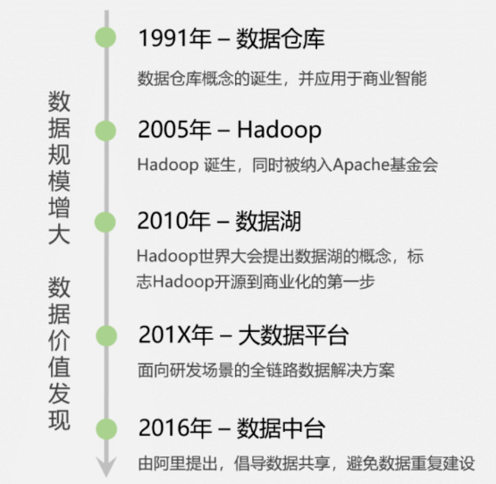
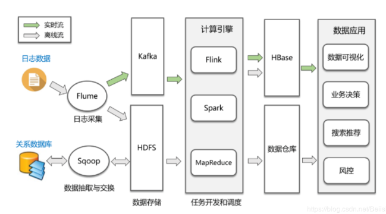
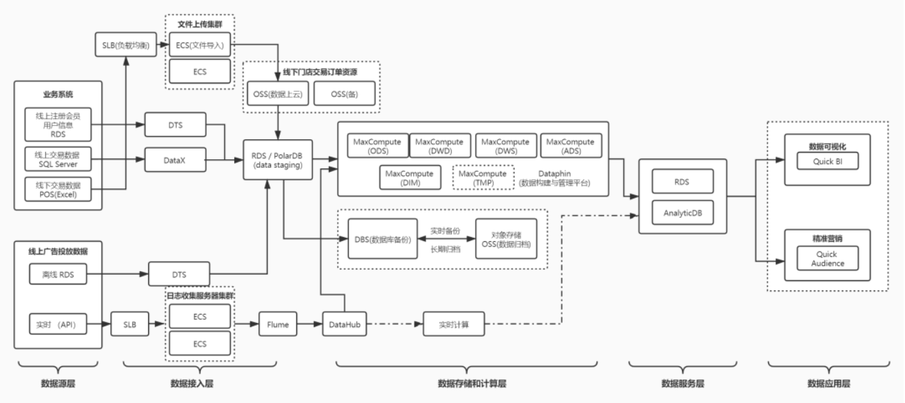
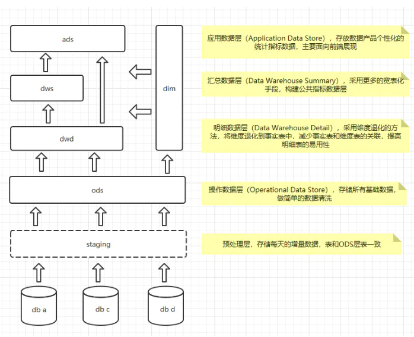
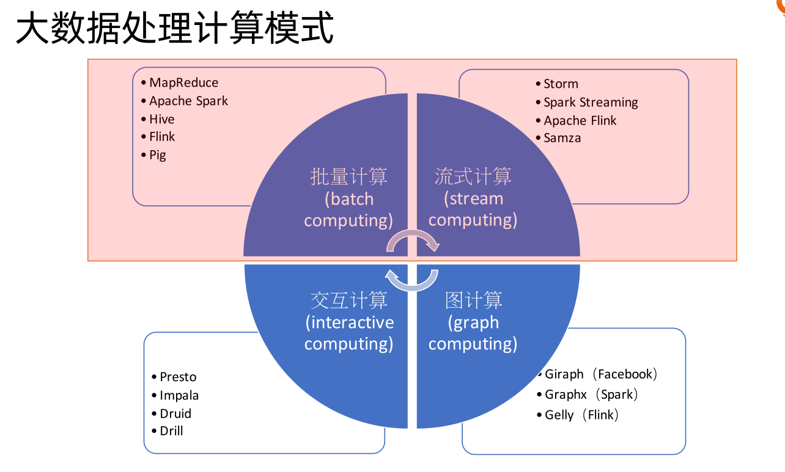

## 1. 大数据发展史

 

## 2. 大数据技术概览

### 2.1. 技术体系

* **文件存储**

  Hadoop HDFS、Tachyon、KFS

* **离线计算**

  Hadoop MapReduce、Spark

* 实时计算

  Storm、Spark Streaming、Flink

* **NOSQL数据库**

  HBase、Redis、MongoDB

* **资源管理**

  YARN、Mesos

* **日志收集**
  Flume、Scribe、Logstash、Kibana

* **消息系统**

  Kafka、StormMQ、RabbitMQ

* **查询分析**

  Hive、Impala、Pig、Presto、Phoenix、SparkSQL、Drill、Flink、Kylin、Druid

* **分布式协调服务**

  Zookeeper

* **集群管理与监控**

  Ambari、Ganglia、Nagios、Cloudera Manager

* **数据挖掘、机器学习**

  Mahout、Spark MLLib

* **数据同步**

  Sqoop

* **任务调度**

  Oozie

### 2.2. 通用架构

 

* **数据采集**

  这是大数据处理的第一步，数据来源主要是两类，第一类是各个业务系统的关系数据库，通过Sqoop或者Cannal等工具进行定时抽取或者实时同步；第二类是各种埋点日志，通过Flume进行实时收集。

* **数据存储**

  收集到数据后，下一步便是将这些数据存储在HDFS中，实时日志流情况下则通过Kafka输出给后面的流式计算引擎。

* **数据分析**

  这一步是数据处理最核心的环节，包括离线处理和流处理两种方式，对应的计算引擎包括MapReduce、Spark、Flink等，处理完的结果会保存到已经提前设计好的数据仓库中，或者HBase、Redis、RDBMS等各种存储系统上。

* **数据应用**

  包括数据的可视化展现、业务决策、或者AI等各种数据应用场景。

 

### 2.3. 数仓体系

数据仓库是从业务角度出发的一种数据组织形式，它是大数据应用和数据中台的基础。数仓系统一般采用下图所示的分层结构

 

## 3. 大数据计算技术

### 3.1. hadoop
hadoop三大组件具有三大组件： 
* HDFS  
  hadoop分布式文件系统海量数据存储（集群服务）。NameNode和DataNode。NameNode是唯一的，程序与之通信，然后从DataNode上存取文件。
* MapReduce  
  是一个编程框架，分布式运算框架（编程框架），海量数据运算分析。  
  MapReduce的计算模型分为Map和Reduce两个过程。在日常经验里，我们统计数据需要分类，分类越细、参与统计的人数越多，计算的时间就越短，这就是Map的形象比喻，在大数据计算中，成百上千台机器同时读取目标文件的各个部分，然后对每个部分的统计量进行计算，Map就是负责这一工作的；而Reduce就是对分类计数之后的合计，是大数据计算的第二阶段。可见，数据的计算过程就是在HDFS基础上进行分类汇总
* Yarn   
  资源调度管理集群（可以理解为一个分布式的操作系统，管理和分配集群硬件资源）。
   用MapReduce编写一个程序，到Yarn运行平台上去运行     

其它的一些组件：
* hive  
  Hive是基于Hadoop的一个数据仓库工具，可以将结构化的数据映射为一张数据表，可以将SQL语句转化为MapReduce任务进行运行.Hive是依赖于Hadoop存在的，其次因为MapReduce语法较复杂，Hive可以将较简单的SQL语句转化成MapReduce进行计算  
* Zookeeper    
  是作为 Hadoop 子项目发展起来的，最初的设计目标就是为 Hadoop 生态组件之间提供一致性协调服务的，因此在 Hadoop 体系（这里主要指 HDFS 与 YARN）中使用广泛。 在 Hadoop 中，Zookeeper 主要用来实现 HA（High Availability），包括 HDFS NameNode 和 YARN ResourceManager 的 HA
### 3.2. spark  
 Spark，是一种通用的大数据计算框架。包含了大数据领域常见的各种计算框架。  
* Spark Core
  用于离线计算
* Spark SQL用于交互式查询
* Spark Streaming  
  用于实时流式计算
* Spark MLlib  
  用于机器学习   
* Spark GraphX  
  用于图计算  
  
 ### 3.3. storm  

