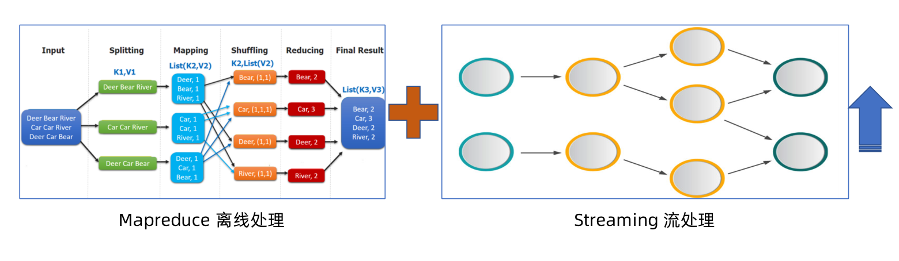
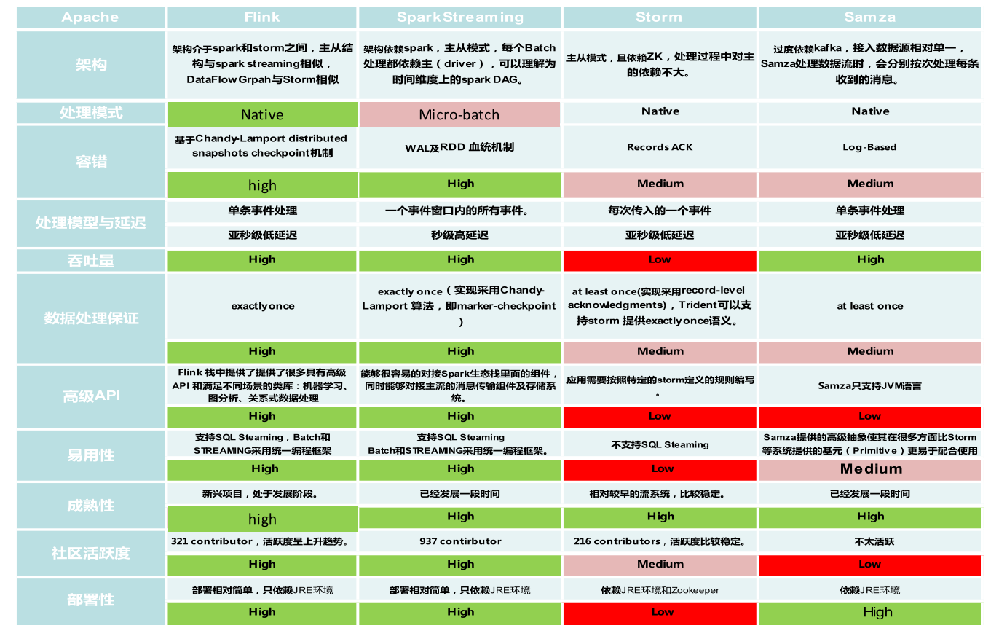
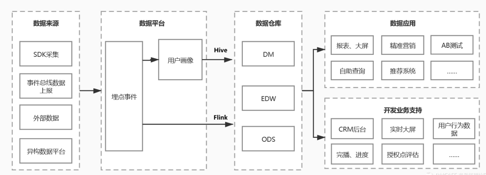
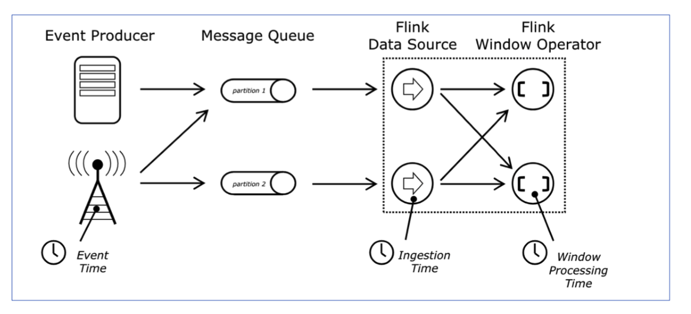
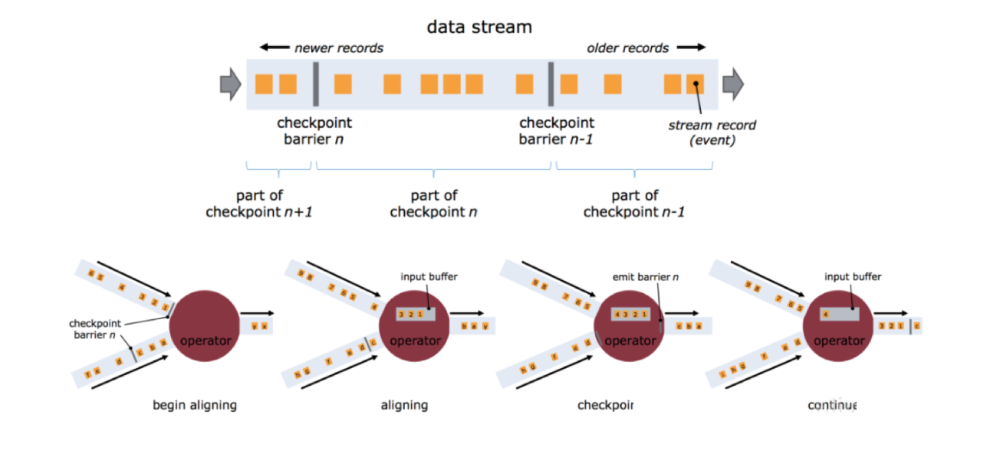
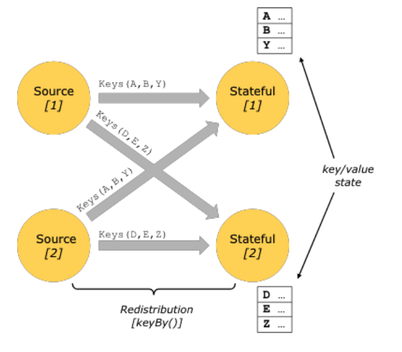
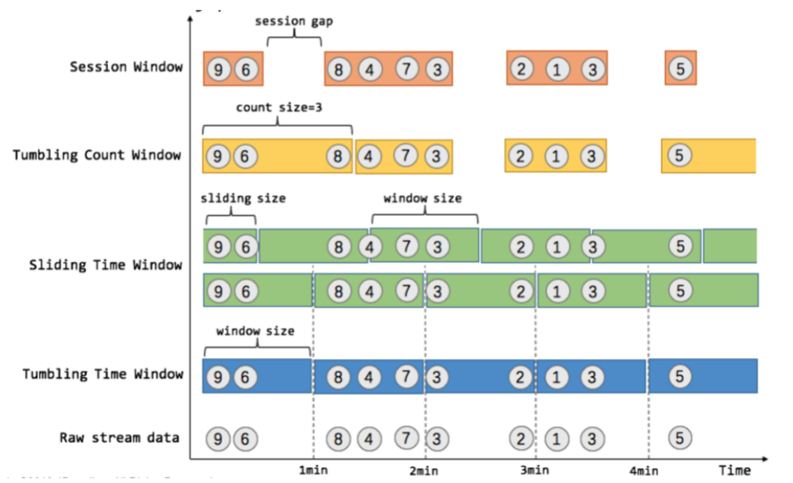
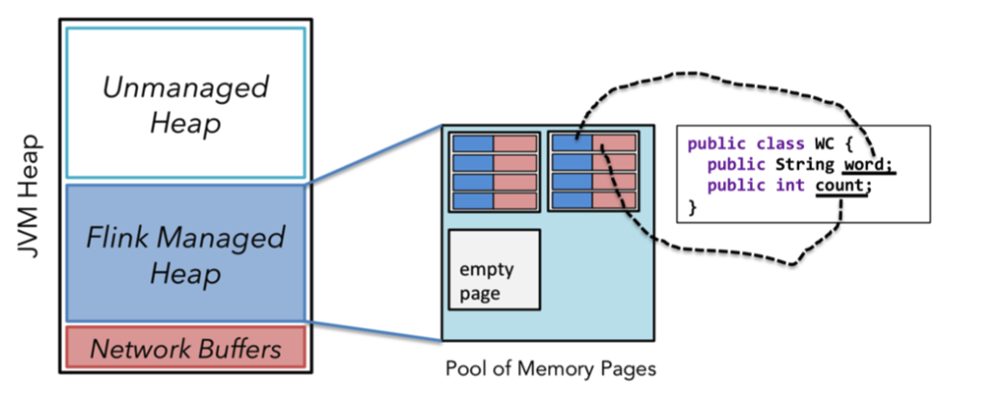

## 1. 为什么要用流式计算
### 1.1. 对比
原因为批处理本身也是一种特殊的流式数据。   
  

### 1.2. 应用场景  

## 2. 流式计算产品
* 商业  
  ibm insphere streams  
* 开源  
  * strom，twitter第一代
  * heron，twitter第二代
  * apache storm，基于record级别流处理引擎
  * spark streaming，spark api的扩展
  * flink，针对流数据和批数据处理分布式引擎，支持原生流处理
  * apache kafka，消息中间件   

**原生流：单事件处理数据流，所有记录一个接一个的处理**
### 2.1. storm
社区成熟、支持原生流、延迟低、消息保证弱、吞吐量低
### 2.2. apache streaming
微批处理（固定时间间隔一小段一小段批处理作业）、延迟较高、吞吐量高、exactly once
### 2.3. flink
真流式、延迟低、高吞吐、支持原生流、易用性等。  、
### 2.4. 小结  
一张图总结各个流式框架的对比  

## 3. flink介绍  
### 3.1. 发展史  
### 3.2. 应用场景
* 实时报表
  * 双十一大屏
  * 数据化运营，比如订单量，订单对比、营销分析数据
* 流数据分析
  * 实时计算相关指标反馈
  * 内容投放、智能推送、实时个性化推荐
* 实时数仓
  * 数据实时清洗、归并、结构化
  * 数仓优化和补充  
   

## 4. flink的核心特性
* 数据处理技术栈全面，支持批处理、流处理、机器学习、图分析等
* 支持时间时间、接入时间、处理时间  
  

* 支持轻量的分布式快照容错
    

* 支持有状态的计算
  * support for very large state
  * querable state 支持
  * 灵活的state-backend(hdfs,内存、rocksdb)     
   
**注意：无状态计算会观察每个独立的事件，并且会在最后一个时间出结果，例如一些报警和监控，一直观察每个事件，当触发警报的事件来临就会触发警告。有状态的计算就会基于多个事件来输出结果，比如说计算过去一个小时的平均温度等等**
  

* 窗口模式丰富
    

* 反压模型  
* 基于jvm实现的独立的内存管理，flink在jvm中实现了自己的内存管理
* 应用可以超出主内存的大小限制，gc的优化
* 对象序列化二进制存储，类似于c对内存的管理  
