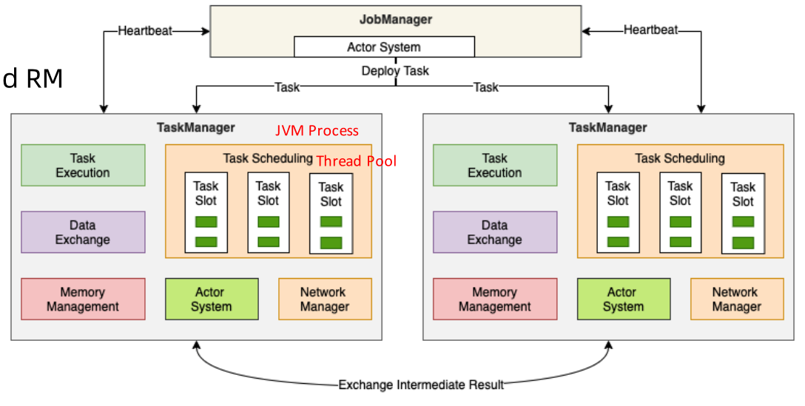

## 1. 基本架构
&emsp;&emsp;flink有这个三大基本角色：client、jobmanager、taskmanager。这三种角色相互配合完成流式计算的任务。 它们之间如何进行配合的如下图：    
  
  
### 1.1. jobmanager
* checkpoint coordinator
* job graph -> execution graph
* task部署和调度
* rpc通讯（actor system）
* job接收（job dispatch）
* 集群资源管理（resource manager）
* taskmanager的注册与管理   

  

### 1.2. taskManager
* TaskExecution
* Network Manager
* Shuffle Environment管理 Rpc通信(Actorsystem)
* Heartbeat with jobManage and rm
* Data Exchange
* Memory Management 
* Register To RM
* Offer Slots TojobManager   

  

### 1.3. client
* Application's main()Method执行
* JobGraphGenerate
* Execution Environment管理
* Job提交与运行
* Dependenyjar Ship
* RPC WithJobManager
* 集群部署(ClusterDeploy)  
  

### 1.4. jobgraph  
* 通过有向无环图(Daq)方式表达用户程序
* 不同接口程序的抽象表达
* 客户端和集群之间的Job描述载体
* 节点(Vertices)，Result参数
* Flink1.11之前只能在Client中生成    

## 2. 部署模式