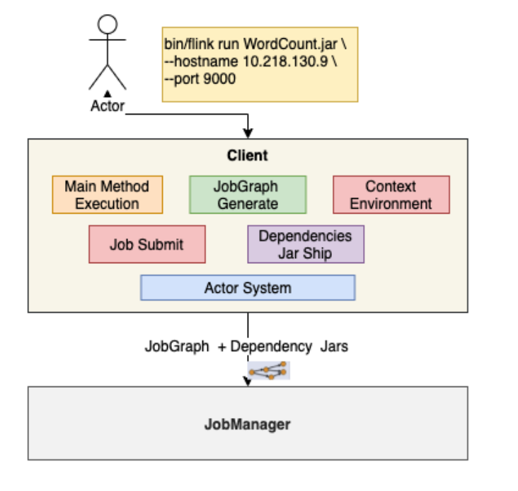

## 1. 基本架构
&emsp;&emsp;flink有这个三大基本角色：client、jobmanager、taskmanager。这三种角色相互配合完成流式计算的任务。 它们之间如何进行配合的如下图：    
  

### 1.1. jobmanager
* checkpoint coordinator
* job graph -> execution graph
* task部署和调度
* rpc通讯（actor system）
* job接收（job dispatch）
* 集群资源管理（resource manager）
* taskmanager的注册与管理   

  

### 1.2. taskManager
* TaskExecution
* Network Manager
* Shuffle Environment管理 Rpc通信(Actorsystem)
* Heartbeat with jobManage and rm
* Data Exchange
* Memory Management 
* Register To RM
* Offer Slots TojobManager   

  

### 1.3. client
* Application's main()Method执行
* JobGraphGenerate
* Execution Environment管理
* Job提交与运行
* Dependenyjar Ship
* RPC WithJobManager
* 集群部署(ClusterDeploy)  
  


### 1.4. jobgraph  
* 通过有向无环图(Daq)方式表达用户程序
* 不同接口程序的抽象表达
* 客户端和集群之间的Job描述载体
* 节点(Vertices)，Result参数
* Flink1.11之前只能在Client中生成    


## 2. 集群部署模式
根据以下两种维度将集群部署模式分为三种类型：
* 集群的生命周期和资源隔离;
* 根据程序main()方法执行在Client还是JobManager.   

三种类型为：
* Session Mode  
  共享JobManager和TaskManager，所有提交的Job都在一个Runtime中运行. 
* Per-Job Mode  
  独享JobManager 与TaskManager，好比为每个Job单独启动一个Runtime. 
* Application Mode ( 1.17版本提出)  
  Application的main()运行在Cluster 上，而不在客户端。每个Application对应一个Runtime，Application中可以含有多个Job。

### 2.1. Session Mode  
session的特点为：
* JobManager 与 TaskManager共享
* 客户端通过RPC或 Rest API连接集群的管理节点
* Deployer需要上传依赖的Dependences Jar
* Deployer 需要生成JobGraph，并提交到管理节点.
* **JobManager的生命周期不受提交的Job影响，会长期运行**
* 资源充分共享，提升资源利用率
* Job 在Flink Session集群中管理，运维简单
* 资源隔离相对较差
* 非Native类型部署，TM不易拓展，Slot计算资源伸缩性较差  


### 2.2. per job mode
该模式的特点为：
* 单个Job独享JobManager 与TaskManager
* TM中Slot资源根据Job指定
* Deployer需要上传依赖的DependencesJar
* 客户端生成JobGraph，并提交到管理节点
* JobManager的生命周期和Job生命周期绑定. 
* Job和Job之间资源隔离充分
* 资源根据Job需要进行申请，TM Slots数量可以不同
* 资源相对比较浪费，JobManager需要消耗资源
* **Job管理完全交给ClusterManagement，管理复杂**  
  
  
### 2.3. application mode特点   
&emsp;&emsp;以上两个模式，需要客户端执行main方法，使用较多的cpu资源生成jobgraph，再耗用一定的带宽将jobgraph和依赖包上传到job manager上，这些操作在job较多的情况下性能较差。于是设计者把一部分client的工作压力交给job manager上开发出了application模式   
&emsp;&emsp;main方法不在client上，应用独占运行环境，即一个应用一个job manager，但可以有多个job, 客户端只需上传应用的jar，也不需要上传依赖，提交到job manager后,job manager生成jobgraph和从配置的仓库拉取依赖。  
&emsp;&emsp;这种模式aplicaiton之间是隔离的，其中的job是共享的。能有效降低带宽和客户端负载，但是这种模式过于前卫，生产验证不多，支持的集群管理组件有限（yarn、k8s）
&emsp;&emsp;该模式ide特点为：  
* Application Mode类型集群（1.11版本)才支持
* 每个Application对应一个JobManager,且可以运行多个Job
* **客户端无需将Dependencies 上传到JobManager ,仅负责管理Job的提交与管理**
* main()方法运行JobManager 中，将JobGraph的生成放在集群上运行，客户端压力降低
* 有效降低带宽消耗和客户端负载
* Application实现资源隔离，Application中实现资源共享
* 功能太新，还未经过生产验证
* 仅支持 Yarn和 Kubunetes


## 3. 资源管理器
我们从上面知道了flink部署的模式，有那么三种，它们都需要借助资源管理器完成部署。使用不同的资源管理器可以完成不同方式的flink任务作业。flink支持的资源管理器如下：
* standalone
* Hadoop Yarn
* Apache Mesos
* Docker
* Kubernetes

上面介绍了flink自身集群部署模式，真正的部署时需要借助资源管理器进行部署，一下是不同的资源管理器对flink的不同的部署模式支持情况:  
  


### 3.1. native部署
native部署使用资源管理器后的一种特殊的部署效果。其特点为：  
* Session集群根据根据实际提交的Job资源动态申请和启动TaskManager计算资源
* 支持Native部署模式的有Yarn,Kubernetes，Mesos资源管理器。
* Standalone不支持Native部署。  
native部署的流程如下：
* 当在ClusterManagement上启动Session集群时，只启动JobManager实例，不启动有TaskManager。
* 提交Job-1后根据Job的资源申请，动态启动TaskManager满足计算需求。
* 提交Job-2, Job-3后，再次向ClusterManagement中申请TM资源  

  


### 3.2. standalone部署  
使用flink自身的资源管理器 进行部署，目前支持Session模式提交Job

#### 3.2.1. standalone单机   
其特点为：
* JobManager和TaskManager 全部在一个机器上运行
* 支持Linux和Mac OS X上部署，如果是Windows机器则需要安装Cygwin或 WSL环境依赖于Java8或Java 11JDK环境
* 仅适合于本地测试，不适用于生产环境
* 仅支持Session模式提交Job
* 不支持高可用  

其部署步骤为：  
* 下载安装 Flink安装包或通过源码编译生成;  
  下载地址为: https: //flink.apache.org/downloads.html  
  $ wget https://www.apache.org/dyn/closer.lua/flink/flink-1.11.1/flink-1.11.1-bin-scala_2.11.tgz
* 解压安装包:  
  $tar -xvf flink-1.11.1-bin-scala_2.17.tgz
* 启动Flink集群:  
  $cd flink-1.11.1 & ./ bin/start-cluster.sh


#### 3.2.2. standalone集群   
其部署步骤如下  
前置条件:
* 每台节点都必须安装JDK，并配置JAVA_HOME路径和环境变量
* 如果需要用hdfs，则需要在每台节点需配置HADOOP_CONFIG_DIR环境变量
* 每台节点Flink Package路径保持一致，且版本保持一致
* 最好挑选一台机器，和其他机器ssh打通
* 部署节点
* Node01作为Master节点仅部署JobManager
* Node02-Node05作为Worker节点部署TaskManager      

主要配置修改:
* 修改conf/flink-conf.yaml文件，配置jobmanager.rpc.address: localhost
* 修改conf/master文件，设定master节点为Node01
* 修改conf/worker文件，设定work节点地址
* 将修改后的配置文件同步到每台节点的${FLINK_HOME}/conf路径下  


注意：该模式在主节点会启动一个jobmanager，在worker节点启动taskmanger，还会启动StandaloneSessionClusterEntrypoint

#### 3.3. flink on yarn部署
前面介绍了flink使用自身的资源管理器提交任务，我们还可以使用yarn来作为资源管理器来部署flink任务。yarn支持session模式和perjob模式。
#### 3.3.1. 为什么要使用yarn部署  
主要优势:
* 与现有大数据平台无缝对接（ Hadoop2.4+)。·部署集群与任务提交都非常简单。
* 资源管理统一通过Yarn 管理，提升整体资源利用率类。
* 基于Native方式，TaskManager资源按需申请和启动，防止资源浪费。
* 容错保证借助于Hadoop Yarn 提供的自动failover机制，能保证JobManager,TaskManager节点异常恢复  

主要劣势:  
* 资源隔离问题，尤其是网络资源的隔离，Yarn做的还不够完善。
* 离线和实时作业同时运行相互干扰等问题需要重视。
* Kerberos认证超期问题导致Checkpoint无法持久化。


#### 3.3.2. flink on yarn架构 
    
yarn集群部署架构有四大关键点: 
* ResouManager ( NM) :
  * 负责处理客户端请求
  * 监控NodeManager
  * 启动和监控APPlicationMaster
  * 资源的分配和调度
* NodeManager  
  * 管理单个Worker节点上的资源;  
  * 处理来自ResourceManager的命令处理来自
  * ApplicationMaster的命令
  * 汇报资源状态
* ApplicationMaster:
  * 负责数据的切分
  * 为应用申请计算资源，并分配给Task
  * 任务的监控与容错  
  * 运行在worker节点上
* container 
  * 资源抽象，封装了节点上的多维度资源，如CPU，内存,网络资源  


#### 3.3.3. session模式支持  
   
其特点：  
* 多jobmanager共享dispatcher和yarnresourcemanager
* 支持native模式，tm动态申请  

#### 3.3.4. per-job模式支持  
  
* 单个JobManager独享YarnResourceManager和Dispatcher
* Application Master 与Flink Master节点处于同一个Container


#### 3.3.4. 部署步骤  
* 下载安装包，并解压到单台节点指定路径;
* Hadoop Yarn版本需要在2.4.1以上，且具有HDFS文件系统;
* 该节点需要配置HADOOP_CONF_DIR环境变量，并指向Hadoop客户端配置路径
* 下载Hadoop依赖包配置:
* Flink 1.11版本后将不再在主版本中支持flink-shaded-hadoop-2-uber包，用户需要自己指定HADOOP_ClASSPATH，或者继续到以下地址下载Hadoop依赖包  
  https://flink.apache.org/downloads.html#additional-components
* session集群启动:  
  * $./ bin/yarn-session.sh -jm 1024m -tm 4096m
* per-Job集群启动:  
  * #./ bin/flink run -m yarn-cluster-p 4 -yjm 1024m -ytm 4096m ./examples/batch/WordCountjar
* Application Mode集群启动:  
  * #./ bin/flink run-application -t yarn-application l-Djobmanager.memory.process.size=2048m \-Dtaskmanager.memory.process.size=4096m \
  -Dyarn.provided.lib.dirs="hdfs://node02:8020/flink-training/flink-1.11.1" \./ MyApplication.jar


## 4. flink高可用  
生产环境必须要考虑高可用，这样才能保证集群能够快速恢复集群服务。flink的高可用可以分为：  
* job持久化  
  
* handling checkpoints  
  


### 4.1. flink高可用配置  

#### 4.1.1. standalone  
* 修改conf/flink-conf.yaml:
  * high-availability: zookeeper
  * high-availability.zookeeper.quorum: localhost:2181
  * high-availability.zookeeper.path.root: /flink
  * high-availability.cluster-id : / cluster_one # important: customize per cluster
  * high-availability.storageDir: hdfs: / * llflink/recovery
* 配置conf/masters:
  * localhost:8081localhost:8082
* 配置conf/zoo.cfg(可选):
  * server.0=localhost:2888:3888·
* 启动HA集群  
      $ bin/start-cluster.sh  
      Starting HA cluster with 2 masters and 1 peers in zooKeeper quorum  
      Starting standalonesession daemon on host localhost.  
      Starting standalonesession daemon on host localhost.  
      Starting taskexecutor daemon on host localhost.


#### 4.1.2. flink on yarn  

* 修改yarn-site.xml配置，设定最大Application Master启动次数:
  ```
  <property>
      <name>yarn.resourcemanager.am.max-attempts</name><value>4</value>
      <description> The maximum number of application master execution attempts.</description>
  </property>
  ```

* 修改配置文件conf/flink-conf.yaml:  
    high-availability: zookeeper  
    high-availability.zookeeper.quorum: localhost:2181  
    high-availability.storageDir: hdfs:/ llflink/recovery  
    high-availability.zookeeper.path.root: /flink  
    yarn.application-attempts: 10
* Start an HA-cluster:  
  $ bin/yarn-session.sh-n 2

## 5. 总结 
