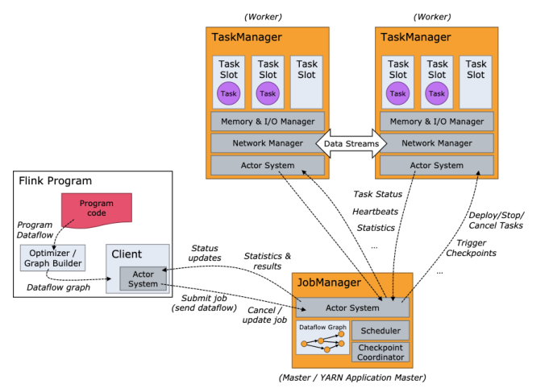
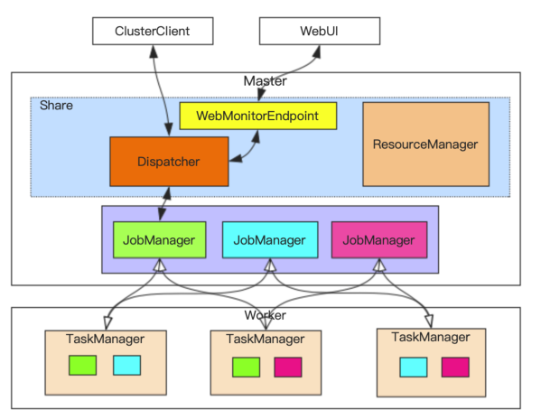
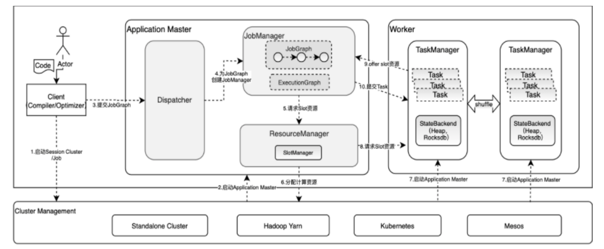
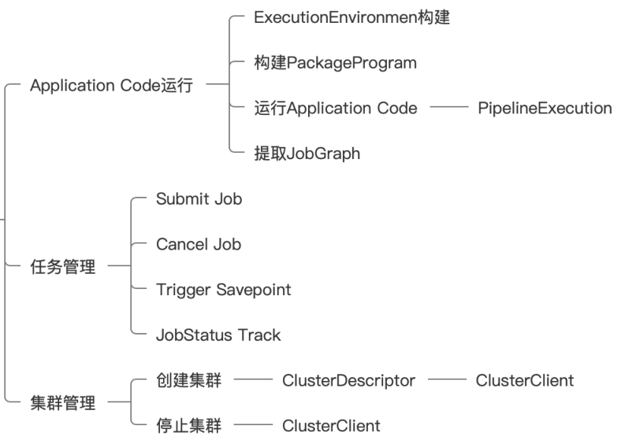

## 1. 概述
### 1.1. 概述   
flink整体架构包括三大部分：  
* ApplicationMaster
* TaskManager
* Client   

    
说明： 
* standalone不依赖外部资源管理器，执行命令start-cluster.sh，启动application master
* yarn-session，需要提前yarn-session.sh借助yarn来启动application master
* yarn-per-job，直接提交job./ bin/flink run -m yarn-cluster，借助yarn来启动该job的application master    

### 1.2. 运行模式   
* Session模式
  * Runtime集群组件共享·
  * 资源复用
  * Runtime中有多个JobManager. 
* Per-Job模式
  * Runtime集群组件仅为单个Job服务·
  * 资源相对独立
  * 不支持提交JobGraph  

### 1.3. yarn-seesion架构示例
以下是一个yarn-seesion的启动的flink整体运行图：  
      
* Dispatcher
  * 集群Job的调度分发
  * 根据JobGraph启动JobManager (JobMaster). 
* ResourceManager
  * 集群层面资源管理
  * 适配不同的资源管理，eg Yarn,Kubernetes等
  * 核心组件:SlotManager
* TaskManager
  * Slot计算资源提供者
* JobManager
  * 负责管理具体的Job
  * Scheduler
    * 调度和执行该Job的所有Task
    * 发出Slots资源请求

## 2. 客户端原理  
  
如上图所示，客户端的功能主要三大块：  
* 任务管理
* application code运行
* 集群管理

### 2. flink集群启动  
我们知道flink集群需要启动application master，不管是session模式还是per-job模式

