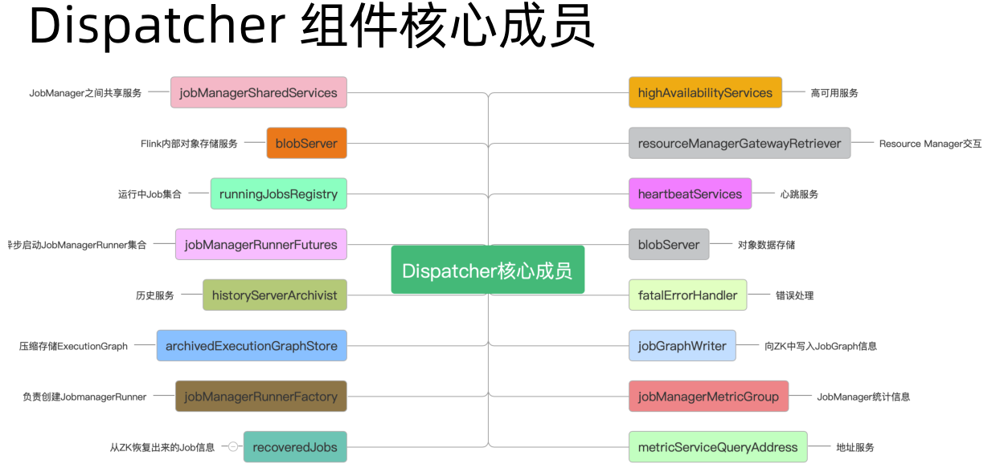

## 1. 开头    


## 2. applicationMaster的启动
* 当我们使用yarn-session启动集群时会向resourceManagement发起请求。  
  会调用appMaster:org.apache.flink.yarn.YarnClusterDescriptor#startAppMaster方法启动  
  该方法也会用于提交jobgraph（应该是per-job模式，会同时启动集群和提交job）
  ```
      private ApplicationReport startAppMaster(
            Configuration configuration,
            String applicationName,
            String yarnClusterEntrypoint,
            JobGraph jobGraph,
            YarnClient yarnClient,
            YarnClientApplication yarnApplication,
            ClusterSpecification clusterSpecification)
            throws Exception {
  ```

* hadoop会创建容器启动org.apache.flink.yarn.entrypoint.YarnJobClusterEntrypoint#main的方法
* 上述的方法会执行ClusterEntrypoint.runClusterEntrypoint(yarnJobClusterEntrypoint);
* 接着调用org.apache.flink.runtime.entrypoint.ClusterEntrypoint#startCluster启动集群
* runCLuster会启动各种服务组件
  ```
     private void runCluster(Configuration configuration, PluginManager pluginManager)
            throws Exception {
        synchronized (lock) {
            initializeServices(configuration, pluginManager);

            // write host information into configuration
            configuration.setString(JobManagerOptions.ADDRESS, commonRpcService.getAddress());
            configuration.setInteger(JobManagerOptions.PORT, commonRpcService.getPort());

            final DispatcherResourceManagerComponentFactory
                    dispatcherResourceManagerComponentFactory =
                            createDispatcherResourceManagerComponentFactory(configuration);

            clusterComponent =
                    dispatcherResourceManagerComponentFactory.create(
                            configuration,
                            ioExecutor,
                            commonRpcService,
                            haServices,
                            blobServer,
                            heartbeatServices,
                            metricRegistry,
                            executionGraphInfoStore,
                            new RpcMetricQueryServiceRetriever(
                                    metricRegistry.getMetricQueryServiceRpcService()),
                            this);

            clusterComponent
                    .getShutDownFuture()
                    .whenComplete(
                            (ApplicationStatus applicationStatus, Throwable throwable) -> {
                                if (throwable != null) {
                                    shutDownAsync(
                                            ApplicationStatus.UNKNOWN,
                                            ShutdownBehaviour.STOP_APPLICATION,
                                            ExceptionUtils.stringifyException(throwable),
                                            false);
                                } else {
                                 .......................
                                }
                            });
        }
    }
  ``` 


## 3. dispatcher组件  
&emsp;&emsp;上述applicationmaster启动时会创建主要的组件，其中dispatcher组件非常重要。

### 3.1. 启动过程
* 创建DispatcherResourceManagerComponent  
  上面的启动会进行创建
```
            clusterComponent =
                    dispatcherResourceManagerComponentFactory.create(
                            configuration,
                            ioExecutor,
                            commonRpcService,
                            haServices,
                            blobServer,
                            heartbeatServices,
                            metricRegistry,
                            executionGraphInfoStore,
                            new RpcMetricQueryServiceRetriever(
                                    metricRegistry.getMetricQueryServiceRpcService()),
                            this);
```
dispatcher是集群的主要组件，它的主要功能为：
* 主要负责JobGraph的接收
* 根据JobGraph启动JobManager
* RpcEndpoint服务
* 通过DispatcherGateway Rpc对外提供服务
* 从ZK中恢复JobGraph (HA模式)保存整个集群的Job运行状态    


* 创建dispatcherRunner
  ```
       dispatcherRunner =
                    dispatcherRunnerFactory.createDispatcherRunner(
                            highAvailabilityServices.getDispatcherLeaderElectionService(),
                            fatalErrorHandler,
                            new HaServicesJobGraphStoreFactory(highAvailabilityServices),
                            ioExecutor,
                            rpcService,
                            partialDispatcherServices);
  ```


* dispatcherRunner启动DispatcherLeaderProcess
```
    private DispatcherRunnerLeaderElectionLifecycleManager(
            T dispatcherRunner, LeaderElectionService leaderElectionService) throws Exception {
        this.dispatcherRunner = dispatcherRunner;
        this.leaderElectionService = leaderElectionService;

        leaderElectionService.start(dispatcherRunner);
    }
```  

```
    public void grantLeadership(UUID leaderSessionID) {
        runActionIfRunning(() -> startNewDispatcherLeaderProcess(leaderSessionID));
    }

    private void startNewDispatcherLeaderProcess(UUID leaderSessionID) {
        stopDispatcherLeaderProcess();

        dispatcherLeaderProcess = createNewDispatcherLeaderProcess(leaderSessionID);

        final DispatcherLeaderProcess newDispatcherLeaderProcess = dispatcherLeaderProcess;
        FutureUtils.assertNoException(
                previousDispatcherLeaderProcessTerminationFuture.thenRun(
                        newDispatcherLeaderProcess::start));
    }
```
如下图为dispatcher的启动流程  
  


### 3.2. 接收job
* 接这个上面的dispatcherleaderprocess。会启动dispatchgateway。  、
  ```
      protected void onStart() {
        final DispatcherGatewayService dispatcherService =
                dispatcherGatewayServiceFactory.create(
                        DispatcherId.fromUuid(getLeaderSessionId()),
                        Collections.singleton(jobGraph),
                        ThrowingJobGraphWriter.INSTANCE);

        completeDispatcherSetup(dispatcherService);
    }
  ```
* dispatcher的submitjob会接收提交的任务 
  ```
     public CompletableFuture<Acknowledge> submitJob(JobGraph jobGraph, Time timeout) {
        log.info("Received JobGraph submission {} ({}).", jobGraph.getJobID(), jobGraph.getName());
        try {
            if (isDuplicateJob(jobGraph.getJobID())) {
                final DuplicateJobSubmissionException exception =
                        isInGloballyTerminalState(jobGraph.getJobID())
                                ? DuplicateJobSubmissionException.ofGloballyTerminated(
                                        jobGraph.getJobID())
                                : DuplicateJobSubmissionException.of(jobGraph.getJobID());
                return FutureUtils.completedExceptionally(exception);
            } else if (isPartialResourceConfigured(jobGraph)) {
                return FutureUtils.completedExceptionally(
                        new JobSubmissionException(
                                jobGraph.getJobID(),
                                "Currently jobs is not supported if parts of the vertices have "
                                        + "resources configured. The limitation will be removed in future versions."));
            } else {
                return internalSubmitJob(jobGraph);
            }
        } catch (FlinkException e) {
            return FutureUtils.completedExceptionally(e);
        }
    }
  ```
* 持久化和运行job
  ```
  
    private void persistAndRunJob(JobGraph jobGraph) throws Exception {
        jobGraphWriter.putJobGraph(jobGraph); //持久化job
        runJob(jobGraph, ExecutionType.SUBMISSION);//运行
    }
  ```
* 创建job manager并启动
  ```
      private void runJob(JobGraph jobGraph, ExecutionType executionType) throws Exception {
        Preconditions.checkState(!runningJobs.containsKey(jobGraph.getJobID()));
        long initializationTimestamp = System.currentTimeMillis();
        JobManagerRunner jobManagerRunner =
                createJobManagerRunner(jobGraph, initializationTimestamp);
  ```
  ```
      JobManagerRunner createJobManagerRunner(JobGraph jobGraph, long initializationTimestamp)
            throws Exception {
        final RpcService rpcService = getRpcService();

        JobManagerRunner runner =
                jobManagerRunnerFactory.createJobManagerRunner(
                        jobGraph,
                        configuration,
                        rpcService,
                        highAvailabilityServices,
                        heartbeatServices,
                        jobManagerSharedServices,
                        new DefaultJobManagerJobMetricGroupFactory(jobManagerMetricGroup),
                        fatalErrorHandler,
                        initializationTimestamp);
        runner.start(); //启动job manager
        return runner;
    }
  ```
具体的流程如：  
  

### 3.3. dispatcher核心成员
  


## 4. resourcemanager组件  
    
### 4.1. resourcemanager启动
* 和dispatcher的启动入口类似
```
private void runCluster(Configuration configuration, PluginManager pluginManager)
        throws Exception {
synchronized (lock) {
        initializeServices(configuration, pluginManager);

        // write host information into configuration
        configuration.setString(JobManagerOptions.ADDRESS, commonRpcService.getAddress());
        configuration.setInteger(JobManagerOptions.PORT, commonRpcService.getPort());

        final DispatcherResourceManagerComponentFactory
                dispatcherResourceManagerComponentFactory =
                        createDispatcherResourceManagerComponentFactory(configuration);
}
```  

* 开启resourcemanager
  ```
      private void startNewLeaderResourceManager(UUID newLeaderSessionID) throws Exception {
        stopLeaderResourceManager();

        this.leaderSessionID = newLeaderSessionID;
        this.leaderResourceManager =
                resourceManagerFactory.createResourceManager(
                        rmProcessContext, newLeaderSessionID, ResourceID.generate());

        final ResourceManager<?> newLeaderResourceManager = this.leaderResourceManager;

        previousResourceManagerTerminationFuture
                .thenComposeAsync(
                        (ignore) -> {
                            synchronized (lock) {
                                return startResourceManagerIfIsLeader(newLeaderResourceManager);
                            }
                        },
                        handleLeaderEventExecutor)
                .thenAcceptAsync(
                        (isStillLeader) -> {
                            if (isStillLeader) {
                                leaderElectionService.confirmLeadership(
                                        newLeaderSessionID, newLeaderResourceManager.getAddress());
                            }
                        },
                        ioExecutor);
    }
  ```


### 4.2. resourcemanager资源分配  
* activemanager接收newwork请求
* 资源信息封装到WorkerResourceSpec  
  ```
  
    private final CPUResource cpuCores;

    private final MemorySize taskHeapSize;

    private final MemorySize taskOffHeapSize;

    private final MemorySize networkMemSize;

    private final MemorySize managedMemSize;

    private final int numSlots;

    private final Map<String, ExternalResource> extendedResources;
  ```
* processSpecFromWorkerResourceSpec来封装TaskExecutorProcessSpec  
  ```
        * <pre>
        *               ┌ ─ ─ Total Process Memory  ─ ─ ┐
        *                ┌ ─ ─ Total Flink Memory  ─ ─ ┐
        *               │ ┌───────────────────────────┐ │
        *                ││   Framework Heap Memory   ││  ─┐
        *               │ └───────────────────────────┘ │  │
        *               │ ┌───────────────────────────┐ │  │
        *            ┌─  ││ Framework Off-Heap Memory ││   ├─ On-Heap
        *            │  │ └───────────────────────────┘ │  │
        *            │   │┌───────────────────────────┐│   │
        *            │  │ │     Task Heap Memory      │ │ ─┘
        *            │   │└───────────────────────────┘│
        *            │  │ ┌───────────────────────────┐ │
        *            ├─  ││   Task Off-Heap Memory    ││
        *            │  │ └───────────────────────────┘ │
        *            │   │┌───────────────────────────┐│
        *            ├─ │ │      Network Memory       │ │
        *            │   │└───────────────────────────┘│
        *            │  │ ┌───────────────────────────┐ │
        *  Off-Heap ─┼─   │      Managed Memory       │
        *            │  ││└───────────────────────────┘││
        *            │   └ ─ ─ ─ ─ ─ ─ ─ ─ ─ ─ ─ ─ ─ ─ ┘
        *            │  │┌─────────────────────────────┐│
        *            ├─  │        JVM Metaspace        │
        *            │  │└─────────────────────────────┘│
        *            │   ┌─────────────────────────────┐
        *            └─ ││        JVM Overhead         ││
        *                └─────────────────────────────┘
        *               └ ─ ─ ─ ─ ─ ─ ─ ─ ─ ─ ─ ─ ─ ─ ─ ┘
        * </pre>
        */
        public class TaskExecutorProcessSpec extends CommonProcessMemorySpec<TaskExecutorFlinkMemory> {
  ```
* YarnResourceManagerDriver#requestResource来申请资源
* 

## 5. graph
我们知道flink的客户端完成了stream graph -> job graph，然后提交到了dispatch后，会完成job graph -> excution graph -> 物理执行图
  

### 5.1. flink graph转换
  

#### 5.1.1. program->stream graph
    
通过图片可以知道，它是将代码拆分成算子，然后用stream将它们连接起来。   
    

* 执行应用的execute方法
* 获取stream graph
  ```
      public JobExecutionResult execute(String jobName) throws Exception {
        Preconditions.checkNotNull(jobName, "Streaming Job name should not be null.");
        return this.execute(this.getStreamGraph(jobName));
    }
  ```
* StreamExecutionEnvironment持有Transformation数组
* 我们在使用各种flink的api的时候，实际上那些api会调用这个方法将算子添加到Transformation数组
  ```
  	public void addOperator(Transformation<?> transformation) {
		Preconditions.checkNotNull(transformation, "transformation must not be null.");
		this.transformations.add(transformation);
	}
  ```
  

* StreamGraphGenerator生成graph的时候遍历进行生成graph
  ```
  	Collection<Integer> transformedIds;
		if (transform instanceof OneInputTransformation<?, ?>) {
			transformedIds = transformOneInputTransform((OneInputTransformation<?, ?>) transform);
		} else if (transform instanceof TwoInputTransformation<?, ?, ?>) {

                        ......................


  ```
* 上一步会将算子的信息放入到StreamGraph对象之中，如：
  ```
  	private <T> Collection<Integer> transformPartition(PartitionTransformation<T> partition) {
		Transformation<T> input = partition.getInput();
		List<Integer> resultIds = new ArrayList<>();

		Collection<Integer> transformedIds = transform(input);
		for (Integer transformedId: transformedIds) {
			int virtualId = Transformation.getNewNodeId();
			streamGraph.addVirtualPartitionNode(
					transformedId, virtualId, partition.getPartitioner(), partition.getShuffleMode());
			resultIds.add(virtualId);
		}

		return resultIds;
	}
  ``` 

* 最终会生成完整的streamgraph  


  
具体的streamgraph组成为：  
  

#### 5.1.2. stream graph -> job graph
  
  
* streamgraph的getjobGraph会将streamgraph生成jobgraph
  ```
        public JobGraph getJobGraph(@Nullable JobID jobID) {
                return StreamingJobGraphGenerator.createJobGraph(this, jobID);
        }
  ```
* 最终是由StreamingJobGraphGenerator来生成的  
    

jobgraph的核心成员为：  
 


#### 5.1.3. job graph  -> executiongraph    
  
     


#### 5.1.4. execution graph -> 物理执行图
  


