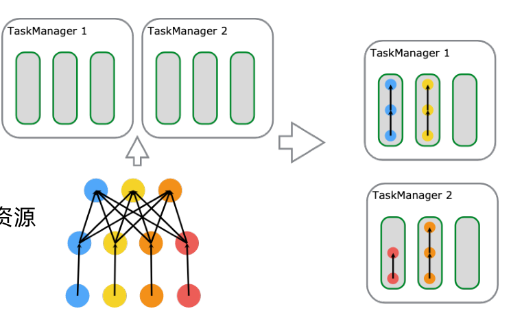

## 1. 开头    

在前面客户端使用yarn-session相关的脚本启动时，客户端最终会请求yarn的资源管理器。最终启动flink-master

## 2. applicationMaster的启动

### 2.1. flink client触发

* 当我们使用yarn-session启动集群时会向resourceManagement（yarn的资源管理器）发起请求。  
  会调用appMaster:org.apache.flink.yarn.YarnClusterDescriptor#startAppMaster方法启动  
  该方法也会用于提交jobgraph（即per-job模式，会同时启动集群和提交job）

  ```
      private ApplicationReport startAppMaster(
            Configuration configuration,
            String applicationName,
            String yarnClusterEntrypoint,
            JobGraph jobGraph,
            YarnClient yarnClient,
            YarnClientApplication yarnApplication,
            ClusterSpecification clusterSpecification)
            throws Exception {
  ```

### 2.2. 启动applicationMaster

* hadoop会创建容器启动org.apache.flink.yarn.entrypoint.YarnJobClusterEntrypoint#main的方法

  ```
  public static void main(final String[] args) {
      // startup checks and logging
      EnvironmentInformation.logEnvironmentInfo(
              LOG, YarnApplicationClusterEntryPoint.class.getSimpleName(), args);
      SignalHandler.register(LOG);
      JvmShutdownSafeguard.installAsShutdownHook(LOG);
  
      Map<String, String> env = System.getenv();
  
      final String workingDirectory = env.get(ApplicationConstants.Environment.PWD.key());
      Preconditions.checkArgument(
              workingDirectory != null,
              "Working directory variable (%s) not set",
              ApplicationConstants.Environment.PWD.key());
  
      try {
          YarnEntrypointUtils.logYarnEnvironmentInformation(env, LOG);
      } catch (IOException e) {
          LOG.warn("Could not log YARN environment information.", e);
      }
  
      final Configuration configuration =
              YarnEntrypointUtils.loadConfiguration(workingDirectory, env);
  
      PackagedProgram program = null;
      try {
          program = getPackagedProgram(configuration);
      } catch (Exception e) {
          LOG.error("Could not create application program.", e);
          System.exit(1);
      }
  
      try {
          configureExecution(configuration, program);
      } catch (Exception e) {
          LOG.error("Could not apply application configuration.", e);
          System.exit(1);
      }
  
      YarnApplicationClusterEntryPoint yarnApplicationClusterEntrypoint =
              new YarnApplicationClusterEntryPoint(configuration, program);
  
      ClusterEntrypoint.runClusterEntrypoint(yarnApplicationClusterEntrypoint);
  }
  ```

* 上述的方法会执行ClusterEntrypoint.runClusterEntrypoint(yarnJobClusterEntrypoint);

  ```
  public static void runClusterEntrypoint(ClusterEntrypoint clusterEntrypoint) {
      final String clusterEntrypointName = clusterEntrypoint.getClass().getSimpleName();
      try {
          clusterEntrypoint.startCluster();
      } catch (ClusterEntrypointException e) {
   		。。。。。。。。。。。。。
      }
    		。。。。。。。。。。。。。。
      LOG.info(
              "Terminating cluster entrypoint process {} with exit code {}.",
              clusterEntrypointName,
              returnCode,
              throwable);
      System.exit(returnCode);
  }
  ```

* 接着调用org.apache.flink.runtime.entrypoint.ClusterEntrypoint#startCluster启动集群

* runCLuster会启动各种服务组件
  ```
     private void runCluster(Configuration configuration, PluginManager pluginManager)
            throws Exception {
        synchronized (lock) {
            initializeServices(configuration, pluginManager);
  
            // write host information into configuration
            configuration.setString(JobManagerOptions.ADDRESS, commonRpcService.getAddress());
            configuration.setInteger(JobManagerOptions.PORT, commonRpcService.getPort());
  
            final DispatcherResourceManagerComponentFactory
                    dispatcherResourceManagerComponentFactory =
                            createDispatcherResourceManagerComponentFactory(configuration);
  
            clusterComponent =
                    dispatcherResourceManagerComponentFactory.create(
                            configuration,
                            ioExecutor,
                            commonRpcService,
                            haServices,
                            blobServer,
                            heartbeatServices,
                            metricRegistry,
                            executionGraphInfoStore,
                            new RpcMetricQueryServiceRetriever(
                                    metricRegistry.getMetricQueryServiceRpcService()),
                            this);
  
            clusterComponent
                    .getShutDownFuture()
                    .whenComplete(
                            (ApplicationStatus applicationStatus, Throwable throwable) -> {
                                if (throwable != null) {
                                    shutDownAsync(
                                            ApplicationStatus.UNKNOWN,
                                            ShutdownBehaviour.STOP_APPLICATION,
                                            ExceptionUtils.stringifyException(throwable),
                                            false);
                                } else {
                                 .......................
                                }
                            });
        }
    }
  ```

## 3. dispatcher组件  
&emsp;&emsp;上述applicationmaster启动时会创建主要的组件，其中dispatcher组件非常重要。

如下图为dispatcher的启动流程    

 


### 3.1. 启动过程
* 创建DispatcherResourceManagerComponent  
  上面的启动会进行创建
```
            clusterComponent =
                    dispatcherResourceManagerComponentFactory.create(
                            configuration,
                            ioExecutor,
                            commonRpcService,
                            haServices,
                            blobServer,
                            heartbeatServices,
                            metricRegistry,
                            executionGraphInfoStore,
                            new RpcMetricQueryServiceRetriever(
                                    metricRegistry.getMetricQueryServiceRpcService()),
                            this);
                            。。。。。。
        dispatcherResourceManagerComponentFactory.create(                  
                            。。。。。。
        LeaderRetrievalService dispatcherLeaderRetrievalService = null;
        LeaderRetrievalService resourceManagerRetrievalService = null;
        WebMonitorEndpoint<?> webMonitorEndpoint = null;
        ResourceManager<?> resourceManager = null;
        DispatcherRunner dispatcherRunner = null;
```
dispatcher是集群的主要组件，它的主要功能为：
* 主要负责JobGraph的接收
* 根据JobGraph启动JobManager
* RpcEndpoint服务
* 通过DispatcherGateway Rpc对外提供服务
* 从ZK中恢复JobGraph (HA模式)保存整个集群的Job运行状态    


* 创建dispatcherRunner
  ```
       dispatcherRunner =
                    dispatcherRunnerFactory.createDispatcherRunner(
                            highAvailabilityServices.getDispatcherLeaderElectionService(),
                            fatalErrorHandler,
                            new HaServicesJobGraphStoreFactory(highAvailabilityServices),
                            ioExecutor,
                            rpcService,
                            partialDispatcherServices);
  ```


* dispatcherRunner启动DispatcherLeaderProces

```
DefaultDispatcherRunner.create(
        leaderElectionService, fatalErrorHandler, dispatcherLeaderProcessFactory)
```

```
public static DispatcherRunner create(
        LeaderElectionService leaderElectionService,
        FatalErrorHandler fatalErrorHandler,
        DispatcherLeaderProcessFactory dispatcherLeaderProcessFactory)
        throws Exception {
    final DefaultDispatcherRunner dispatcherRunner =
            new DefaultDispatcherRunner(
                    leaderElectionService, fatalErrorHandler, dispatcherLeaderProcessFactory);
    return DispatcherRunnerLeaderElectionLifecycleManager.createFor(
            dispatcherRunner, leaderElectionService);
}
```

```
    private DispatcherRunnerLeaderElectionLifecycleManager(
            T dispatcherRunner, LeaderElectionService leaderElectionService) throws Exception {
        this.dispatcherRunner = dispatcherRunner;
        this.leaderElectionService = leaderElectionService;

        leaderElectionService.start(dispatcherRunner);
    }
```

leaderElectionService.start开启后，会监听zk会触发这个grantLeadership

```
    public void grantLeadership(UUID leaderSessionID) {
        runActionIfRunning(() -> startNewDispatcherLeaderProcess(leaderSessionID));
    }

    private void startNewDispatcherLeaderProcess(UUID leaderSessionID) {
        stopDispatcherLeaderProcess();

        dispatcherLeaderProcess = createNewDispatcherLeaderProcess(leaderSessionID);

        final DispatcherLeaderProcess newDispatcherLeaderProcess = dispatcherLeaderProcess;
        FutureUtils.assertNoException(
                previousDispatcherLeaderProcessTerminationFuture.thenRun(
                        newDispatcherLeaderProcess::start));
    }
```

### 3.2. 接收job
* 接这个上面的dispatcherleaderprocess。会启动dispatchgateway。  
  
  org.apache.flink.runtime.dispatcher.runner.AbstractDispatcherLeaderProcess#start
  
  ```
  @Override
  public final void start() {
      runIfStateIs(State.CREATED, this::startInternal);
  }
  ```
  
  ```
  private void startInternal() {
      log.info("Start {}.", getClass().getSimpleName());
      state = State.RUNNING;
      onStart();
  }
  ```
  
  ```
      protected void onStart() {
        final DispatcherGatewayService dispatcherService =
                dispatcherGatewayServiceFactory.create(
                        DispatcherId.fromUuid(getLeaderSessionId()),
                        Collections.singleton(jobGraph),
                        ThrowingJobGraphWriter.INSTANCE);
  
        completeDispatcherSetup(dispatcherService);
    }
  ```
  
  创建Dispatcher的接口如下：
  
  ```
  public interface DispatcherFactory {
  
      /** Create a {@link Dispatcher}. */
      Dispatcher createDispatcher(
              RpcService rpcService,
              DispatcherId fencingToken,
              Collection<JobGraph> recoveredJobs,
              DispatcherBootstrapFactory dispatcherBootstrapFactory,
              PartialDispatcherServicesWithJobGraphStore partialDispatcherServicesWithJobGraphStore)
              throws Exception;
  }
  ```
  
   
  
* dispatcher的submitjob会接收提交的任务 
  ```
     public CompletableFuture<Acknowledge> submitJob(JobGraph jobGraph, Time timeout) {
        log.info("Received JobGraph submission {} ({}).", jobGraph.getJobID(), jobGraph.getName());
        try {
            if (isDuplicateJob(jobGraph.getJobID())) {
                final DuplicateJobSubmissionException exception =
                        isInGloballyTerminalState(jobGraph.getJobID())
                                ? DuplicateJobSubmissionException.ofGloballyTerminated(
                                        jobGraph.getJobID())
                                : DuplicateJobSubmissionException.of(jobGraph.getJobID());
                return FutureUtils.completedExceptionally(exception);
            } else if (isPartialResourceConfigured(jobGraph)) {
                return FutureUtils.completedExceptionally(
                        new JobSubmissionException(
                                jobGraph.getJobID(),
                                "Currently jobs is not supported if parts of the vertices have "
                                        + "resources configured. The limitation will be removed in future versions."));
            } else {
                return internalSubmitJob(jobGraph);
            }
        } catch (FlinkException e) {
            return FutureUtils.completedExceptionally(e);
        }
    }
  ```
  
* 持久化和运行job
  ```
  
    private void persistAndRunJob(JobGraph jobGraph) throws Exception {
        jobGraphWriter.putJobGraph(jobGraph); //持久化job
        runJob(jobGraph, ExecutionType.SUBMISSION);//运行
    }
  ```
  
* 创建job manager并启动
  ```
      private void runJob(JobGraph jobGraph, ExecutionType executionType) throws Exception {
        Preconditions.checkState(!runningJobs.containsKey(jobGraph.getJobID()));
        long initializationTimestamp = System.currentTimeMillis();
        JobManagerRunner jobManagerRunner =
                createJobManagerRunner(jobGraph, initializationTimestamp);
  ```
  ```
      JobManagerRunner createJobManagerRunner(JobGraph jobGraph, long initializationTimestamp)
            throws Exception {
        final RpcService rpcService = getRpcService();
  
        JobManagerRunner runner =
                jobManagerRunnerFactory.createJobManagerRunner(
                        jobGraph,
                        configuration,
                        rpcService,
                        highAvailabilityServices,
                        heartbeatServices,
                        jobManagerSharedServices,
                        new DefaultJobManagerJobMetricGroupFactory(jobManagerMetricGroup),
                        fatalErrorHandler,
                        initializationTimestamp);
        runner.start(); //启动job manager
        return runner;
    }
  ```
  具体的流程如：  
    

### 3.3. dispatcher核心成员
  


## 4. resourcemanager组件   

resoucemanager负责集群资源的管理 

    
### 4.1. resourcemanager启动
* 和dispatcher的启动入口类似
```
    public DispatcherResourceManagerComponent create(
    
           .................
           
           //这里的resourcemanager为ActiveResourceManagerFactory，如果是yarn则为YarnResourceManagerFactory
            resourceManager =
                    resourceManagerFactory.createResourceManager(
                            configuration,
                            ResourceID.generate(),
                            rpcService,
                            highAvailabilityServices,
                            heartbeatServices,
                            fatalErrorHandler,
                            new ClusterInformation(hostname, blobServer.getPort()),
                            webMonitorEndpoint.getRestBaseUrl(),
                            metricRegistry,
                            hostname);
                            
          ....................
          
            resourceManager.start();
```


* 创建过程

   

  * ResourceManagerFactory会创建SlotManagerMetricGroup、ResourceManagerMetricGroup、ResourceManagerRuntimeServices等功能

    ResourceManagerRuntimeServices创建如下：

    ```
    public static ResourceManagerRuntimeServices fromConfiguration(
            ResourceManagerRuntimeServicesConfiguration configuration,
            HighAvailabilityServices highAvailabilityServices,
            ScheduledExecutor scheduledExecutor,
            SlotManagerMetricGroup slotManagerMetricGroup) {
    
        final SlotManager slotManager =
                new SlotManagerImpl(
                        scheduledExecutor,
                        configuration.getSlotManagerConfiguration(),
                        slotManagerMetricGroup);
    
        final JobLeaderIdService jobLeaderIdService =
                new JobLeaderIdService(
                        highAvailabilityServices, scheduledExecutor, configuration.getJobTimeout());
    
        return new ResourceManagerRuntimeServices(slotManager, jobLeaderIdService);
    }
    
    ```

  * SlotManager创建

    ```
     public static ResourceManagerRuntimeServices fromConfiguration(
                ResourceManagerRuntimeServicesConfiguration configuration,
                HighAvailabilityServices highAvailabilityServices,
                ScheduledExecutor scheduledExecutor,
                SlotManagerMetricGroup slotManagerMetricGroup) {
    
            final SlotManager slotManager =
                    new SlotManagerImpl(
                            scheduledExecutor,
                            configuration.getSlotManagerConfiguration(),
                            slotManagerMetricGroup);
    
            final JobLeaderIdService jobLeaderIdService =
                    new JobLeaderIdService(
                            highAvailabilityServices, scheduledExecutor, configuration.getJobTimeout());
    
            return new ResourceManagerRuntimeServices(slotManager, jobLeaderIdService);
        }
    ```

  * JobLeaderIdService

    开启对应的jobleader线程

  * 创建对应资源管理器的YarnResourceManager

    ```
    @Override
    public ResourceManager<YarnWorkerNode> createResourceManager(
            Configuration configuration,
            ResourceID resourceId,
            RpcService rpcService,
            HighAvailabilityServices highAvailabilityServices,
            HeartbeatServices heartbeatServices,
            FatalErrorHandler fatalErrorHandler,
            ClusterInformation clusterInformation,
            @Nullable String webInterfaceUrl,
            ResourceManagerMetricGroup resourceManagerMetricGroup,
            ResourceManagerRuntimeServices resourceManagerRuntimeServices) {
    
        return new YarnResourceManager(
                rpcService,
                resourceId,
                configuration,
                System.getenv(),
                highAvailabilityServices,
                heartbeatServices,
                resourceManagerRuntimeServices.getSlotManager(),
                ResourceManagerPartitionTrackerImpl::new,
                resourceManagerRuntimeServices.getJobLeaderIdService(),
                clusterInformation,
                fatalErrorHandler,
                webInterfaceUrl,
                resourceManagerMetricGroup);
    }
    ```

    

* 开启resourcemanager

  ```
      private void startNewLeaderResourceManager(UUID newLeaderSessionID) throws Exception {
        stopLeaderResourceManager();
  
        this.leaderSessionID = newLeaderSessionID;
        this.leaderResourceManager =
                resourceManagerFactory.createResourceManager(
                        rmProcessContext, newLeaderSessionID, ResourceID.generate());
  
        final ResourceManager<?> newLeaderResourceManager = this.leaderResourceManager;
  
        previousResourceManagerTerminationFuture
                .thenComposeAsync(
                        (ignore) -> {
                            synchronized (lock) {
                                return startResourceManagerIfIsLeader(newLeaderResourceManager);
                            }
                        },
                        handleLeaderEventExecutor)
                .thenAcceptAsync(
                        (isStillLeader) -> {
                            if (isStillLeader) {
                                leaderElectionService.confirmLeadership(
                                        newLeaderSessionID, newLeaderResourceManager.getAddress());
                            }
                        },
                        ioExecutor);
    }
  ```


### 4.2. resourcemanager资源分配
#### 4.2.1. resourcemanager资源 
  
* TM有固定数量的Slot资源
* Slot数量由配置决定
* Slot资源由TM资源及Slot数量决定
* 同一TM上的Slot之间无差别  

#### 4.2.2. taskMananger资源类型
resourcemanager管理的资源主要类型有：  
* 内存
* cpu
* 其它拓展资源（gpu）  

分配的时候主要就分配这些资源。  
内存资源的类型如下：   
  

#### 4.2.3. resourcemanager申请资源流程
其流程为：
* activemanager接收newwork请求

* 资源信息封装到WorkerResourceSpec  
  ```
  
    private final CPUResource cpuCores;
  
    private final MemorySize taskHeapSize;
  
    private final MemorySize taskOffHeapSize;
  
    private final MemorySize networkMemSize;
  
    private final MemorySize managedMemSize;
  
    private final int numSlots;
  
    private final Map<String, ExternalResource> extendedResources;
  ```
  
* processSpecFromWorkerResourceSpec来封装TaskExecutorProcessSpec  
  ```
        * <pre>
        *               ┌ ─ ─ Total Process Memory  ─ ─ ┐
        *                ┌ ─ ─ Total Flink Memory  ─ ─ ┐
        *               │ ┌───────────────────────────┐ │
        *                ││   Framework Heap Memory   ││  ─┐
        *               │ └───────────────────────────┘ │  │
        *               │ ┌───────────────────────────┐ │  │
        *            ┌─  ││ Framework Off-Heap Memory ││   ├─ On-Heap
        *            │  │ └───────────────────────────┘ │  │
        *            │   │┌───────────────────────────┐│   │
        *            │  │ │     Task Heap Memory      │ │ ─┘
        *            │   │└───────────────────────────┘│
        *            │  │ ┌───────────────────────────┐ │
        *            ├─  ││   Task Off-Heap Memory    ││
        *            │  │ └───────────────────────────┘ │
        *            │   │┌───────────────────────────┐│
        *            ├─ │ │      Network Memory       │ │
        *            │   │└───────────────────────────┘│
        *            │  │ ┌───────────────────────────┐ │
        *  Off-Heap ─┼─   │      Managed Memory       │
        *            │  ││└───────────────────────────┘││
        *            │   └ ─ ─ ─ ─ ─ ─ ─ ─ ─ ─ ─ ─ ─ ─ ┘
        *            │  │┌─────────────────────────────┐│
        *            ├─  │        JVM Metaspace        │
        *            │  │└─────────────────────────────┘│
        *            │   ┌─────────────────────────────┐
        *            └─ ││        JVM Overhead         ││
        *                └─────────────────────────────┘
        *               └ ─ ─ ─ ─ ─ ─ ─ ─ ─ ─ ─ ─ ─ ─ ─ ┘
        * </pre>
        */
        public class TaskExecutorProcessSpec extends CommonProcessMemorySpec<TaskExecutorFlinkMemory> {
  ```
  
* YarnResourceManagerDriver#requestResource来申请资源

  启动玩jobmaster后开始启动slotPool，并且向ResourceManager申请新的资源了。

  ```
     private void startJobMasterServices() throws Exception {
          startHeartbeatServices();
  
          // start the slot pool make sure the slot pool now accepts messages for this leader
          slotPool.start(getFencingToken(), getAddress(), getMainThreadExecutor());
          scheduler.start(getMainThreadExecutor());
  
          // TODO: Remove once the ZooKeeperLeaderRetrieval returns the stored address upon start
          // try to reconnect to previously known leader
          reconnectToResourceManager(new FlinkException("Starting JobMaster component."));
  
          // job is ready to go, try to establish connection with resource manager
          //   - activate leader retrieval for the resource manager
          //   - on notification of the leader, the connection will be established and
          //     the slot pool will start requesting slots
          if (resourceManagerLeaderRetriever != null) {
              resourceManagerLeaderRetriever.stop();
          }
          resourceManagerLeaderRetriever =
                  highAvailabilityServices.getResourceManagerLeaderRetriever();
          resourceManagerLeaderRetriever.start(new ResourceManagerLeaderListener());
      }
  ```

  


### 4.3. resourcemanager资源分配
在上面的资源申请流程中，activemanager会充当taskmanager的管理工作。 其实taskmanager的管理有两大类：  
* Standalone部署模式
* ActiveResourceManager部署模式
  * Kubernetes,Yarn,Mesos
  * Slot数量按需分配，根据Slot Request请求数量启动TaskManager.
  * TaskManager空闲一段时间后，超时释放
  * On-Yarn部署模式不再支持固定数量的TaskManager   

### 4.4. taskmanager的task调度图
  
* SlotRequest
  * task + slot -> allocate taskslot
* slot sharing
  * slot sharing group任务共享slot计算资源
  * 单个slots中相同任务只能有一个。    
  



重要的组件通讯的接口

* TaskManagerGateway

  taskmanger暴露的rpc接口

* JobMasterGateway

  jobmanger暴露的rpc接口

* ResourceManagerGateway

  resoucemanager暴露的接口
