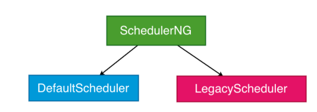
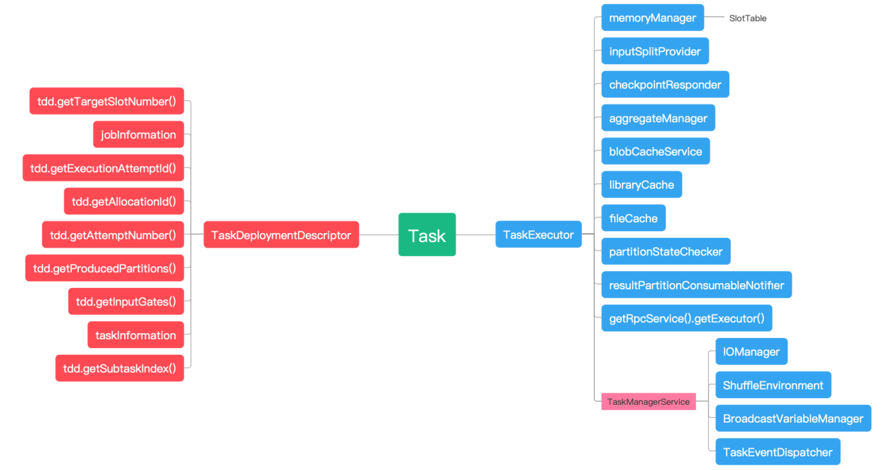
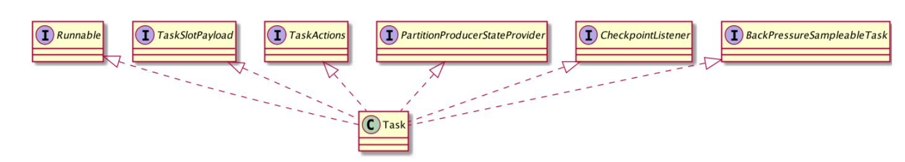
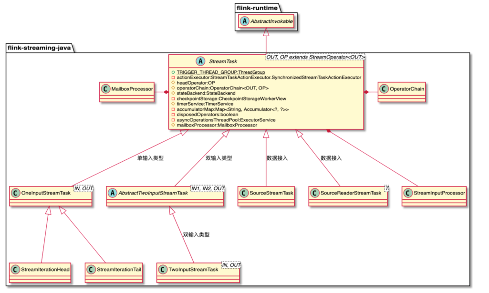
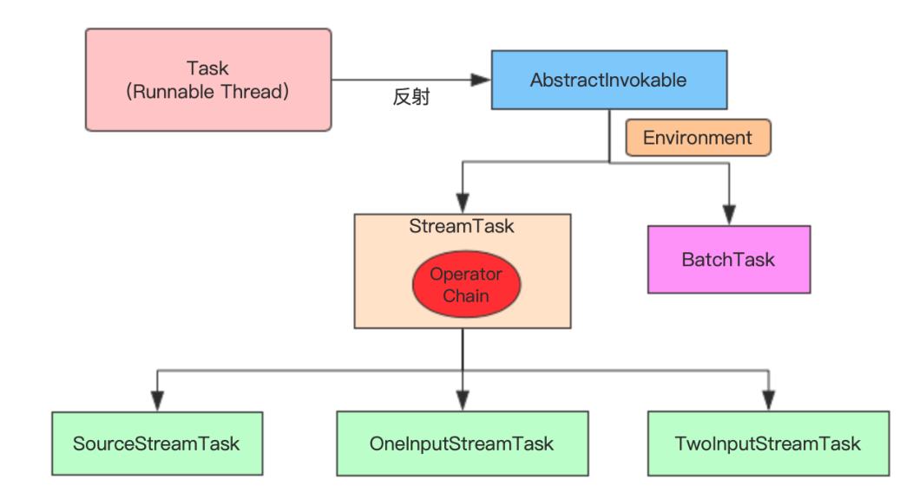
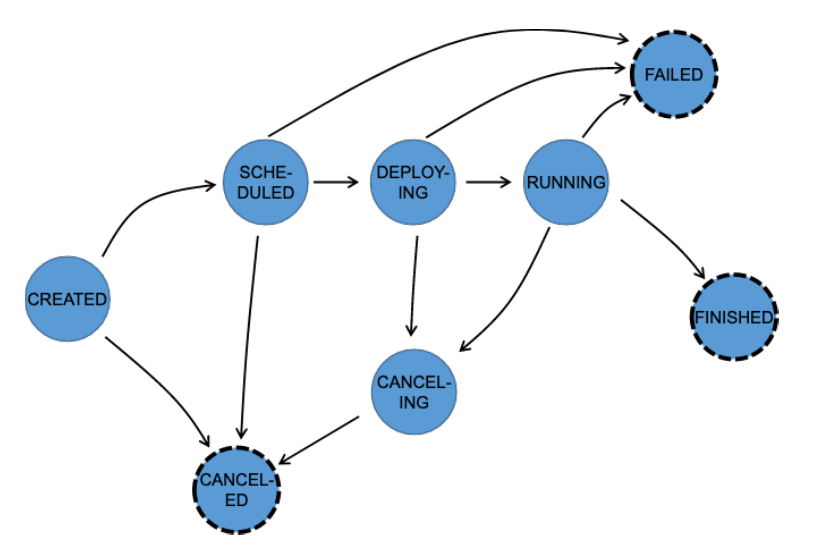

## 1. 开头

## 2. graph
我们知道flink的客户端完成了stream graph -> job graph，然后提交到了dispatch后，会完成job graph -> excution graph -> 物理执行图
  

### 2.1. flink graph转换整体过程
  

#### 2.1.1. program->stream graph
    
通过图片可以知道，它是将代码拆分成算子，然后用stream将它们连接起来。   
    

* 执行应用的execute方法
* 获取stream graph
  ```
      public JobExecutionResult execute(String jobName) throws Exception {
        Preconditions.checkNotNull(jobName, "Streaming Job name should not be null.");
        return this.execute(this.getStreamGraph(jobName));
    }
  ```
* StreamExecutionEnvironment持有Transformation数组
* 我们在使用各种flink的api的时候，实际上那些api会调用这个方法将算子添加到Transformation数组
  ```
  public void addOperator(Transformation<?> transformation) {
		Preconditions.checkNotNull(transformation, "transformation must not be null.");
		this.transformations.add(transformation);
	}
  ```
  
* StreamGraphGenerator生成graph的时候遍历进行生成graph
  ```
  	Collection<Integer> transformedIds;
		if (transform instanceof OneInputTransformation<?, ?>) {
			transformedIds = transformOneInputTransform((OneInputTransformation<?, ?>) transform);
		} else if (transform instanceof TwoInputTransformation<?, ?, ?>) {
  ```


* 上一步会将算子的信息放入到StreamGraph对象之中，如：
  ```
  	private <T> Collection<Integer> transformPartition(PartitionTransformation<T> partition) {
		Transformation<T> input = partition.getInput();
		List<Integer> resultIds = new ArrayList<>();
  
		Collection<Integer> transformedIds = transform(input);
		for (Integer transformedId: transformedIds) {
			int virtualId = Transformation.getNewNodeId();
			streamGraph.addVirtualPartitionNode(
					transformedId, virtualId, partition.getPartitioner(), partition.getShuffleMode());
			resultIds.add(virtualId);
		}
  
		return resultIds;
	}
  ```

* 最终会生成完整的streamgraph    


具体的streamgraph组成为：  

     

#### 2.1.2. stream graph -> job graph
  

* streamgraph的getjobGraph会将streamgraph生成jobgraph
  ```
        public JobGraph getJobGraph(@Nullable JobID jobID) {
                return StreamingJobGraphGenerator.createJobGraph(this, jobID);
        }
  ```
* 最终是由StreamingJobGraphGenerator来生成的    


jobgraph的核心成员为：    
 


#### 2.1.3. job graph  -> executiongraph      
    
 

* JobVertex

  实际上就是JobGraph的节点，代表一个或者一组Operator实例，JobGraph仅是一个计算逻辑的描述，节点和节点之间通过Intermediate Data Set连接。

* ExecutionJobVertex

  ExecutionGraph的Job节点，和JobGraph中JobVertex一一对应，ExecutionJobVertex相当于一系列并行的操作。

* ExecutionVertex

  ExecutionGraph中的子节点，代表ExecutionJobVertex中的并行实例，在ExecutionVertex中ExecutionVertexID作为唯一ID，每个ExecutionVertex都具备Execution变量，Execution负责向TaskExecutor中提交和运行相应的Task。

* IntermediateResult

  ExecutionJobVertex上游算子的中间数据集，每个IntermediateResult包含多个IntermediateResultPartition，通过IntermediateResultPartition生成物理执行图中的ResultPartition组件，用于网络栈中上游Task节点的数据输出。

* Execution

  ExecutionVertex节点中对应的执行单元，ExecutionVertex可以被执行多次，如recovery、re-computation和re-
  configuration等操作都会导致ExecutionVertex重新启动和执行，此时就会通过Execution记录每次执行的操作，Execution提供了向TaskExecutor提交Task的方法    


#### 2.1.4. execution graph -> 物理执行图
  

#### 2.1.5. ExecutionGraph调度器  
ExecutionGraph调度器分类：
* DefaultScheduler
  * 默认调度器
  * 外部调度ExecutionGraph
* LegacyScheduler  
  * 基于ExecutionGraph 内部调度
  




### 2.2. StreamOperator

​	StreamOperator最终会通过StreamOperatorFactory封装在Transformation结构中，并存储在StreamGraph和JobGraph结构中，直到运行时执行StreamTask时，才会调用StreamOperatorFactory.createStreamOperator()方法在StreamOperatorFactory中定义StreamOperator实例。

​	通过StreamOperatorFactory封装创建StreamOperator的操作，在DataStreamAPI中主要通过SimpleStreamOperatorFactory创建已经定义的Operator，而在Table API模块中主要通过CodeGenOperatorFactory从代码中动态编译并创建Operator实例。SimpleStreamOperatorFactory和CodeGenOperatorFactory都是StreamOperatorFactory的实现类

#### 2.2.1. StreamOperatorfactory

SimpleOperatorFactory.of()方法定义中可以看出，基于StreamOperator提供的of()方法对算子进行工厂类的封装，实现将Operator封装在OperatorFactory中。然后根据Operator类型的不同，创建不同的SimpleOperatorFactory实现类。

#### 2.2.2. createStreamOperator方法

首先会调用
SimpleOperatorFactory.createStreamOperator()方法创建
StreamOperator实例。如果算子同时实现了SetupableStreamOperator
接口，则会调用setup()方法对算子进行基本的设置 

### 2.3. Function

和Java提供的Function接口类似，Flink实现的Function接口专门用于处理接入的数据元素。StreamOperator负责对内部Function的调用和执行，当StreamOperator被Task调用和执行时，StreamOperator会将接入的数据元素传递给内部Function进行处理，然后将Function处理后的结果推送给下游的算子继续处理.

#### 2.3.1. RichFunction

​	Flink提供了RichFunction接口实现对有状态计算的支持，RichFunction接口除了包含open()和close()方法之外，还提供了获取RuntimeContext的方法，并在AbstractRichFunction抽象类类中提供了对RichFunction接口的基本实现。RichMapFunction和RichFlatMapFunction接口实现类最终通过AbstractRichFunction提供的getRuntimeContext()方法获取RuntimeContext对象，进而操作状态数据

​	RuntimeContext接口定义了非常丰富的方法，例如创建和获取Accumulator、BroadcastVariable变量的方法以及在状态
操作过程中使用到的getState()和getListState()等方法。

​	不同类型的Operator创建的RuntimeContext也有一定区别，因此在Flink中提供了不同的RuntimeContext实现类，以满足不同Operator对运行时上下文信息的获取。其中AbstractRuntimeUDFContext主要用于获取提供UDF函数的相关运行时上下文信息，且
AbstractRuntimeUDFContext又分别被RuntimeUDFContext、DistributedRuntimeUDFContext以及StreamingRuntimeContext三个子
类继承和实现。RuntimeUDFContext主要用于CollectionExecutor；DistributedRuntimeUDFContext则主要用于BatchTask、DataSinkTask以及DataSourceTask等离线场景。流式数据处理中使用最多的是StreamingRuntimeContext

#### 2.3.2. SourceFunction

​	SourceFunction接口继承了Function接口，并在内部定义了数据读取使用的run()方法和SourceContext内部类，其中SourceContext定义了数据接入过程用到的上下文信息。在默认情况下，SourceFunction不支持并行读取数据，因此SourceFunction被
ParallelSourceFunction接口继承，以支持对外部数据源中数据的并行读取操作，比较典型的ParallelSourceFunction实例就是
FlinkKafkaConsumer。

​	在SourceFunction的基础上拓展了，RichParallelSourceFunction和RichSourceFunction抽象实现类，这使得SourceFunction可以在数据接入的过程中获取RuntimeContext信息，从而实现更加复杂的操作，例如使用OperatorState保存Kafka中数据消费的偏移量，从而实现端到端当且仅被处理一次的语义保障。

​	SourceContext主要用于收集SourceFunction中的上下文信息。SourceContext主要有两种类型的实现子类，分别为NonTimestampContext和WatermarkContext。顾名思义，WatermarkContext支持事件时间抽取和生成Watermark，最终用于处理
乱序事件；而NonTimestampContext不支持基于事件时间的操作，仅实现了从外部数据源中读取数据并处理的逻辑，主要对应
TimeCharacteristic为ProcessingTime的情况。可以看出，用户设定不同的TimeCharacteristic，就会创建不同类型的SourceContext上下文信息

#### 2.3.3. SourceStreamTask

​	SourceFunction定义完毕后，会被封装在StreamSource算子中，前面我们已经知道StreamSource继承自AbstractUdfStreamOperator。在StreamSource算子中提供了run()方法实现SourceStreamTask实例的调用和执行，SourceStreamTask实际上是针对Source类型算子实现的StreamTask实现类。

* 从OperatorConfig中获取TimeCharacteristic，并从Task的环境信息Environment中获取Configuration配置信息。
* 创建LatencyMarksEmitter实例，主要用于在SourceFunction中输出Latency标记，也就是周期性地生成时间戳，当下游算子接收到
  SourceOperator发送的LatencyMark后，会使用当前的时间减去LatencyMark中的时间戳，以此确认该算子数据处理的延迟情况，最后算子会将LatencyMark监控指标以Metric的形式发送到外部的监控系统中。
* 创建SourceContext，这里调用的是StreamSourceContexts.getSourceContext()方法，在该方法中根据TimeCharacteristic参数创建对应类型的SourceContext。
* 将SourceContext实例应用在自定义的SourceFunction中，此时SourceFunction能够直接操作SourceContext，例如收集数据元素、输出Watermark事件等。
* 调用userFunction.run(ctx)方法，调用和执行SourceFunction实例

#### 2.3.4. SinkFunction

​	相比于SourceFunction，SinkFunction的实现相对简单。在SinkFunction中同样需要关注和外部介质的交互，尤其对于支持两阶段提交的数据源来讲，此时需要使用TwoPhaseCommitSinkFunction实现端到端的数据一致性。在SinkFunction中也会通过SinkContext获取与Sink操作相关的上下文信息。

​	SinkFunction继承自Function接口，且SinkFunciton分为WriteSink-Function和RichSinkFunction两种类型的子类，其中WriteSinkFunction实现类已经被废弃，大部分情况下使用的都是RichSinkFunction实现类。常见的RichSinkFunction实现类有SocketClientSink和StreamingFileSink，对于支持两阶段提交的TwoPhaseCommitSinkFunction，实现类主要有FlinkKafkaProducer

​	SourceFunction中的SourceContext一样，在SinkFuntion中也会创建和使用SinkContext，以获取Sink操作过程需要的上下文信息。但相比于SourceContext，SinkFuntion中的SinkContext仅包含一些基本方法，例如获取currentProcessingTime、currentWatermark以及Timestamp等变量。

#### 2.3.5. ProcessFunction

#### 2.3.6. TimerService

​	对于需要依赖时间定时器进行数据处理的算子来讲，需要借助TimerService组件实现对定时器的管理，其中定时器执行的具体处理逻辑主要通过回调函数定义。每个StreamOperator在创建和初始化的过程中，都会通过InternalTimeServiceManager创建TimerService实例，这里的InternalTimeServiceManager管理了Task内所有和时间相关的服务，并向所有Operator提供创建和获取TimerService的方法

#### 2.3.7. KeyedStream

KeyGroupStreamPartitioner实际上就是对数据按照Key进行分组，然后根据Key的分组确定数据被路由到哪个下游的算子中。如图2-
16所示，KeyGroupStreamPartitioner实际上继承自StreamPartitioner抽象类，而StreamPartitioner又实现了ChannelSelector接口，用于选择下游的InputChannel。InputChannel的概念我们会在第7章进行介绍，这里可以将其理解为基于Netty中的channel实现的跨网络数据输入管道，经过网络栈传输的数据最终发送到指定下游算子的InputChannel中。

根据分区策略的不同，StreamPartitioner的实现类也有所区别，这些实现类分别被应用在DataStream对应的转换操作中，例如ShufflePartitioner和DataStream.shuffe()对应。

#### 2.3.8. WindowedStream

## 3. task  

### 3.1. task的class结构  
  
```
    public Task(
            JobInformation jobInformation,
            TaskInformation taskInformation,
            ExecutionAttemptID executionAttemptID,
            AllocationID slotAllocationId,
            int subtaskIndex,
            int attemptNumber,
            List<ResultPartitionDeploymentDescriptor> resultPartitionDeploymentDescriptors,
            List<InputGateDeploymentDescriptor> inputGateDeploymentDescriptors,
            MemoryManager memManager,
            IOManager ioManager,
            ShuffleEnvironment<?, ?> shuffleEnvironment,
            KvStateService kvStateService,
            BroadcastVariableManager bcVarManager,
            TaskEventDispatcher taskEventDispatcher,
            ExternalResourceInfoProvider externalResourceInfoProvider,
            TaskStateManager taskStateManager,
            TaskManagerActions taskManagerActions,
            InputSplitProvider inputSplitProvider,
            CheckpointResponder checkpointResponder,
            TaskOperatorEventGateway operatorCoordinatorEventGateway,
            GlobalAggregateManager aggregateManager,
            LibraryCacheManager.ClassLoaderHandle classLoaderHandle,
            FileCache fileCache,
            TaskManagerRuntimeInfo taskManagerConfig,
            @Nonnull TaskMetricGroup metricGroup,
            ResultPartitionConsumableNotifier resultPartitionConsumableNotifier,
            PartitionProducerStateChecker partitionProducerStateChecker,
            Executor executor) {
```
  
### 3.2. task触发和执行 
   
  
```
          Environment env =
                    new RuntimeEnvironment(
                            jobId,
                            vertexId,
                            executionId,
                            executionConfig,
                            taskInfo,
                            jobConfiguration,
                            taskConfiguration,
                            userCodeClassLoader,
                            memoryManager,
                            ioManager,
                            broadcastVariableManager,
                            taskStateManager,
                            aggregateManager,
                            accumulatorRegistry,
                            kvStateRegistry,
                            inputSplitProvider,
                            distributedCacheEntries,
                            consumableNotifyingPartitionWriters,
                            inputGates,
                            taskEventDispatcher,
                            checkpointResponder,
                            operatorCoordinatorEventGateway,
                            taskManagerConfig,
                            metrics,
                            this,
                            externalResourceInfoProvider);

		...................


       invokable = loadAndInstantiateInvokable(
                                userCodeClassLoader.asClassLoader(), nameOfInvokableClass, env);

		...................    

		try {
			// run the invokable
			invokable.invoke();
		} finally {
			FlinkSecurityManager.unmonitorUserSystemExitForCurrentThread();
		}

```
#### TaskExecutor.submitTask()

```
// 如果添加成功，则执行Task线程
if (taskAdded) {
// 启动Task线程
task.startTaskThread();
// 设定ResultPartition
setupResultPartitionBookkeeping(
tdd.getJobId(),
tdd.getProducedPartitions(),
task.getTerminationFuture());
return CompletableFuture.completedFuture(Acknowledge.get());
} else {
final String message = "TaskManager already contains a task for id
" +
task.getExecutionId() + '.';
log.debug(message);
throw new TaskSubmissionException(message);
}
} catch (TaskSubmissionException e) {

}
return FutureUtils.completedExceptionally(e);
```

* 构建task

  StreamTask通过继承和实现AbstractInvokable抽象类，提供了对流计算任务的支持和实现，StreamTask是所有Streaming类型Task的基本实现类

* task 反射获取operate

* 

  

### 3.3. task的运行状态

    

### 3.4. task重启与容错  
&emsp;&emsp;如果Task执行过程失败，Flink需要重启失败的Task以及相关的上下游Task，以恢复Job到正常状态。  
&emsp;&emsp;重启和容错策略分别用于控制Task重启的时间和范围，其中RestartStrategy决定了Task的重启时间，FailureStrategy决定了哪些Task需要重启才能恢复正常。我们已经知道，在整个ExecutionGraph调度过程中，会创建两种SchedulerNg实现类，分别为LegacyScheduler和DefaultScheduler。  
&emsp;&emsp;LegacyScheduler主要是为了兼容之前的版本，现在默认的ExecutionGraph调度器为DefaultScheduler。  
两种调度器对应的Task重启策略的实现方式也有所不同，但对用户来讲，设定重启策略参数都是一样的，仅底层代码实现有所不同。


#### 3.4.1. task重启策略  
&emsp;&emsp;Task重启策略主要分为三种类型：固定延时重启（fixed-delay）、按失败率重启（failure-rate）以及无重启（none）。

#### 3.4.2. 基于LegacyScheduler实现的重启策略  
LegacyScheduler主要是为了兼容之前的版本，现在默认的ExecutionGraph调度器为DefaultScheduler。这里略。
#### 3.4.3. 基于DefaultScheduler容错和重启策略
&emsp;&emsp;Task容错主要通过FailoverStrategy控制：  
FailoverStrategy接口目前支持：
* RestartAllStrategy  
  只要有Task失败就直接重启Job中所有的，Task实例，这样做的代价相对较大，需要对整个Job进行重启，因此不是首选项。
* RestartPipelinedRegionStrategy   
  RestartPipelinedRegionStrategy策略是只启动与异常Task相关联的Task实例。在Pipeline中通过Region定义上下游中产生数据交换的Task集合，当Region中出现失败的Task，直接重启当前Task所在的Region，完成对作业的容错，其他不在Region内的Task实例则不做任务处理，RestartPipelinedRegionStrategy是Flink中默认支持的容错策略。    
  
  FailoverStrategy有三个关键点:   
  * FailoverStrategy  
    用于控制Task的重启范围，包括重启全部Task还是重启PipelinedRegion内的相关Task  
  * RestartBackoffTimeStrategy  
  	用于控制Task是否需要重启以及重启时间和尝试次数。
  * FailoverTopology  
    用于构建Task重启时需要的拓扑、确定异常Task关联的PipelinedRegion，然后重启Region内的Task。  

  

还有更多。。。。。。。。。