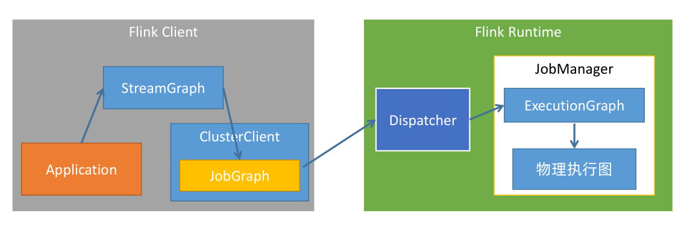
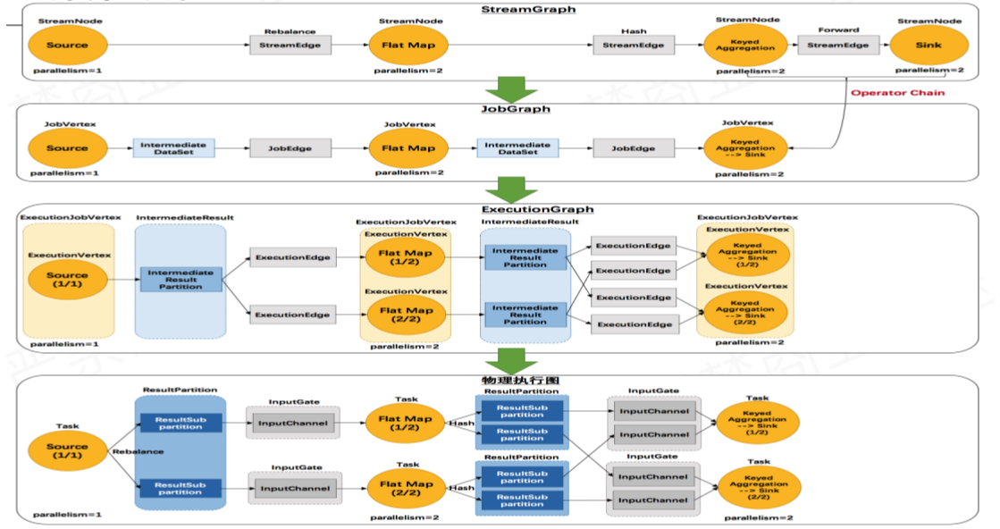
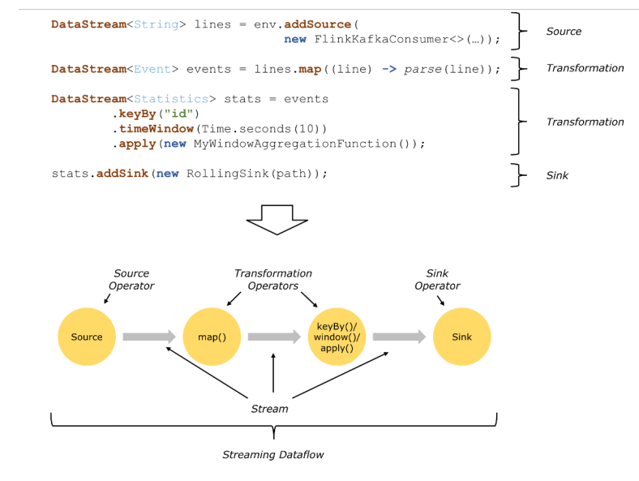
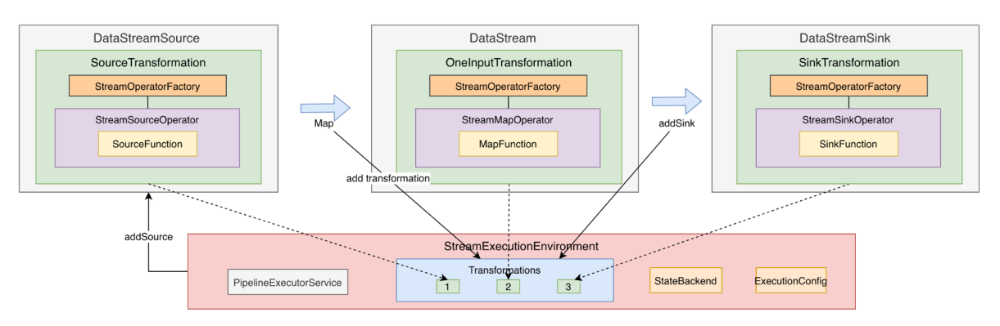
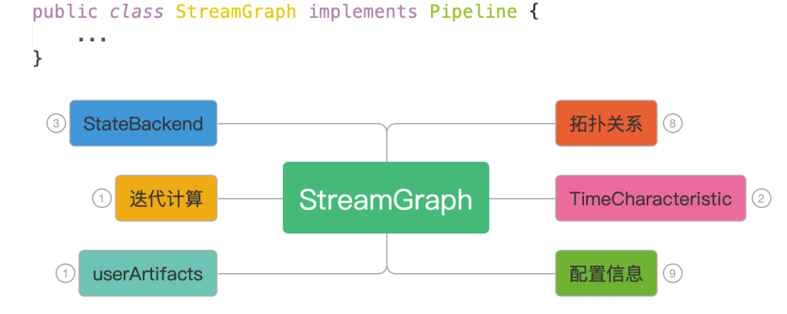
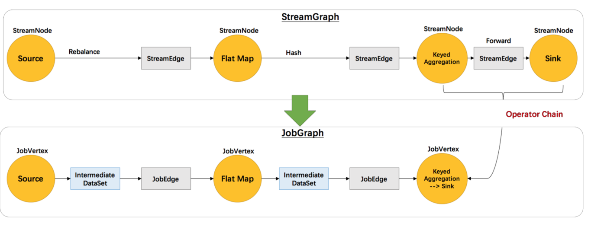
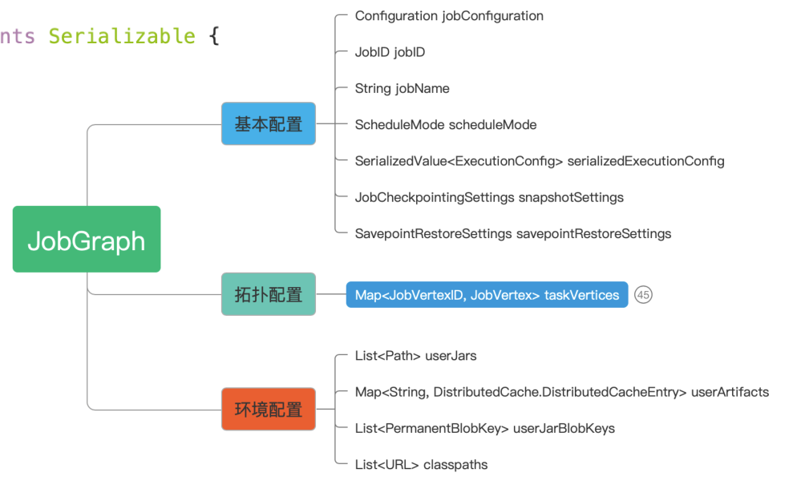
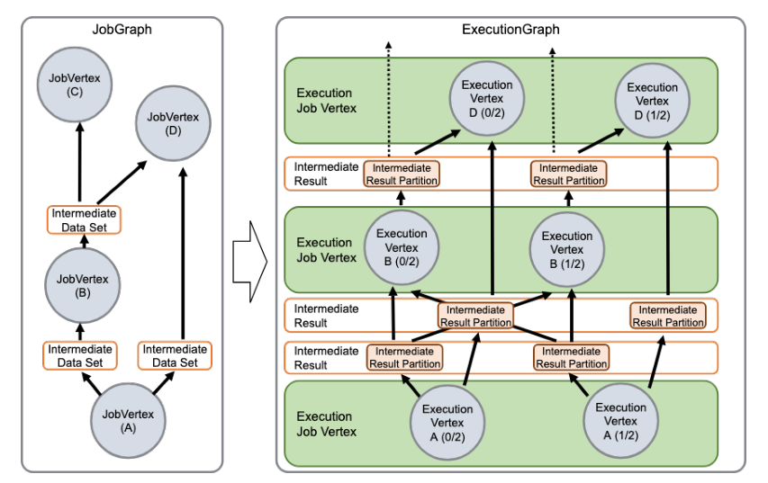
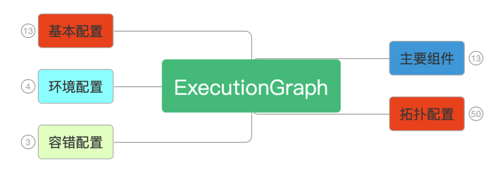
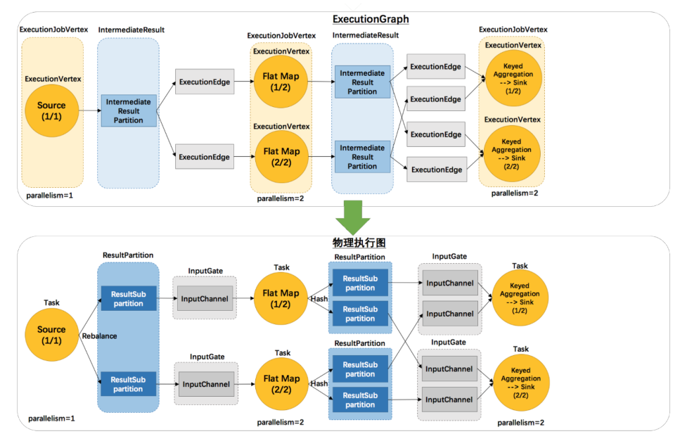

## 1. 开头

## 2. graph
我们知道flink的客户端完成了stream graph -> job graph，然后提交到了dispatch后，会完成job graph -> excution graph -> 物理执行图
  

### 2.1. flink graph转换
  

#### 2.1.1. program->stream graph
    
通过图片可以知道，它是将代码拆分成算子，然后用stream将它们连接起来。   
    

* 执行应用的execute方法
* 获取stream graph
  ```
      public JobExecutionResult execute(String jobName) throws Exception {
        Preconditions.checkNotNull(jobName, "Streaming Job name should not be null.");
        return this.execute(this.getStreamGraph(jobName));
    }
  ```
* StreamExecutionEnvironment持有Transformation数组
* 我们在使用各种flink的api的时候，实际上那些api会调用这个方法将算子添加到Transformation数组
  ```
  	public void addOperator(Transformation<?> transformation) {
		Preconditions.checkNotNull(transformation, "transformation must not be null.");
		this.transformations.add(transformation);
	}
  ```
  

* StreamGraphGenerator生成graph的时候遍历进行生成graph
  ```
  	Collection<Integer> transformedIds;
		if (transform instanceof OneInputTransformation<?, ?>) {
			transformedIds = transformOneInputTransform((OneInputTransformation<?, ?>) transform);
		} else if (transform instanceof TwoInputTransformation<?, ?, ?>) {
  ```  


* 上一步会将算子的信息放入到StreamGraph对象之中，如：
  ```
  	private <T> Collection<Integer> transformPartition(PartitionTransformation<T> partition) {
		Transformation<T> input = partition.getInput();
		List<Integer> resultIds = new ArrayList<>();

		Collection<Integer> transformedIds = transform(input);
		for (Integer transformedId: transformedIds) {
			int virtualId = Transformation.getNewNodeId();
			streamGraph.addVirtualPartitionNode(
					transformedId, virtualId, partition.getPartitioner(), partition.getShuffleMode());
			resultIds.add(virtualId);
		}

		return resultIds;
	}
  ``` 

* 最终会生成完整的streamgraph    


具体的streamgraph组成为：  

     

#### 2.1.2. stream graph -> job graph
  
  
* streamgraph的getjobGraph会将streamgraph生成jobgraph
  ```
        public JobGraph getJobGraph(@Nullable JobID jobID) {
                return StreamingJobGraphGenerator.createJobGraph(this, jobID);
        }
  ```
* 最终是由StreamingJobGraphGenerator来生成的    


jobgraph的核心成员为：    
 


#### 2.1.3. job graph  -> executiongraph      
    
     


#### 2.1.4. execution graph -> 物理执行图
  

## 3. task