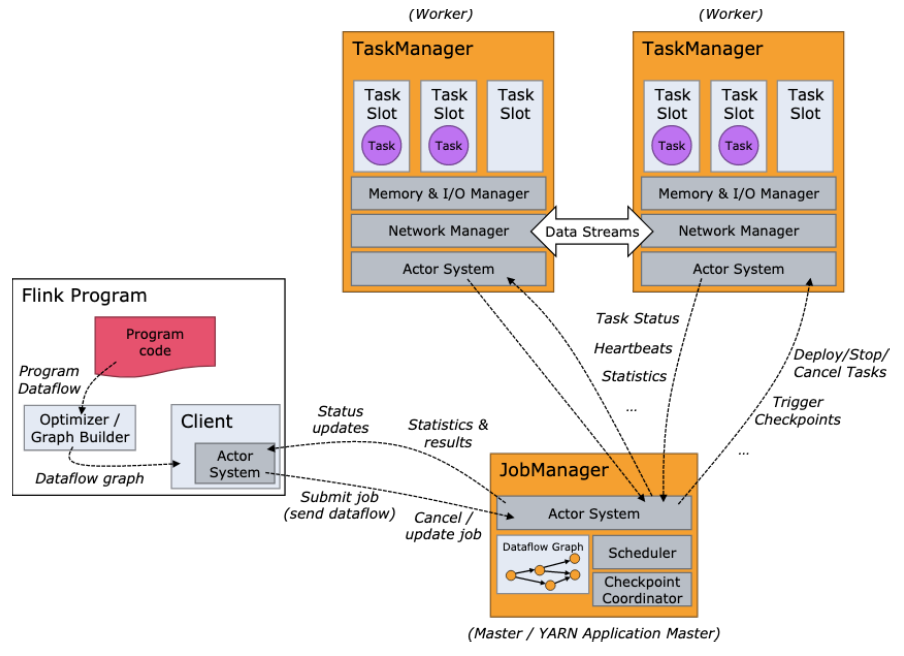
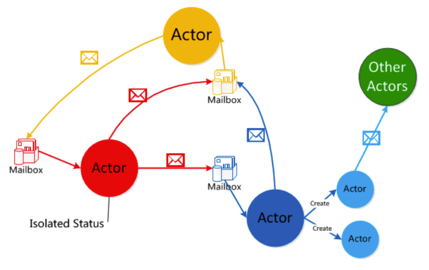
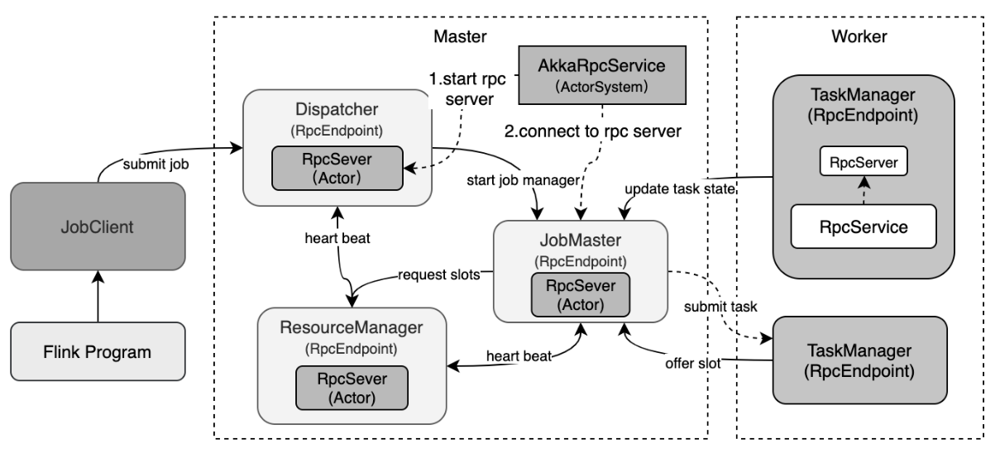
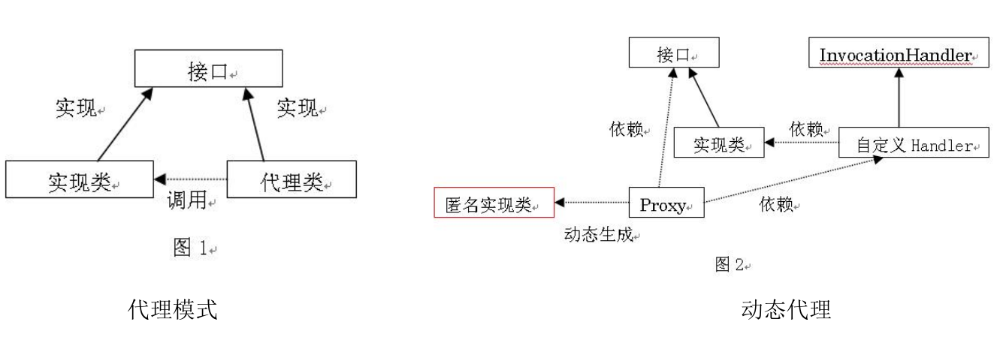
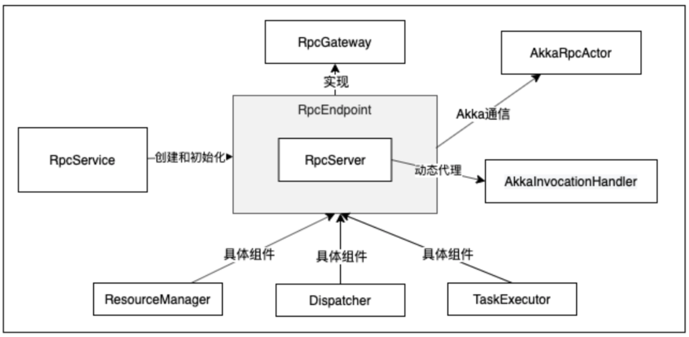
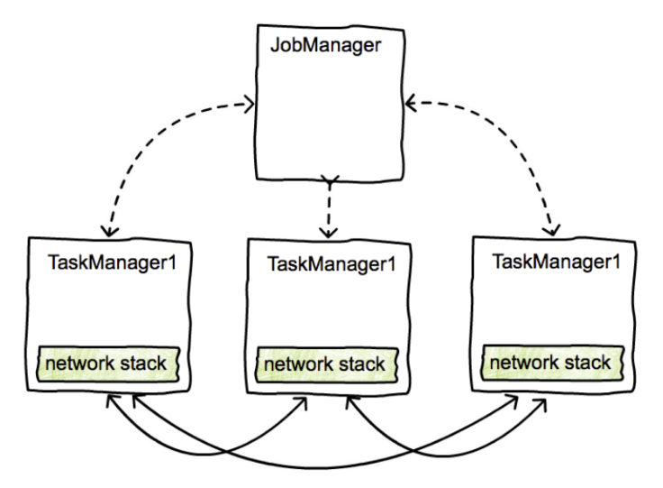
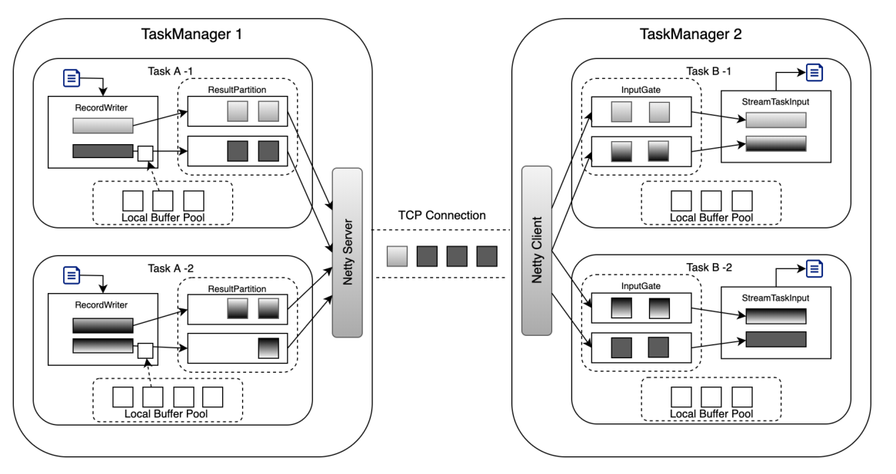
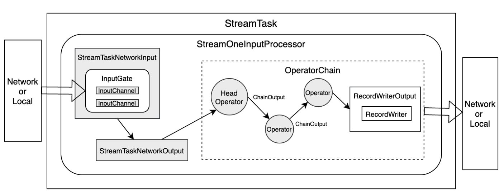
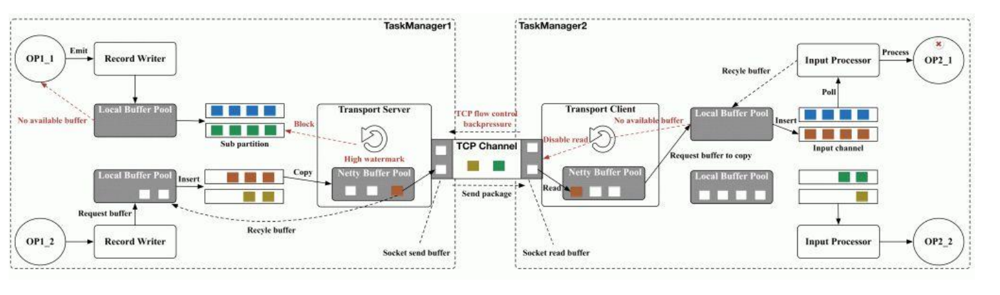
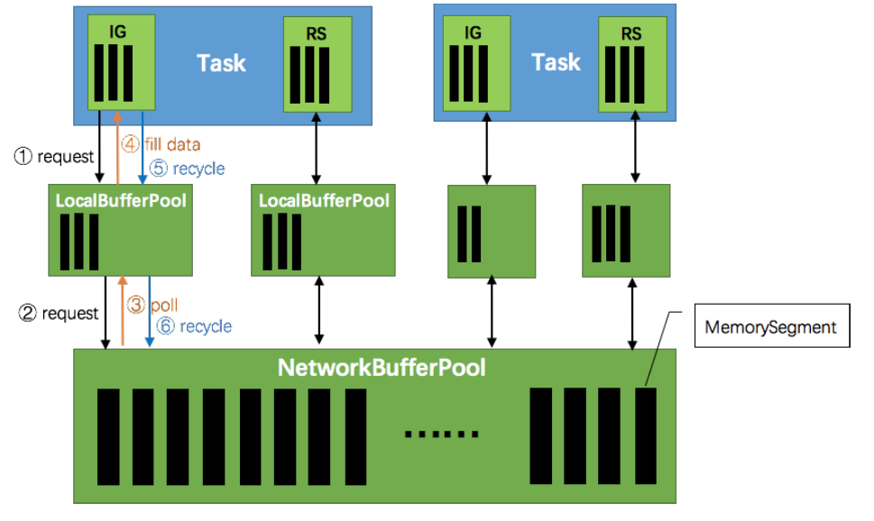

## 1. 开头
flink通信分为组件之间通信和task数据通信。两种方式实现是不同的。
## 2. flink的rpc通信
### 2.1. 整体组件通信架构  

### 2.2. akka通信
    
&emsp;&emsp;flink组件之间通过基于akka的rcp进行通信的。而akka是actor并发模型框架，使用akka进行编程的示例如下：
* 构建ActorSystem
```
ActorSystem system = ActorSystem.create("akka_system");
// ActorSystem system = ActorSystem.create("akka_system", ConfigFactory.load("appsys"));
```
* 构建Actor, 获取该Actor引用
```
// 即ActorRef ActorRef customActor =
system.actorOf(Props.create(CustomActor.class), "customActor");
```    

* 给helloActor发送消息
```
helloActor.tell("hello customActor", ActorRef.noSender());
```
* 关闭akka系统框架
```
ActorSystem system.terminate();
```  

### 2.3. fink的rpc架构  
    

### 2.4. rpc的基本原理  
  

### 2.5. fink的rpc server设计    
  


## 3. flink数据网络传输
&emsp;&emsp;flink数据传输是基于netty的，task与task之间是通过netty的tcp协议进行传输。  
 

### 3.1. tasks之间的传输
  

### 3.2. streamtask之间的传输
  

### 3.3. taskmanager之间的数据传输
  


### 3.4. 网络传输的内存管理  
