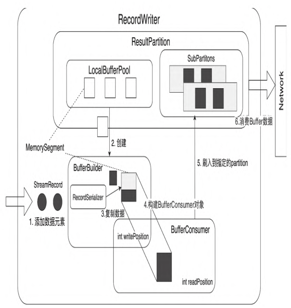
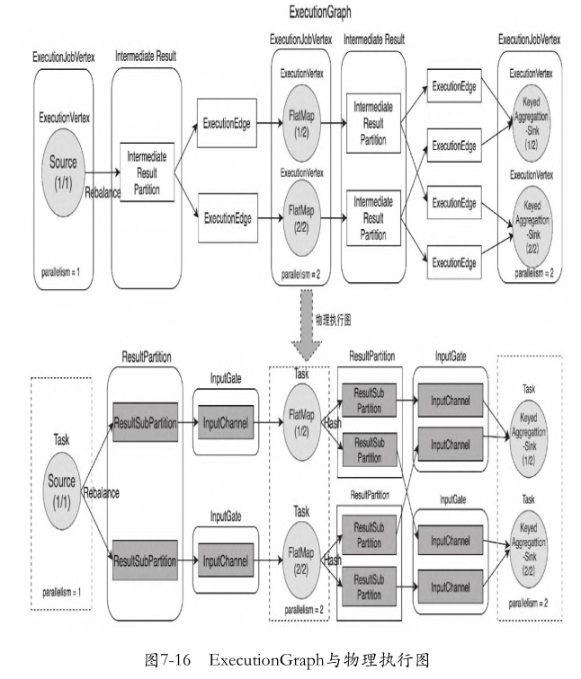
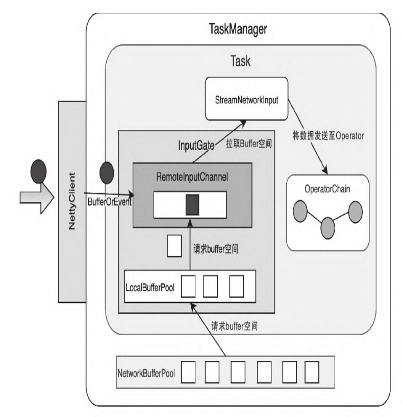
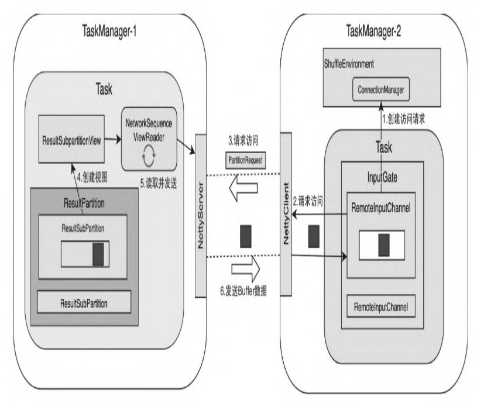
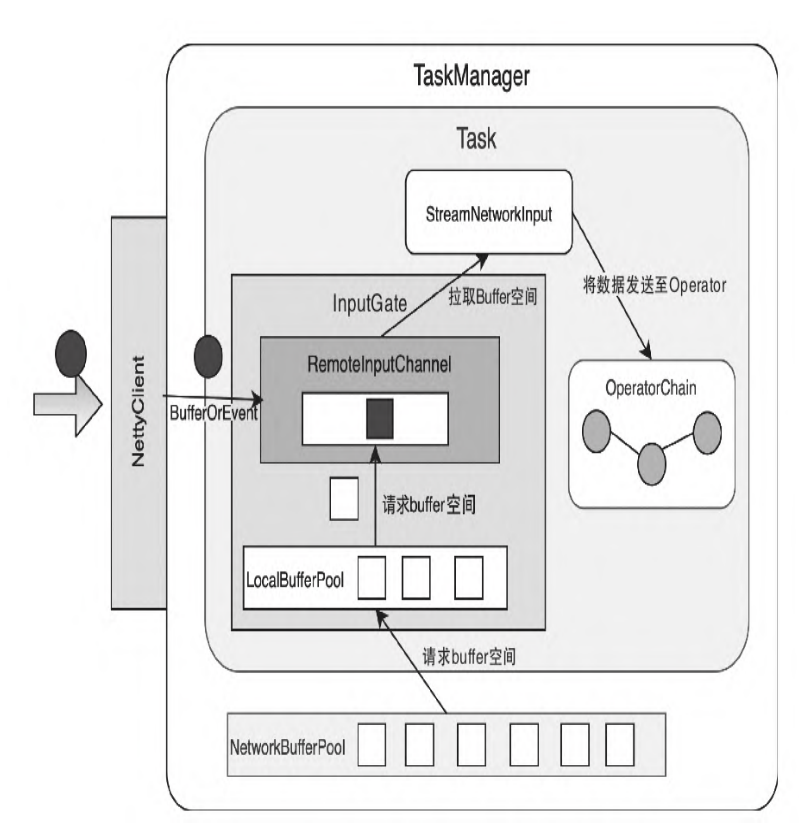
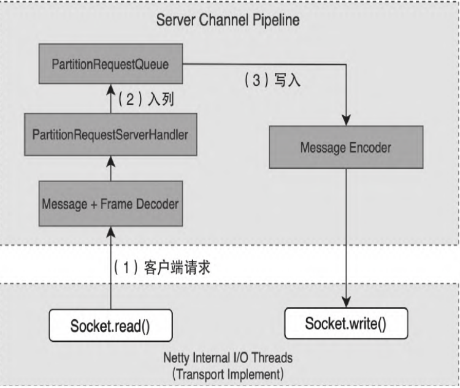

## 1. 开头
flink通信分为组件之间通信和task数据通信。两种方式实现是不同的。
## 2. flink的rpc通信
### 2.1. 整体组件通信架构  

### 2.2. akka通信
    
&emsp;&emsp;flink组件之间通过基于akka的rcp进行通信的。而akka是actor并发模型框架，使用akka进行编程的示例如下：
* 构建ActorSystem
```
ActorSystem system = ActorSystem.create("akka_system");
// ActorSystem system = ActorSystem.create("akka_system", ConfigFactory.load("appsys"));
```
* 构建Actor, 获取该Actor引用
```
// 即ActorRef ActorRef customActor =
system.actorOf(Props.create(CustomActor.class), "customActor");
```

* 给helloActor发送消息
```
helloActor.tell("hello customActor", ActorRef.noSender());
```
* 关闭akka系统框架
```
ActorSystem system.terminate();
```

### 2.3. fink的rpc架构  
    

**RpcEndpoint中创建和启动RpcServer主要是基于集群中的**
**RpcService实现，RpcService的主要实现是AkkaRpcService。**
**从图中可以看出，AkkaRpcService将Akka中的ActorSystem进行封装，通过**
**AkkaRpcService可以创建RpcEndpoint中的RpcServer，同时基于**
**AkkaRpcService提供的connect()方法与远程RpcServer建立RPC连接，**
**提供远程进程调用的能力。**

#### 2.3.1. rpc的基本原理  
  

#### 2.3.2. fink的rpc server设计 
  

#### 2.3.3. fink的rpc 涉及的组件

* RpcEndpoint中提供了集群RPC组件的基本实现，所有需要实现RPC服务的组件都会继承RpcEndpoint抽象类。RpcEndpoint中包含了endpointId，用于唯一标记当前的RPC节点。RpcEndpoint借助RpcService启动内部RpcServer，之后通过RpcServer完成本地和远程线程执行
* 对于RpcEndpoint来讲，底层主要有FencedRpcEndpoint基本实现类，FencedRpcEndpoint在RpcEndpoint的基础上增加了
  FencedToken。实现FencedRpcEndpoint的RPC节点都会有自己的FencedToken，当进行远程RPC调用时，会对比访问者分配的FencedToken和被访问者的FencedToken，结果一致才会进行后续操作
* RpcEndpoint的实现类有TaskExecutor组件，FencedRpcEndpoint的实现类有Dispatcher、JobMaster以及ResourceManager等组件。这些组件继承RpcEndpoint后，就能获取RpcEndpoint中提供的全部非私有化方法，例如在TaskExecutor中调用getRpcService().getExecutor()方法，可以获取RpcService中ActorSystem的dispatcher服务，并直接通过dispatcher创建Task线程
  实例。

* RpcService提供了创建和启动RpcServer的方法，在启动RpcServer的过程中，通过RpcEndpoint的地址创建Akka Actor实例，
  并基于Actor实例构建RpcServer接口的动态代理类，向RpcServer的主线程中提交Runnable以及Callable线程等。同时在RpcService中提供了连接远程RpcEndpoint的方法，并创建了相应RpcGateway接口的动态代理类，用于执行远程RPC请求
* RpcServer接口通过AkkaInvocationHandler动态代理类实现，所有远程或本地的执行请求最终都会转换到AkkaInvocationHandler代
  理类中执行。AkkaInvocationHandler实现了MainThreadExecutable接口，提供了runAsync(Runnable runnable)以及
  callAsync(Callable<V> callable, Time callTimeout)等在主线程中执行代码块的功能。例如在TaskExecutor中释放Slot资源时，会调用runAsync()方法将freeSlotInternal()方法提交到TaskExecutor对应的RpcServer中运行，此时就会调用AkkaInvocationHandler在主线程中执行任务。

#### 2.3.4. RpcEndpoint的设计与实现

RpcEndpoint是集群中RPC组件的端点，每个RpcEndpoint都对应一个由endpointId和actorSystem确定的路径，且该路径对应同一个AkkaActor。所有需要实现RPC通信的集群组件都会继承RpcEndpoint抽象类，例如TaskExecutor、Dispatcher以及ResourceManager组件服务，还包括根据JobGraph动态创建和启动的jobMaster服务

RpcEndpoint实现了RpcGateway和
AutoCloseableAsync两个接口，其中RpcGateway提供了动态获取
RpcEndpoint中Akka地址和HostName的方法。因为JobMaster组件在任
务启动时才会获取Akka中ActorSystem分配的地址信息，所以借助
RpcGateway接口提供的方法就能获取Akka相关连接信息。
RpcEndpoint中包含RpcService、RpcServer以及
MainThreadExecutor三个重要的成员变量，其中RpcService是
RpcEndpoint的后台管理服务，RpcServer是RpcEndpoint的内部服务
类，MainThreadExecutor封装了MainThreadExecutable接口，
MainThreadExecutable的主要底层实现是AkkaInvocationHandler代理
类。所有本地和远程的RpcGateway执行请求都会通过动态代理的形式
转换到AkkaInvocationHandler代理类中执行

### 2.4. AkkaRpcService详解

#### 2.4.1. RpcServer创建

RpcService主要包含如下两个重要方法。
1）startServer()：用于启动RpcEndpoint中的RpcServer。
RpcServer实际上就是对Actor进行封装，启动完成后，RpcEndpoint中
的RpcServer就能够对外提供服务了。
2）connect()：用于连接远端RpcEndpoint并返回给调用方
RpcGateway接口的代理类，RPC客户端就能像本地一样调用RpcServer
提供的RpcGateway接口了。例如在JobMaster组件中创建与
ResourceManager组件之间的RPC连接时，会在JobMaster中创建
ResourceManagerGateway的动态代理类，最终转换成
RpcInvocationMessage通过Akka系统发送到ResourceManager节点对应
的RpcServer中执行，这样就使得JobMaster像调用本地方法一样在
ResourceManager中执行请求任务

RpcServer在RpcEndpoint的构造器中完成初始化后，接下来就是
启动RpcEndpoint和RpcServer，这里我们以ResourceManager为例进行
说明。首先在DefaultDispatcherResourceManagerComponentFactory
中调用ResourceManager.start()方法启动ResourceManager实例，此
时在ResourceManager.start()方法中会同步调用RpcServer.start()
方法，启动ResourceManager所在RpcEndpoint中的RpcServer，如图7-
7所示。
ResourceManager组件对应的RpcServer启动过程主要包含如下流
程。
1）调用ResourceManager.start()方法，此时会调用
RpcEndpoint.start()父方法，启动ResourceManager组件的
RpcServer。
2）通过动态代理AkkaInvocationHandler.invoke()方法执行流
程，发现调用的是StartStoppable.start()方法，此时会直接调用
AkkaInvocationHandler.start()本地方法。
3）在AkkaInvocationHandler.start()方法中，实际上会调用
rpcEndpoint.tell(ControlMessages.START, ActorRef.noSender())
方法向ResourceManager对应的Actor发送控制消息，表明当前Actor实
例可以正常启动并接收来自远端的RPC请求。
4）AkkaRpcActor调用handleControlMessage()方法处理
ControlMessages.START控制消息。
5）将AkkaRpcActor中的状态更新为StartedState，此时
ResourceManager的RpcServer启动完成，ResourceManager组件能够接
收来自其他组件的RPC请求。
经过以上步骤，指定组件的RpcEndpoint节点就正常启动，此时
RpcServer会作为独立的线程运行在JobManager或TaskManager进程
中，处理本地和远程提交的RPC请求

#### 2.4.2. RpcServer启动

#### 2.4.3. 创建RpcGateway

​	当AkkaRpcService启动RpcEndpoint中的RpcServer后，
RpcEndpoint组件仅能对外提供处理RPC请求的能力，RpcEndpoint组件
需要在启动后向其他组件注册自己的RpcEndpoint信息，并完成组件之
间的RpcConnection注册，才能相互访问和通信。创建RPC连接需要调
用RpcService.connect()方法

​	在AkkaRpcService.connect()方法中，实际
上调用了connectInternal()方法完成RpcConnection对象的创建。同
时在方法中会使用Lambda表达式定义函数接口的实现，通过给定的
ActorRef引用类创建FencedAkkaInvocationHandler实例。最后方法会
返回FencedRpcGateway接口代理类，此时调用方就能像本地一样调用
远端RpcEndpoint实现的RpcGateway接口

### 2.5. RpcServer动态代理实现

RpcServer中提供的RpcGateway接口方法，最终都会通过
AkkaInvocationHandler.invoke()方法进行代理实现。
AkkaInvocationHandler中根据在本地执行还是远程执行将代理方法进
行区分。通常情况下，RpcEndpoint实现类除了调用指定服务组件的
RpcGateway接口之外，其余的RpcGateway接口基本上都是本地调用和
执行的。
如代码清单7-6所示，本地接口主要有AkkaBasedEndpoint、
RpcGateway、StartStoppable、MainThreadExecutable和RpcServer
等，这些接口方法都是通过AkkaInvocationHandler代理类通过动态代
理的方式实现的。例如ResourceManager组件需要执行定时代码块时，
会调用RpcEndpoint.scheduleRunAsync()方法，最终调用
AkkaInvocationHandler.scheduleRunAsync()方法执行定时线程服
务。
另外一种方法是远程调用，此时会在AkkaInvocationHandler中创
建RpcInvocationMessage，并通过Akka发送RpcInvocationMessage到
指定地址的远端进程中，远端的RpcEndpoint会接收
RpcInvocationMessage并进行反序列化，然后调用底层的动态代理类
实现进程内部的方法调用

### 2.6. AkkaRpcActor的设计与实现

在RpcEndpoint中创建的RemoteRpcInvocation消息，最终会通过
Akka系统传递到被调用方，例如TaskExecutor向ResourceManager发送
SlotReport请求的时候，会在TaskExecutor中将
ResourceManagerGateway的方法名称和参数打包成
RemoteRpcInvocation对象。然后经过网络发送到ResourceManager中
的AkkaRpcActor，在ResourceManager本地执行具体的方法。接下来我
们深入了解AkkaRpcActor的设计与实现，了解在AkkaRpcActor中如何
接收RemoteRpcInvocation消息并执行后续的操作。
如代码清单7-9所示，首先在AkkaRpcActor中创建Receive对象，
用于处理Akka系统接收的其他Actor发送过来的消息。可以看出，在
AkkaRpcActor中主要创建了RemoteHandshakeMessage、
ControlMessages等消息对应的处理器，其中RemoteHandshakeMessage
主要用于进行正式RPC通信之前的网络连接检测，保障RPC通信正常。
ControlMessages用于控制Akka系统，例如启动和停止Akka Actor等控
制消息。这里我们重点关注第三种类型的消息，即在集群运行时中RPC
组件通信使用的Message类型，此时会调用handleMessage()方法对这
类消息进行处理

### 2.7. 集群组件之间的RPC通信

当TaskExecutor启动后，会立即向ResourceManager中注册当前
TaskManager的信息。同样，JobMaster组件启动后也立即会向
ResourceManager注册JobMaster的信息。这些注册操作实际上就是在
构建集群中各个组件之间的RPC连接，这里的注册连接在Flink中被称
为RegisteredRpcConnection，集群组件之间的RPC通信都会通过创建
RegisteredRpcConnection进行，例如获取RpcEndpoint对应的
RpcGateway接口以及维护组件之间的心跳连接等

集群运行时中各组件的注册连接主要通过
RegisteredRpcConnection基本类提供的，且实现子类主要有
JobManagerRegisteredRpcConnection、ResourceManagerConnection
和TaskExecutorToResourceManagerConnection三种。
·JobManagerRegisteredRpcConnection：用于管理TaskManager中与
JobManager之间的RPC连接。
·ResourceManagerConnection：用于管理JobManager中与
ResourceManager之间的RPC连接。
·TaskExecutorToResourceManagerConnection：用于管理
TaskExecutor中与ResourceManager之间的RPC连接

## 3. flink数据网络传输

除了各个组件之间进行RPC通信之外，在Flink集群中TaskManager
和TaskManager节点之间也会发生数据交换，尤其当用户提交的作业涉
及Task实例运行在不同的TaskManager上时。Task实例之间的数据交换
主要借助Flink中的NetworkStack实现。NetworkStack不仅提供了非常
高效的网络I/O，也提供了非常灵活的反压控制

&emsp;&emsp;flink数据传输是基于netty的，task与task之间是通过netty的tcp协议进行传输。  
 

### 3.1. tasks之间的传输
  

经过Operator处理后的数据，最终会通过RecordWriter组件写入网络栈，即算子输出的数据并不是直接写入网络，而是先将数据元素转换为二级制Buffer数据，并将Buffer缓存在ResultSubPartition队列中，再从ResultSubPartition队列将Buffer数据消费后写入下游Task对应的InputChannel。在上游的Task

中会创建LocalBufferPool为数据元素申请对应Buffer的存储空间，且上游的Task会创建NettyServer作为网络连接服务端，并与下游Task内部的NettyClient之间建立网络连接。

对下游的Task实例来讲，会通过InputGate组件接收上游Task发送
的数据，在InputGate中包含了多个InputChannel。InputChannel实际
上是将Netty中Channel进行封装，数量取决于Task的并行度。上游
Task的ResultPartition会根据ChannelSelector选择需要将数据下发
到哪一个InputChannel中，其实现类似Shuffe的数据洗牌操作。在下
游的Task实例中可以看出，InputGate中接收到的二进制数据，会转换
为Buffer数据结构并存储到本地的Buffer队列中，最后被
StreamTaskInput不断地从队列中拉取出来并处理。StreamTaskInput
会将Buffer数据进行反序列化操作，将Buffer数据转换为
StreamRecord并发送到OperatorChain中继续处理

### 3.2. streamtask之间的传输

在ExecutionGraph调度和执行
ExecutionVertex节点的过程中，会将OperatorChain提交到同一个
Task实例中运行。如果被调度的作业为流式类型，则
AbstractInvokable的实现类就为StreamTask。最终StreamTask会被
TaskManager中的Task线程触发执行。
根据数据源不同，StreamTask分为两种类型：一种是直接从外部
源数据读取数据的SourceStreamTask和SourceReaderStreamTask；另
一种是支持从网络或本地获取数据的OneInputStreamTask和
TwoInputStreamTask，图中所表示的Task类型就是
OneInputStreamTask类型

  

我们以OneInputStreamTask为例，从Task层面介绍数据从网
络接入并发送到OperatorChain中进行处理，处理完成后又通过Output
组建输出到下游网络中的过程。通过这些Task的组合实现在
TaskManager节点之间数据的网络交互。如图7-11所示，
OneInputStreamTask包含如下逻辑。
1）OneInputStreamTask包含一个StreamInputProcessor，用于对
输入数据进行处理和输出。在StreamInputProcessor组件中包含
StreamTaskInput、OperatorChain以及DataOutput三个组成部分。
2）StreamTaskInput从Task外部获取数据。根据不同的数据来
源，StreamTaskInput的实现主要分为从网络获取数据的
StreamTaskNetworkInput和从外部系统获取数据的
StreamTaskSourceInput。
3）DataOutput负责将StreamTaskInput接收的数据发送到当前
Task实例的OperatorChain的HeadOperator中进行处理。DataOutput主
要有StreamTaskNetworkOutput和StreamTaskSourceOutput两种实现。
StreamTaskNetworkOutput用于处理StreamTaskNetworkInput接收的数
据，StreamTaskSourceOutput用于处理StreamTaskSourceInput接收的
数据。
4）OperatorChain负责将能够运行在同一个Task实例中的
Operator连接起来，然后形成算子链，且算子链中HeaderOperator会
暴露给StreamTask。当StreamTaskNetworkIutput接收到网络数据后，
就会通过StreamTaskNetworkOutput组件将数据元素发送给
OperatorChain中的HeaderOperator进行处理，此时Task实例中的算子
就能够接收数据并进行处理了。
5）在OperatorChain中，除了具有HeaderOperator之外，还包含
了其他算子，这些算子会按照拓扑关系连接到HeaderOperator之后，
每个算子之间的数据传输通过Output组件相连，即在OperatorChain
中，上一个算子处理的数据会通过Output组件发送到下一个算子中继
续处理。这里需要区分Output和DataOutput的区别，DataOutput强调
的是从外部接入数据到Task实例后再转发到HeaderOperator中，
Output则更加强调算子链内部的数据传递。
6）对于Output组件的实现主要有ChainingOutput、
BroadcastingOutputCollector、DirectedOutput和
RecordWriterOutput等类型，它们最大的区别在于数据下发的方式不
同，例如ChainingOutput代表直接向下游算子推送数据。
7）经过算子链处理后的数据，需要发送到网络中供下游的Task实
例继续处理，此时需要通过RecordWriterOutput完成数据的网络输
出。RecordWriterOutput中包含了RecordWriter组件，用于将数据输
出到网络中，下游Task实例就能通过StreamTaskInput组件从网络中获
取数据，并继续传递到Task内部的算子链进行处理。
在StreamTask中接入数据，然后通过OperatorChain进行处理，再
通过RecordWriterOutput发送到网络中，下游Task节点则继续从网络
中获取数据并继续处理，最后组合这些Task节点就形成了整个Flink作
业的计算拓扑。Task节点的数据输入也可以是本地类型，这种情况主
要出现在Task实例被执行在同一台TaskManager时，数据不需要经过网
络传输

#### 3.2.1. 数据接收

OneInputStreamTask.processInput()方法实际上就会调用
StreamOneInputProcessor.processInput()方法完成数据元素的获取
和处理。调度并执行StreamOneInputProcessor组件，串联并运行
StreamTaskInput组件、DataOutput组件和OperatorChain组件，最终
完成数据元素的处理操作。

StreamTaskNetworkInput.emitNext()方法
包含如下逻辑。
1）启动一个While(true)循环并根据指定条件退出循环。
2）判断currentRecorddeserializer是否为空，如果不为空，表
明currentRecorddeserializer对象中已经含有反序列化的数据元素，
此时会优先从中获取反序列化的数据元素，并返回
DeserializationResult表示数据元素的消费情况。
3）如果DeserializationResult中显示Buffer已经消费完，则对
Buffer内存空间进行回收，本地缓冲区中的数据元素都会通过Buffer
结构以二进制的格式进行存储，我们会在7.2.7节重点介绍Buffer的底
层数据结构设计。
4）判断DeserializationResult是否消费了完整的Record，如果
是则表明当前反序列化的Buffer数据是一个完整的数据元素。接着调
用processElement()方法对该数据元素继续进行处理，并返回
InputStatus.MORE_AVAILABLE状态，表示管道中还有更多的数据元素
可以继续处理。
5）当数据还没有接入的时候，currentRecorddeserializer对象
为空，此时会跳过上面的逻辑，从InputGate中拉取新的Buffer数据，
并调用processBufferOrEvent()方法将接收到的Buffer数据写入
currentRecorddeserializer。
6）调用checkpointedInputGate.pollNext()方法从InputGate中
拉取新的BufferOrEvent数据，BufferOrEvent代表数据元素可以是
Buffer类型，也可以是事件类型，比如CheckpointBarrier、
TaskEvent等事件。
7）bufferOrEvent不为空的时候，会调用
processBufferOrEvent()进行处理，此时如果是Buffer类型的数据则
进行反序列化操作，将接收到的二进制数据存储到
currentRecordDeserializer中，再从currentRecorddeserializer对
象获取数据元素。对于事件数据则直接执行相应类型事件的操作。
8）如果bufferOrEvent为空，则判断checkpointedInputGate是否
已经关闭，如果已经关闭了则直接返回END_OF_INPUT状态，否则返回
NOTHING_AVAILABLE状态

#### 3.2.2. OperatorChain

从InputGate中拉取数据元素并进行反序列化操作，转换成
StreamElement类型后，再调用
StreamTaskNetworkOutput.emitRecord()方法将数据元素推送到
OperatorChain的HeaderOperator中进行处理。后续的数据处理操作主
要在OperatorChain中完成，接下来我们深入了解OperatorChain的设
计与实现

我们知道在JobGraph对象的创建过程中，将链化可以连在一起的
算子，常见的有StreamMap、StreamFilter等类型的算子。
OperatorChain中的所有算子都会被运行在同一个Task实例中。
StreamTaskNetworkOutput会将接入的数据元素写入算子链的
HeadOperator中，从而开启整个OperatorChain的数据处理。如图7-12
所示，在OperatorChain中通过Output组件将上下游算子相连，当上游
算子数据处理完毕后，会通过Output组件发送到下游的算子中继续处
理。
OperatorChain内部定义了
WatermarkGaugeExposingOutput接口，且该接口分别继承了Output和
Collector接口。Collector接口提供了collect()方法，用于收集处理
完的数据。Output接口提供了emitWatermark()、
emitLatencyMarker()等方法，用于对Collector接口进行拓展，使得
Output接口实现类可以输出Watermark和LatencyMarker等事件。
WatermarkGaugeExposingOutput接口则提供了获取WatermarkGauge的
方法，用于监控最新的Watermark

#### 3.2.3. RecordWriter

​	StreamTask节点中的中间结果数据元素最终通过RecordWriterOutput实现了网络输出，RecordWriterOutput底层依赖RecordWriter组件完成数据输出操作。

* 创建RecordWriter实例

在StreamTask构造器方法中会直接创建RecordWriter实例，用于
输出当前任务产生的Intermediate Result数据。这里实际上调用了
createRecordWriterDelegate()方法创建RecordWriterDelegate作为
RecordWriter的代理类

createRecordWriterDelegate()方法中会调用createRecordWriters()方法，根据StreamConfig和Environment
环境信息创建RecordWriter实例。然后根据recordWrites的数量创建
对应的RecordWriterDelegate代理类：如果recordWrites数量等于1，
则创建SingleRecordWriter代理类；如果recordWrites数量等于0，则
创建NonRecordWriter代理类；其他情况则创建
MultipleRecordWriters代理类

StreamTask.createRecordWriters()方法中，首先创建空的
RecordWriter集合，用于存储创建的RecordWriter实例，然后从配置
中获取outEdgesInOrder集合，即当前StreamTask的所有输出边，接着
从configuration中获取chainedConfigs配置，用于调用
BufferTimeOut等参数，再然后遍历输出节点，分别创建每个输出边对
应的RecordWriter，最后将RecordWriter实例添加到RecordWriter集
合中，返回创建的RecordWriter集合


RecordWriter负责将
Buffer数据写入指定的ResultPartition，下游任务的算子可以到
ResultPartition中消费Buffer数据。在创建OperatorChain时会指定
recordWriter作为参数，用于创建RecordWriterOutput组件，代码如
下

* RecordWriter的类型与实现

  RecordWriter内部主要包含RecordSerializer和
  ResultPartitionWriter两个组件。RecordSerializer用于对输出到网
  络中的数据进行序列化操作，将数据元素序列化成Bytes[]二进制格
  式，维护Bytes[]数据中的startBuffer及position等信息。
  ResultPartitionWriter是ResultPartition实现的接口，提供了将数
  据元素写入ResultPartiton的方法，例如addBufferConsumer()方法就
  是将RecordSerializer序列化的BufferConsumer数据对象添加到
  ResultPartition队列并进行缓存，供下游InputGate消费
  BufferConsumer对象

   

  我们知
  道，RecordWriterOutput调用了
  recordWriter.emit(serializationDelegate)方法，将数据元素发送
  到RecordWriter中进行处理。如代码清单7-34所示，
  RecordWriter.emit()方法中首先通过创建好的序列化器将数据元素序
  列化成ByteBuffer二进制格式数据，并缓存在
  SpanningRecordSerializer.serializationBuffer对象中。然后调用
  copyFromSerializerToTargetChannel()方法将序列化器生成的中间数
  据复制到指定分区中，实际上就是将ByteBuffer数据复制到
  BufferBuiler对象中。如果BufferBuiler中存储了完整的数据元素，
  copyFromSerializerToTargetChannel()方法就会返回True，接着清空
  序列化器的中间数据，因为序列化器中累积的数据不宜过大

  RecordWriter组件中将数据元素序列化成二进制
  格式，然后通过BufferBuilder构建成Buffer类型数据，最终存储在
  ResultPartition的ResultSubPartition中

#### 3.2.4. Shuffle

Flink作业最终会被转换为ExecutionGraph并拆解成
Task，在TaskManager中调度并执行，Task实例之间会发生跨
TaskManager节点的数据交换，尤其是在DataStream API中使用了物理
分区操作的情况。如图7-16所示，从ExecutionGraph到物理执行图的
转换中可以看出，ExecutionVertex最终会被转换为Task实例运行，在
ExecutionGraph中上游节点产生的数据被称为IntermediateResult，
即中间结果，在物理执行图中与之对应的是ResultPartition组件。在
ResultPartition组件中会根据分区的数量再细分为
ResultSubPartition。在ResultSubPartition中主要有
BufferConsumer队列，用于本地存储Buffer数据，供下游的Task节点
消费使用。
对下游的Task实例来讲，主要依赖InputGate组件读取上游数据，
在InputGate组件中InputChannel和上游的ResultSubPartition数量相
同，因此RecordWriter向ResultPartition中的ResultSubPartition写
入Buffer数据，就是在向下游的InputChannel写入数据，因为最终会
从ResultSubPartition的队列中读取Buffer数据再经过TCP网络连接发
送到对应的InputChannel中。
TaskManager接收到JobManager的Task创建请求时，会根据
TaskDeploymentDescriptor中的参数创建并初始化ResultPartition和
InputGate组件。Task启动成功并开始接入数据后，使用
ResultPartition和InputGate组件实现上下游算子之间的跨网络数据
传输。
在TaskManager实例中，主要通过ShuffleEnvironment统一创建
ResultPartition和InputGate组件。在JobMaster中也会创建
ShuffleMaster统一管理和监控作业中所有的ResultPartition和
InputGate组件。因此在介绍ResultPartition和InputGate之前，我们
先了解一下ShuffleMaster和ShuffleEnvironment的主要作用和创建过
程。

* ShuffleService的设计与实现

  创建ShuffleMaster和ShuffleEnvironment组件主
  要依赖ShuffleServiceFactory实现。同时为了实现可插拔的
  ShuffleService服务，ShuffleServiceFactory的实现类通过Java SPI
  的方式加载到ClassLoader中，即通过ShuffleServiceLoader从配置文
  件中加载系统配置的ShuffleServiceFactory实现类，因此用户也可以
  自定义实现Shuffle服务。
  1）在JobManager内部创建JobManagerRunner实例的过程中会创建
  ShuffeServiceLoader，用于通过Java SPI服务的方式加载配置的
  ShuffleServiceFactory，同时在TaskManager的TaskManagerServices
  中创建ShuffeServiceLoader并加载ShuffleServiceFactory。
  2）ShuffleServiceFactory接口定义中包含创建ShuffleMaster和
  ShuffleEnvironment的方法。Flink提供了基于Netty通信框架实现的
  NettyShuffleServiceFactory，作为ShuffleServiceFactory接口的默
  认实现类。
  3）ShuffleEnvironment组件提供了创建Task实例中
  ResultPartition和InputGate组件的方法，同时Flink中默认提供了
  NettyShuffleEnvironment实现。
  4）ShuffleMaster组件实现了对ResultPartition和InputGate的
  注册功能，同时每个作业都有ShuffleMaster管理当前作业的
  ResultPartition和InputGate等信息，Flink中提供了
  NettyShuffleMaster默认实现

   

* 在JobMaster中创建ShuffleMaster

  通过ShuffleServiceFactory可以创建ShuffleMaster和
  ShuffleEnvironment服务，其中ShuffleMaster主要用在JobMaster调
  度和执行Execution时，维护当前作业中的ResultPartition信息，例
  如ResourceID、ExecutionAttemptID等。紧接着JobManager会将
  ShuffleMaster创建的NettyShuffleDescriptor参数信息发送给对应的
  TaskExecutor实例，在TaskExecutor中就会基于
  NettyShuffleDescriptor的信息，通过ShuffleEnvironment组件创建
  ResultPartition、InputGate等组件。
  如代码清单7-40所示，在JobMaster开始向Execution分配Slot资
  源时，会通过分配的Slot计算资源获取TaskManagerLocation信息，然
  后调用Execution.registerProducedPartitions()方法将分区信息注
  册到ShuffleMaster中

* 在TaskManager中创建ShuffleEnvironment

  在TaskManagerServices的启动过程中会创建并启动
  ShuffleEnvironment。在
  TaskManagerServices.fromConfiguration()方法中包含创建和启动
  ShuffleEnvironment的过程。和ShuffleMaster的创建过程一样，在
  TaskManagerServices.createShuffleEnvironment()方法中，也会通
  过Java SPI的方式加载ShuffleServiceFactory实现类，然后创建
  ShuffleEnvironment

  在Flink中默认提供基于Netty通信框架实现的
  NettyShuffleServiceFactory实现类，基于
  NettyShuffleServiceFactory可以创建NettyShuffleEnvironment默认
  实现类。ShuffleEnvironment控制了TaskManager中网络数据交换需要
  的全部服务和组件信息，包括创建上下游数据传输的
  ResultPartition、SingleInput以及用于网络栈中Buffer数据缓存的
  NetworkBufferPool等

在StreamTask中会使用这些创建好的网络组件。Task实例会将
ResultPartition和InputGate组件封装在环境信息中，然后传递给
StreamTask。StreamTask获取ResultPartition和InputGate，用于创
建StreamNetWorkTaskInput和RecordWriter组件，从而完成Task中数
据的输入和输出

#### 3.2.5. ResultPartition与InputGate详细实现

ResultPartition组件实际上是ExecutionGraph
中IntermediateResultPartition对应的底层物理实现。通过
ResultPartition实现管理和缓存Task产生的中间结果数据。每个Task
中都有一个ResultPartition，会根据并行度创建多个
ResultSubPartition，然后将产生的Buffer数据缓存在本地队列中，
等待下游的InputChannel消费Buffer数据

* ResultPartition的设计与实现
  如图7-18所示，ResultPartition分别实现了
  ResultPartitionWriter接口和BufferPoolOwner接口。
  ResultPartitionWriter接口主要用在Task实例中，实现将Buffer数据
  写入ResultPartition的操作，例如创建BufferBuilder以及向
  ResultSubPartition添加BufferConsumer等。BufferPoolOwner接口则
  主要用在LocalBufferPool中，用于释放当前ResultPartition占用的
  Buffer存储空间。
  从图7-18中我们也可以看出，单个ResultPartition会包含多个
  ResultSubPartiton实例，ResultSubPartiton的数量取决于
  ExecutonGraph中IntermediateResult的分区数量，且
  ResultSubPartiton的数量和下游InputGate中InputChannel的数量保
  持一致。ResultSubPartiton主要有PipelinedSubParitition和
  BoundedBlockingParitition两种实现类型，是根据
  ResultSubPartitonType类型是否为Blocking确定的。
  PipelinedSubParitition主要用于无界流式数据处理场景，
  BoundedBlockingParitition主要用于有界离线数据处理场景

  resultPartition还包含了LocalBufferPool组件，通过
  LocalBufferPool可以获取Buffer数据的内存存储空间。
  ResultPartitionManager用于监控和跟踪同一个TaskManager中的所有
  生产和消费分区，即ResultPartition和ResultSubpartitionView。
  ResultPartition用于生产输出到网络的Buffer数据，
  ResultSubpartitionView用于消费ResultSubpartition中产生的
  Buffer数据，然后推送到网络中

* InputGate的设计与实现

  InputGate作为下游Task节点的数据输入口，提供了从网络或本地
  获取上游Task传输的Buffer数据的能力。接下来我们来具体了解
  InputGate组件的设计与实现，如图7-19所示。
  1）下游Task节点中的InputGate和上游ResultPartition对应，同
  时在InputGate中包含多个InputChannel，用于接收ResultPartition
  对应的ResultSubPartition写入的Buffer数据。
  2）InputGate同样包含了一个LocalBufferPool组件，用于从
  NetworkBufferPool中申请Buffer内存存储空间，通过Buffer可以缓存
  网络中接入的二进制数据，然后再接入到后续算子中进行处理。
  3）通过将InputGate封装成CheckpointedInputGate，可以实现对
  Checkpoint数据的处理，包括通过CheckpointBarrierHandler实现
  Checkpoint Barrier对齐处理等。
  4）StreamTaskNetworkInput组件通过调用
  CheckpointedInputGate，获取BufferOrEvent数据进行处理，然后借
  助StreamTaskNetworkInput中的DataOut组件将数据推送到
  OperatorChain中进行处理

   

* ResultPartition与InputGate初始化

* 向ResultPartition注册InputChannel

  InputChannel初始化完成后，会向ResultPartition发送访问和读
  取Buffer数据的请求。如图7-20所示，整个过程包含如下流程。
  1）InputChannel调用ConnectionManager创建用于访问上游Task
  实例中ResultPartition的PartitionRequestClient对象，用了
  PartitionRequestClient对象就可以通过网络向上游的Task发送消息
  和TaskEvent，这一步主要会向ResultPartition节点发送
  ResultPartition访问请求。
  2）InputChannel通过调用PartitionRequestClient向网络中发送
  PartitionRequest消息，PartitionRequest中包括PartitionId、
  SubpartitionIndex、InputChannelId和InitialCredit等信息。
  3）当ResultPartition所在节点的NettyServer接收到
  PartitionRequest消息后，会创建NetworkSequenceViewReader组件，
  用于读取ResultSubPartition中的数据，NetworkSequenceViewReader
  的主要实现是CreditBasedSequenceNumberingViewReader。
  4）ResultPartition所在的Task实例会在
  NetworkSequenceViewReader中创建ResultSubPartitionView，用于读
  取ResultSubPartition的Buffer数据。
  5）ResultSubPartition中的Buffer数据通过
  NetworkSequenceViewReader发送到下游网络指定的Channel中，然后
  下游的RemoteInputChannel就能够从Channel中获取BufferOrEvent数
  据，这里的Channel就是Netty通信框架中的通道。
  6）Task通过InputGate中的InputChannel组件获取上游发送的
  Buffer数据，然后经过DataOut组件将其发送到OperatorChain中进行
  处理

   

* 向ResultPartiton写入Buffer数据

* PipelinedSubpartitionView读取Buffer数据

  当接收到下游Task消费节点发送的PartitionRequest消息后，在
  上游生产节点中会为其请求的ResultSubPartition创建
  CreditBasedSequenceNumberingViewReader和
  PipelinedSubpartitionView对象，用于读取和消费
  ResultSubPartition中的Buffer数据。其中
  PipelinedSubpartitionView实际上是一种数据消费视图，
  PipelinedSubpartitionView会读取ResultSubPartition中的Buffer数
  据，然后发送到TCP网络指定的InputChannel中，最终实现下游
  Consumer节点对指定ResultSubPartition中Buffer数据的消费

  在创建
  PipelinedSubpartitionView的过程中，会同步向
  PipelinedSubpartitionView添加BufferAvailabilityListener监听
  器，BufferAvailabilityListener用于监听ResultSubPartition中
  Buffer数据的消费情况。BufferAvailabilityListener接口的实现主
  要是CreditBasedSequenceNumberingViewReader，也就是说，一旦
  ResultSubPartition的Buffer队列中有数据写入，就会通知
  CreditBasedSequenceNumberingViewReader读取Buffer数据，并视情
  况将Buffer数据写入网络

  在CreditBasedSequenceNumberingViewReader中会调用
  PipelinedSubpartitionView.getNextBuffer()方法，从
  ResultSubPartition中读取Buffer数据。而在
  PipelinedSubpartitionView.getNextBuffer()方法中，实际上调用了
  PipelinedSubpartition.pollBuffer()方法进行处理

* 从InputGate中获取Buffer数据

  当数据通过TCP网络传递至下游的Task节点后，下游Task节点会通
  过InputGate获取Buffer数据。InputGate包含多个InputChannel，
  Buffer数据实际上是从InputChannel中获取的，然后通过InputGate传
  递给StreamTask继续计算。
  InputChannel主要有LocalInputChannel和RemoteInputChannel两
  种实现类型，LocalInputChannel用于Producer节点和Consumer节点运
  行在同一个TaskManager的情况，因此不需要跨网络传输Buffer数据。
  RemoteInputChannel则用于需要跨网络传输数据的情况

* 从InputChannel中获取Buffer数据

   

#### 3.2.6. ConnectManager的设计与实现

InputGate中的数据主要是通过InputChannel获取的，如果要从远
程网络中获取数据，InputChannel的实现类就会使用
RemoteInputChannel组件。RemoteInputChannel名称中的Channel和
Netty中Channel的概念一致，都是数据传输的通道。基于Netty框架实
现的网络连接，所有的数据都会经过Netty内部的TCP通道在客户端和
服务端之间传递。本节我们就来看Flink底层如何集成Netty框架实现
上下游Task节点之间的跨网络数据传输

ConnectManager是网络连接管理器的接口，属于TaskManager中网
络环境对象（ShuffleEnvironment）的核心部件。ConnectorManager
的默认实现是NettyConnectionManager，实际上就是基于Netty框架实
现的网络连接管理器。在NettyConnectionManager中提供了创建
NettyServer、NettyClient以及NettyProtocol等主要功能。
TaskManager中会同时运行多个Task实例，有时某些Task需要消费
远程任务生产的结果分区，有时某些Task会生产结果分区供其他任务
消费。对于TaskManager来说，职责并非是单一的，它既可能充当客户
端的角色也可能充当服务端的角色。因此，TaskManager中的
NettyConnectionManager会同时管理一个Netty客户端
（NettyClient）实例和一个Netty服务端（NettyServer）实例。当
然，除此之外还一个Netty Buffer数据缓冲池（NettyBufferPool）以
及一个分区请求客户端工厂（PartitionRequestClientFactory），这
些组件都会在NettyConnectionManager构造器中被初始化。所有的
PartitionRequestClientFactory实例依赖同一个Netty客户端，即所
有PartitionRequestClient底层共用一个Netty客户端

* ConnectionManager的设计与实现

* NettyBufferPool详解

  NettyBufferPool在构造器内以固定的参数
  实例化PooledByteBufAllocator并作为自己的内存分配器。首先，
  PooledByteBufAllocator本身既支持堆内存分配也支持堆外内存分
  配，但NettyBufferPool将其限定为只在堆外内存进行分配。其次，
  NettyBufferPool中指定了pageSize的值为8192，maxOrder的值为11。
  Netty中的内存池包含页（page）和块（chunk）两种分配单位，通过
  PooledByteBufAllocator构造器可以设置页大小，即pageSize参数，
  该参数在PooledByteBufAllocator中的默认值为8192，而参数maxOder
  则主要用于计算块的大小

* NettyProtocol详解
  NettyProtocol定义了基于Netty进行网络通信时，客户端和服务
  端对事件的处理逻辑和顺序。因为Netty中所有事件处理逻辑的代码都
  扩展自ChannelHandler接口，所以NettyProtocol约定了所有的协议实
  现者，必须提供服务端和客户端处理逻辑的ChannelHandler集合，这
  些ChannelHandler会根据它们在数组中的顺序进行链接以形成
  ChannelPipeline。下面我们分别介绍服务端和客户端协议实现

  NettyServer ChannelPipeline中的处理器主要有
  NettyMessageEncoder、NettyMessageDecoder、
  PartitionRequestServerHandler和PartitionRequestQueue。客户端
  的请求通过Socket.read()方法接入后，经过NettyMessageDecoder解
  码接入的NettyMessage，然后交给PartitionRequestServerHandler进
  行处理，最后按照解析出的请求调用PartitionRequestQueue，将消息
  压缩到队列中。如果Netty服务端接收到的是PartitionRequest消息，
  会在PartitionRequestServerHandler对象中创建
  NetworkSequenceViewReader并添加到PartitionRequestQueue的读取
  队列中。此时PartitionRequestQueue将使用有效的
  NetworkSequenceViewReader从ResultPartition中读取Buffer数据并
  下发。然后通过MessageEncoder对Buffer数据进行编码，最后使用
  Socket.write()方法写入TCP通道

   

  


#### 3.2.7.  NetworkBuffer资源管理

* NetworkBuffer的设计与实现
* NetworkBufferPool与LocalBufferPool
* NetworkBufferPool详解
* ResultPartition中NetworkBuffer的管理与使用


### 3.3. taskmanager之间的数据传输

  


### 3.4. 网络传输的内存管理  
