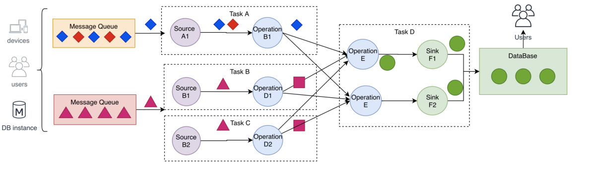
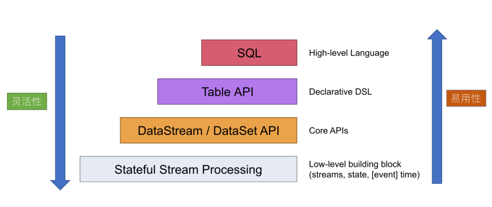
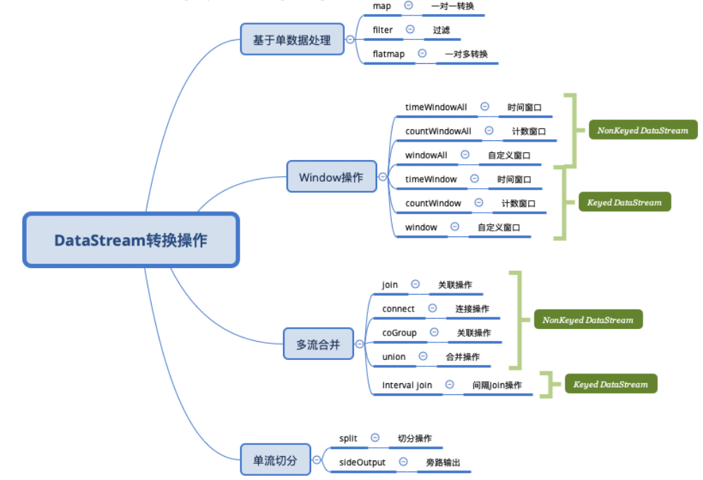
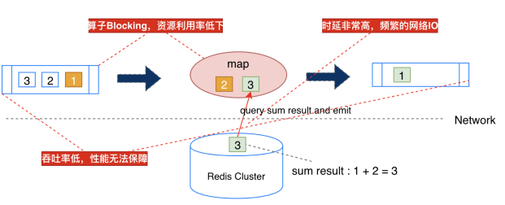
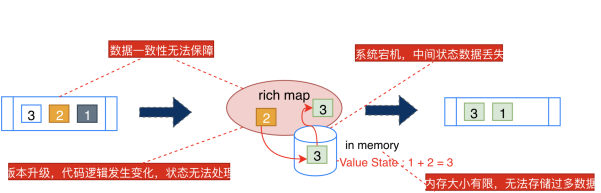
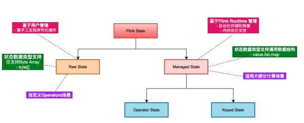
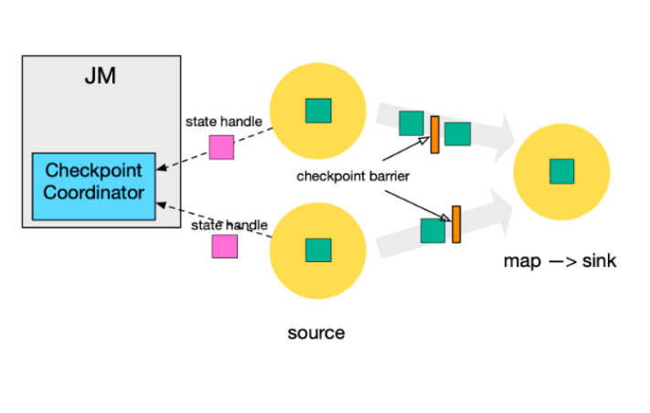
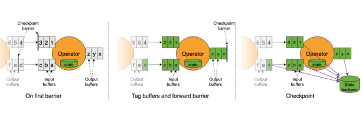

## 1. 背景
datastream的使用主要分为如下的关键：
* 分布式流处理模型
* DataStream API 总体概念
* Timestamp 与 Watermark原理
* Windows 窗口计算（Assigner，Function，Trigger，Evictors）
* DataStream 多流合并
* ProcessFunction 应用
* SideOutput 旁路输出
* Asynchronous I/O 异步操作
* Pipeline 与 StreamGraph 生成与转换
* 项目实战：基于 DataStream API 实现 PV，UV 统计  


## 2. 分布式流处理模型  
* 数据从上一个Operation节点直接Push到下一个Operation节点。
* 各节点可以分布在不同的Task线程中运行，数据在Operation之间传递。
* 具有Shuffle过程，但是数据不像MapReduce模型，Reduce 从 Map端拉取数据
* 实现框架有Apache Storm和Apache Flink以及Apache Beam。
  
  


## 3. datastream的api    

### 3.1. StreamExecutionEnvironment
流的执行环境

### 3.2. DataStreamSource
数据流源

### 3.3. DataStream转换的操作
数据流的操作可以分为，单个流转换，多个流的窗口操作，多个流的合并，单流拆分操作  
    
### 3.3.1. Watermark
* 1) 定义
* 2) 使用  
    两种方式：  
    * Periodic Watermarks
    * Punctuated Watermarks
* 3) 总结

### 3.3.2. 窗口计算
* 窗口计算可分为keyed窗口计算和nonekeyd窗口计算
* 转换为窗口流后，可以执行的函数有 reduce、aggregate、process
* 常用的窗口类型有：
  * 时间窗口，滚动
  * 时间窗口，滑动
  * 时间窗口，会话，会话的意思就是根据空隙时间决定是否关闭
  * 时间窗口，全局
  * 次数窗口，滚动
  * 次数窗口，滑动

* Trigger的意思时何时将窗口的数据关闭和清理  
如trigger(PurgingTrigger.of(ProcessingTimeTrigger.create()))代表机器，GlobalWindow必须自己定义何时关闭窗口。

* Evictor 窗口清除器
  * CountEvictor，保留一定数目的元素，多余的元素按照从前到后的顺序先后清理
  * TimeEvictor，保留一个时间段的元素，早于这个时间段的元素会被清理
  * DeltaEvictor，窗口计算时，最近一条 Element 和其他 Element 做 Delta 计算，仅保留 Delta 结果在指定 Threshold 内的 Element
* function
  * ReduceFunction
增量，归约
  * AggregateFunction
增量，聚合
  * FoldFunction
增量
  * ProcessWindowFunction
全量

* window的多流合并
示例
```
streamA.join(streamB)
.where(<KeySelector>)
.equalTo(<KeySelector>)
.window(<WindowAssigner>)
.apply(<JoinFunction>)
```
多流合并类型:
  * WIndow Join
  * Interval Join
### 3.3.3. ProcessFunction
是flink更加底层的相关接口，使用起来更加灵活

一般定义三个方法，open（初始化）、processElement、onTimer（可以为每一个流元素定义一个回调定时器）

### 3.3.4. 旁路输出
先给输出的流打一个标签，然后再获取一个旁路输出流，SideOutput

### 3.3.5. 异步IO（关联）
          可以使用AsyncFunction，异步关联外部表的数据，不必等到结果一个一个返回导致性能问题。

### 3.3.6. flink的系统类型  


## 4. flink中的状态计算    
&emsp;&emsp;一些其它的流式计算需要将计算节点的数据存储在数据库中，其中会占用一定的io，而如果不将数据持久化，则系统将不能容错。而flink是怎么做的呢？答案是checkpoint，不过我们先了解下flink的状态  
&emsp;&emsp;传统的流计算架构:  
    
    

### 4.1. Flink状态分类  
  


#### 4.1.1. Keyed State  
只能用于keyedstream的operator上，每个key对应一个state
类型：
* ValueState
* ListState
* ReduceState
* MapState
* AggregatingState  
使用方式：
实现RichFunction接口

#### 4.1.2. Operator state  
不区分key，需要重新分布，一个operator一个这样的状态，一般用于source或者sink上，比如可以做buffersink。
类型：
* ListState
* UnionListState
* BroadcastState
使用方式：
实现CheckpointedFunction接口  

### 4.2. Flink状态持久化  
#### 4.2.1. checkpoint  
通过jobmanager来定时发起checkpoint  
* checkpoint coordinator向source发起trigger checkpoint
* source异步将自己的数据写入到持久化，并发起barrier事件给下游
* 下游收到事件后，会将状态快照，异步持久化，并继续发起barrier事件给下游
* 持久化完成后会将持久化后的数据地址发给checkpoint coordinator
* 当所有的节点都完成持久化了，整个checkpoint就完成了  

barier会有一个对齐的操作，会阻塞正常数据处理  
1.11版本之后进行了优化，在持久化的时候会进行脏数据合并的操作。  
  
可以设置Checkpointmode；至少一次和精准1次，精准一次会有barrier对齐，导致性能阻塞，至少一次不对齐则可能恢复的时候有重复数据。  
还有一些其它的参数可查看资料。  


#### 4.2.2. savepoint    
Savepoint  


#### 4.2.3.Statebackend
有三种模式：
* 纯内存模式
* 文件模式
* Rocksdb    

这几种模式分别有什么特点  


#### 4.2.4. 状态恢复和升级
注意点

#### 4.2.5.状态的序列化

