## 1. flink中的状态计算    
&emsp;&emsp;一些其它的流式计算需要将计算节点的数据存储在数据库中，其中会占用一定的io，而如果不将数据持久化，则系统将不能容错。而flink是怎么做的呢？答案是checkpoint，不过我们先了解下flink的状态  
&emsp;&emsp;传统的流计算架构:  
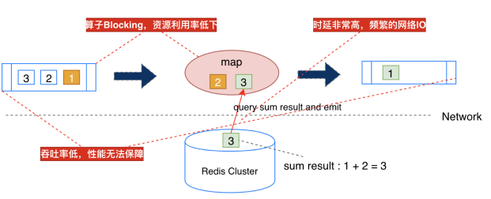    
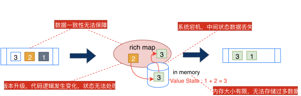    

## 2. Flink状态分类  
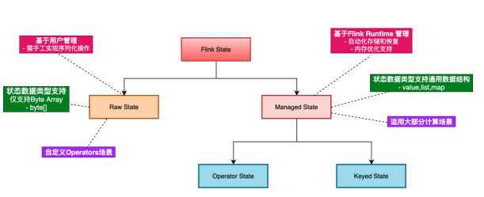      
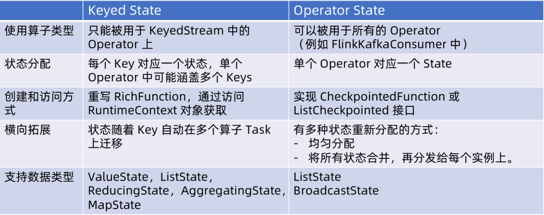  


### 2.1. Keyed State  
只能用于keyedstream的operator上，每个key对应一个state
类型：
* ValueState
* ListState
* ReduceState
* MapState
* AggregatingState  
使用方式：
实现RichFunction接口

### 2.2. Operator state   
其特点：  
* 单operator具有一个状态，不区分key
* state需要重新分布
* 一个operator一个这样的状态，一般用于source或者sink上
* 比如可以做buffersink。
* 比如用于维护kafkaconsumer中的位移
类型：
* ListState
* UnionListState
* BroadcastState
使用方式：  
* 实现CheckpointedFunction接口  
* 实现 ListCheckpointed 接口定义 (Deprecated)  

一个Operator state实现buffersink的案例：
```
public class BufferingSinkExample {
    public static void main(String[] args) {

    }
}

class BufferingSinkFunction
        implements SinkFunction<Tuple2<String, Integer>>,
        CheckpointedFunction {

    private final int threshold;

    private transient ListState<Tuple2<String, Integer>> checkpointedState;

    private List<Tuple2<String, Integer>> bufferedElements;

    public BufferingSinkFunction(int threshold) {
        this.threshold = threshold;
        this.bufferedElements = new ArrayList<>();
    }

    @Override
    public void invoke(Tuple2<String, Integer> value, Context contex) throws Exception {
        bufferedElements.add(value);
        if (bufferedElements.size() == threshold) {
            for (Tuple2<String, Integer> element : bufferedElements) {
                // send it to the sink
            }
            bufferedElements.clear();
        }
    }

    @Override
    public void snapshotState(FunctionSnapshotContext context) throws Exception {
        checkpointedState.clear();
        for (Tuple2<String, Integer> element : bufferedElements) {
            checkpointedState.add(element);
        }
    }

    @Override
    public void initializeState(FunctionInitializationContext context) throws Exception {
        ListStateDescriptor<Tuple2<String, Integer>> descriptor =
                new ListStateDescriptor<>(
                        "buffered-elements",
                        TypeInformation.of(new TypeHint<Tuple2<String, Integer>>() {
                        }));

        checkpointedState = context.getOperatorStateStore().getListState(descriptor);

        if (context.isRestored()) {
            for (Tuple2<String, Integer> element : checkpointedState.get()) {
                bufferedElements.add(element);
            }
        }
    }
}
```

### 2.3. Broadcast State    

#### 2.3.1. 特点
* Broadcast State 使得 Flink 用户能够以容错、一致、可扩缩容地将来自广播的低吞吐的事
件流数据存储下来，被广播到某个 operator 的所有并发实例中，然后与另一条流数据连接
进行计算。
* 广播状态与其它的operator state 之间有三个主要区别它的
  * Map 格式类型
  * 需要有一条广播的输入流
  * operator 可以有多个不同名称的广播状态

##### 2.3.2. Broadcast 应用场景  
* 动态规则：
  * 动态规则是一条事件流，要求吞吐量不能太高。例如，当一个报警规则时触发报警信息等，将规
  则广播到算子的所有并发实例中；
* 数据丰富：
  * 例如，将用户的详细信息作业广播状态进行广播，对包含用户 ID 的交易数据流进行数据丰富；

##### 2.3.3. Broadcast使用注意事项
* 同一个 operator 的各个 task 之间没有通信，广播流侧（processBroadcastElement）可
以能修改 broadcast state，而数据流侧（processElement）只能读 broadcast state.；
* 需要保证所有 Operator task 对 broadcast state 的修改逻辑是相同的，否则会导致非预期
的结果；
* Operator tasks 之间收到的广播流元素的顺序可能不同：虽然所有元素最终都会下发给下游
tasks，但是元素到达的顺序可能不同，所以更新state时不能依赖元素到达的顺序；
* 每个 task 对各自的 Broadcast state 都会做快照，防止热点问题；
* 目前不支持 RocksDB 保存 Broadcast state：Broadcast state 目前只保存在内存中，需要
为其预留合适的内存；

##### 2.3.4. Broadcast案例  
```
DataStream<Action> actions = env.addSource(new KafkaConsumer<>());
DataStream<Pattern> patterns = env.addSource(new KafkaConsumer<>());
KeyedStream<Action, Long> actionsByUser = actions
.keyBy((KeySelector<Action, Long>) action -> action.userId);
MapStateDescriptor<Void, Pattern> bcStateDescriptor =
new MapStateDescriptor<>("patterns", Types.VOID, Types.POJO(Pattern.class));
BroadcastStream<Pattern> bcedPatterns = patterns.broadcast(bcStateDescriptor);
DataStream<Tuple2<Long, Pattern>> matches = actionsByUser
.connect(bcedPatterns)
.process(new PatternEvaluator());
```

```
public abstract class BroadcastProcessFunction<IN1, IN2, OUT> extends
  BaseBroadcastProcessFunction {
  public abstract void processElement(IN1 value, ReadOnlyContext ctx, Collector<OUT> out) throws Exception;
  public abstract void processBroadcastElement(IN2 value, Context ctx, Collector<OUT> out) throws Exception;
}
public abstract class KeyedBroadcastProcessFunction<KS, IN1, IN2, OUT> {
  public abstract void processElement(IN1 value, ReadOnlyContext ctx, Collector<OUT> out) throws Exception;
  public abstract void processBroadcastElement(IN2 value, Context ctx, Collector<OUT> out) throws Exception;
  public void onTimer(long timestamp, OnTimerContext ctx, Collector<OUT> out) throws Exception;
}
```

## 3. Flink状态持久化  
### 3.1. checkpoint  
通过jobmanager来定时发起checkpoint  
* checkpoint coordinator向source发起trigger checkpoint
* source异步将自己的数据写入到持久化，并发起barrier事件给下游
* 下游收到事件后，会将状态快照，异步持久化，并继续发起barrier事件给下游
* 持久化完成后会将持久化后的数据地址发给checkpoint coordinator
* 当所有的节点都完成持久化了，整个checkpoint就完成了  
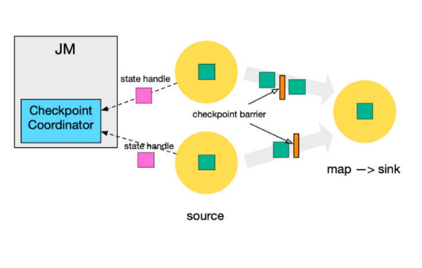
barier会有一个对齐的操作，会阻塞正常数据处理  
1.11版本之后进行了优化，在持久化的时候会进行脏数据合并的操作，这样不会阻塞等待，还不完善。  
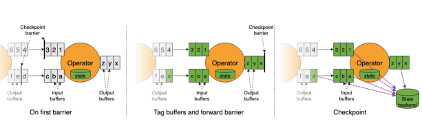  
可以设置Checkpointmode；至少一次和精准1次，精准一次会有barrier对齐，导致性能阻塞，至少一次不对齐则可能恢复的时候有重复数据。  
还有一些其它的参数可查看资料。  

#### 3.1.1 代码示例   
```
// 指定Checkpoint间隔时间
• StreamExecutionEnvironment enableCheckpointing(long interval)
// 指定Checkpoint间隔时间以及CheckpointingMode(EXACTLY_ONCE ,AT_LEAST_ONCE)
• StreamExecutionEnvironment enableCheckpointing(long interval, CheckpointingMode mode)
// 指定是否强制在迭代作业中执行Checkpoint（@Deprecated ）
• StreamExecutionEnvironment enableCheckpointing(long interval, CheckpointingMode mode, boolean force)
// 默认Checkpoint Interval 为500 ms （@Deprecated ）
• StreamExecutionEnvironment enableCheckpointing()
```


### 3.2. savepoint     
#### 3.2.1. checkpoint和savepoint对比     
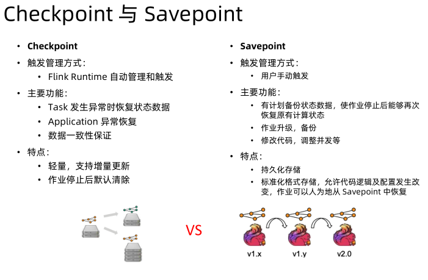  
#### 3.2.2. savepoint 客户端命令   
• Trigger a Savepoint
$ bin/flink savepoint :jobId [:targetDirectory]
• Trigger a Savepoint with YARN
$ bin/flink savepoint :jobId [:targetDirectory] -yid :yarnAppId
• Cancel Job with Savepoint
$ bin/flink cancel -s [:targetDirectory] :jobId
• Resuming from Savepoints
$ bin/flink run -s :savepointPath [:runArgs]
• Allowing Non-Restored State
$ bin/flink run -s :savepointPath -n [:runArgs]
• Disposing Savepoints
$ bin/flink savepoint -d :savepointPath  

#### 3.2.3. Savepoint 默认路径配置
• 在$FLINK_HOME/conf/flink-conf.yaml文件中配置如下：
##Default savepoint target directory
state.savepoints.dir: hdfs:///flink/savepoints

#### 3.2.4. Savepoint 路径格式  
```
# Savepoint target directory
/savepoints/
# Savepoint directory
/savepoints/savepoint-:shortjobid-:savepointid/
# Savepoint file contains the checkpoint meta data
/savepoints/savepoint-:shortjobid-:savepointid/_metadata
# Savepoint state
/savepoints/savepoint-:shortjobid-:savepointid/...
```

#### 3.2.5. 注意事项  
设置一个uid，用于从指定savepoint中恢复，兼容性恢复。    
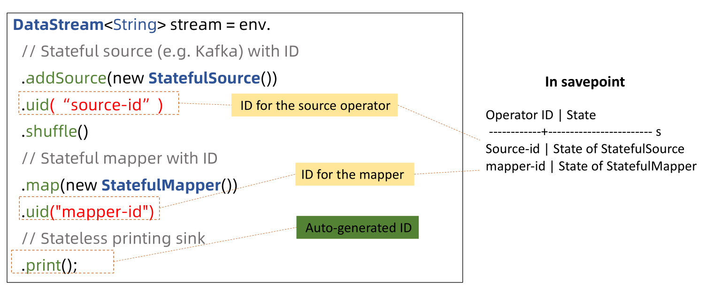  

### 3.3. Statebackend
有三种模式：
* 纯内存模式
* 文件模式
* Rocksdb    

这几种模式分别有什么特点  


#### 3.3.1. 状态恢复和升级
注意点

#### 3.3.2. 状态的序列化
状态的序列化可以in base heap和 in off heap
* base heap  
  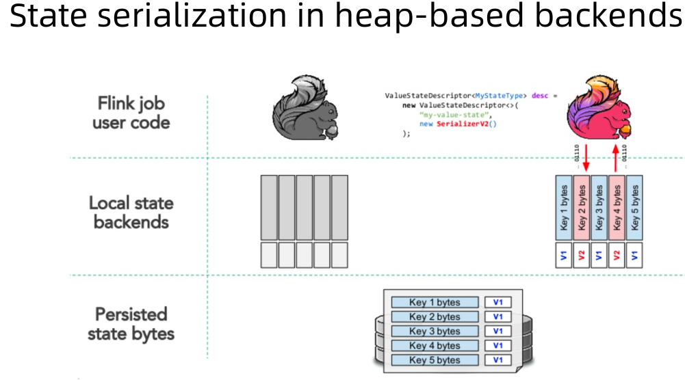
* off heap     
  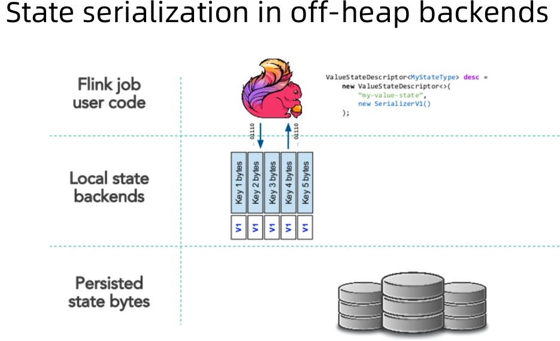  


## 4. Querable State  
### 4.1. Queryable State 整体架构  
  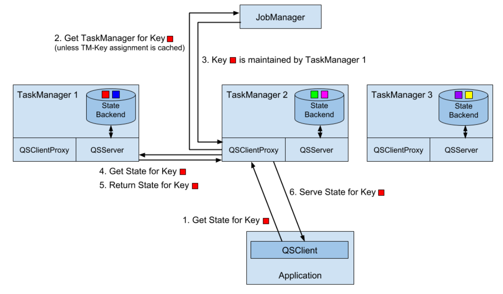  
* Queryable State 集群配置  
  * 启用Queryable State服务  
    在${FLINK_HOME}/conf/flink-conf.yaml中设置queryable-state.enable: true
  * 添加依赖到Flink集群lib  
    cp ${FLINK_HOME}/opt/flink-queryable-state-runtime_2.11-1.11.0.jar ${FLINK_HOME}/lib/
  * 重启Flink集群，查看TaskManager日志
    * Started Queryable State Server @ /x.x.x.x:9067.
    * Started Queryable State Proxy Server @ /x.x.x.x:9069
### 4.2. 可查询状态任务配置  
可查询状态配置方式有两种：
* 将KeyedStream转换为QueryableStateStream:  
  ```
  // ValueState
  QueryableStateStream asQueryableState( String queryableStateName, ValueStateDescriptor stateDescriptor)
  // ReducingState
  QueryableStateStream asQueryableState( String queryableStateName, ReducingStateDescriptor stateDescriptor)
  ```

* 通过状态描述StateDescriptor的setQueryable(String queryableStateName)方法: 
  ```
    ValueStateDescriptor<Tuple2<Long, Long>> descriptor = new ValueStateDescriptor<>(
      "average", // the state name
    TypeInformation.of(new TypeHint<Tuple2<Long, Long>>() {})); // type information
    descriptor.setQueryable("query-name"); // queryable state name
  ```

### 4.3. Queryable State 客户端配置  
* 在客户端项目中引入如下Maven依赖配置：
 ```
<dependency>
  <groupId>org.apache.flink</groupId>
  <artifactId>flink-queryable-state-client-java</artifactId>
  <version>1.11.0</version>
</dependency>
 ```
* 其次在代码中通过QueryableStateClient和Flink Application建立连接：
  ```  
  QueryableStateClient client = new QueryableStateClient(tmHostname, proxyPort);
  ```
* 然后调用getKvState()方法查询状态指标
  ```
  CompletableFuture<S> getKvState( JobID jobId, String queryableStateName, K key, TypeInformation<K> keyTypeInfo, StateDescriptor<S, V> stateDescriptor)
  ```


### 4.4.  Queryable State 实例
```
public class CountWindowAverage extends RichFlatMapFunction<Tuple2<Long, Long>, Tuple2<Long, Long>> {

    private transient ValueState<Tuple2<Long, Long>> sum; // a tuple containing the count and the sum
  
    @Override
    public void flatMap(Tuple2<Long, Long> input, Collector<Tuple2<Long,Long>> out) throws Exception {
      Tuple2<Long, Long> currentSum = sum.value();
      
      currentSum.f0 += 1;
      
      currentSum.f1 += input.f1;
      
      sum.update(currentSum);
      
      if (currentSum.f0 >= 2) {
      
        out.collect(new Tuple2<>(input.f0, currentSum.f1 / currentSum.f0));
      
        sum.clear();
      }
    }
    @Override
    public void open(Configuration config) {
      ValueStateDescriptor<Tuple2<Long, Long>> descriptor = new ValueStateDescriptor<>("average", // the state name
      
      TypeInformation.of(new TypeHint<Tuple2<Long, Long>>() {}));
      
      // type information
      descriptor.setQueryable("query-name");
      
      sum = getRuntimeContext().getState(descriptor);
    }
}
```


```
QueryableStateClient client = new QueryableStateClient(tmHostname, proxyPort);

// the state descriptor of the state to be fetched.
ValueStateDescriptor<Tuple2<Long, Long>> descriptor = new ValueStateDescriptor<>(
"average",
TypeInformation.of(new TypeHint<Tuple2<Long,
Long>>() {}));

CompletableFuture<ValueState<Tuple2<Long, Long>>> resultFuture = client.getKvState(jobId, "query-name", key, BasicTypeInfo.LONG_TYPE_INFO, descriptor);

// now handle the returned value

resultFuture.thenAccept(response -> {
  try {
    Tuple2<Long, Long> res = response.get();
  } catch (Exception e) {
    e.printStackTrace();
  }
});
```