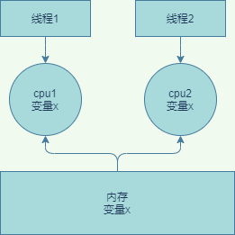

## 1. 并发问题始作俑者
### 1.1. 计算机性能
&emsp;&emsp;我们知道计算机有这么几大核心组件，CPU、内存、I/O 设备，它们的性能的差异就非常明显，cpu的速度远远大于内存，而内存的速度也远远大于磁盘IO的。而一个应用如果性能要求很高，往往取决于最慢的组件，如何合理的平衡它们的性能差异。计算机和应用的设计者做了如下的事情：
* cpu自身增加了缓存，cpu可以不去访问内存。
* cpu太快了，操作系统增加了多进程、多线程来提升cpu的利用率  

* 应用程序代码编译的时候，编译器会做编译优化。比如java会做一些指令重排序。  

&emsp;&emsp;有了上述的优化，计算机应用的性能得到了大幅的提升，但是有失必有得，以上的优化就带来了并发安全问题了。java的并发安全问题的原因大致可以总结如下：  
### 1.2. 缓存导致的可见性问题
  
&emsp;&emsp;如图所示。所有线程都是操作同一个 CPU 的缓存，一个线程对缓存的写，对另外一个线程来说一定是可见的。线程 1 和线程 2 都是操作同一个 CPU 里面的缓存，所以线程 1更新了变量 2 的值，那么线程 1 之后再访问变量 2，得到的一定是x的最新值，但是如果是多核的话，两个cpu没有交流，都是各自缓存，最后更新到内存中会出现不一致的问题。
### 1.3. 线程切换带来的原子性。
&emsp;&emsp;我们把一个或者多个操作在 CPU 执行的过程中不被中断的特性称为原子性。  
&emsp;&emsp;比如我们java的i++;操作就不是原子性的，它包括三个cpu指令:
* 变量i从内存加载到 CPU 的寄存器
* 在寄存器中执行 +1 操作
* 将结果写入内存(如果使用了cpu缓存，则不会写入内存，而是写入到cpu缓存)  
如果多个线程调用该代码，由于是非原子性的，会导致i+1还没有操作挂起了cpu，然后另一个线程也进行i+1。导致了最终的结果不一致了。
### 1.4. 编译优化导致的有序性
编译会结合cpu的情况对代码的cpu指令进行重排序，最终可能导致安全问题。最典型的就是一个单例
```
public class Singleton {
  static Singleton instance;
  static Singleton getInstance(){
    if (instance == null) {
      synchronized(Singleton.class) {
        if (instance == null)
          instance = new Singleton();
        }
    }
    return instance;
  }
}
```
&emsp;&emsp;如上面的代码所示，如果多线程调用可能会产生空指针异常。为什么多个线程会出现控制指针呢？
出在 new 操作上，我们以为的 new 操作应该是：
1. 分配一块内存 M；
2. 在内存 M 上初始化 Singleton 对象；
3. 然后 M 的地址赋值给 instance 变量。  

但是实际上优化后的执行路径却是这样的：  
1. 分配一块内存 M；
2. 将 M 的地址赋值给 instance 变量；
3. 最后在内存 M 上初始化 Singleton 对象。  

&emsp;&emsp;这样就会导致，我们假设线程 A 先执行 getInstance() 方法，当执行完指令 2 时恰好发生了线程切换，切换到了线程 B 上；如果此时线程 B 也执行 getInstance() 方法，那么线程 B 在执行第一个判断时会发现 instance != null ，所以直接返回 instance，而此时的 instance 是没有初始化过的，如果我们这个时候访问 instance 的成员变量就可能触发空指针异常。
### 1.4. 小结
&emsp;&emsp;可见性、原子性、有序性这些原本为了优化计算机性能反而会影响计算机性能，特意提到缓存导致的可见性问题，线程切换带来的原子性问题，编译优化带来的有序性问题。这都是并发问题的根源。

**PS：通常long类型为64位，所以在32位的机器上，对long类型的数据操作通常需要多条指令组合出来，无法保证原子性，所以并发的时候会出问题**
## 2. java的并发理论
并发问题在所有的语言都会
### 2.1. java内存模型
## 3. java锁
## 4. 死锁
## 5. 性能问题
## 6. 管程
## 7. java线程生命周期
### 7.1. 线程的概念
线程是操作系统里的一个概念，不同的开发语言如 Java等都对其进行了封装，线程和时间有关，它有一个生命周期。我们只需要关注线程状态的转换就可以。线程是一个通用性的概念。  

## 8. java进程的线程数
## 9. java线程安全
## 10. 并发程序开发思路