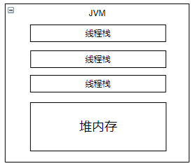
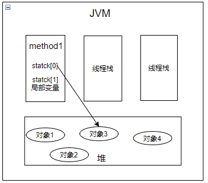
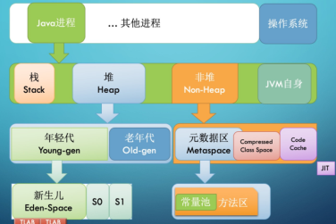

## 1. 整体结构
### 1.1 内存结构  
&emsp;&emsp;  
* jvm有线程栈和堆内存，jvm线程中创建普通局部变量是存在线程栈中的，所有线程创建的对象（其中包括Integer之类的包装类）是存在一个堆内存中的，存在线程栈中的变量和其它线程互不干扰，不能直接共享。

* 线程栈中如果是原生数据类型的则保存的是值，如果是引用类型，则保存堆内存的地址。对象保存在堆中，包含成员变量

* 静态变量和类定义都保存在堆中
* Java的内存分为：堆、栈、非堆、jvm自身  

&emsp;&emsp;我们结合java类部分，方法中的操作都会创建stack，基于statck进行变量的计算，可以得出如下的图:  
&emsp;&emsp;  
* jvm创建一个线程的时候会分配线程栈一个大小空间，-Xss1m代表分配1m的空间。
* 线程执行过程中，一般会有多个方法调用栈（Stack Trace）, 比如 A 调用 B每执行到一个方法，就会创建对应的 栈帧（Frame）

### 1.2 堆内存模型  
&emsp;&emsp;堆内存会被划分两个部分，年轻代和老年代  
&emsp;&emsp;  
&emsp;&emsp;如图所示：  
* 新创建的对象会被放在eden区，当它放满了或者达到了一定阈值，会触发minorgc。
* 随后会将存活的对象迁移至s0区，下一次minorgc，eden区对象迁移至s1区，s0的对象也复制至s1区，无用的对象将清理，s0将清空。
* 下一次minorgc, 放到s0, s1复制到s0, s1清空，如此反复。如果年龄超过15次也放到老年代。
* 终于s0/或者s1的占用达到了一定的阈值，也会将它放到老年代。  
  
&emsp;&emsp;GC的更多细节我们后面再进一步探讨