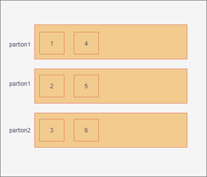
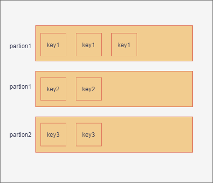

## 1、kafka的分区
### 1.1 分区概念
kafka作为消息中间件时，消息的量一般是巨大的。并且一台服务器肯定是不够用的，所以需要扩展成多台服务器，使用者是通过不同的主题来存储不同维度的消息。为了将数据能够更加均匀的分配到各个机器上来分摊压力，这里引入了分区。这个分区类似于elasticsearch分片。如下图所示，为一个消息分区：

  

总的来说，分区的作用为：  
* 负载均衡，数据能够比较均匀的打到不同的分区上
* 高的伸缩性，可以通过添加新的机器来增加整体系统的吞吐量 

当然分区也有一定其它方面的影响，比如可能会影响消息的顺序性。如果分区太多，会造成随机io太多，一定程度上影响写入性能。

### 1.2 kafka分区的策略
首先消息在哪一个分区是由生产者决定的，需要生产者来决定发送到哪个一个分区。分区策略就是生产者通过的一种算法将消息发送到某一分区中。kafka提供了默认的分区策略，我们也可以自定义策略发送。如何进行自定义分区策略呢？需要实现org.apache.kafka.clients.producer.Partitioner接口，其中的参数有主题、borker数等信息。我们可以通过这些信息进行灵活的进行分区。常见的分区策略有如下的策略：  
* 轮询策略  
就是按顺序一个分区放一条。

* 随机策略  
随机策略如上图所示，是按照一定的随机算法，随机的将消息分到分区上。这种算法在实际上表现没有轮询算法好，老版本的默认算法为随机算法，新版的算法已经改为轮询了。
* 业务键策略  
入名字表示，根据业务的id，是的同一id的消息，一定会分到某分区，入可以取单号的hash值落到同一分区。同一分区的消息是能够保证消费的顺序的。这样就不必为了保证消息的顺序性而只设置一个分区了。  
  
* 其它的分区策略  
可以基于地理位置进行分区。比如我们将两个国家的机房组成了一个大的broker集群，不同业务根据发送方所在的机房，比如中国产生的消息分区发送到中国的机房，美国的消息发送至美国的机房的分区。
```
    List<PartitionInfo> partitions = cluster.partitionsForTopic(topic);
    return partitions.stream().filter(p -> isSouth(p.leader().host()))
        .map(PartitionInfo::partition).findAny()
            .get();
```

### 1.3 注意  
分区一般使用默认的策略即可，但是如果有业务需求，可以自定义分区策略，但是一定要注意防止数据倾斜产生，进而影响broker的性能。


## 2 客户端通讯协议
  我们知道应用层有很多耳熟能详的通讯协议，比如http等，为什么kafka不使用http协议却使用了更加底层的tcp协议呢？查阅了相关的资料，主要有两点：
  * 基于tcp可以实现更加高级的功能  
  比如网络传输常用的多路复用，这里并不是说tcp提供了多路复用，而是多路复用可以很方便的基于tcp实现可靠的消息传输
  * http协议在大多数语言中支持的不够完善。

## 3 kafka的生产者
生产者是发送消息的对象，而生产生者如何发送消息呢？
### 3.1 java发送消息流程
主要经过如下步骤：
* 构造生产者对象所需的参数对象
* 创建KafkaProducer对象实例
* 调用send方法发送数据
* 调用close方法，关闭资源
```
    Properties props = new Properties ();
    props.put(“参数 1”, “参数 1 的值”)；
    props.put(“参数 2”, “参数 2 的值”)；
    Producer<String, String> producer = new KafkaProducer<>(props));
    producer.send(new ProducerRecord<String, String>(……), callback);
}
```
上面只是一个简单的发送消息流程，其实还有很多细节，比如建立连接、关闭连接等等，后面一一讨论。
### 3.1 元信息
* Producer 通过 metadata.max.age.ms 参数定期地去更新元信息。该参数的默认值是5min，每 5 分钟都会强制刷新一次元数据
* Producer发送不存在的主题信息，则会强制从broker集群拉取最新的元信息

### 3.2 建立连接
发送消息的时候，什么时候和kakfa服务端建立连接呢？
答案是：  
在创建 KafkaProducer 对象时，生产者应用会在后台创建并启动一个名为 Sender 的线程，该线程会建立和broker的连接。  
这里有几个**注意点**：
* **最开始生产者对象会和所有的borker地址建立连接**
* 如果有servers配置了100个broker地址，那么就会建立100个连接，这是没有必要的，只需要配置几个就行了，因为只要连接成功后就能拿到整个集群信息了  

除了上述的建立时机外，还有哪些地方会创建呢？ 
*  更新元数据  
kakfa会定期更新元数据信息，发现与某些 Broker 当前没有连接，那么它就会创建一个 TCP 连接
*  发送消息时 发现尚不存在与目标 Broker 的连接，也会创建一个  

小讨论：这种设计可能不是特别优秀，创建了很多无用的连接，比如可能要给topic就和两个broker打交道，但是连接了kafka集群100个连接。
### 3.3 关闭连接
kafka的关闭连接有两种，一种是用户主动关闭，一种是 Kafka 自动关闭。
* 主动关闭  
如何用户produce.close();或者kill
* Kafka自动关闭  
connections.max.idle.ms（默认9min）,如果9分钟之内没有任何数据，则主动关闭避免浪费资源。也可以设置成-1来使得自动关闭禁用。