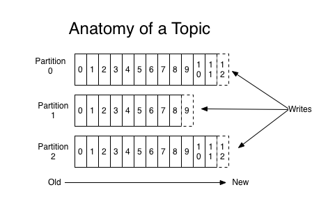

## 1、kafka的分区
### 1.1 分区概念
kafka作为消息中间件时，消息的量一般是巨大的。并且一台服务器肯定是不够用的，所以需要扩展成多台服务器，使用者是通过不同的主题来存储不同维度的消息。为了将数据能够更加均匀的分配到各个机器上来分摊压力，这里引入了分区。这个分区类似于elasticsearch分片。如下图所示，为一个消息分区：

  

总的来说，分区的作用为：  
* 负载均衡，数据能够比较均匀的打到不同的分区上
* 高的伸缩性，可以通过添加新的机器来增加整体系统的吞吐量 

当然分区也有一定其它方面的影响，比如可能会影响消息的顺序性。如果分区太多，会造成随机io太多，一定程度上影响写入性能。

### 1.2 kafka分区的策略
首先消息在哪一个分区是由生产者决定的，需要生产者来决定发送到哪个一个分区。