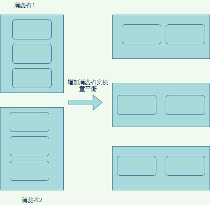

## 1. 消费分组基本概念
### 1.1. 消费模型 
&emsp;&emsp;传统的消息系统的引擎模型主要有两类：  
* 点对点
* 发布订阅模型   

&emsp;&emsp;它们各有优缺点，点对点一旦消息被消费就会被删除，而且只能被一个消费者实例消费，伸缩性很差。而发布订阅模型，允许多个消费者消费，但是伸缩性也不高，因为一个消费者实例需要订阅所有的分区信息，这种也是不灵活扩展性也不好。  
&emsp;&emsp;kafka的消费者分组，避开这两种模型的缺陷又兼具它们的优点，什么是消费者分组呢？  
&emsp;&emsp;一个消费者分组内可以有多个消费者或消费者实例，它们共享一个公共的groupid，组内的消费者实例协调起来一起消费者一个主题下的分区。如果所有实例都属于同一个 Group，那么它实现的就是消息队列模型；如果所有实例分别属于不同的 Group，那么它实现的就是发布订阅模型。  
&emsp;&emsp;消费者分组可以总结如下的特性：
* groupid唯一标识一个消费者分组
* Consumer分组下可以有一个或多个Consumer实例
* 一个主题的分区只能被唯一的一个消费者实例消费
### 1.2. kafka的消费分区  
&emsp;&emsp;如何确定消费者的实例个数呢，理想情况下，Consumer 实例的数量应该等于该 Group 订阅主题的分区总数，当消费者实例的个数大于分区数时，将会有分区不能分配到改消费者实例。它将属于空闲状态，浪费资源  
&emsp;&emsp;消费者在消费的过程中需要记录自己消费了多少数据，在kafka中有个Offset来管理消费位移，在java中就是个Map，如 Map<TopicPartition, Long>表示某个分区消费到了某个位移了。  
&emsp;&emsp;在早期的版本，消费者的位移信息会被提交到zk上，但是这种频繁更新的操作是不适合在zk上进行的。于是后来的版本重新设计了位移的管理方式，即将位移保存在 Kafka内部的特殊主题。
### 1.3. kafka的消费Rebalance 
#### 1.3.1. Rebalance时机和过程   
&emsp;&emsp;Rebalance 是一种机制，使得同一消费者分组下的实例比较合理的分配分区。什么时候进行Rebalance呢？
* 组成员数发生变更,比如下线实例或者新增消费者实例
* 订阅主题数发生变更，订阅的消费者主题发生了变化，比如消费者实例订阅某个主题，新增了一个主题
* 主题分区发生了变化，kafka对某个主题新增了分区（注意kafka是不允许减少分区的）  

&emsp;&emsp;Rebalance是如何进行rebalance的呢？它的基本原则就是尽可能保证每个消费者实例的分区数均匀。  
  
如何所示，当新增了消费者后，6个分区重新分布了，由每个消费者三个分区变成每个消费者两个分区了。

#### 1.3.2. Coordinator组件
&emsp;&emsp;Broker在启动时，会创建一个叫做Coordinator组件。所有 Broker 都有各自的 Coordinator 组件。它专门为 Consumer Group 服务，它的作用主要是：
* 负责为 Group 执行 Rebalance
* 提供位移管理，后面提到的消费者提交位移时，其实是向 Coordinator 所在的Broker提交位移
* 组成员管理， 消费者应用启动时，也会向Coordinator所在的Broker发送各种请求，然后由 Coordinator 负责执行消费者组的注册、成员管理记录等元数据管理操作

&emsp;&emsp;有多少个broker就有多少个conndinator，消费者分组是如何找到对应用的coordinator呢？答案是位移主题分区，具体寻找步骤为：
* 由分组id来确定位移主题的分区：partitionId=Math.abs(groupId.hashCode() % offsetsTopicPartitionCount)
* 找出该分区所在的leader副本所在的broker,该 Broker 即为对应的 Coordinator。  
  
&emsp;&emsp;由上可以知道，某个消费者分组所在的coordinator的broker，是在一个位移主题的leader副本的所在broker上的，是哪一个分区的leader副本呢，是通过一个hash算法计算出来的。这些计算工作都有 Java Consumer API帮你完成了。
#### 1.3.3. Rebalance的影响  
&emsp;&emsp;在 Rebalance 过程中，所有 Consumer 实例都会停止消费，导致Rebalance 实在是太慢了如果消费者有上百个的话，成功进行rebalance会很耗时。总结下来它的确定如下：
* Rebalance 影响 Consumer 端 TPS，因为当进行rebalance时，Consumer会停下手头的事情，什么也干不了。
* Rebalance慢，消费者实例越多，它就越慢
* Rebalance设计需要所有的成员参与，存在一定的不必要性。

#### 1.3.4. 避免Rebalance的方式
目前kafka对于前两种的影响是无解的，如果发生了只能进行等待，并没有好的方式加快效率。所以只能通过减少rebalance的频次来减少对系统的影响。 Consumer 实例都会定期地向 Coordinator 发送心跳请求，表明它还存活着，如果coordinator认为消费者实例死了，那么就会发起一轮rebalance了。其中 session.timeout.ms就是消费者控制”是否死了的“超时时间。除了这个参数还有其它的参数可以影响rebalance，我们可以总结一下：
* session.timout.ms， 决定了 Consumer 存活性的时间间隔，越小越敏感，越容易rebalance，推荐为6s
* heartbeat.interval.ms，控制心跳频率，越小消费者获取信息越快，但占用带宽越大，推荐2s
* max.poll.interval.ms，默认值是 5 分钟。如果消息处理能力不足，导致拉取的消息没有在这个时间范围处理完， Consumer 会主动发起“离开组”的请求，Coordinator 也会开启新一轮 Rebalance，我们可以设置大一点，比如为10min
* 如果jvm参数不合理导致频繁的gc，也会导致上述触发rebalance, 需要极力避免
  

<br>

## 2. 位移主题概念
&emsp;&emsp;在上一章我们说过，消费者会提交一个消费位移给kafka，在早期的版本中，消费位移数据是存储在zk之中的，消费者实例重启后，它能自动从 ZooKeeper 中读取位移数据，从而在上次消费截止的地方继续消费，而broker端不需要保存位移主题的，这种模式对于系统的伸缩性是很好的。  
&emsp;&emsp;但是理想很丰满，显示很骨感。zk其实并不适合这种频繁写入的操作。新版kafka通过位移主题来保存位移数据，它的名字叫做 __consumer_offsets，它的消息格式是kafka自定义的，不可以自行变更，否则会校验失败，其它方面就和普通的主题一样了。    
**PS:Kafka 事务也是利用了这个方法，当然那是另外的一个内部主题了**
### 2.1. 消息格式
&emsp;&emsp;具体这个消息格式是什么样的呢？  
&emsp;&emsp;一共有三种格式：
* 标准的key、value对，key表示的是 主题：分区：分组对应于一个消费位移。真正的kafka设计会比这个复杂的多，还会保存一些元信息之类的。
* 用于保存 Consumer Group 信息的消息，它是用来注册 Consumer Group 
* 用于删除 Group 过期位移甚至是删除 Group 的消息，墓碑消息，消息体是 null，即空消息体，当消费者实例都停止了，位移数据都被删除了，那么kafka就会写入这个消息表示要删除这个分组信息了。
### 2.2. 如何创建位移主题
&emsp;&emsp;当kafka消费者的第一个实例启动的时候就会创建这个主题，默认自动创建50个主分区、3个副本分区。
### 2.2. 如何发送位移消息
&emsp;&emsp;目前提交位移有两种方式，这里先简单的介绍一下：
* 自动提交位移，消费端的enable.auto.commit参数如果是true就是自动提交位移，非常方便，也不会发生消息丢失，但是缺少灵活性，有些功能实现不了
* 手动提交位移，enable.auto.commit = false，消费者端调用api的 consumer.commitSync 方法就能将消费的位移数据提交到该主题。  


&emsp;&emsp;位移提交会出现什么样的坑呢？
* 自动提交位移，可能会导致broker磁盘爆满，比如消费者无消息消费时会不断的提交最新的消费进度，如果broker没有对消费位移有定期删除的策略的话，这个消息会在Broker越来越多，最终撑爆磁盘
* 手动提交位移，如果处理不好很容易消费重复或者丢失。

### 2.3. 位移消息的清理
&emsp;&emsp;Kafka的后台有个线程叫Log Cleaner，它会定期地巡检待 Compact ，看是否存在满足条件的可删除数据。使用Compact来清理位移消息的。如图官网图  
  
Compact 的过程就是扫描日志的所有消息，剔除那些过期的消息，然后把剩下的消息整理在一起

## 3. 位移提交  
&emsp;&emsp;在前面已经说到位移数据的提交有两种，自动提交和手动提交
### 3.1. 自动提交  
&emsp;&emsp;enable.auto.commit=true会进行自动提交，auto.commit.interval.ms为自动提交频率，默认是5s，也就是说它是定时提交的。如下面的demo示例
 ```
    Properties props = new Properties();
     props.put("bootstrap.servers", "ip:9092");
     props.put("group.id", "my-test");
     props.put("enable.auto.commit", "true");
     props.put("auto.commit.interval.ms", "1000");
     KafkaConsumer<String, String> consumer = new KafkaConsumer<>(props);
     consumer.subscribe(Arrays.asList("foo", "bar"));
     while (true) {
         ConsumerRecords<String, String> datas = consumer.poll(2);
         // do somethings
     }
 ```
 **注意：自动提交很方便，不会发生消息丢失，但是会发生重复消费，比如宕机了，位移还没提交上去或者发生了rebalance,位移还没提交上去，分区重新分配，重写消费**
 **注意：poll 方法的逻辑是先提交上一批消息的位移，再处理下一批消息，因此它能保证不出现消费丢失的情况。但自动提交位移的一个问题在于，它可能会出现重复消费**
 ### 3.2. 手动提交   
 手动提交支持两种提交方式，同步和异步
 * KafkaConsumer#commitSync()  
  ```
  while (true) {
    ConsumerRecords<String, String> datas =
                consumer.poll(Duration.ofSeconds(1));
    process(datas);
    try {
        //同步提交位移
        consumer.commitSync();
    } catch (CommitFailedException e) {
        handle(e); 
    }
  }
  ```
  这种提交存在明显的缺陷：调用 commitSync() 时，Consumer 程序会处于阻塞状态，会影响整个应用程序的 TPS。
 * KafkaConsumer#commitAsync()，异步提交，它会立即返回，不会阻塞，Kafka 提供了回调函数（callback）
```
while (true) {
            ConsumerRecords<String, String> records =
                    consumer.poll(Duration.ofSeconds(1));
            process(records); // 处理消息
            consumer.commitAsync((offsets, exception) -> {
                if (exception != null)
                    handle(exception);
            });
        }
```
这种提交也存在缺陷：提交失败的无法重试，并且异步重试也没有意义，因为它是异步操作，倘若提交失败后自动重试，那么它重试时提交的位移值可能早已经“过期”或不是最新值了。因此，异步提交的重试其实没有意义。
 ### 3.3. 最佳提交方式
 上面每一种都存在缺陷，我们需要达到，同步提交不影响tps，异步提交又能够防止网络抖动的影响 ，却不想自己进行重试。于是代码可以如下编写：
 ```
        try {
            while (true) {
                ConsumerRecords<String, String> records =
                        consumer.poll(Duration.ofSeconds(1));
                process(records); // 处理消息
                commitAysnc(); // 使用异步提交规避阻塞
            }
        } catch (Exception e) {
            handle(e); // 处理异常
        } finally {
            try {
                consumer.commitSync(); // 最后一次提交使用同步阻塞式提交
            } finally {
                consumer.close();
            }
        }
 ``` 
 它的逻辑关键点是：
 *  commitAsync() 避免程序阻塞
 *  commitSync()  能够保存Consumer 关闭前正确的位移数据

 ### 3.4. 大批量消费提交方式
 如果一次poll了大量的数据，如果出现了异常，那么会出现大量消息重复消费的情况。如何避免呢？  
 我们可以将大批量分批提交，防止消息重置
```
private Map<TopicPartition, OffsetAndMetadata> offsets = new HashMap<>();
int count = 0;
……
while (true) {
            ConsumerRecords<String, String> records = 
	consumer.poll(Duration.ofSeconds(1));
            for (ConsumerRecord<String, String> record: records) {
                        process(record);  // 处理消息
                        offsets.put(new TopicPartition(record.topic(), record.partition()),
                                    new OffsetAndMetadata(record.offset() + 1)；
                        if（count % 100 == 0）
                                    consumer.commitAsync(offsets, null); // 回调处理逻辑是 null
                        count++;
	}
}
```
### 3.5. 提交异常  
&emsp;&emsp;commitSync支持提交异常自动重试的。 在这里讲的提交异常主要是CommitFailedException，这个异常的含义是指：  
&emsp;&emsp;从源码中翻译过来原因是消费者组已经开启了 Rebalance 过程，并且将要提交位移的分区分配给了另一个消费者实例。出现这个情况的原因是，你的消费者实例连续两次调用 poll 方法的时间间隔超过了期望的 max.poll.interval.ms 参数值。大白话就是：你丫的消费太慢了，我换个人来消费。遇到这种异常可以通过如下方式解决：  
* 增加期望的时间间隔 max.poll.interval.ms 参数值。
* 减少 poll 方法一次性返回的消息数量，即减少 max.poll.records 参数值。
  
具体在哪些场景可能会遇到这种异常呢？
#### 3.5.1 真的消费太慢了  
超过太长实践才提交位移，如下代码：
```
while (true) {
    ConsumerRecords<String, String> records = 
		consumer.poll(Duration.ofSeconds(1));
  
    Thread.sleep(6000L);
    consumer.commitSync();
}
``` 
解决方式，推荐优先级高 ---》低：
* 缩短单条消息处理的时间
* 调大max.poll.interval.ms参数
* 一次消费少点，其实也是缩短消息的消费时间
* 下游多线程消费，实现较困难。
#### 3.5.2 冷门场景  
&emsp;&emsp;Kafka Java Consumer 端还提供了一个名为 Standalone Consumer 的独立消费者。它没有消费者组的概念 。如果独立消费者groupid和普通消费者grouid重复了，那么提交时就会报错。该异常的原因比较冷门，但确实存在，排查问题时需要注意。

## 4. 构建消费者TCP连接
&emsp;&emsp;和producer不一样， KafkaProducr是在创建kafkaProducer实例的时候创建tcp连接的，而KafkaConsumer是在在调用 KafkaConsumer.poll来创建TCP连接的。 

### 4.1. 创建TCP连接时机
### 4.1.1. 发起 FindCoordinator请求
&emsp;&emsp;前面我们知道消费者需要知道coordinator的位置，消费者程序会向集群中当前负载最小（消费者连接的所有 Broker 中，谁的待发送请求最少）的那台 Broker 发送请求
### 4.1.2. 连接协调者时
&emsp;&emsp;上一步返回了这个消费者实例对应的coordinator的broker后，创建连向该 Broker 的 Socket 连接
### 4.1.3. 消费数据时
&emsp;&emsp;消费者会为每个要消费的分区创建与该分区领导者副本所在 Broker 连接的 TCP。举个例子，假设消费者要消费 5 个分区的数据，这 5 个分区各自的领导者副本分布在 4 台 Broker 上，那么该消费者在消费时会创建与这 4 台 Broker 的 Socket 连接。
### 4.2. TCP连接的数量
&emsp;&emsp;建立tcp连接的过程：  
* 一无所知获取，建立配置的server的第一个连接
* 复用刚刚的连接，获取集群的元数据
* 发送查询coordinatror信息的连接
* 从上一步的结果，获取协调者的地址并建立了连接
* 消费者建立所有的要消费的主分区和领导者副本分区的连接
### 4.3. 关闭连接
消费者关闭 Socket 也分为主动关闭和 Kafka 自动关闭。
* 手动调用 KafkaConsumer.close() 方法，或者是执行 Kill 命令
*  connection.max.idle.ms（默认值是 9 分钟），如果某个 Socket 连接上连续 9 分钟都没有任何请求“过境”的话，那么消费者会强行“杀掉”这个 Socket 连接。

**注意:在后面findcoordinator的连接会关掉，只会有后面两类 TCP 连接存在**

### 4.4. 建立连接的思考
目前是建立了很多连接。有些连接建立后后面会把它关闭掉，这样会存在一些浪费。因为开始建立的连接为了后面获取最终的连接而建立的，后面要创建的连接其实有可能在前面创建了，然后又关闭了，这样造成一定的浪费。未来应该考虑使用< 主机名、端口、ID>三元组的方式来定位 Socket 资源，这样或许能够让消费者程序少创建一些 TCP 连接。
