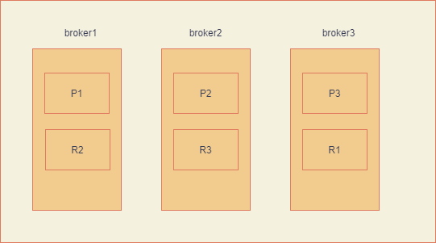
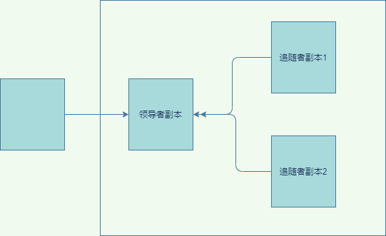
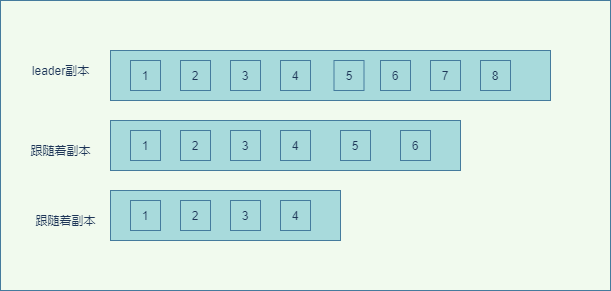

## 1. 开头  
　我们知道kafka具有非常好的系统容错性，这个kafka的容错性是如何保证的呢？答案就是所有分布式系统通用的解决之道-副本机制。  
副本机制总的来说到底有什么好处呢？ 

* 数据冗余，保证了系统整体的可用性
* 提升伸缩性，我们可以通过增加硬件机器将副本进行扩展，从而提高整体的吞吐量（这里需要副本能够提供对服务）
* 提升服务性能，将副本放在就近的访问机房，从而提升吞吐量

　在这个需要指出的是kafka并没有让kafka的副本能够对外服务，所以只起到了容错的作用

## 2. 副本
　我们知道kafka的主题是由分区组成的，数据分散在不同的分区上，而副本的概念是对标于分区，其本质就是分区的拷贝，它是一个只能追加消息的提交日志。  
　当我们的副本越多，那么能够就能更好的保证系统的可用性。  
　如下图所示，就是一个kafka的副本分布图：  
  
### 2.1. 副本的类型
kafka的副本有两种，一种是领导者副本，一种是追随者副本。  
  
* 领导者副本（Leader Replica）和追随者副本（Follower Replica）。  
  在 Kafka 中，副本分成两类,每个分区在创建时都要选举一个副本，称为领导者副本，其余的副本自动称为追随者副本
* 在 Kafka 中，追随者副本是不对外提供服务的。所有的读写请求都必须发往领导者副本所在的 Broker，由该 Broker 负责处理。追随者副本不处理客户端请求，它唯一的任务就是从领导者副本异步拉取消息，并写入到自己的提交日志中，从而实现与领导者副本的同步
* 当领导者副本挂了，基于zk，kafka会重新选举一个领导者副本，如果之前的领导这副本起来了，也只能变成追随者副本。

由由上面可知。Kafka 的追随者副本没有任何作用，不能实现扩增副本的数量从而一定程度来提升性能。

### 2.2. 领导者副本设计优点
* Read-your-writes  
能够实时的看到写入的数据，如果从跟随者副本读的话，因为是异步的，所以有可能读不到，但是已经写入了。
* Monotonic Reads（单调读）  
保证单调读一致性，如果允许追随者副本提供读服务，假设有两个跟随着副本，消费者从第一个副本读到了某数据，但是从第二副本可能异步还没有同步完成，又没有读取到数据，这就造成单调不一致读了。  
### 2.3. 实现机制  
#### 2.3.1. In-sync Replicas（ISR）   
 &emsp;&emsp;In-sync Replicas就是所谓的 ISR 副本集合。ISR 中的副本都是与 Leader 同步的副本，相反，不在 ISR 中的追随者副本就被认为是与 Leader 不同步的。ISR 不只是追随者副本集合，它必然包括 Leader 副本。甚至在某些情况下，ISR 只有 Leader 这一个副本。  
 如图所示副本同步图：  
   
&emsp;&emsp;这张图中的 2 个 Follower 副本都有可能与 Leader 不同步，但也都有可能与 Leader 同步。也就是说，Kafka 判断 Follower 是否与 Leader 同步的标准，不是看相差的消息数 ，而是看另一个参数：  
replica.lag.time.max.ms。 副本最大时间间隔。
&emsp;&emsp;该含义是：Follower 副本能够落后 Leader 副本的最长时间间隔，当前默认值是 10 秒。这就是说，只要一个Follower副本落后 Leader 副本的时间不连续超过 10 秒，那么 Kafka 就认为该Follower副本与Leader是同步的，即使此时Follower副本中保存的消息明显少于Leader副本中的消息。在 replica.lag.time.max.ms 时间后，此Follower副本就会被认为是与Leader副本不同步的，因此不能再放入ISR中。此时，Kafka会自动收缩 ISR 集合，将该副本移除ISR列表。倘若该副本后面慢慢地追上了 Leader 的进度，那么它是能够重新被加回 ISR 的。所以说ISR 是一个动态调整的集合。

#### 2.3.2. Unclean 领导者选举（Unclean Leader Election）
&emsp;&emsp;如果 ISR 为空了，就说明 Leader 副本也没有了，ISR为空，我们该如何选举新的leader呢？  
Kafka 把所有不在 ISR 中的存活副本都称为非同步副本,这些副本的数据可能不全，Broker 端参数 unclean.leader.election.enable 控制是否允许 Unclean 领导者选举。如果允许非同步副本选举这个会提升系统的可用性。但是一致性得到不到保证，如果禁用维护了数据的一致性，避免了消息丢失，但牺牲了高可用性。建议你不要开启需要根据实际的业务来配置。这就是非常典型的CAP理论。建议不要开启该参数，为了一点点可用性来牺牲了一致性，如果业务很重要，可能会出现严重的错误。
### 2.4. 小结
I