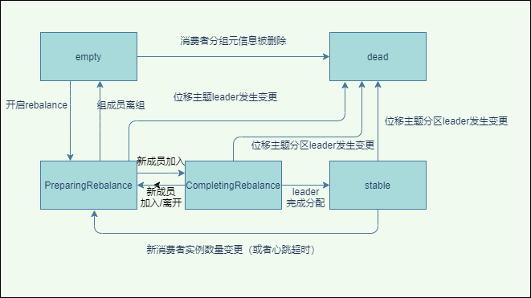
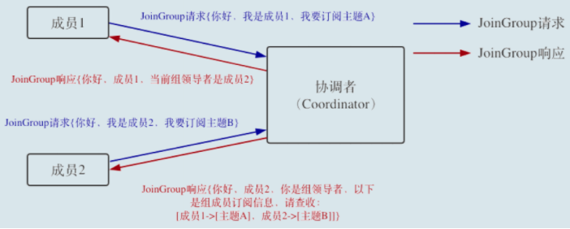
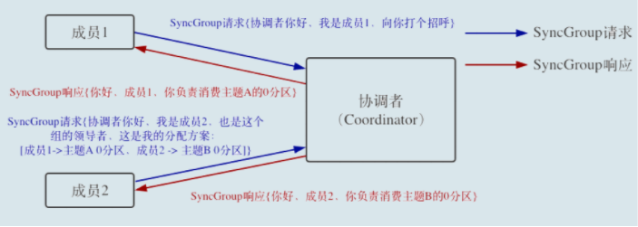
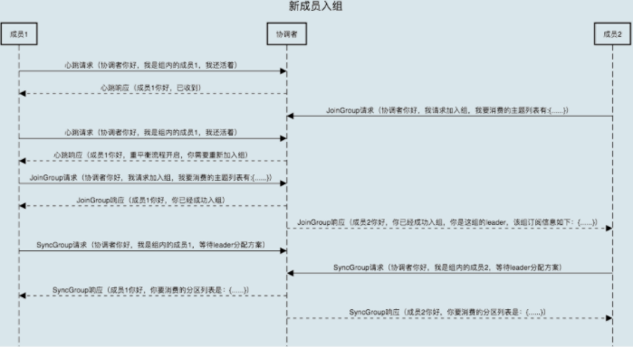
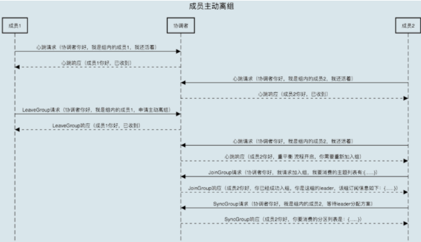
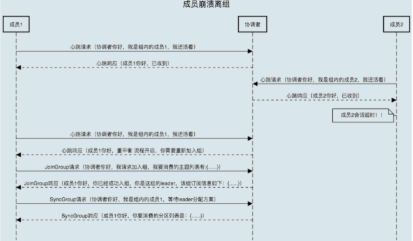
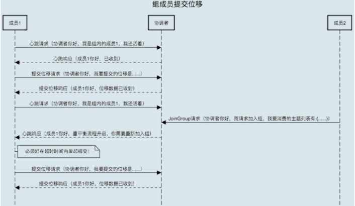

## 1. 重平衡时机回顾
在前面的文章我们已经知道了一些重平衡的概念，kafka发生重平衡的触发条件：
* 消费者实例数量发生变化（最常见）
* 订阅的主题数量发生变化
* 订阅的主题分区数发生了变化

## 2. 重平衡机制
我们在线添加了一个消费者实例后，其它的实例是如何感知到要发生重平衡呢？  
依靠的是消费者端的心跳线程。
### 2.1. 心跳线程
&emsp;&emsp;在0.10.1.0版本之前，消费者发送心跳是通过KafkaConsumer.poll来完成的，这个会存在很大的问题，一旦消息处理消耗了过长的时间，心跳请求将无法及时发到协调者那里，导致协调者认为该消费者已经下线，出现错误。 0.10.1.0 版本以后，引入了一个单独的心跳线程了避免受到消费的影响。  
&emsp;&emsp;当协调者想要发起重平衡时，它会将REBALANCE_IN_PROGRESS消息放入心跳消息响应中，消费者实例收到就知道需要重平衡了。  
&emsp;&emsp;所以heartbeat.interval.ms这个参数代表心跳时间格式，同时也是标识重平衡的时间敏感程度。越短，那么其它节点越快知道平衡了。

### 2.2. 消费者组状态机  
重平衡一旦开始，Broker 端的协调者就需要控制消费者组的状态流转了。Kafka 设计了一套消费者组状态机。Kafka 为消费者组定义了 5 种状态，如下图所示：  
  
* empty  
  组内没有任何成员，消费者组可能存在已提交的位移数据，这些位移尚未过期
* dead  
  组内没有任何城苑，组的元信息已经被移除，协调者组件保存着当前向他注册过的所有组信息，元数据信息就是类似于这个注册信息。
* PreparingRebalance，表明要开启重平衡了，需要各个消费者需要加入消费者分组。
* CompletingRebalance
  消费者组所有成员已经加入，各成员等待分配方案
* Stable  
  消费者组处于稳定状态，表明重平衡完成，组成员能够正常消费数据

&emsp;&emsp;一个消费者组最开始是Empty状态，当重平衡过程开启后，它会被置于PreparingRebalance状态等待成员加入，之后变更到CompletingRebalance状态等待分配方案，最后流转到Stable状态完成重平衡  
&emsp;&emsp;kafka 定期自动删除过期位移的条件就是，组要处于 Empty 状态。因此，如果你的消费者组停掉了很长时间（超过 7 天），那么 Kafka 很可能就把该组的位移数据删除了。  

### 2.3. 重平衡流程
### 2.3.1. 消费端请求
在消费者端，涉及到重平衡的有两类请求：joinGroup请求和SyncGroup请求
* joinGroup  
  当组成员加入组，消费者发送joinGroup到协调者说明我加入携带订阅主题，等待分配方案，通常情况下，第一个发送 JoinGroup 请求的成员自动成为领导者，即收到自己是领导者的信息以及消费者所有成员信息。然后进入到下一步：发送 SyncGroup 请求  

* SyncGroup
  leader消费者将分配好方案通过SyncGroup发送给协调者，普通消费者也发送SyncGroup消息，协调者可能返回已经分配好的方案信息，当所有成员都成功接收到分配方案后，消费者组进入到 Stable 状态，即开始正常的消费工作  

### 2.3.2. broker接收请求
要剖析协调者端处理重平衡的全流程，我们必须要分几个场景来讨论
* 新成员入组  
  新成员入组是指组处于 Stable 状态后，有新成员加入，协调者通过心跳请求响应的方式通知组内现有的所有成员，强制它们开启新一轮的重平衡  
  
* 组成员主动离组  
  这个场景就涉及到了第三类请求：LeaveGroup 请求
 

* 组成员崩溃离组  
  时间一般是由消费者端参数 session.timeout.ms来控制感知时间   
  

* 位移处理  
  协调者会给予成员一段缓冲时间  
  

## 3. 总结  
&emsp;&emsp;至此我们比较系统了解到了重平衡的机制，新版消费者和协调者之间会保持一个心跳，通过心跳会发送不同类型的数据，当消费者组处于stable，有新成员joinGroup，其它的消费者通过心跳也会收到协调者重平衡的通知，然后所有的消费者都会重新的发起一轮joinGroup、syncGroup请求直到分配方案的确定，就可以重新消费了。当有消费者实例超设置的seesion超时时间，协调者也会通知各个实例进行重平衡。如果收到了重平衡通知了，能够容忍一小段的位移提交请求，从而减少重复消息。