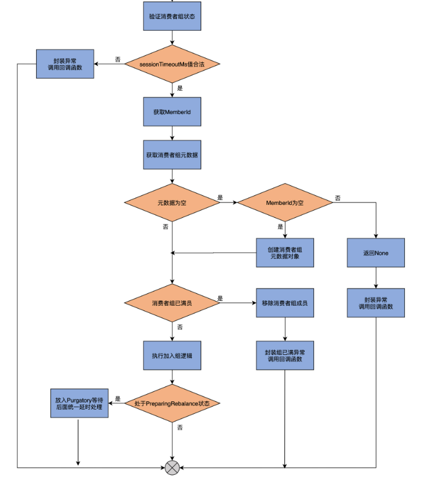
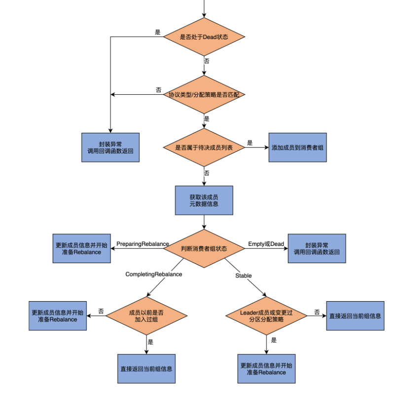

## 1. 开头

​	有些人认为，Consumer 端参数 session.timeout.ms 决定了完成一次 Rebalance 流程的最大时间。这种认知是不对的，实际上，这个参数是用于检测消费者组成员存活性的，即如果在这段超时时间内，没有收到该成员发给 Coordinator 的心跳请求，则把该成员标记为 Dead，而且要显式地将其从消费者组中移除，并触发新一轮的 Rebalance。而真正决定单次 Rebalance 所用最大时长的参数，是 Consumer 端的 **max.poll.interval.ms**

​	总体而言， Rebalance 的流程大致分为两大步：加入组（JoinGroup）和组同步（SyncGroup）

​	**加入组，是指消费者组下的各个成员向 Coordinator 发送 JoinGroupRequest 请求加入进组的过程**。这个过程有一个超时时间，如果有成员在超时时间之内，无法完成加入组操作，它就会被排除在这轮 Rebalance 之外。

​	组同步，是指当所有成员都成功加入组之后，Coordinator 指定其中一个成员为 Leader，然后将订阅分区信息发给 Leader 成员。接着，所有成员（包括 Leader 成员）向 Coordinator 发送 SyncGroupRequest 请求。需要注意的是，**只有 Leader 成员发送的请求中包含了订阅分区消费分配方案，在其他成员发送的请求中，这部分的内容为空**。当 Coordinator 接收到分配方案后，会通过向成员发送响应的方式，通知各个成员要消费哪些分区

## 2. 成员入组

加入组的源码实现，它们位于 GroupCoordinator.scala 文件中

handleJoinGroup、doUnknownJoinGroup、doJoinGroup 和 addMemberAndRebalance。

handleJoinGroup 是执行加入组的顶层方法，被 KafkaApis 类调用，该方法依据给定消费者组成员是否了设置成员 ID，来决定是调用 doUnknownJoinGroup 还是 doJoinGroup，前者对应于未设定成员 ID 的情形，后者对应于已设定成员 ID 的情形。而这两个方法，都会调用 addMemberAndRebalance，执行真正的加入组逻辑

### 2.1. handleJoinGroup

KafkaApis.scala 这个 API 入口文件，就可以看到，处理 JoinGroupRequest 请求的方法是 handleJoinGroupRequest。而它的主要逻辑，就是**调用 GroupCoordinator 的 handleJoinGroup 方法，来处理消费者组成员发送过来的加入组请求，所以，我们要具体学习一下 handleJoinGroup 方法**

```
def handleJoinGroup(
  groupId: String, // 消费者组名
  memberId: String, // 消费者组成员ID
  groupInstanceId: Option[String], // 组实例ID，用于标识静态成员
  requireKnownMemberId: Boolean, // 是否需要成员ID不为空
  clientId: String, // client.id值
  clientHost: String, // 消费者程序主机名
  rebalanceTimeoutMs: Int, // Rebalance超时时间,默认是max.poll.interval.ms值
  sessionTimeoutMs: Int, // 会话超时时间
  protocolType: String, // 协议类型
  protocols: List[(String, Array[Byte])], // 按照分配策略分组的订阅分区
  responseCallback: JoinCallback // 回调函数
  ): Unit = {
  ......
} 

```

 

### 2.2. doUnknownJoinGroup 方法

### 2.3. doJoinGroup 方法

 


 doJoinGroup 方法。这是为那些设置了成员 ID 的成员，执行加入组逻辑的方法。它的输入参数全部承袭自 handleJoinGroup 方法输入参数

就是变更消费者组状态，以及处理延时请求并放入 Purgatory，因此，我不展开说了，你可以自行阅读下这部分代码

### 2.4. addMemberAndRebalance 

doUnknownJoinGroup 和 doJoinGroup 方法都会用到的 addMemberAndRebalance 方法。从名字上来看，它的作用有两个：

向消费者组添加成员；

准备 Rebalance。

```
private def addMemberAndRebalance(
  rebalanceTimeoutMs: Int,
  sessionTimeoutMs: Int,
  memberId: String,
  groupInstanceId: Option[String],
  clientId: String,
  clientHost: String,
  protocolType: String,
  protocols: List[(String, Array[Byte])],
  group: GroupMetadata,
  callback: JoinCallback): Unit = {
  // 创建MemberMetadata对象实例
  val member = new MemberMetadata(
    memberId, group.groupId, groupInstanceId,
    clientId, clientHost, rebalanceTimeoutMs,
    sessionTimeoutMs, protocolType, protocols)
  // 标识该成员是新成员
  member.isNew = true
  // 如果消费者组准备开启首次Rebalance，设置newMemberAdded为True
  if (group.is(PreparingRebalance) && group.generationId == 0)
    group.newMemberAdded = true
  // 将该成员添加到消费者组
  group.add(member, callback)
  // 设置下次心跳超期时间
  completeAndScheduleNextExpiration(group, member, NewMemberJoinTimeoutMs)
  if (member.isStaticMember) {
    info(s"Adding new static member $groupInstanceId to group ${group.groupId} with member id $memberId.")
    group.addStaticMember(groupInstanceId, memberId)
  } else {
    // 从待决成员列表中移除
    group.removePendingMember(memberId)
  }
  // 准备开启Rebalance
  maybePrepareRebalance(group, s"Adding new member $memberId with group instance id $groupInstanceId")
}
```


**第 1 步**，该方法会根据传入参数创建一个 MemberMetadata 对象实例，并设置 isNew 字段为 True，标识其是一个新成员。isNew 字段与心跳设置相关联，你可以阅读下 MemberMetadata 的 hasSatisfiedHeartbeat 方法的代码，搞明白该字段是如何帮助 Coordinator 确认消费者组成员心跳的。

**第 2 步**，代码会判断消费者组是否是首次开启 Rebalance。如果是的话，就把 newMemberAdded 字段设置为 True；如果不是，则无需执行这个赋值操作。这个字段的作用，是 Kafka 为消费者组 Rebalance 流程做的一个性能优化。大致的思想，是在消费者组首次进行 Rebalance 时，让 Coordinator 多等待一段时间，从而让更多的消费者组成员加入到组中，以免后来者申请入组而反复进行 Rebalance。这段多等待的时间，就是 Broker 端参数 **group.initial.rebalance.delay.ms 的值**。这里的 newMemberAdded 字段，就是用于判断是否需要多等待这段时间的一个变量。

我们接着说回 addMemberAndRebalance 方法。该方法的**第 3 步**是调用 GroupMetadata 的 add 方法，将新成员信息加入到消费者组元数据中，同时设置该成员的下次心跳超期时间。

**第 4 步**，代码将该成员从待决成员列表中移除。毕竟，它已经正式加入到组中了，就不需要待在待决列表中了。

**第 5 步**，调用 maybePrepareRebalance 方法，准备开启 Rebalance。

### 2.5. 小结

在这一步中，你要格外注意，**加入组时是区分有无消费者组成员 ID**。对于未设定成员 ID 的分支，代码调用 doUnkwonwJoinGroup 为成员生成 ID 信息；对于已设定成员 ID 的分支，则调用 doJoinGroup 方法。而这两个方法，底层都是调用 addMemberAndRebalance 方法，实现将消费者组成员添加进组的逻辑。

* Rebalance 流程：包括 JoinGroup 和 SyncGroup 两大步。

* handleJoinGroup 方法：Coordinator 端处理成员加入组申请的方法。

* Member Id：成员 ID。Kafka 源码根据成员 ID 的有无，决定调用哪种加入组逻辑方法，比如 doUnknownJoinGroup 或 doJoinGroup 方法。

* addMemberAndRebalance 方法：实现加入组功能的实际方法，用于完成“加入组 + 开启 Rebalance”这两个操作。

## 同步

当所有成员都成功加入到组之后，所有成员会开启 Rebalance 的第二大步：组同步。在这一步中，成员会发送 SyncGroupRequest 请求给 Coordinator。那么，Coordinator 又是如何应对的呢？咱们下节课见分晓。

1. 