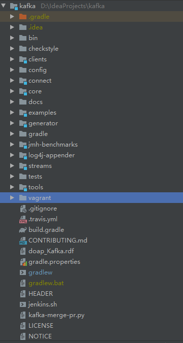
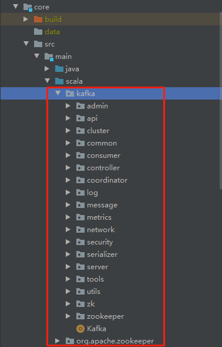

## 1. 准备环境

* Oracle Java 8：专栏使用的是 Oracle 的 JDK 及 Hotspot JVM。

* Gradle 5.0：我在专栏里带你阅读的 Kafka 源码是社区的 Trunk 分支。Trunk 分支目前演进到了 2.4.0 版本，还不支持 Gradle 6.0，因此，需要安装 **Gradle 5.x 版本。**

* Scala 2.12：当前社区编译 Kafka 支持 3 个 Scala 版本，分别是 2.11、2.12 和 2.13。2.11 应该很快就会不支持了，而 2.13 又是刚刚推出的版本，推荐安装 Scala 2.12 版本。

* IDEA + Scala 插件

* Git

* window11， 64

  

## 2. 编译步骤

* 拉取源码

   git clone https://github.com/apache/kafka.git

  切换至2.x分支

* 构建 Kafka 工程

  ```
  
  # gradle
  ```

* 恢复生成windows的gradlew执行脚本

  修改wrapper.gradle文件，因为是kafka下的[wrapper](https://so.csdn.net/so/search?q=wrapper&spm=1001.2101.3001.7020).gradle配置中，删除了windows批处理文件gradlew.bat，原因是官方未在windows下进行测试构建。因此删除以下代码（在文件最后）

  ```
  task removeWindowsScript(type: Delete) {
      delete "$rootDir/gradlew.bat"
  }
  wrapper.finalizedBy removeWindowsScript
  ```

* 根目录下执行 gradle wrapper 命令 gradlew.bat文件生成
* 根目录下执行gradlew jar生成 Jar 文件

## 3. 代码结构

 

* **bin 目录**

  保存 Kafka 工具行脚本，我们熟知的 kafka-server-start 和 kafka-console-producer 等脚本都存放在这里。

* **clients 目录**

  保存 Kafka 客户端代码，比如生产者和消费者的代码都在该目录下。

* **config 目录**

  保存 Kafka 的配置文件，其中比较重要的配置文件是 server.properties。

* **connect 目录**

  保存 Connect 组件的源代码。Kafka Connect 组件是用来实现 Kafka 与外部系统之间的实时数据传输的。

* **core 目录**

  保存 Broker 端代码。Kafka 服务器端代码全部保存在该目录下。

* **streams 目录**

  保存 Streams 组件的源代码。Kafka Streams 是实现 Kafka 实时流处理的组件。

## 4. 常见命令

想要测试这 4 个部分的代码，可以分别运行以下 4 条命令：

* ./gradlew core:test

* ./gradlew clients:test

* ./gradlew connect:[submodule]:test

  Connect 组件的测试方法不太一样。这是因为 Connect 工程下细分了多个子模块，比如 api、runtime 等，所以，你需要显式地指定要测试的子模块名才能进行测试

* ./gradlew streams:test

单独对某一个具体的测试用例进行测试：

* gradlew core:test --tests kafka.log.LogTest

构建二进制环境：

* gradlew clean releaseTarGz

  成功运行后，core、clients 和 streams 目录下就会分别生成对应的二进制发布包，它们分别是：

  * kafka-2.12-2.5.0-SNAPSHOT.tgz。它是 Kafka 的 Broker 端发布包，把该文件解压之后就是标准的 Kafka 运行环境。该文件位于 core 路径的 /build/distributions 目录。
  * kafka-clients-2.5.0-SNAPSHOT.jar。该 Jar 包是 Clients 端代码编译打包之后的二进制发布包。该文件位于 clients 目录下的 /build/libs 目录。
  * kafka-streams-2.5.0-SNAPSHOT.jar。该 Jar 包是 Streams 端代码编译打包之后的二进制发布包。该文件位于 streams 目录下的 /build/libs 目录

## 5. Broker源码结构

broker核心源码在core工程下，且用scala写的

 

* controller 包

  保存了 Kafka 控制器（Controller）代码，而控制器组件是 Kafka 的核心组件，后面我们会针对这个包的代码进行详细分析。

* coordinator 包

  保存了**消费者端的 GroupCoordinator 代码**和**用于事务的 TransactionCoordinator 代码**。对 coordinator 包进行分析，特别是对消费者端的 GroupCoordinator 代码进行分析，是我们弄明白 Broker 端协调者组件设计原理的关键。

* log 包

  保存了 Kafka 最核心的日志结构代码，包括日志、日志段、索引文件等，专栏后面会有详细介绍。另外，该包下还封装了 Log Compaction 的实现机制，是非常重要的源码包。

* network 包

  封装了 Kafka 服务器端网络层的代码，特别是 SocketServer.scala 这个文件，是 Kafka 实现 Acceptor 模式的具体操作类，非常值得一读。

* server 包

  顾名思义，它是 Kafka 的服务器端主代码，里面的类非常多，很多关键的 Kafka 组件都存放在这里，比如专栏后面要讲到的状态机、Purgatory 延时机制等

kafka的测试用例放在 src/test 之下

## 6. scala语法入门

## 7. 总结