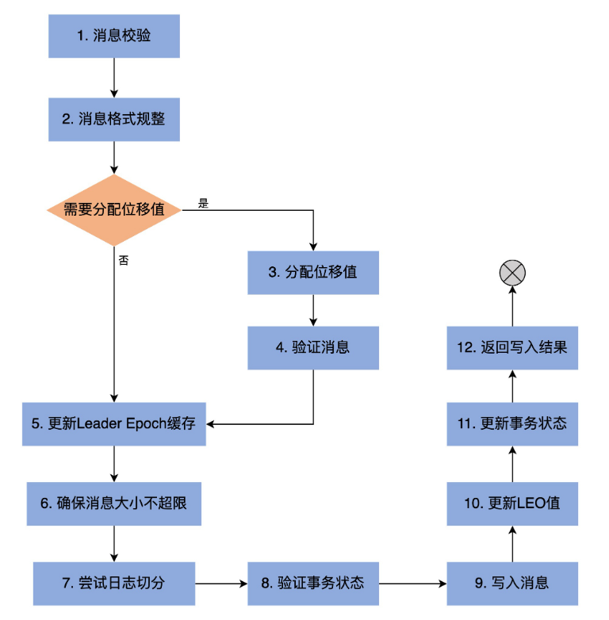
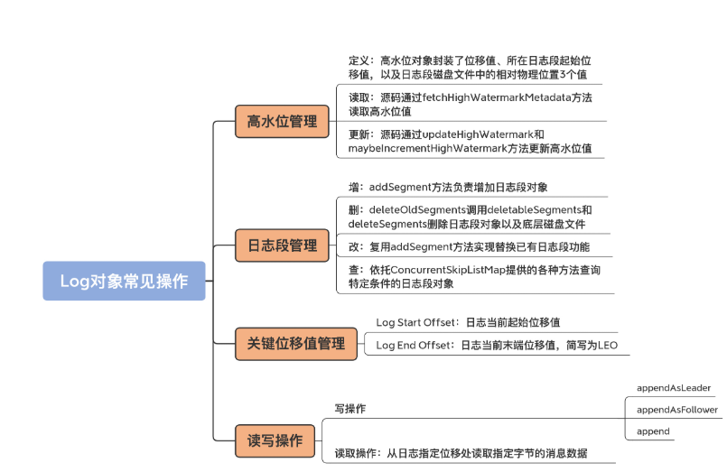

## 1. 概览

 

### 1.1. 日志结构	

​	一个 Kafka 主题有很多分区，每个分区就对应一个 Log 对象，在物理磁盘上则对应于一个子目录。

​	比如我们可以创建一个双分区的主题 test-topic，那么，Kafka 在磁盘上会创建两个子目录：test-topic-0 和 test-topic-1。每个子目录下存在多组日志段，也就是多组.log、.index、.timeindex 文件组合，只不过文件名不同，因为每个日志段的起始位移不同

### 1.2. 日志段结构

​	Kafka 日志对象由多个日志段对象组成，而每个日志段对象会在磁盘上创建一组文件：

* 消息日志文件（.log）

* 位移索引文件（.index）

* 时间戳索引文件（.timeindex）

* 已中止（Aborted）事务的索引文件（.txnindex）

  没有使用 Kafka 事务，已中止事务的索引文件是不会被创建

因此每个日志段由两个核心组件构成：日志、索引。每个日志段都有一个起始位移值（Base Offset），而该位移值是此日志段所有消息中最小的位移值，同时，该值却又比前面任何日志段中消息的位移值都大

## 2. 日志段分析

日志段源码位于 Kafka 的 core 工程下，具体文件位置是 core/src/main/scala/kafka/log/LogSegment.scala.如下为日志段类声明：

```
@nonthreadsafe
class LogSegment private[log] (val log: FileRecords,
                               val lazyOffsetIndex: LazyIndex[OffsetIndex],
                               val lazyTimeIndex: LazyIndex[TimeIndex],
                               val txnIndex: TransactionIndex,
                               val baseOffset: Long,
                               val indexIntervalBytes: Int,
                               val rollJitterMs: Long,
                               val time: Time) extends Logging
```

* FileRecords

  实际保存 Kafka 消息

* lazyOffsetIndex、lazyTimeIndex、txnIndex

  ​	分别对应于刚才所说的 3 个索引文件。不过，在实现方式上，前两种使用了延迟初始化的原理，降低了初始化时间成本

* baseOffset

  ​	在磁盘上看到的文件名就是 baseOffset 的值。每个 LogSegment 对象实例一旦被创建，它的起始位移就是固定的了，不能再被更改

* indexIntervalBytes

  控制了日志段对象新增索引项的频率，默认情况下，日志段至少新写入 4KB 的消息数据才会新增一条索引项

* rollJitterMs

  rollJitterMs 是日志段对象新增倒计时的“扰动值”。因为目前 Broker 端日志段新增倒计时是全局设置，这就是说，在未来的某个时刻可能同时创建多个日志段对象，这将极大地增加物理磁盘 I/O 压力。有了 rollJitterMs 值的干扰，每个新增日志段在创建时会彼此岔开一小段时间，这样可以缓解物理磁盘的 I/O 负载瓶颈

* time

  用于统计计时的一个实现类,在 Kafka 源码中普遍出现

### 2.1. append 方法

append 方法接收 4 个参数:

* 最大位移值
* 最大时间戳
* 最大时间戳对应消息的位移
* 真正要写入的消息集合

 

* **第一步：**

  在源码中，首先调用 log.sizeInBytes 方法判断该日志段是否为空，如果是空的话， Kafka 需要记录要写入消息集合的最大时间戳，并将其作为后面新增日志段倒计时的依据。

  ```
  val physicalPosition = log.sizeInBytes()
  if (physicalPosition == 0)
  rollingBasedTimestamp = Some(largestTimestamp)
  ```

* **第二步：**

  代码调用 ensureOffsetInRange 方法确保输入参数最大位移值是合法的

  标准就是看它与日志段起始位移的差值是否在整数范围内，即 largestOffset - baseOffset 的值是不是 介于 [0，Int.MAXVALUE] 之间。

  在极个别的情况下，这个差值可能会越界，这时， append 方法就会抛出异常，阻止后续的消息写入。一旦你碰到这个问题，你需要做的是升级你的 Kafka 版本，因为这是由已知的 Bug 导致的。

* **第三步：**

  append 方法调用 FileRecords 的 append 方法执行真正的写入。

  它的工作是将内存中的消息对象写入到操作系统的页缓存

* **第四步：**

  更新日志段的最大时间戳以及最大时间戳所属消息的位移值属性。

  每个日志段都要保存当前最大时间戳信息和所属消息的位移信息。

  Broker 端提供定期删除日志的功能, 判断的依据就是最大时间戳这个值；

  而最大时间戳对应的消息的位移值则用于时间戳索引项。

  **时间戳索引项保存时间戳与消息位移的对应关系**。

  Kafka 会更新并保存这组对应关系。

* **第五步：**

  更新索引项和写入的字节数了。

  日志段每写入 4KB 数据就要写入一个索引项。

  当已写入字节数超过了 4KB 之后，append 方法会调用索引对象的 append 方法新增索引项

  同时清空已写入字节数，以备下次重新累积计算

````
 def append(largestOffset: Long, largestTimestamp: Long, shallowOffsetOfMaxTimestamp: Long, records: MemoryRecords): Unit = {
    if (records.sizeInBytes > 0) {
      trace(s"Inserting ${records.sizeInBytes} bytes at end offset $largestOffset at position ${log.sizeInBytes} " +
            s"with largest timestamp $largestTimestamp at shallow offset $shallowOffsetOfMaxTimestamp")
      val physicalPosition = log.sizeInBytes()
      if (physicalPosition == 0)
        rollingBasedTimestamp = Some(largestTimestamp)

      ensureOffsetInRange(largestOffset)

      // append the messages
      val appendedBytes = log.append(records)
      trace(s"Appended $appendedBytes to ${log.file} at end offset $largestOffset")
      // Update the in memory max timestamp and corresponding offset.
      if (largestTimestamp > maxTimestampSoFar) {
        maxTimestampSoFar = largestTimestamp
        offsetOfMaxTimestampSoFar = shallowOffsetOfMaxTimestamp
      }
      // append an entry to the index (if needed)
      if (bytesSinceLastIndexEntry > indexIntervalBytes) {
        offsetIndex.append(largestOffset, physicalPosition)
        timeIndex.maybeAppend(maxTimestampSoFar, offsetOfMaxTimestampSoFar)
        bytesSinceLastIndexEntry = 0
      }
      bytesSinceLastIndexEntry += records.sizeInBytes
    }
  }
````

### 2.2. read方法

read 方法接收 4 个输入参数：

* startOffset：要读取的第一条消息的位移；

* maxSize：能读取的最大字节数；

* maxPosition ：能读到的最大文件位置；

* minOneMessage：是否允许在消息体过大时至少返回第一条消息

  参数为 true 时，即使出现消息体字节数超过了 maxSize 的情形，read 方法依然能返回至少一条消息。

该方法的逻辑：

* 查找索引确定读取的物理文件的位置

  调用 translateOffset 方法定位要读取的起始文件位置 （startPosition）。输入参数 startOffset 仅仅是位移值，Kafka 需要根据索引信息找到对应的物理文件位置才能开始读取消息。

* 计算读取的总字节数

  确定了读取起始位置，日志段代码需要根据这部分信息以及 maxSize 和 maxPosition 参数共同计算要读取的总字节数。举个例子，假设 maxSize=100，maxPosition=300，startPosition=250，那么 read 方法只能读取 50 字节，因为 maxPosition - startPosition = 50。我们把它和 maxSize 参数相比较，其中的最小值就是最终能够读取的总字节数

* 读取消息

  调用 FileRecords 的 slice 方法，从指定位置读取指定大小的消息集合

```
  def read(startOffset: Long,
           maxSize: Int,
           maxPosition: Long = size,
           minOneMessage: Boolean = false): FetchDataInfo = {
    if (maxSize < 0)
      throw new IllegalArgumentException(s"Invalid max size $maxSize for log read from segment $log")

    val startOffsetAndSize = translateOffset(startOffset)

    // if the start position is already off the end of the log, return null
    if (startOffsetAndSize == null)
      return null

    val startPosition = startOffsetAndSize.position
    val offsetMetadata = LogOffsetMetadata(startOffset, this.baseOffset, startPosition)

    val adjustedMaxSize =
      if (minOneMessage) math.max(maxSize, startOffsetAndSize.size)
      else maxSize

    // return a log segment but with zero size in the case below
    if (adjustedMaxSize == 0)
      return FetchDataInfo(offsetMetadata, MemoryRecords.EMPTY)

    // calculate the length of the message set to read based on whether or not they gave us a maxOffset
    val fetchSize: Int = min((maxPosition - startPosition).toInt, adjustedMaxSize)

    FetchDataInfo(offsetMetadata, log.slice(startPosition, fetchSize),
      firstEntryIncomplete = adjustedMaxSize < startOffsetAndSize.size)
  }
```

### 2.3. recover 方法

​	Broker 在启动时会从磁盘上加载所有日志段信息到内存中，并创建相应的 LogSegment 对象实例。在这个过程中，它需要执行一系列的操作。总的来说就是，读取日志段文件，然后重建索引文件。当我们的环境上有很多日志段文件，Broker 重启很慢，现在就知道了，这是因为 Kafka 在执行 recover 的过程中需要读取大量的磁盘文件。

 

* recover 开始时，代码依次调用索引对象的 reset 方法清空所有的索引文件

* 开始遍历日志段中的所有消息集合或消息批次（RecordBatch）

  对于读取到的每个消息集合，日志段必须要确保它们是合法的，这主要体现在两个方面：

  * 必须要符合 Kafka 定义的二进制格式；

  * 集合中最后一条消息的位移值不能越界，即它与日志段起始位移的差值必须是一个正整数值。

* 更新遍历过程中观测到的最大时间戳以及所属消息的位移值。这两个数据用于后续构建索引项。

  不断累加当前已读取的消息字节数，并根据该值有条件地写入索引项。

* 最后是更新事务型 Producer 的状态以及 Leader Epoch 缓存。

  这两个并不是理解 Kafka 日志结构所必需的组件，可以忽略它们。

* 遍历执行完成后，Kafka 会将日志段当前总字节数和刚刚累加的已读取字节数进行比较：
  * 如果发现前者比后者大，说明日志段写入了一些非法消息，需要执行截断操作，将日志段大小调整回合法的数值。
  *  Kafka 还必须相应地调整索引文件的大小。
* 日志段恢复的操作也就宣告结束了 

### 2.4. 小结

 

## 3. 日志的加载

​	日志是日志段的容器，里面定义了很多管理日志段的操作。

 

### 3.1. 日志伴生对象

#### 3.1.1. LogAppendInfo

* LogAppendInfo（C）

  根据名字我们便可以知道，这个是保存了一组待写入消息的各种元数据信息。比如，这组消息中第一条消息的位移值是多少、最后一条消息的位移值是多少；再比如，这组消息中最大的消息时间戳又是多少

* LogAppendInfo（O）

  可以理解为其对应伴生类的工厂方法类，里面定义了一些工厂方法，用于创建特定的 LogAppendInfo 实例

#### 3.1.2. Log

* Log（C） 

  源码中最核心的代码

* Log（O）

  Log 伴生类的工厂方法，定义了很多常量以及一些辅助方法。

  这里定义了一些日志文件的类型

#### 3.1.3. RollParams

* RollParams（C）

  定义用于控制日志段是否切分（Roll）的数据结构。

* RollParams（O）

  RollParams 伴生类的工厂方法

#### 3.1.4. LogMetricNames

 Log 对象的监控指标

#### 3.1.5. LogMetricNames

定义了 Log 对象的监控指标

#### 3.1.6. LogOffsetSnapshot

封装分区所有位移元数据的容器类

#### 3.1.7. LogReadInfo

封装读取日志返回的数据及其元数据

#### 3.1.8. CompletedTxn

记录已完成事务的元数据，主要用于构建事务索引

### 3.2. log文件类型

Log的伴生对象定义了各种文件类型

```
object Log {
  val LogFileSuffix = ".log"
  val IndexFileSuffix = ".index"
  val TimeIndexFileSuffix = ".timeindex"
  val ProducerSnapshotFileSuffix = ".snapshot"
  val TxnIndexFileSuffix = ".txnindex"
  val DeletedFileSuffix = ".deleted"
  val CleanedFileSuffix = ".cleaned"
  val SwapFileSuffix = ".swap"
  val CleanShutdownFile = ".kafka_cleanshutdown"
  val DeleteDirSuffix = "-delete"
  val FutureDirSuffix = "-future"
……
}
```

* snapshot   

  Kafka 为幂等型或事务型 Producer 所做的快照文件

* .deleted 

  删除日志段操作创建的文件。目前删除日志段文件是异步操作，Broker 端把日志段文件从.log 后缀修改为.deleted 后缀

* .cleaned 、.swap

  Compaction 操作的产物 ，在Cleaner阶段发挥作用 

* -delete 则是应用于文件夹的。

  当你删除一个主题的时候，主题的分区文件夹会被加上这个后缀。

* -future 

  用于变更主题分区文件夹地址的，属于比较高阶的用法

### 3.3. log工具方法

log的伴生对象还提供了很多工具方法

* 通过给定的位移值计算出对应的日志段文件名:

  ```
  def filenamePrefixFromOffset(offset: Long): String = {
      val nf = NumberFormat.getInstance()
      nf.setMinimumIntegerDigits(20)
      nf.setMaximumFractionDigits(0)
      nf.setGroupingUsed(false)
      nf.format(offset)
    }
  ```

  Kafka 日志文件固定是 20 位的长度，filenamePrefixFromOffset 方法就是用前面补 0 的方式，把给定位移值扩充成一个固定 20 位长度的字符串，如我们给定一个位移值是 12345，那么 Broker 端磁盘上对应的日志段文件名就应该是 00000000000000012345.log

### 3.4. log的核心属性

* 类的定义

  ```
  class Log(@volatile var dir: File,
            @volatile var config: LogConfig,
            @volatile var logStartOffset: Long,
            @volatile var recoveryPoint: Long,
            scheduler: Scheduler,
            brokerTopicStats: BrokerTopicStats,
            val time: Time,
            val maxProducerIdExpirationMs: Int,
            val producerIdExpirationCheckIntervalMs: Int,
            val topicPartition: TopicPartition,
            val producerStateManager: ProducerStateManager,
            logDirFailureChannel: LogDirFailureChannel) extends Logging with KafkaMetricsGroup {
  ……
  }
  ```

  核心参数：

  * dir

    dir 就是这个日志所在的文件夹路径，也就是主题分区的路径

  * logStartOffset

    表示日志的当前最早位移。

  dir 和 logStartOffset 都是 volatile var 类型，表示它们的值是变动的，而且可能被多个线程更新

* kafka的位移概念

   

  *  Log End Offset（LEO）

    末端位移，表示日志下一条待插入消息的位移值

  * Log Start Offset 

    表示日志当前对外可见的最早一条消息的位移值，Log Start Offset 却不能简称为 LSO。因为在 Kafka 中，LSO 特指 Log Stable Offset

  * 高水位值

    区分已提交消息和未提交消息的分水岭

* nextOffsetMetadata

  该属性封装了下一条待插入消息的位移值，你基本上可以把这个属性和 LEO 等同起来

  ```
  @volatile private var nextOffsetMetadata: LogOffsetMetadata = _
  ```

* highWatermarkMetadata

  ```
  @volatile private var highWatermarkMetadata: LogOffsetMetadata = LogOffsetMetadata(logStartOffset)
  ```

​		分区日志高水位值。关于高水位的概念

* segments  

  ```
  private val segments: ConcurrentNavigableMap[java.lang.Long, LogSegment] = new ConcurrentSkipListMap[java.lang.Long, LogSegment]
  ```

   Log 类中最重要的属性。它保存了分区日志下所有的日志段信息，只不过是用 Map 的数据结构来保存的。Map 的 Key 值是日志段的起始位移值，Value 则是日志段对象本身。Kafka 源码使用 ConcurrentNavigableMap 数据结构来保存日志段对象，就可以很轻松地利用该类提供的线程安全和各种支持排序的方法，来管理所有日志段对象

*  Leader Epoch Cache  

  主要是用来判断出现 Failure 时是否执行日志截断操作（Truncation）。之前靠高水位来判断的机制，可能会造成副本间数据不一致的情形。这里的 Leader Epoch Cache 是一个缓存类数据，里面保存了分区 Leader 的 Epoch 值与对应位移值的映射关系

* 其它的不重要属性

  timer、scheduler大多是做辅助用的

#### 3.5.  log的初始化

```
 locally {
    val startMs = time.milliseconds

    // create the log directory if it doesn't exist
    Files.createDirectories(dir.toPath)

    initializeLeaderEpochCache()

    val nextOffset = loadSegments()

    /* Calculate the offset of the next message */
    nextOffsetMetadata = LogOffsetMetadata(nextOffset, activeSegment.baseOffset, activeSegment.size)

    leaderEpochCache.foreach(_.truncateFromEnd(nextOffsetMetadata.messageOffset))

    updateLogStartOffset(math.max(logStartOffset, segments.firstEntry.getValue.baseOffset))

    // The earliest leader epoch may not be flushed during a hard failure. Recover it here.
    leaderEpochCache.foreach(_.truncateFromStart(logStartOffset))

    // Any segment loading or recovery code must not use producerStateManager, so that we can build the full state here
    // from scratch.
    if (!producerStateManager.isEmpty)
      throw new IllegalStateException("Producer state must be empty during log initialization")
    loadProducerState(logEndOffset, reloadFromCleanShutdown = hasCleanShutdownFile)

    info(s"Completed load of log with ${segments.size} segments, log start offset $logStartOffset and " +
      s"log end offset $logEndOffset in ${time.milliseconds() - startMs} ms")
  }
```

* 创建分区日志路径

* 初始化leader epoch cache
  * 创建leader epoch cache检查点文件
  * 生成leader epoch cache对象
  
* 加载所有的日志段对象

  ```
    private def loadSegments(): Long = {
  
      val swapFiles = removeTempFilesAndCollectSwapFiles()
  
      retryOnOffsetOverflow {
        logSegments.foreach(_.close())
        segments.clear()
        loadSegmentFiles()
      }
  
      completeSwapOperations(swapFiles)
  
      if (!dir.getAbsolutePath.endsWith(Log.DeleteDirSuffix)) {
        val nextOffset = retryOnOffsetOverflow {
          recoverLog()
        }
  
        activeSegment.resizeIndexes(config.maxIndexSize)
        
        nextOffset
        
      } else {
         if (logSegments.isEmpty) {
            addSegment(LogSegment.open(dir = dir,
              baseOffset = 0,
              config,
              time = time,
              fileAlreadyExists = false,
              initFileSize = this.initFileSize,
              preallocate = false))
         }
        0
      }
    }
  ```

  这个会对分区日志路径遍历两次

  * 会移除上次 Failure 遗留下来的各种临时文件（包括.cleaned、.swap、.deleted 文件等）

    即调用removeTempFilesAndCollectSwapFiles 

    ```
      private def removeTempFilesAndCollectSwapFiles(): Set[File] = {
    	//在方法内部定义一个名为deleteIndicesIfExist的方法，用于删除日志文件对应的索引文件
        def deleteIndicesIfExist(baseFile: File, suffix: String = ""): Unit = {
          info(s"Deleting index files with suffix $suffix for baseFile $baseFile")
          val offset = offsetFromFile(baseFile)
          Files.deleteIfExists(Log.offsetIndexFile(dir, offset, suffix).toPath)
          Files.deleteIfExists(Log.timeIndexFile(dir, offset, suffix).toPath)
          Files.deleteIfExists(Log.transactionIndexFile(dir, offset, suffix).toPath)
        }
    
        val swapFiles = mutable.Set[File]()
        val cleanFiles = mutable.Set[File]()
        var minCleanedFileOffset = Long.MaxValue
    	//遍历分区日志路径下的所有文件
        for (file <- dir.listFiles if file.isFile) {
        //如果不可读，直接抛出IOException
          if (!file.canRead)
            throw new IOException(s"Could not read file $file")
          val filename = file.getName
          // 如果以.deleted结尾
          if (filename.endsWith(DeletedFileSuffix)) {
            debug(s"Deleting stray temporary file ${file.getAbsolutePath}")
             // 说明是上次Failure遗留下来的文件，直接删除
            Files.deleteIfExists(file.toPath)
            // 如果以.cleaned结尾
          } else if (filename.endsWith(CleanedFileSuffix)) {
            minCleanedFileOffset = Math.min(offsetFromFileName(filename), minCleanedFileOffset)
            cleanFiles += file
             // 如果以.swap结尾
          } else if (filename.endsWith(SwapFileSuffix)) {
            // we crashed in the middle of a swap operation, to recover:
            // if a log, delete the index files, complete the swap operation later
            // if an index just delete the index files, they will be rebuilt
            val baseFile = new File(CoreUtils.replaceSuffix(file.getPath, SwapFileSuffix, ""))
            info(s"Found file ${file.getAbsolutePath} from interrupted swap operation.")
             // 如果该.swap文件原来是索引文件
            if (isIndexFile(baseFile)) {
             // 删除原来的索引文件
              deleteIndicesIfExist(baseFile)
             // 如果该.swap文件原来是日志文件
            } else if (isLogFile(baseFile)) {
            // 删除掉原来的索引文件
              deleteIndicesIfExist(baseFile)
              // 加入待恢复的.swap文件集合中
              swapFiles += file
            }
          }
        }
    
    	//从待恢复swap集合中找出那些起始位移值大于minCleanedFileOffset值的文件，直接删掉这些无效的.swap
        val (invalidSwapFiles, validSwapFiles) = swapFiles.partition(file => offsetFromFile(file) >= minCleanedFileOffset)
        invalidSwapFiles.foreach { file =>
          debug(s"Deleting invalid swap file ${file.getAbsoluteFile} minCleanedFileOffset: $minCleanedFileOffset")
          val baseFile = new File(CoreUtils.replaceSuffix(file.getPath, SwapFileSuffix, ""))
          deleteIndicesIfExist(baseFile, SwapFileSuffix)
          Files.deleteIfExists(file.toPath)
        }
    
         // 清除所有待删除文件集合中的文件
        cleanFiles.foreach { file =>
          debug(s"Deleting stray .clean file ${file.getAbsolutePath}")
          Files.deleteIfExists(file.toPath)
        }
        // 最后返回当前有效的.swap文件集合
        validSwapFiles
      }
    ```

    不管是否要过滤出符合条件的oldSegments，恢复之后都要进行替换，这是升级Broker版本而做的防御性编程。在老的版本中，代码写入消息后并不会对位移值进行校验。因此log cleaner老代码可能写入一个非常大的位移值（大于Int.MAX_VALUE）。当broker升级后，这些日志段就不能正常被compact了，因为位移值越界了（新版本加入了位移校验）

    代码需要去搜寻在swap start offset和swap LEO之间的所有日志段对象，但这还不够，还要保证这些日志段的LEO比swap的base offset大才行，否则会有问题

  * 清空所有日志段对象，并且再次遍历分区路径，重建日志段 segments Map 以及索引文件，调用的是loadSegmentFiles

    ```
     private def loadSegmentFiles(): Unit = {
        //按照日志段文件名中的位移值正序排列，然后遍历每个文件
        for (file <- dir.listFiles.sortBy(_.getName) if file.isFile) {
        //如果是索引文件
          if (isIndexFile(file)) {
            // if it is an index file, make sure it has a corresponding .log file
            val offset = offsetFromFile(file)
            val logFile = Log.logFile(dir, offset)
            // 确保存在对应的日志文件，否则记录一个警告，并删除该索引文件
            if (!logFile.exists) {
              warn(s"Found an orphaned index file ${file.getAbsolutePath}, with no corresponding log file.")
              Files.deleteIfExists(file.toPath)
            }
            // 如果是日志文件
          } else if (isLogFile(file)) {
            // if it's a log file, load the corresponding log segment
            val baseOffset = offsetFromFile(file)
            val timeIndexFileNewlyCreated = !Log.timeIndexFile(dir, baseOffset).exists()
            // 创建对应的LogSegment对象实例，并加入segments中
            val segment = LogSegment.open(dir = dir,
              baseOffset = baseOffset,
              config,
              time = time,
              fileAlreadyExists = true)
    
            try segment.sanityCheck(timeIndexFileNewlyCreated)
            catch {
              case _: NoSuchFileException =>
                error(s"Could not find offset index file corresponding to log file ${segment.log.file.getAbsolutePath}, " +
                  "recovering segment and rebuilding index files...")
                recoverSegment(segment)
              case e: CorruptIndexException =>
                warn(s"Found a corrupted index file corresponding to log file ${segment.log.file.getAbsolutePath} due " +
                  s"to ${e.getMessage}}, recovering segment and rebuilding index files...")
                recoverSegment(segment)
            }
            addSegment(segment)
          }
        }
      }
    ```

    

  * 会完成未完成的 swap 操作，即调用 completeSwapOperations 方法。等这些都做完之后，再调用 recoverLog 方法恢复日志段对象，然后返回恢复之后的分区日志 LEO 值

    ```
     private def completeSwapOperations(swapFiles: Set[File]): Unit = {
        //遍历所有有效.swap文件
        for (swapFile <- swapFiles) {
          val logFile = new File(CoreUtils.replaceSuffix(swapFile.getPath, SwapFileSuffix, ""))
          // 拿到日志文件的起始位移值
          val baseOffset = offsetFromFile(logFile)
           // 创建对应的LogSegment实例
          val swapSegment = LogSegment.open(swapFile.getParentFile,
            baseOffset = baseOffset,
            config,
            time = time,
            fileSuffix = SwapFileSuffix)
          info(s"Found log file ${swapFile.getPath} from interrupted swap operation, repairing.")
           // 执行日志段恢复操作
          recoverSegment(swapSegment)
    
          // We create swap files for two cases:
          // (1) Log cleaning where multiple segments are merged into one, and
          // (2) Log splitting where one segment is split into multiple.
          //
          // Both of these mean that the resultant swap segments be composed of the original set, i.e. the swap segment
          // must fall within the range of existing segment(s). If we cannot find such a segment, it means the deletion
          // of that segment was successful. In such an event, we should simply rename the .swap to .log without having to
          // do a replace with an existing segment.
          // 确认之前删除日志段是否成功，是否还存在老的日志段文件
          val oldSegments = logSegments(swapSegment.baseOffset, swapSegment.readNextOffset).filter { segment =>
            segment.readNextOffset > swapSegment.baseOffset
          }
           // 如果存在，直接把.swap文件重命名成.log
          replaceSegments(Seq(swapSegment), oldSegments.toSeq, isRecoveredSwapFile = true)
        }
      }
    ```

    * recoverLog操作

      ```
        private def recoverLog(): Long = {
          // if we have the clean shutdown marker, skip recovery
          //如果不存在以.kafka_cleanshutdown结尾的文件。通常都不存在
          if (!hasCleanShutdownFile) {
          //获取到上次恢复点以外的所有unflushed日志段对象
            // okay we need to actually recover this log
            val unflushed = logSegments(this.recoveryPoint, Long.MaxValue).iterator
            var truncated = false
      	  //遍历这些unflushed日志段
            while (unflushed.hasNext && !truncated) {
              val segment = unflushed.next
              info(s"Recovering unflushed segment ${segment.baseOffset}")
              val truncatedBytes =
                try {
                //执行恢复日志段操作
                  recoverSegment(segment, leaderEpochCache)
                } catch {
                  case _: InvalidOffsetException =>
                    val startOffset = segment.baseOffset
                    warn("Found invalid offset during recovery. Deleting the corrupt segment and " +
                      s"creating an empty one with starting offset $startOffset")
                    segment.truncateTo(startOffset)
                }
                //如果有无效的消息导致被截断的字节数不为0，直接删除剩余的
              if (truncatedBytes > 0) {
                // we had an invalid message, delete all remaining log
                warn(s"Corruption found in segment ${segment.baseOffset}, truncating to offset ${segment.readNextOffset}")
                removeAndDeleteSegments(unflushed.toList, asyncDelete = true)
                truncated = true
              }
            }
          }
      	//这些都做完之后，如果日志段集合不为空
          if (logSegments.nonEmpty) {
            val logEndOffset = activeSegment.readNextOffset
            //验证分区日志的LEO值不能小于Log Start Offeset
            if (logEndOffset < logStartOffset) {
              warn(s"Deleting all segments because logEndOffset ($logEndOffset) is smaller than logStartOffset ($logStartOffset). " +
                "This could happen if segment files were deleted from the file system.")
              removeAndDeleteSegments(logSegments, asyncDelete = true)
            }
          }
      	//这些都做完之后，如果日志段集合为空了
          if (logSegments.isEmpty) {
            // no existing segments, create a new mutable segment beginning at logStartOffset
            //至少创建一个新的日志段，以logStartOffset为日志段的起始位移，并加入日志段集合中
            addSegment(LogSegment.open(dir = dir,
              baseOffset = logStartOffset,
              config,
              time = time,
              fileAlreadyExists = false,
              initFileSize = this.initFileSize,
              preallocate = config.preallocate))
          }
      	//更新上次恢复点属性，并返回
          recoveryPoint = activeSegment.readNextOffset
          recoveryPoint
        }
      ```

      验证分区日志的LEO值不能小于Log Start Offset值，否则删除这些日志段对象的原因主要是当底层日志文件被删除或损坏的话就可能出现这种情况，因为无法读取文件去获取LEO了

* 更新nextoffsetmetadata和logstartoffset

* 更新leader epoch cache。清理无效数据

总的来说，一个Log 对象 就相当与 一个日志分区文件夹, 可以用以下的逻辑流程图来展示

 

## 4. 日志操作

前面已经详细阐述了日志记载日志段的过程。加载完毕后，日志对象有什么操作呢？主要有一下四大操作需要关注

* 高水位管理操作

  高水位的概念在 Kafka 中举足轻重，对它的管理，是 Log 最重要的功能之一。

* 日志段管理

  Log 是日志段的容器。高效组织与管理其下辖的所有日志段对象，是源码要解决的核心问题。

* 关键位移值管理

  日志定义了很多重要的位移值，比如 Log Start Offset 和 LEO 等。确保这些位移值的正确性，是构建消息引擎一致性的基础。

* 读写操作

  所谓的操作日志，大体上就是指读写日志

### 4.1. 高水位的管理

#### 4.1.1. 什么是高水位

在log源码中，高水位的成员变量为的定义为：

```
  /* Keep track of the current high watermark in order to ensure that segments containing offsets at or above it are
   * not eligible for deletion. This means that the active segment is only eligible for deletion if the high watermark
   * equals the log end offset (which may never happen for a partition under consistent load). This is needed to
   * prevent the log start offset (which is exposed in fetch responses) from getting ahead of the high watermark.
   */
@volatile private var highWatermarkMetadata: LogOffsetMetadata = LogOffsetMetadata(logStartOffset)
```

我们可以知道： 

* 高水位值是 volatile（易变型）。

  因为多个线程可能同时读取它，因此需要设置成 volatile，保证内存可见性。另外，由于高水位值可能被多个线程同时修改，因此源码使用 Java Monitor 锁来确保并发修改的线程安全。

* 高水位值的初始值是 Log Start Offset 值。

  每个 Log 对象都会维护一个 Log Start Offset 值。当首次构建高水位时，它会被赋值成 Log Start Offset 值

#### 4.1.2. LogOffsetMetadata对象

```
/*
 * A log offset structure, including:
 *  1. the message offset
 *  2. the base message offset of the located segment
 *  3. the physical position on the located segment
 */
case class LogOffsetMetadata(messageOffset: Long,
                             segmentBaseOffset: Long = Log.UnknownOffset,
                             relativePositionInSegment: Int = LogOffsetMetadata.UnknownFilePosition) {
```

其中这个class有三个重要的变量：

* messageOffset

  消息位移值，这是最重要的信息。高水位就是这个变量。

* segmentBaseOffset：

  保存该位移值所在日志段的起始位移。日志段起始位移值辅助计算两条消息在物理磁盘文件中位置的差值，即两条消息彼此隔了多少字节。这个计算有个前提条件，即两条消息必须处在同一个日志段对象上，不能跨日志段对象。否则它们就位于不同的物理文件上，计算这个值就没有意义了。这里的 segmentBaseOffset，就是用来判断两条消息是否处于同一个日志段的。

* relativePositionSegment

  保存该位移值所在日志段的物理磁盘位置。这个字段在计算两个位移值之间的物理磁盘位置差值时非常有用。你可以想一想，Kafka 什么时候需要计算位置之间的字节数呢？答案就是在读取日志的时候。假设每次读取时只能读 1MB 的数据，那么，源码肯定需要关心两个位移之间所有消息的总字节数是否超过了 1MB

#### 4.1.3. 高水位的关键操作

对于高水位主要有获取和设置高水位值、更新高水位值，以及读取高水位值这几种关键方法。

* 获取和设置高水位值

  ```
  
  // getter method：读取高水位的位移值
  def highWatermark: Long = highWatermarkMetadata.messageOffset
  
  //setter method：设置高水位值
  private def updateHighWatermarkMetadata(newHighWatermark: LogOffsetMetadata): Unit = {
     // 高水位值不能是负数
     if (newHighWatermark.messageOffset < 0)
        throw new IllegalArgumentException("High watermark offset should be non-negative")
  
  	 // 保护Log对象修改的Monitor锁
      lock synchronized {
      // 赋值新的高水位值
        highWatermarkMetadata = newHighWatermark
        producerStateManager.onHighWatermarkUpdated(newHighWatermark.messageOffset)
        // First Unstable Offset是Kafka事务机制的
        maybeIncrementFirstUnstableOffset()
      }
      trace(s"Setting high watermark $newHighWatermark")
    }
  ```

* 更新高水位值

  kafka有两种更新操作，updateHighWatermark 和 maybeIncrementHighWatermark

  ```
    def updateHighWatermark(hw: Long): Long = {
    // 新高水位值一定介于[Log Start Offset，Log End Offset]之间
      val newHighWatermark = if (hw < logStartOffset)
        logStartOffset
      else if (hw > logEndOffset)
        logEndOffset
      else
        hw
        // 调用Setter方法来更新高水位值
      updateHighWatermarkMetadata(LogOffsetMetadata(newHighWatermark))
      // 最后返回新高水位值
      newHighWatermark
    }
  ```

  updateHighWatermark 方法，主要用在 Follower 副本从 Leader 副本获取到消息后更新高水位值。一旦拿到新的消息，就必须要更新高水位值

  ```
  def maybeIncrementHighWatermark(newHighWatermark: LogOffsetMetadata): Option[LogOffsetMetadata] = {
    // 新高水位值不能越过Log End Offset	
    if (newHighWatermark.messageOffset > logEndOffset)
      throw new IllegalArgumentException(s"High watermark $newHighWatermark update exceeds current " +
        s"log end offset $logEndOffsetMetadata")
  
    lock.synchronized {
    // 获取老的高水位值
      val oldHighWatermark = fetchHighWatermarkMetadata
  
      // Ensure that the high watermark increases monotonically. We also update the high watermark when the new
      // offset metadata is on a newer segment, which occurs whenever the log is rolled to a new segment.
       // 新高水位值要比老高水位值大以维持单调增加特性，否则就不做更新！
       // 另外，如果新高水位值在新日志段上，也可执行更新高水位操作
      if (oldHighWatermark.messageOffset < newHighWatermark.messageOffset ||
        (oldHighWatermark.messageOffset == newHighWatermark.messageOffset && oldHighWatermark.onOlderSegment(newHighWatermark))) {
        updateHighWatermarkMetadata(newHighWatermark)
        // 返回老的高水位值
        Some(oldHighWatermark)
      } else {
        None
      }
    }
  }
  ```

  maybeIncrementHighWatermark 方法，主要是用来更新 Leader 副本的高水位值。需要注意的是，Leader 副本高水位值的更新是有条件的——某些情况下会更新高水位值，某些情况下可能不会。比如，Follower 副本成功拉取 Leader 副本的消息后必须更新高水位值，但 Producer 端向 Leader 副本写入消息时，分区的高水位值就可能不需要更新——因为它可能需要等待其他 Follower 副本同步的进度。因此，源码中定义了两个更新的方法，它们分别应用于不同的场景

* 读取高水位值

   fetchHighWatermarkMetadata，不仅仅是获取高水位值，还要获取高水位的其他元数据信息，即日志段起始位移和物理位置信息

  ```
  private def fetchHighWatermarkMetadata: LogOffsetMetadata = {
   //读取时确保日志不能被关闭
   checkIfMemoryMappedBufferClosed()
   // 保存当前高水位值到本地变量，避免多线程访
    val offsetMetadata = highWatermarkMetadata
    //没有获得到完整的高水位元数据
    if (offsetMetadata.messageOffsetOnly) {
      lock.synchronized {
      //通过读日志文件的方式把完整的高水位元数据信息拉出来
        val fullOffset = convertToOffsetMetadataOrThrow(highWatermark)
        // 然后再更新一下高水位对象
        updateHighWatermarkMetadata(fullOffset)
        fullOffset
      }
    // 否则，直接返回即可  
    } else {
      offsetMetadata
    }
  }
  ```

注意：maybeIncrementHighWatermark方法实现是更新高水位值或高水位对象用的。方法首先要判断新的高水位值不能越过LEO，这在Kafka中是不允许的。fetchHighWatermarkMetadata方法重新获取当前的高水位对象，然后判断当前高水位值要小于新的高水位值。这里的小于可能有两种情况：

* 新旧高水位值在同一个日志段对象上且旧值小于新值
* 旧高水位对象在老的日志段对象上

做这个判断的原因是Kafka必须要确保高水位值的单调增加性。一旦确保了这个条件之后，调用updateHighWatermarkMetadata方法更新即可，最后返回旧的高水位对象

### 4.2. 日志段的管理

log如何管理日志段的呢？

#### 4.2.1. 日志段变量

```
/* the actual segments of the log */
private val segments: ConcurrentNavigableMap[java.lang.Long, LogSegment] = new ConcurrentSkipListMap[java.lang.Long, LogSegment]
```

log使用了使用 Java 的 ConcurrentSkipListMap 类来保存所有日志段对象。主要原因是：

* 它是线程安全的

  Kafka 源码不需要自行确保日志段操作过程中的线程安全；

* 它是键值（Key）可排序的 Map。

  Kafka 将每个日志段的起始位移值作为 Key，这样一来，我们就能够很方便地根据所有日志段的起始位移值对它们进行排序和比较，同时还能快速地找到与给定位移值相近的前后两个日志段。

#### 4.2.2. 日志段的操作

* addSegment

  log中定义了添加日志段对象的方法，即 Map 的 put 方法将给定的日志段对象添加到 segments 中

  ```
    @threadsafe
    def addSegment(segment: LogSegment): LogSegment = this.segments.put(segment.baseOffset, segment)
  ```

* deleteOldSegments

  删除，Kafka 有很多留存策略，包括基于时间维度的、基于空间维度的和基于 Log Start Offset 维度的，即删除的时候需要根据一定的规则决定哪些日志段可以删除

  ```
    def deleteOldSegments(): Int = {
      if (config.delete) {
        deleteRetentionMsBreachedSegments() + deleteRetentionSizeBreachedSegments() + deleteLogStartOffsetBreachedSegments()
      } else {
        deleteLogStartOffsetBreachedSegments()
      }
    }
  ```

  删除的策略一共有三种：

  * deleteRetentionMsBreachedSegments
  * deleteRetentionSizeBreachedSegments
  * deleteLogStartOffsetBreachedSegments

  deleteOldSegments

  这3 个留存策略方法底层都会调用带参数版本的 deleteOldSegments

  ```
    private def deleteOldSegments(predicate: (LogSegment, Option[LogSegment]) => Boolean, reason: String): Int = {
      lock synchronized {
        val deletable = deletableSegments(predicate)
        if (deletable.nonEmpty)
          info(s"Found deletable segments with base offsets [${deletable.map(_.baseOffset).mkString(",")}] due to $reason")
        deleteSegments(deletable)
      }
    }
  ```

  * 使用传入的函数计算哪些日志段对象能够被删除；

  * 调用 deleteSegments 方法删除这些日志段。

  deletableSegments 的源码为：

  ```
    private def deletableSegments(predicate: (LogSegment, Option[LogSegment]) => Boolean): Iterable[LogSegment] = {
    //// 如果当前压根就没有任何日志段对象，直接返回
      if (segments.isEmpty) {
        Seq.empty
      } else {
        val deletable = ArrayBuffer.empty[LogSegment]
        var segmentEntry = segments.firstEntry
        // 从具有最小起始位移值的日志段对象开始遍历，直到满足以下条件之一便停止遍历：
      // 1. 测定条件函数predicate = false
      // 2. 扫描到包含Log对象高水位值所在的日志段对象
      // 3. 最新的日志段对象不包含任何消息
      // 最新日志段对象是segments中Key值最大对应的那个日志段，也就是我们常说的Active Segment。完全为空的Active Segment如果被允许删除，后面还要重建它，故代码这里不允许删除大小为空的Active Segment。
      // 在遍历过程中，同时不满足以上3个条件的所有日志段都是可以被删除的！
        while (segmentEntry != null) {
          val segment = segmentEntry.getValue
          val nextSegmentEntry = segments.higherEntry(segmentEntry.getKey)
          val (nextSegment, upperBoundOffset, isLastSegmentAndEmpty) = if (nextSegmentEntry != null)
            (nextSegmentEntry.getValue, nextSegmentEntry.getValue.baseOffset, false)
          else
            (null, logEndOffset, segment.size == 0)
  
          if (highWatermark >= upperBoundOffset && predicate(segment, Option(nextSegment)) && !isLastSegmentAndEmpty) {
            deletable += segment
            segmentEntry = nextSegmentEntry
          } else {
            segmentEntry = null
          }
        }
        deletable
      }
    }
  ```

  deleteSegments的源码

  ```
  private def deleteSegments(deletable: Iterable[LogSegment]): Int = {
    maybeHandleIOException(s"Error while deleting segments for $topicPartition in dir ${dir.getParent}") {
      val numToDelete = deletable.size
      if (numToDelete > 0) {
        // we must always have at least one segment, so if we are going to delete all the segments, create a new one first
         // 不允许删除所有日志段对象。如果一定要做，先创建出一个新的来，然后再把前面N个删掉
        if (segments.size == numToDelete)
          roll()
        lock synchronized {
        // 确保Log对象没有被关闭
          checkIfMemoryMappedBufferClosed()
          // 删除给定的日志段对象以及底层的物理文件
          // remove the segments for lookups
          removeAndDeleteSegments(deletable, asyncDelete = true)
          // 尝试更新日志的Log Start Offset值 
          maybeIncrementLogStartOffset(segments.firstEntry.getValue.baseOffset)
        }
      }
      numToDelete
    }
  }
  ```

  Log Start Offset 值是整个 Log 对象对外可见消息的最小位移值。如果我们删除了日志段对象，很有可能对外可见消息的范围发生了变化，自然要看一下是否需要更新 Log Start Offset 值。这就是 deleteSegments 方法最后要更新 Log Start Offset 值的原因

* 修改

  源码里面不涉及修改日志段对象，所谓的修改或更新也就是替换而已，用新的日志段对象替换老的日志段对象。举个简单的例子。segments.put(1L, newSegment) 语句在没有 Key=1 时是添加日志段，否则就是替换已有日志段

* 查询

  利用了 ConcurrentSkipListMap 的现成方法

  * segments.firstEntry

    获取第一个日志段对象；

  * segments.lastEntry

    获取最后一个日志段对象，即 Active Segment；

  * segments.higherEntry

    获取第一个起始位移值≥给定 Key 值的日志段对象；

  * segments.floorEntry

    获取最后一个起始位移值≤给定 Key 值的日志段对象。

### 4.3. 关键位移值的管理

Log 对象维护了一些关键位移值数据，比如 Log Start Offset、LEO 等。其实，高水位值也算是关键位移值

 

**注意：Log 对象中的 LEO 永远指向下一条待插入消息，即LEO 值上面是没有消息的**

```
  def logEndOffsetMetadata: LogOffsetMetadata = nextOffsetMetadata
```

nextOffsetMetadata 就是我们所说的 LEO，它也是 LogOffsetMetadata 类型的对象。Log 对象初始化的时候，源码会加载所有日志段对象，并由此计算出当前 Log 的下一条消息位移值。之后，Log 对象将此位移值赋值给 LEO，代码片段如下:

#### 4.3.1.  LEO的初始化

```
 locally {
    val startMs = time.milliseconds

    // create the log directory if it doesn't exist
     // 创建日志路径，保存Log对象磁盘文件
    Files.createDirectories(dir.toPath)
	// 初始化Leader Epoch缓存
    initializeLeaderEpochCache()
	// 加载所有日志段对象，并返回该Log对象下一条消息的位移值
    val nextOffset = loadSegments()

	// 初始化LEO元数据对象，LEO值为上一步获取的位移值，起始位移值是Active Segment的起始位移值，
    /* Calculate the offset of the next message */
    nextOffsetMetadata = LogOffsetMetadata(nextOffset, activeSegment.baseOffset, activeSegment.size)
	
	// 更新Leader Epoch缓存，去除LEO值之上的所有无效缓存项 
    leaderEpochCache.foreach(_.truncateFromEnd(nextOffsetMetadata.messageOffset))

	......
  }
```

#### 4.3.2.  LEO的更新

代码中单独定义了更新 LEO 的 updateLogEndOffset 方法：

```
  private def updateLogEndOffset(offset: Long): Unit = {
    nextOffsetMetadata = LogOffsetMetadata(offset, activeSegment.baseOffset, activeSegment.size)

    // Update the high watermark in case it has gotten ahead of the log end offset following a truncation
    // or if a new segment has been rolled and the offset metadata needs to be updated.
    if (highWatermark >= offset) {
      updateHighWatermarkMetadata(nextOffsetMetadata)
    }

    if (this.recoveryPoint > offset) {
      this.recoveryPoint = offset
    }
  }
```

如果在更新过程中发现新 LEO 值小于高水位值，那么 Kafka 还要更新高水位值，因为对于同一个 Log 对象而言，高水位值是不能越过 LEO 值的。

LEO 对象被更新的时机有 4 个：

* Log 对象初始化时

  当 Log 对象初始化时，我们必须要创建一个 LEO 对象，并对其进行初始化

* 写入新消息时

  当不断向 Log 对象插入新消息时，LEO 值就像一个指针一样，需要不停地向右移动，也就是不断地增加

* Log 对象发生日志切分（Log Roll）时

  创建一个全新的日志段对象，并且关闭当前写入的日志段对象。这通常发生在当前日志段对象已满的时候。一旦发生日志切分，说明 Log 对象切换了 Active Segment，那么，LEO 中的起始位移值和段大小数据都要被更新，因此，在进行这一步操作时，我们必须要更新 LEO 对象

* 日志截断（Log Truncation）时

  日志中的部分消息被删除了，自然可能导致 LEO 值发生变化，从而要更新 LEO 对象

### 4.3.3.   Log Start Offse的更新

Log Start Offset 的方式要比 LEO 简单，因为 Log Start Offset 不是一个对象，它就是一个长整型的值而已。代码定义了专门的 updateLogStartOffset 方法来更新它。

 Log Start Offset的更新时机主要是：

* Log 对象初始化时

  和 LEO 类似，Log 对象初始化时要给 Log Start Offset 赋值，一般是将第一个日志段的起始位移值赋值给它

* 日志截断时

  一旦日志中的部分消息被删除，可能会导致 Log Start Offset 发生变化，因此有必要更新该值

* Follower 副本同步时

  一旦 Leader 副本的 Log 对象的 Log Start Offset 值发生变化。为了维持和 Leader 副本的一致性，Follower 副本也需要尝试去更新该值

* 删除日志段时

  这个和日志截断是类似的。凡是涉及消息删除的操作都有可能导致 Log Start Offset 值的变化

* 删除消息时

  严格来说，这个更新时机有点本末倒置了。在 Kafka 中，删除消息就是通过抬高 Log Start Offset 值来实现的，因此，删除消息时必须要更新该值

### 4.4. 读写操作

#### 4.4.1. 写操作

涉及写操作的方法有 3 个：

* appendAsLeader

  appendAsLeader 是用于写 Leader 副本的

* appendAsFollower 

  appendAsFollower 是用于 Follower 副本同步的

* append

  以上两种它们的底层都调用了 append 方法

apend逻辑流程图如下：

 

```
private def append(records: MemoryRecords,
                   origin: AppendOrigin,
                   interBrokerProtocolVersion: ApiVersion,
                   assignOffsets: Boolean,
                   leaderEpoch: Int): LogAppendInfo = {
  maybeHandleIOException(s"Error while appending records to $topicPartition in dir ${dir.getParent}") {
    
    // 第1步：分析和验证待写入消息集合，并返回校验结果
    val appendInfo = analyzeAndValidateRecords(records, origin)

	// 如果压根就不需要写入任何消息，直接返回即可
    // return if we have no valid messages or if this is a duplicate of the last appended entry
    if (appendInfo.shallowCount == 0)
      return appendInfo

	// 第2步：消息格式规整，即删除无效格式消息或无效字节
    // trim any invalid bytes or partial messages before appending it to the on-disk log
    var validRecords = trimInvalidBytes(records, appendInfo)

    // they are valid, insert them in the log
    lock synchronized {
    	// 确保Log对象未关闭
      checkIfMemoryMappedBufferClosed()
      // 需要分配位移
      if (assignOffsets) {
      
      // 第3步：使用当前LEO值作为待写入消息集合中第一条消息的位移值
        // assign offsets to the message set
        val offset = new LongRef(nextOffsetMetadata.messageOffset)
        appendInfo.firstOffset = Some(offset.value)
        val now = time.milliseconds
        val validateAndOffsetAssignResult = try {
          LogValidator.validateMessagesAndAssignOffsets(validRecords,
            topicPartition,
            offset,
            time,
            now,
            appendInfo.sourceCodec,
            appendInfo.targetCodec,
            config.compact,
            config.messageFormatVersion.recordVersion.value,
            config.messageTimestampType,
            config.messageTimestampDifferenceMaxMs,
            leaderEpoch,
            origin,
            interBrokerProtocolVersion,
            brokerTopicStats)
        } catch {
          case e: IOException =>
            throw new KafkaException(s"Error validating messages while appending to log $name", e)
        }
        
        // 更新校验结果对象类LogAppendInfo
        validRecords = validateAndOffsetAssignResult.validatedRecords
        appendInfo.maxTimestamp = validateAndOffsetAssignResult.maxTimestamp
        appendInfo.offsetOfMaxTimestamp = validateAndOffsetAssignResult.shallowOffsetOfMaxTimestamp
        appendInfo.lastOffset = offset.value - 1
        appendInfo.recordConversionStats = validateAndOffsetAssignResult.recordConversionStats
        if (config.messageTimestampType == TimestampType.LOG_APPEND_TIME)
          appendInfo.logAppendTime = now

		// 第4步：验证消息，确保消息大小不超限
        // re-validate message sizes if there's a possibility that they have changed (due to re-compression or message
        // format conversion)
        if (validateAndOffsetAssignResult.messageSizeMaybeChanged) {
          for (batch <- validRecords.batches.asScala) {
            if (batch.sizeInBytes > config.maxMessageSize) {
              // we record the original message set size instead of the trimmed size
              // to be consistent with pre-compression bytesRejectedRate recording
              brokerTopicStats.topicStats(topicPartition.topic).bytesRejectedRate.mark(records.sizeInBytes)
              brokerTopicStats.allTopicsStats.bytesRejectedRate.mark(records.sizeInBytes)
              throw new RecordTooLargeException(s"Message batch size is ${batch.sizeInBytes} bytes in append to" +
                s"partition $topicPartition which exceeds the maximum configured size of ${config.maxMessageSize}.")
            }
          }
        }
      // 直接使用给定的位移值，无需自己分配位移值
      } else {
      
      	// 确保消息位移值的单调递增性
        // we are taking the offsets we are given
        if (!appendInfo.offsetsMonotonic)
          throw new OffsetsOutOfOrderException(s"Out of order offsets found in append to $topicPartition: " +
                                               records.records.asScala.map(_.offset))

        if (appendInfo.firstOrLastOffsetOfFirstBatch < nextOffsetMetadata.messageOffset) {
          // we may still be able to recover if the log is empty
          // one example: fetching from log start offset on the leader which is not batch aligned,
          // which may happen as a result of AdminClient#deleteRecords()
          val firstOffset = appendInfo.firstOffset match {
            case Some(offset) => offset
            case None => records.batches.asScala.head.baseOffset()
          }

          val firstOrLast = if (appendInfo.firstOffset.isDefined) "First offset" else "Last offset of the first batch"
          throw new UnexpectedAppendOffsetException(
            s"Unexpected offset in append to $topicPartition. $firstOrLast " +
            s"${appendInfo.firstOrLastOffsetOfFirstBatch} is less than the next offset ${nextOffsetMetadata.messageOffset}. " +
            s"First 10 offsets in append: ${records.records.asScala.take(10).map(_.offset)}, last offset in" +
            s" append: ${appendInfo.lastOffset}. Log start offset = $logStartOffset",
            firstOffset, appendInfo.lastOffset)
        }
      }


	  // 第5步：更新Leader Epoch缓存
      // update the epoch cache with the epoch stamped onto the message by the leader
      validRecords.batches.asScala.foreach { batch =>
        if (batch.magic >= RecordBatch.MAGIC_VALUE_V2) {
          maybeAssignEpochStartOffset(batch.partitionLeaderEpoch, batch.baseOffset)
        } else {
          // In partial upgrade scenarios, we may get a temporary regression to the message format. In
          // order to ensure the safety of leader election, we clear the epoch cache so that we revert
          // to truncation by high watermark after the next leader election.
          leaderEpochCache.filter(_.nonEmpty).foreach { cache =>
            warn(s"Clearing leader epoch cache after unexpected append with message format v${batch.magic}")
            cache.clearAndFlush()
          }
        }
      }

		// 第6步：确保消息大小不超限
      // check messages set size may be exceed config.segmentSize
      if (validRecords.sizeInBytes > config.segmentSize) {
        throw new RecordBatchTooLargeException(s"Message batch size is ${validRecords.sizeInBytes} bytes in append " +
          s"to partition $topicPartition, which exceeds the maximum configured segment size of ${config.segmentSize}.")
      }

		// 第7步：执行日志切分。当前日志段剩余容量可能无法容纳新消息集合，因此有必要创建一个新的日志段来保存待写入的所有消息
      // maybe roll the log if this segment is full
      val segment = maybeRoll(validRecords.sizeInBytes, appendInfo)

      val logOffsetMetadata = LogOffsetMetadata(
        messageOffset = appendInfo.firstOrLastOffsetOfFirstBatch,
        segmentBaseOffset = segment.baseOffset,
        relativePositionInSegment = segment.size)

		// 第8步：验证事务状态
      // now that we have valid records, offsets assigned, and timestamps updated, we need to
      // validate the idempotent/transactional state of the producers and collect some metadata
      val (updatedProducers, completedTxns, maybeDuplicate) = analyzeAndValidateProducerState(
        logOffsetMetadata, validRecords, origin)

      maybeDuplicate.foreach { duplicate =>
        appendInfo.firstOffset = Some(duplicate.firstOffset)
        appendInfo.lastOffset = duplicate.lastOffset
        appendInfo.logAppendTime = duplicate.timestamp
        appendInfo.logStartOffset = logStartOffset
        return appendInfo
      }

  	// 第9步：执行真正的消息写入操作，主要调用日志段对象的append方法实现
      segment.append(largestOffset = appendInfo.lastOffset,
        largestTimestamp = appendInfo.maxTimestamp,
        shallowOffsetOfMaxTimestamp = appendInfo.offsetOfMaxTimestamp,
        records = validRecords)

		// 第10步：更新LEO对象，其中，LEO值是消息集合中最后一条消息位移值+1
       // 前面说过，LEO值永远指向下一条不存在的消息	
      // Increment the log end offset. We do this immediately after the append because a
      // write to the transaction index below may fail and we want to ensure that the offsets
      // of future appends still grow monotonically. The resulting transaction index inconsistency
      // will be cleaned up after the log directory is recovered. Note that the end offset of the
      // ProducerStateManager will not be updated and the last stable offset will not advance
      // if the append to the transaction index fails.
      updateLogEndOffset(appendInfo.lastOffset + 1)

	  // 第11步：更新事务状态
      // update the producer state
      for (producerAppendInfo <- updatedProducers.values) {
        producerStateManager.update(producerAppendInfo)
      }

      // update the transaction index with the true last stable offset. The last offset visible
      // to consumers using READ_COMMITTED will be limited by this value and the high watermark.
      for (completedTxn <- completedTxns) {
        val lastStableOffset = producerStateManager.lastStableOffset(completedTxn)
        segment.updateTxnIndex(completedTxn, lastStableOffset)
        producerStateManager.completeTxn(completedTxn)
      }

      // always update the last producer id map offset so that the snapshot reflects the current offset
      // even if there isn't any idempotent data being written
      producerStateManager.updateMapEndOffset(appendInfo.lastOffset + 1)

      // update the first unstable offset (which is used to compute LSO)
      maybeIncrementFirstUnstableOffset()

      trace(s"Appended message set with last offset: ${appendInfo.lastOffset}, " +
        s"first offset: ${appendInfo.firstOffset}, " +
        s"next offset: ${nextOffsetMetadata.messageOffset}, " +
        s"and messages: $validRecords")

	  // 是否需要手动落盘。一般情况下我们不需要设置Broker端参数log.flush.interval.messages
       // 落盘操作交由操作系统来完成。但某些情况下，可以设置该参数来确保高可靠性
      if (unflushedMessages >= config.flushInterval)
        flush()
        
	  // 第12步：返回写入结果
      appendInfo
    }
  }
}
```

注意，在第一步的时候，kafka针对不同的消息格式版本，Kafka 是如何做校验的。LogAppendInfo 几乎保存了待写入消息集合的所有信息

```
case class LogAppendInfo(var firstOffset: Option[Long],
                         var lastOffset: Long, // 消息集合最后一条消息的位移值
                         var maxTimestamp: Long, // 消息集合最大消息时间戳
                         var offsetOfMaxTimestamp: Long, // 消息集合最大消息时间戳所属消息的位移值
                         var logAppendTime: Long, // 写入消息时间戳
                         var logStartOffset: Long, // 消息集合首条消息的位移值
                         // 消息转换统计类，里面记录了执行了格式转换的消息数等数据
    var recordConversionStats: RecordConversionStats,
                         sourceCodec: CompressionCodec, // 消息集合中消息使用的压缩器（Compressor）类型，比如是Snappy还是LZ4
                         targetCodec: CompressionCodec, // 写入消息时需要使用的压缩器类型
                         shallowCount: Int, // 消息批次数，每个消息批次下可能包含多条消息
                         validBytes: Int, // 写入消息总字节数
                         offsetsMonotonic: Boolean, // 消息位移值是否是顺序增加的
                         lastOffsetOfFirstBatch: Long, // 首个消息批次中最后一条消息的位移
                         recordErrors: Seq[RecordError] = List(), // 写入消息时出现的异常列表
                         errorMessage: String = null) {  // 错误码
......
}
```

​	这里有两大参数需要注意lastOffset、lastOffsetOfFirstBatch。目前是 0.11.0.0 版本引入的 Version 2 消息格式，在 0.11.0.0 版本之后，lastOffset 和 lastOffsetOfFirstBatch 都是指向消息集合的最后一条消息即可。它们的区别主要体现在 0.11.0.0 之前的版本

​	analyzeAndValidateRecords

```
  private def analyzeAndValidateRecords(records: MemoryRecords, origin: AppendOrigin): LogAppendInfo = {
    var shallowMessageCount = 0
    var validBytesCount = 0
    var firstOffset: Option[Long] = None
    var lastOffset = -1L
    var sourceCodec: CompressionCodec = NoCompressionCodec
    var monotonic = true
    var maxTimestamp = RecordBatch.NO_TIMESTAMP
    var offsetOfMaxTimestamp = -1L
    var readFirstMessage = false
    var lastOffsetOfFirstBatch = -1L

    for (batch <- records.batches.asScala) {
       // 消息格式Version 2的消息批次，起始位移值必须从0开始
      // we only validate V2 and higher to avoid potential compatibility issues with older clients
      if (batch.magic >= RecordBatch.MAGIC_VALUE_V2 && origin == AppendOrigin.Client && batch.baseOffset != 0)
        throw new InvalidRecordException(s"The baseOffset of the record batch in the append to $topicPartition should " +
          s"be 0, but it is ${batch.baseOffset}")

      // update the first offset if on the first message. For magic versions older than 2, we use the last offset
      // to avoid the need to decompress the data (the last offset can be obtained directly from the wrapper message).
      // For magic version 2, we can get the first offset directly from the batch header.
      // When appending to the leader, we will update LogAppendInfo.baseOffset with the correct value. In the follower
      // case, validation will be more lenient.
      // Also indicate whether we have the accurate first offset or not
      if (!readFirstMessage) {
        if (batch.magic >= RecordBatch.MAGIC_VALUE_V2)
        // 更新firstOffset字段
          firstOffset = Some(batch.baseOffset)
           // 更新lastOffsetOfFirstBatch字段
        lastOffsetOfFirstBatch = batch.lastOffset
        readFirstMessage = true
      }

	  // 一旦出现当前lastOffset不小于下一个batch的lastOffset，说明上一个batch中有消息的位移值大于后面batch的消息
      // 这违反了位移值单调递增性  
      // check that offsets are monotonically increasing
      if (lastOffset >= batch.lastOffset)
        monotonic = false
	
	   // 使用当前batch最后一条消息的位移值去更新lastOffset 
      // update the last offset seen
      lastOffset = batch.lastOffset
      
      // Check if the message sizes are valid.
      val batchSize = batch.sizeInBytes
      if (batchSize > config.maxMessageSize) {
        brokerTopicStats.topicStats(topicPartition.topic).bytesRejectedRate.mark(records.sizeInBytes)
        brokerTopicStats.allTopicsStats.bytesRejectedRate.mark(records.sizeInBytes)
        throw new RecordTooLargeException(s"The record batch size in the append to $topicPartition is $batchSize bytes " +
          s"which exceeds the maximum configured value of ${config.maxMessageSize}.")
      }

      // 执行消息批次校验，包括格式是否正确以及CRC校验
      // check the validity of the message by checking CRC
      if (!batch.isValid) {
        brokerTopicStats.allTopicsStats.invalidMessageCrcRecordsPerSec.mark()
        throw new CorruptRecordException(s"Record is corrupt (stored crc = ${batch.checksum()}) in topic partition $topicPartition.")
      }

	  // 更新maxTimestamp字段和offsetOfMaxTimestamp
      if (batch.maxTimestamp > maxTimestamp) {
        maxTimestamp = batch.maxTimestamp
        offsetOfMaxTimestamp = lastOffset
      }

 	 // 累加消息批次计数器以及有效字节数，更新shallowMessageCount字段
      shallowMessageCount += 1
      validBytesCount += batchSize

	  // 从消息批次中获取压缩器类型
      val messageCodec = CompressionCodec.getCompressionCodec(batch.compressionType.id)
      if (messageCodec != NoCompressionCodec)
        sourceCodec = messageCodec
    }

    // 获取Broker端设置的压缩器类型，即Broker端参数compression.type值。
    // 该参数默认值是producer，表示sourceCodec用的什么压缩器，targetCodec就用什么
    // Apply broker-side compression if any
    val targetCodec = BrokerCompressionCodec.getTargetCompressionCodec(config.compressionType, sourceCodec)
    // 最后生成LogAppendInfo对象并返回
    LogAppendInfo(firstOffset, lastOffset, maxTimestamp, offsetOfMaxTimestamp, RecordBatch.NO_TIMESTAMP, logStartOffset,
      RecordConversionStats.EMPTY, sourceCodec, targetCodec, shallowMessageCount, validBytesCount, monotonic, lastOffsetOfFirstBatch)
  }
```


#### 4.4.2. 读操作

```
  def read(startOffset: Long,
           maxLength: Int,
           isolation: FetchIsolation,
           minOneMessage: Boolean): FetchDataInfo = {
    maybeHandleIOException(s"Exception while reading from $topicPartition in dir ${dir.getParent}") {
      trace(s"Reading $maxLength bytes from offset $startOffset of length $size bytes")
```

它一共接收4个参数：

* startOffset

  即从 Log 对象的哪个位移值开始读消息。

* maxLength

  即最多能读取多少字节。

* isolation

  设置读取隔离级别，主要控制能够读取的最大位移值，多用于 Kafka 事务。

* minOneMessage

  即是否允许至少读一条消息。设想如果消息很大，超过了 maxLength，正常情况下 read 方法永远不会返回任何消息。但如果设置了该参数为 true，read 方法就保证至少能够返回一条消息。

read 方法的返回值是 FetchDataInfo 类，也是一个 POJO 类，里面最重要的数据就是读取的消息集合，其他数据还包括位移等元数据信息

```
  def read(startOffset: Long,
           maxLength: Int,
           isolation: FetchIsolation,
           minOneMessage: Boolean): FetchDataInfo = {
    maybeHandleIOException(s"Exception while reading from $topicPartition in dir ${dir.getParent}") {
      trace(s"Reading $maxLength bytes from offset $startOffset of length $size bytes")

      val includeAbortedTxns = isolation == FetchTxnCommitted

	  // 读取消息时没有使用Monitor锁同步机制，因此这里取巧了，用本地变量的方式把LEO对象保存起来，避免争用（race condition）
      // Because we don't use the lock for reading, the synchronization is a little bit tricky.
      // We create the local variables to avoid race conditions with updates to the log.
      val endOffsetMetadata = nextOffsetMetadata
      val endOffset = endOffsetMetadata.messageOffset
      
      
      // 找到startOffset值所在的日志段对象。注意要使用floorEntry方法
      var segmentEntry = segments.floorEntry(startOffset)

	 // 满足以下条件之一将被视为消息越界，即你要读取的消息不在该Log对象中：
      // 1. 要读取的消息位移超过了LEO值
      // 2. 没找到对应的日志段对象
      // 3. 要读取的消息在Log Start Offset之下，同样是对外不可见的消息
      // return error on attempt to read beyond the log end offset or read below log start offset
      if (startOffset > endOffset || segmentEntry == null || startOffset < logStartOffset)
        throw new OffsetOutOfRangeException(s"Received request for offset $startOffset for partition $topicPartition, " +
          s"but we only have log segments in the range $logStartOffset to $endOffset.")


      // 查看一下读取隔离级别设置。
      // 普通消费者能够看到[Log Start Offset, LEO)之间的消息
      // 事务型消费者只能看到[Log Start Offset, Log Stable Offset]之间的消息。Log Stable Offset(LSO)是比LEO值小的位移值，为Kafka事务使用
      // Follower副本消费者能够看到[Log Start Offset，高水位值]之间的消息
      val maxOffsetMetadata = isolation match {
        case FetchLogEnd => endOffsetMetadata
        case FetchHighWatermark => fetchHighWatermarkMetadata
        case FetchTxnCommitted => fetchLastStableOffsetMetadata
      }
      
	  // 如果从LEO处开始读取，那么自然不会返回任何数据，直接返回空消息集合即可
      if (startOffset == maxOffsetMetadata.messageOffset) {
        return emptyFetchDataInfo(maxOffsetMetadata, includeAbortedTxns)
       // 如果要读取的起始位置超过了能读取的最大位置，返回空的消息集合，因为没法读取任何消息
      } else if (startOffset > maxOffsetMetadata.messageOffset) {
        val startOffsetMetadata = convertToOffsetMetadataOrThrow(startOffset)
        return emptyFetchDataInfo(startOffsetMetadata, includeAbortedTxns)
      }

	  // 开始遍历日志段对象，直到读出东西来或者读到日志末尾
      // Do the read on the segment with a base offset less than the target offset
      // but if that segment doesn't contain any messages with an offset greater than that
      // continue to read from successive segments until we get some messages or we reach the end of the log
      while (segmentEntry != null) {
        val segment = segmentEntry.getValue

        val maxPosition = {
          // Use the max offset position if it is on this segment; otherwise, the segment size is the limit.
          if (maxOffsetMetadata.segmentBaseOffset == segment.baseOffset) {
            maxOffsetMetadata.relativePositionInSegment
          } else {
            segment.size
          }
        }

		// 调用日志段对象的read方法执行真正的读取消息操作
        val fetchInfo = segment.read(startOffset, maxLength, maxPosition, minOneMessage)
        // 如果没有返回任何消息，去下一个日志段对象试试
        if (fetchInfo == null) {
          segmentEntry = segments.higherEntry(segmentEntry.getKey)
          // 否则返回
        } else {
          return if (includeAbortedTxns)
            addAbortedTransactions(startOffset, segmentEntry, fetchInfo)
          else
            fetchInfo
        }
      }

	  // 已经读到日志末尾还是没有数据返回，只能返回空消息集合
      // okay we are beyond the end of the last segment with no data fetched although the start offset is in range,
      // this can happen when all messages with offset larger than start offsets have been deleted.
      // In this case, we will return the empty set with log end offset metadata
      FetchDataInfo(nextOffsetMetadata, MemoryRecords.EMPTY)
    }
  }
```

### 4.5. 小结

* 高水位管理

  Log 对象定义了高水位对象以及管理它的各种操作，主要包括更新和读取。

* 日志段管理

  作为日志段的容器，Log 对象保存了很多日志段对象。你需要重点掌握这些日志段对象被组织在一起的方式以及 Kafka Log 对象是如何对它们进行管理的。

* 关键位移值管理

  主要涉及对 Log Start Offset 和 LEO 的管理。这两个位移值是 Log 对象非常关键的字段。比如，副本管理、状态机管理等高阶功能都要依赖于它们。

* 读写操作

  日志读写是实现 Kafka 消息引擎基本功能的基石



* 统计介于高水位值和LEO值之间的消息总数

  ```
  private[log] def messageCountBetweenHWAndLEO: Long = {
  	logEndOffset - highWatermarkMetadata.messageOffset
  }
  ```

   

## 5. 总结
