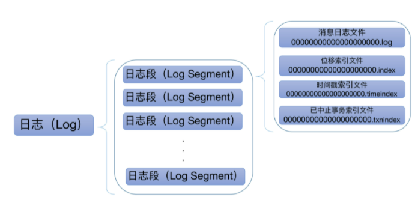

## 1. 概览

 

### 1.1. 日志结构	

​	一个 Kafka 主题有很多分区，每个分区就对应一个 Log 对象，在物理磁盘上则对应于一个子目录。

​	比如我们可以创建一个双分区的主题 test-topic，那么，Kafka 在磁盘上会创建两个子目录：test-topic-0 和 test-topic-1。每个子目录下存在多组日志段，也就是多组.log、.index、.timeindex 文件组合，只不过文件名不同，因为每个日志段的起始位移不同

### 1.2. 日志段结构

​	Kafka 日志对象由多个日志段对象组成，而每个日志段对象会在磁盘上创建一组文件：

* 消息日志文件（.log）

* 位移索引文件（.index）

* 时间戳索引文件（.timeindex）

* 已中止（Aborted）事务的索引文件（.txnindex）

  没有使用 Kafka 事务，已中止事务的索引文件是不会被创建

因此每个日志段由两个核心组件构成：日志、索引。每个日志段都有一个起始位移值（Base Offset），而该位移值是此日志段所有消息中最小的位移值，同时，该值却又比前面任何日志段中消息的位移值都大

## 2. 日志段分析

日志段源码位于 Kafka 的 core 工程下，具体文件位置是 core/src/main/scala/kafka/log/LogSegment.scala.如下为日志段类声明：

```
@nonthreadsafe
class LogSegment private[log] (val log: FileRecords,
                               val lazyOffsetIndex: LazyIndex[OffsetIndex],
                               val lazyTimeIndex: LazyIndex[TimeIndex],
                               val txnIndex: TransactionIndex,
                               val baseOffset: Long,
                               val indexIntervalBytes: Int,
                               val rollJitterMs: Long,
                               val time: Time) extends Logging
```

* FileRecords

  实际保存 Kafka 消息

* lazyOffsetIndex、lazyTimeIndex、txnIndex

  ​	分别对应于刚才所说的 3 个索引文件。不过，在实现方式上，前两种使用了延迟初始化的原理，降低了初始化时间成本

* baseOffset

  ​	在磁盘上看到的文件名就是 baseOffset 的值。每个 LogSegment 对象实例一旦被创建，它的起始位移就是固定的了，不能再被更改

* indexIntervalBytes

  控制了日志段对象新增索引项的频率，默认情况下，日志段至少新写入 4KB 的消息数据才会新增一条索引项

* rollJitterMs

  rollJitterMs 是日志段对象新增倒计时的“扰动值”。因为目前 Broker 端日志段新增倒计时是全局设置，这就是说，在未来的某个时刻可能同时创建多个日志段对象，这将极大地增加物理磁盘 I/O 压力。有了 rollJitterMs 值的干扰，每个新增日志段在创建时会彼此岔开一小段时间，这样可以缓解物理磁盘的 I/O 负载瓶颈

* time

  用于统计计时的一个实现类,在 Kafka 源码中普遍出现

### 2.1. append 方法

append 方法接收 4 个参数:

* 最大位移值
* 最大时间戳
* 最大时间戳对应消息的位移
* 真正要写入的消息集合

 

* **第一步：**

  在源码中，首先调用 log.sizeInBytes 方法判断该日志段是否为空，如果是空的话， Kafka 需要记录要写入消息集合的最大时间戳，并将其作为后面新增日志段倒计时的依据。

  ```
  val physicalPosition = log.sizeInBytes()
  if (physicalPosition == 0)
  rollingBasedTimestamp = Some(largestTimestamp)
  ```

* **第二步：**

  代码调用 ensureOffsetInRange 方法确保输入参数最大位移值是合法的

  标准就是看它与日志段起始位移的差值是否在整数范围内，即 largestOffset - baseOffset 的值是不是 介于 [0，Int.MAXVALUE] 之间。

  在极个别的情况下，这个差值可能会越界，这时， append 方法就会抛出异常，阻止后续的消息写入。一旦你碰到这个问题，你需要做的是升级你的 Kafka 版本，因为这是由已知的 Bug 导致的。

* **第三步：**

  append 方法调用 FileRecords 的 append 方法执行真正的写入。

  它的工作是将内存中的消息对象写入到操作系统的页缓存

* **第四步：**

  更新日志段的最大时间戳以及最大时间戳所属消息的位移值属性。

  每个日志段都要保存当前最大时间戳信息和所属消息的位移信息。

  Broker 端提供定期删除日志的功能, 判断的依据就是最大时间戳这个值；

  而最大时间戳对应的消息的位移值则用于时间戳索引项。

  **时间戳索引项保存时间戳与消息位移的对应关系**。

  Kafka 会更新并保存这组对应关系。

* **第五步：**

  更新索引项和写入的字节数了。

  日志段每写入 4KB 数据就要写入一个索引项。

  当已写入字节数超过了 4KB 之后，append 方法会调用索引对象的 append 方法新增索引项

  同时清空已写入字节数，以备下次重新累积计算

````
 def append(largestOffset: Long, largestTimestamp: Long, shallowOffsetOfMaxTimestamp: Long, records: MemoryRecords): Unit = {
    if (records.sizeInBytes > 0) {
      trace(s"Inserting ${records.sizeInBytes} bytes at end offset $largestOffset at position ${log.sizeInBytes} " +
            s"with largest timestamp $largestTimestamp at shallow offset $shallowOffsetOfMaxTimestamp")
      val physicalPosition = log.sizeInBytes()
      if (physicalPosition == 0)
        rollingBasedTimestamp = Some(largestTimestamp)

      ensureOffsetInRange(largestOffset)

      // append the messages
      val appendedBytes = log.append(records)
      trace(s"Appended $appendedBytes to ${log.file} at end offset $largestOffset")
      // Update the in memory max timestamp and corresponding offset.
      if (largestTimestamp > maxTimestampSoFar) {
        maxTimestampSoFar = largestTimestamp
        offsetOfMaxTimestampSoFar = shallowOffsetOfMaxTimestamp
      }
      // append an entry to the index (if needed)
      if (bytesSinceLastIndexEntry > indexIntervalBytes) {
        offsetIndex.append(largestOffset, physicalPosition)
        timeIndex.maybeAppend(maxTimestampSoFar, offsetOfMaxTimestampSoFar)
        bytesSinceLastIndexEntry = 0
      }
      bytesSinceLastIndexEntry += records.sizeInBytes
    }
  }
````

### 2.2. read方法

read 方法接收 4 个输入参数：

* startOffset：要读取的第一条消息的位移；

* maxSize：能读取的最大字节数；

* maxPosition ：能读到的最大文件位置；

* minOneMessage：是否允许在消息体过大时至少返回第一条消息

  参数为 true 时，即使出现消息体字节数超过了 maxSize 的情形，read 方法依然能返回至少一条消息。

该方法的逻辑：

* 查找索引确定读取的物理文件的位置

  调用 translateOffset 方法定位要读取的起始文件位置 （startPosition）。输入参数 startOffset 仅仅是位移值，Kafka 需要根据索引信息找到对应的物理文件位置才能开始读取消息。

* 计算读取的总字节数

  确定了读取起始位置，日志段代码需要根据这部分信息以及 maxSize 和 maxPosition 参数共同计算要读取的总字节数。举个例子，假设 maxSize=100，maxPosition=300，startPosition=250，那么 read 方法只能读取 50 字节，因为 maxPosition - startPosition = 50。我们把它和 maxSize 参数相比较，其中的最小值就是最终能够读取的总字节数

* 读取消息

  调用 FileRecords 的 slice 方法，从指定位置读取指定大小的消息集合

```
  def read(startOffset: Long,
           maxSize: Int,
           maxPosition: Long = size,
           minOneMessage: Boolean = false): FetchDataInfo = {
    if (maxSize < 0)
      throw new IllegalArgumentException(s"Invalid max size $maxSize for log read from segment $log")

    val startOffsetAndSize = translateOffset(startOffset)

    // if the start position is already off the end of the log, return null
    if (startOffsetAndSize == null)
      return null

    val startPosition = startOffsetAndSize.position
    val offsetMetadata = LogOffsetMetadata(startOffset, this.baseOffset, startPosition)

    val adjustedMaxSize =
      if (minOneMessage) math.max(maxSize, startOffsetAndSize.size)
      else maxSize

    // return a log segment but with zero size in the case below
    if (adjustedMaxSize == 0)
      return FetchDataInfo(offsetMetadata, MemoryRecords.EMPTY)

    // calculate the length of the message set to read based on whether or not they gave us a maxOffset
    val fetchSize: Int = min((maxPosition - startPosition).toInt, adjustedMaxSize)

    FetchDataInfo(offsetMetadata, log.slice(startPosition, fetchSize),
      firstEntryIncomplete = adjustedMaxSize < startOffsetAndSize.size)
  }
```

### 2.3. recover 方法

​	Broker 在启动时会从磁盘上加载所有日志段信息到内存中，并创建相应的 LogSegment 对象实例。在这个过程中，它需要执行一系列的操作。总的来说就是，读取日志段文件，然后重建索引文件。当我们的环境上有很多日志段文件，Broker 重启很慢，现在就知道了，这是因为 Kafka 在执行 recover 的过程中需要读取大量的磁盘文件。

 

* recover 开始时，代码依次调用索引对象的 reset 方法清空所有的索引文件

* 开始遍历日志段中的所有消息集合或消息批次（RecordBatch）

  对于读取到的每个消息集合，日志段必须要确保它们是合法的，这主要体现在两个方面：

  * 必须要符合 Kafka 定义的二进制格式；

  * 集合中最后一条消息的位移值不能越界，即它与日志段起始位移的差值必须是一个正整数值。

* 更新遍历过程中观测到的最大时间戳以及所属消息的位移值。这两个数据用于后续构建索引项。

  不断累加当前已读取的消息字节数，并根据该值有条件地写入索引项。

* 最后是更新事务型 Producer 的状态以及 Leader Epoch 缓存。

  这两个并不是理解 Kafka 日志结构所必需的组件，可以忽略它们。

* 遍历执行完成后，Kafka 会将日志段当前总字节数和刚刚累加的已读取字节数进行比较：
  * 如果发现前者比后者大，说明日志段写入了一些非法消息，需要执行截断操作，将日志段大小调整回合法的数值。
  *  Kafka 还必须相应地调整索引文件的大小。
* 日志段恢复的操作也就宣告结束了 

### 2.4. 小结

 

## 3. 日志

​	日志是日志段的容器，里面定义了很多管理日志段的操作。

 

### 3.1. 日志伴生对象

#### 3.1.1. LogAppendInfo

* LogAppendInfo（C）

  根据名字我们便可以知道，这个是保存了一组待写入消息的各种元数据信息。比如，这组消息中第一条消息的位移值是多少、最后一条消息的位移值是多少；再比如，这组消息中最大的消息时间戳又是多少

* LogAppendInfo（O）

  可以理解为其对应伴生类的工厂方法类，里面定义了一些工厂方法，用于创建特定的 LogAppendInfo 实例

#### 3.1.2. Log

* Log（C） 

  源码中最核心的代码

* Log（O）

  Log 伴生类的工厂方法，定义了很多常量以及一些辅助方法。

  这里定义了一些日志文件的类型

#### 3.1.3. RollParams

* RollParams（C）

  定义用于控制日志段是否切分（Roll）的数据结构。

* RollParams（O）

  RollParams 伴生类的工厂方法

#### 3.1.4. LogMetricNames

 Log 对象的监控指标

#### 3.1.5. LogMetricNames

定义了 Log 对象的监控指标

#### 3.1.6. LogOffsetSnapshot

封装分区所有位移元数据的容器类

#### 3.1.7. LogReadInfo

封装读取日志返回的数据及其元数据

#### 3.1.8. CompletedTxn

记录已完成事务的元数据，主要用于构建事务索引

### 3.2. log文件类型

Log的伴生对象定义了各种文件类型

```
object Log {
  val LogFileSuffix = ".log"
  val IndexFileSuffix = ".index"
  val TimeIndexFileSuffix = ".timeindex"
  val ProducerSnapshotFileSuffix = ".snapshot"
  val TxnIndexFileSuffix = ".txnindex"
  val DeletedFileSuffix = ".deleted"
  val CleanedFileSuffix = ".cleaned"
  val SwapFileSuffix = ".swap"
  val CleanShutdownFile = ".kafka_cleanshutdown"
  val DeleteDirSuffix = "-delete"
  val FutureDirSuffix = "-future"
……
}
```

* snapshot   

  Kafka 为幂等型或事务型 Producer 所做的快照文件

* .deleted 

  删除日志段操作创建的文件。目前删除日志段文件是异步操作，Broker 端把日志段文件从.log 后缀修改为.deleted 后缀

* .cleaned 、.swap

  Compaction 操作的产物 ，在Cleaner阶段发挥作用 

* -delete 则是应用于文件夹的。

  当你删除一个主题的时候，主题的分区文件夹会被加上这个后缀。

* -future 

  用于变更主题分区文件夹地址的，属于比较高阶的用法

### 3.3. log工具方法

log的伴生对象还提供了很多工具方法

* 通过给定的位移值计算出对应的日志段文件名:

  ```
  def filenamePrefixFromOffset(offset: Long): String = {
      val nf = NumberFormat.getInstance()
      nf.setMinimumIntegerDigits(20)
      nf.setMaximumFractionDigits(0)
      nf.setGroupingUsed(false)
      nf.format(offset)
    }
  ```

  Kafka 日志文件固定是 20 位的长度，filenamePrefixFromOffset 方法就是用前面补 0 的方式，把给定位移值扩充成一个固定 20 位长度的字符串，如我们给定一个位移值是 12345，那么 Broker 端磁盘上对应的日志段文件名就应该是 00000000000000012345.log

### 3.4. log的核心属性

* 类的定义

  ```
  class Log(@volatile var dir: File,
            @volatile var config: LogConfig,
            @volatile var logStartOffset: Long,
            @volatile var recoveryPoint: Long,
            scheduler: Scheduler,
            brokerTopicStats: BrokerTopicStats,
            val time: Time,
            val maxProducerIdExpirationMs: Int,
            val producerIdExpirationCheckIntervalMs: Int,
            val topicPartition: TopicPartition,
            val producerStateManager: ProducerStateManager,
            logDirFailureChannel: LogDirFailureChannel) extends Logging with KafkaMetricsGroup {
  ……
  }
  ```

  核心参数：

  * dir

    dir 就是这个日志所在的文件夹路径，也就是主题分区的路径

  * logStartOffset

    表示日志的当前最早位移。

  dir 和 logStartOffset 都是 volatile var 类型，表示它们的值是变动的，而且可能被多个线程更新

* kafka的位移概念

   

  *  Log End Offset（LEO）

    末端位移，表示日志下一条待插入消息的位移值

  * Log Start Offset 

    表示日志当前对外可见的最早一条消息的位移值，Log Start Offset 却不能简称为 LSO。因为在 Kafka 中，LSO 特指 Log Stable Offset

  * 高水位值

    区分已提交消息和未提交消息的分水岭

* nextOffsetMetadata

  该属性封装了下一条待插入消息的位移值，你基本上可以把这个属性和 LEO 等同起来

  ```
  @volatile private var nextOffsetMetadata: LogOffsetMetadata = _
  ```

* highWatermarkMetadata

  ```
  @volatile private var highWatermarkMetadata: LogOffsetMetadata = LogOffsetMetadata(logStartOffset)
  ```

​		分区日志高水位值。关于高水位的概念

* segments  

  ```
  private val segments: ConcurrentNavigableMap[java.lang.Long, LogSegment] = new ConcurrentSkipListMap[java.lang.Long, LogSegment]
  ```

   Log 类中最重要的属性。它保存了分区日志下所有的日志段信息，只不过是用 Map 的数据结构来保存的。Map 的 Key 值是日志段的起始位移值，Value 则是日志段对象本身。Kafka 源码使用 ConcurrentNavigableMap 数据结构来保存日志段对象，就可以很轻松地利用该类提供的线程安全和各种支持排序的方法，来管理所有日志段对象

*  Leader Epoch Cache  

  主要是用来判断出现 Failure 时是否执行日志截断操作（Truncation）。之前靠高水位来判断的机制，可能会造成副本间数据不一致的情形。这里的 Leader Epoch Cache 是一个缓存类数据，里面保存了分区 Leader 的 Epoch 值与对应位移值的映射关系

* 其它的不重要属性

  timer、scheduler大多是做辅助用的

#### 3.5.  log的初始化

```
 locally {
    val startMs = time.milliseconds

    // create the log directory if it doesn't exist
    Files.createDirectories(dir.toPath)

    initializeLeaderEpochCache()

    val nextOffset = loadSegments()

    /* Calculate the offset of the next message */
    nextOffsetMetadata = LogOffsetMetadata(nextOffset, activeSegment.baseOffset, activeSegment.size)

    leaderEpochCache.foreach(_.truncateFromEnd(nextOffsetMetadata.messageOffset))

    updateLogStartOffset(math.max(logStartOffset, segments.firstEntry.getValue.baseOffset))

    // The earliest leader epoch may not be flushed during a hard failure. Recover it here.
    leaderEpochCache.foreach(_.truncateFromStart(logStartOffset))

    // Any segment loading or recovery code must not use producerStateManager, so that we can build the full state here
    // from scratch.
    if (!producerStateManager.isEmpty)
      throw new IllegalStateException("Producer state must be empty during log initialization")
    loadProducerState(logEndOffset, reloadFromCleanShutdown = hasCleanShutdownFile)

    info(s"Completed load of log with ${segments.size} segments, log start offset $logStartOffset and " +
      s"log end offset $logEndOffset in ${time.milliseconds() - startMs} ms")
  }
```

* 创建分区日志路径

* 初始化leader epoch cache
  * 创建leader epoch cache检查点文件
  * 生成leader epoch cache对象
  
* 加载所有的日志段对象

  ```
    private def loadSegments(): Long = {
  
      val swapFiles = removeTempFilesAndCollectSwapFiles()
  
      retryOnOffsetOverflow {
        logSegments.foreach(_.close())
        segments.clear()
        loadSegmentFiles()
      }
  
      completeSwapOperations(swapFiles)
  
      if (!dir.getAbsolutePath.endsWith(Log.DeleteDirSuffix)) {
        val nextOffset = retryOnOffsetOverflow {
          recoverLog()
        }
  
        activeSegment.resizeIndexes(config.maxIndexSize)
        
        nextOffset
        
      } else {
         if (logSegments.isEmpty) {
            addSegment(LogSegment.open(dir = dir,
              baseOffset = 0,
              config,
              time = time,
              fileAlreadyExists = false,
              initFileSize = this.initFileSize,
              preallocate = false))
         }
        0
      }
    }
  ```

  这个会对分区日志路径遍历两次

  * 会移除上次 Failure 遗留下来的各种临时文件（包括.cleaned、.swap、.deleted 文件等）

    即调用removeTempFilesAndCollectSwapFiles 

    ```
      private def removeTempFilesAndCollectSwapFiles(): Set[File] = {
    	//在方法内部定义一个名为deleteIndicesIfExist的方法，用于删除日志文件对应的索引文件
        def deleteIndicesIfExist(baseFile: File, suffix: String = ""): Unit = {
          info(s"Deleting index files with suffix $suffix for baseFile $baseFile")
          val offset = offsetFromFile(baseFile)
          Files.deleteIfExists(Log.offsetIndexFile(dir, offset, suffix).toPath)
          Files.deleteIfExists(Log.timeIndexFile(dir, offset, suffix).toPath)
          Files.deleteIfExists(Log.transactionIndexFile(dir, offset, suffix).toPath)
        }
    
        val swapFiles = mutable.Set[File]()
        val cleanFiles = mutable.Set[File]()
        var minCleanedFileOffset = Long.MaxValue
    	//遍历分区日志路径下的所有文件
        for (file <- dir.listFiles if file.isFile) {
        //如果不可读，直接抛出IOException
          if (!file.canRead)
            throw new IOException(s"Could not read file $file")
          val filename = file.getName
          // 如果以.deleted结尾
          if (filename.endsWith(DeletedFileSuffix)) {
            debug(s"Deleting stray temporary file ${file.getAbsolutePath}")
             // 说明是上次Failure遗留下来的文件，直接删除
            Files.deleteIfExists(file.toPath)
            // 如果以.cleaned结尾
          } else if (filename.endsWith(CleanedFileSuffix)) {
            minCleanedFileOffset = Math.min(offsetFromFileName(filename), minCleanedFileOffset)
            cleanFiles += file
             // 如果以.swap结尾
          } else if (filename.endsWith(SwapFileSuffix)) {
            // we crashed in the middle of a swap operation, to recover:
            // if a log, delete the index files, complete the swap operation later
            // if an index just delete the index files, they will be rebuilt
            val baseFile = new File(CoreUtils.replaceSuffix(file.getPath, SwapFileSuffix, ""))
            info(s"Found file ${file.getAbsolutePath} from interrupted swap operation.")
             // 如果该.swap文件原来是索引文件
            if (isIndexFile(baseFile)) {
             // 删除原来的索引文件
              deleteIndicesIfExist(baseFile)
             // 如果该.swap文件原来是日志文件
            } else if (isLogFile(baseFile)) {
            // 删除掉原来的索引文件
              deleteIndicesIfExist(baseFile)
              // 加入待恢复的.swap文件集合中
              swapFiles += file
            }
          }
        }
    
    	//从待恢复swap集合中找出那些起始位移值大于minCleanedFileOffset值的文件，直接删掉这些无效的.swap
        val (invalidSwapFiles, validSwapFiles) = swapFiles.partition(file => offsetFromFile(file) >= minCleanedFileOffset)
        invalidSwapFiles.foreach { file =>
          debug(s"Deleting invalid swap file ${file.getAbsoluteFile} minCleanedFileOffset: $minCleanedFileOffset")
          val baseFile = new File(CoreUtils.replaceSuffix(file.getPath, SwapFileSuffix, ""))
          deleteIndicesIfExist(baseFile, SwapFileSuffix)
          Files.deleteIfExists(file.toPath)
        }
    
         // 清除所有待删除文件集合中的文件
        cleanFiles.foreach { file =>
          debug(s"Deleting stray .clean file ${file.getAbsolutePath}")
          Files.deleteIfExists(file.toPath)
        }
        // 最后返回当前有效的.swap文件集合
        validSwapFiles
      }
    ```

    不管是否要过滤出符合条件的oldSegments，恢复之后都要进行替换，这是升级Broker版本而做的防御性编程。在老的版本中，代码写入消息后并不会对位移值进行校验。因此log cleaner老代码可能写入一个非常大的位移值（大于Int.MAX_VALUE）。当broker升级后，这些日志段就不能正常被compact了，因为位移值越界了（新版本加入了位移校验）

    代码需要去搜寻在swap start offset和swap LEO之间的所有日志段对象，但这还不够，还要保证这些日志段的LEO比swap的base offset大才行，否则会有问题

  * 清空所有日志段对象，并且再次遍历分区路径，重建日志段 segments Map 以及索引文件，调用的是loadSegmentFiles

    ```
     private def loadSegmentFiles(): Unit = {
        //按照日志段文件名中的位移值正序排列，然后遍历每个文件
        for (file <- dir.listFiles.sortBy(_.getName) if file.isFile) {
        //如果是索引文件
          if (isIndexFile(file)) {
            // if it is an index file, make sure it has a corresponding .log file
            val offset = offsetFromFile(file)
            val logFile = Log.logFile(dir, offset)
            // 确保存在对应的日志文件，否则记录一个警告，并删除该索引文件
            if (!logFile.exists) {
              warn(s"Found an orphaned index file ${file.getAbsolutePath}, with no corresponding log file.")
              Files.deleteIfExists(file.toPath)
            }
            // 如果是日志文件
          } else if (isLogFile(file)) {
            // if it's a log file, load the corresponding log segment
            val baseOffset = offsetFromFile(file)
            val timeIndexFileNewlyCreated = !Log.timeIndexFile(dir, baseOffset).exists()
            // 创建对应的LogSegment对象实例，并加入segments中
            val segment = LogSegment.open(dir = dir,
              baseOffset = baseOffset,
              config,
              time = time,
              fileAlreadyExists = true)
    
            try segment.sanityCheck(timeIndexFileNewlyCreated)
            catch {
              case _: NoSuchFileException =>
                error(s"Could not find offset index file corresponding to log file ${segment.log.file.getAbsolutePath}, " +
                  "recovering segment and rebuilding index files...")
                recoverSegment(segment)
              case e: CorruptIndexException =>
                warn(s"Found a corrupted index file corresponding to log file ${segment.log.file.getAbsolutePath} due " +
                  s"to ${e.getMessage}}, recovering segment and rebuilding index files...")
                recoverSegment(segment)
            }
            addSegment(segment)
          }
        }
      }
    ```

    

  * 会完成未完成的 swap 操作，即调用 completeSwapOperations 方法。等这些都做完之后，再调用 recoverLog 方法恢复日志段对象，然后返回恢复之后的分区日志 LEO 值

    ```
     private def completeSwapOperations(swapFiles: Set[File]): Unit = {
        //遍历所有有效.swap文件
        for (swapFile <- swapFiles) {
          val logFile = new File(CoreUtils.replaceSuffix(swapFile.getPath, SwapFileSuffix, ""))
          // 拿到日志文件的起始位移值
          val baseOffset = offsetFromFile(logFile)
           // 创建对应的LogSegment实例
          val swapSegment = LogSegment.open(swapFile.getParentFile,
            baseOffset = baseOffset,
            config,
            time = time,
            fileSuffix = SwapFileSuffix)
          info(s"Found log file ${swapFile.getPath} from interrupted swap operation, repairing.")
           // 执行日志段恢复操作
          recoverSegment(swapSegment)
    
          // We create swap files for two cases:
          // (1) Log cleaning where multiple segments are merged into one, and
          // (2) Log splitting where one segment is split into multiple.
          //
          // Both of these mean that the resultant swap segments be composed of the original set, i.e. the swap segment
          // must fall within the range of existing segment(s). If we cannot find such a segment, it means the deletion
          // of that segment was successful. In such an event, we should simply rename the .swap to .log without having to
          // do a replace with an existing segment.
          // 确认之前删除日志段是否成功，是否还存在老的日志段文件
          val oldSegments = logSegments(swapSegment.baseOffset, swapSegment.readNextOffset).filter { segment =>
            segment.readNextOffset > swapSegment.baseOffset
          }
           // 如果存在，直接把.swap文件重命名成.log
          replaceSegments(Seq(swapSegment), oldSegments.toSeq, isRecoveredSwapFile = true)
        }
      }
    ```

    * recoverLog操作

      ```
        private def recoverLog(): Long = {
          // if we have the clean shutdown marker, skip recovery
          //如果不存在以.kafka_cleanshutdown结尾的文件。通常都不存在
          if (!hasCleanShutdownFile) {
          //获取到上次恢复点以外的所有unflushed日志段对象
            // okay we need to actually recover this log
            val unflushed = logSegments(this.recoveryPoint, Long.MaxValue).iterator
            var truncated = false
      	  //遍历这些unflushed日志段
            while (unflushed.hasNext && !truncated) {
              val segment = unflushed.next
              info(s"Recovering unflushed segment ${segment.baseOffset}")
              val truncatedBytes =
                try {
                //执行恢复日志段操作
                  recoverSegment(segment, leaderEpochCache)
                } catch {
                  case _: InvalidOffsetException =>
                    val startOffset = segment.baseOffset
                    warn("Found invalid offset during recovery. Deleting the corrupt segment and " +
                      s"creating an empty one with starting offset $startOffset")
                    segment.truncateTo(startOffset)
                }
                //如果有无效的消息导致被截断的字节数不为0，直接删除剩余的
              if (truncatedBytes > 0) {
                // we had an invalid message, delete all remaining log
                warn(s"Corruption found in segment ${segment.baseOffset}, truncating to offset ${segment.readNextOffset}")
                removeAndDeleteSegments(unflushed.toList, asyncDelete = true)
                truncated = true
              }
            }
          }
      	//这些都做完之后，如果日志段集合不为空
          if (logSegments.nonEmpty) {
            val logEndOffset = activeSegment.readNextOffset
            //验证分区日志的LEO值不能小于Log Start Offeset
            if (logEndOffset < logStartOffset) {
              warn(s"Deleting all segments because logEndOffset ($logEndOffset) is smaller than logStartOffset ($logStartOffset). " +
                "This could happen if segment files were deleted from the file system.")
              removeAndDeleteSegments(logSegments, asyncDelete = true)
            }
          }
      	//这些都做完之后，如果日志段集合为空了
          if (logSegments.isEmpty) {
            // no existing segments, create a new mutable segment beginning at logStartOffset
            //至少创建一个新的日志段，以logStartOffset为日志段的起始位移，并加入日志段集合中
            addSegment(LogSegment.open(dir = dir,
              baseOffset = logStartOffset,
              config,
              time = time,
              fileAlreadyExists = false,
              initFileSize = this.initFileSize,
              preallocate = config.preallocate))
          }
      	//更新上次恢复点属性，并返回
          recoveryPoint = activeSegment.readNextOffset
          recoveryPoint
        }
      ```

      验证分区日志的LEO值不能小于Log Start Offset值，否则删除这些日志段对象的原因主要是当底层日志文件被删除或损坏的话就可能出现这种情况，因为无法读取文件去获取LEO了

* 更新nextoffsetmetadata和logstartoffset

* 更新leader epoch cache。清理无效数据

总的来说，一个Log 对象 就相当与 一个日志分区文件夹, 可以用以下的逻辑流程图来展示

 

