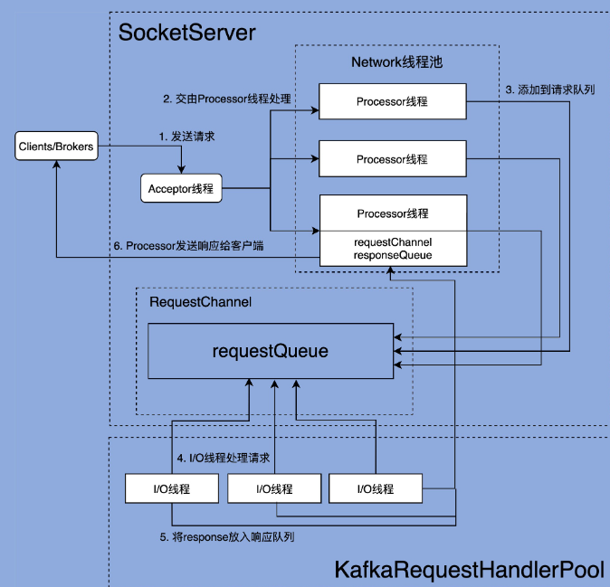

## 1. 开头

## 2. 请求通道

​	当我们说到 Kafka 服务器端，也就是 Broker 的时候，往往会说它承担着消息持久化的功能，但本质上，它其实就是**一个不断接收外部请求、处理请求，然后发送处理结果的 Java 进程**。

​	Broker 不是用 Scala 语言编写的，Scala 代码被编译之后生成.class 文件，它和 Java 代码被编译后的效果是一样的，因此，Broker 启动后也仍然是一个普通的 Java 进程。

​	**高效地保存排队中的请求，是确保 Broker 高处理性能的关键**。既然这样，那你一定很想知道，Broker 上的请求队列是怎么实现的呢？接下来，我们就一起看下 **Broker 底层请求对象的建模**和**请求队列的实现原理**，以及 Broker**请求处理方面的核心监控指标**。

​	Broker 与 Clients 进行交互主要是基于Request/Response 机制

## 3. 网络通讯

kafka的网络通讯是基于 Reactor 模式的。

 

Kafka 网络通信组件主要由两大部分构成：**SocketServer** 和 **KafkaRequestHandlerPool**。

**SocketServer 组件是核心**，主要实现了 Reactor 模式，用于处理外部多个 Clients（这里的 Clients 指的是广义的 Clients，可能包含 Producer、Consumer 或其他 Broker）的并发请求，并负责将处理结果封装进 Response 中，返还给 Clients。

**KafkaRequestHandlerPool 组件就是我们常说的 I/O 线程池**，里面定义了若干个 I/O 线程，用于执行真实的请求处理逻辑。

### 3.1. **Acceptor**

### 3.2. **Processor**

### 3.3. **Processor**

### 3.4. Data plane 和 Control plane

### 3.5. KafkaRequestHandler

### 3.6. KafkaRequestHandlerPool

### 3.7. 整体流程

KafkaRequestHandler：I/O 线程，负责处理 Processor 线程下发的 Request 对象。

KafkaRequestHandlerPool：创建和管理一组 KafkaRequestHandler 线程。

请求处理流程：总共分为 6 步。

* Clients 或其他 Broker 通过 Selector 机制发起创建连接请求。

* Processor 线程接收请求，并将其转换成可处理的 Request 对象。

* Processor 线程将 Request 对象放入 Request 队列。

* KafkaRequestHandler 线程从 Request 队列中取出待处理请求，并进行处理。

* KafkaRequestHandler 线程将 Response 放回到对应 Processor 线程的 Response 队列。

* Processor 线程发送 Response 给 Request 发送方。

 epoll空轮询bug，kafka并没有解决