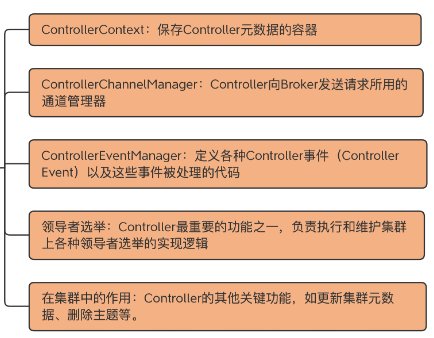
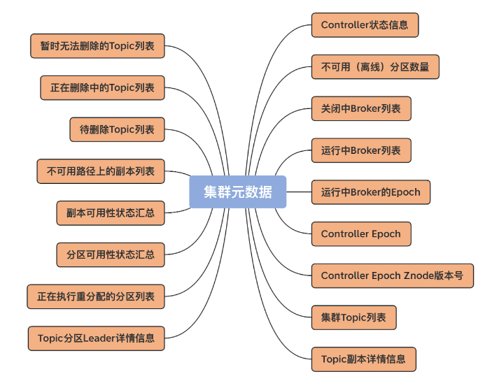
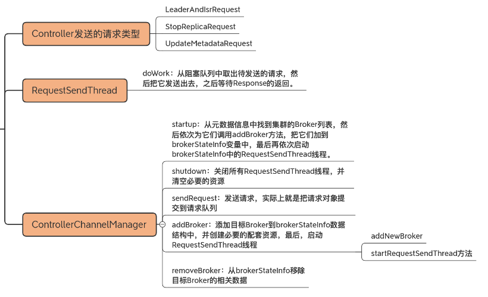

## 1. 开头

控制器的作用如下

 

## 2. Controller元数据

 

```
class ControllerContext {
  val stats = new ControllerStats // Controller统计信息类 
  var offlinePartitionCount = 0   // 离线分区计数器
  val shuttingDownBrokerIds = mutable.Set.empty[Int]  // 关闭中Broker的Id列表
  private val liveBrokers = mutable.Set.empty[Broker] // 当前运行中Broker对象列表
  private val liveBrokerEpochs = mutable.Map.empty[Int, Long]   // 运行中Broker Epoch列表
  var epoch: Int = KafkaController.InitialControllerEpoch   // Controller当前Epoch值
  var epochZkVersion: Int = KafkaController.InitialControllerEpochZkVersion  // Controller对应ZooKeeper节点的Epoch值
  val allTopics = mutable.Set.empty[String]  // 集群主题列表
  val partitionAssignments = mutable.Map.empty[String, mutable.Map[Int, ReplicaAssignment]]  // 主题分区的副本列表
  val partitionLeadershipInfo = mutable.Map.empty[TopicPartition, LeaderIsrAndControllerEpoch]  // 主题分区的Leader/ISR副本信息
  val partitionsBeingReassigned = mutable.Set.empty[TopicPartition]  // 正处于副本重分配过程的主题分区列表
  val partitionStates = mutable.Map.empty[TopicPartition, PartitionState] // 主题分区状态列表 
  val replicaStates = mutable.Map.empty[PartitionAndReplica, ReplicaState]  // 主题分区的副本状态列表
  val replicasOnOfflineDirs = mutable.Map.empty[Int, Set[TopicPartition]]  // 不可用磁盘路径上的副本列表
  val topicsToBeDeleted = mutable.Set.empty[String]  // 待删除主题列表
  val topicsWithDeletionStarted = mutable.Set.empty[String]  // 已开启删除的主题列表
  val topicsIneligibleForDeletion = mutable.Set.empty[String]  // 暂时无法执行删除的主题列表
  ......
}
```

## 3. ControllerChannelManager 

controller 主要通过 ControllerChannelManager 类来实现与其他 Broker 之间的请求发送。其中，ControllerChannelManager 类中定义的 RequestSendThread 是主要的线程实现类，用于实际发送请求给集群 Broker。除了 RequestSendThread 之外，ControllerChannelManager 还定义了相应的管理方法，如添加 Broker、移除 Broker 等。通过这些管理方法，Controller 在集群扩缩容时能够快速地响应到这些变化，完成对应 Broker 连接的创建与销毁。

 

## 4. ControllerEventManager

### ControllerEventProcessor

### ControllerEvent

### ControllerEventManager

**ControllerEventManager Object**：保存一些字符串常量，比如线程名字。

**ControllerEventProcessor**：前面讲过的事件处理器接口，目前只有 KafkaController 实现了这个接口。

**QueuedEvent**：表征事件队列上的事件对象。

**ControllerEventManager Class**：ControllerEventManager 的伴生类，主要用于创建和管理事件处理线程和事件队列

## 5. Controller选举

Controller 依赖 ZooKeeper 实现 Controller 选举，主要是借助于 /controller 临时节点和 ZooKeeper 的监听器机制。

Controller 触发场景有 3 种：集群启动时；/controller 节点被删除时；/controller 节点数据变更时。

源码最终调用 elect 方法实现 Controller 选举

## 6. Controller主体功能

 Controller 的两个主要功能：管理集群 Broker 成员和主题。这两个功能是 Controller 端提供的重要服务。

* 集群成员管理

  controller 负责对集群所有成员进行有效管理，包括自动发现新增 Broker、自动处理下线 Broker，以及及时响应 Broker 数据的变更

* 主题管理

  controller 负责对集群上的所有主题进行高效管理，包括创建主题、变更主题以及删除主题，等等。对于删除主题而言，实际的删除操作由底层的 TopicDeletionManager 完成。

### 6.1. 集群管理

集群broker变更

### 6.2. 主题管理

主题的增删改查


## 7. 总结