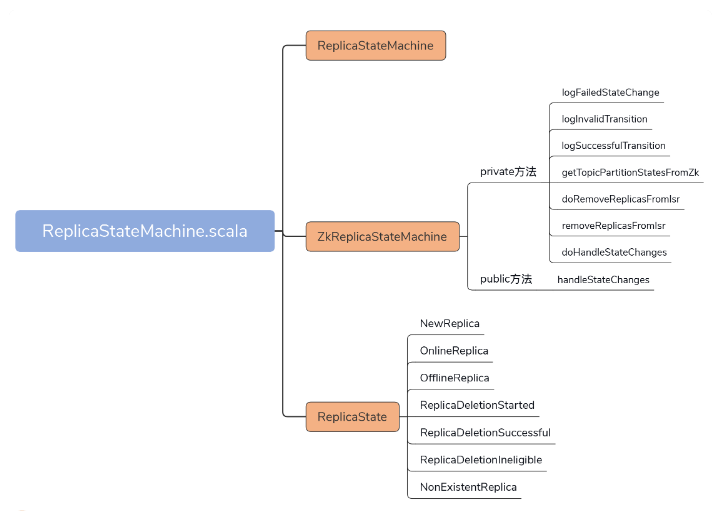
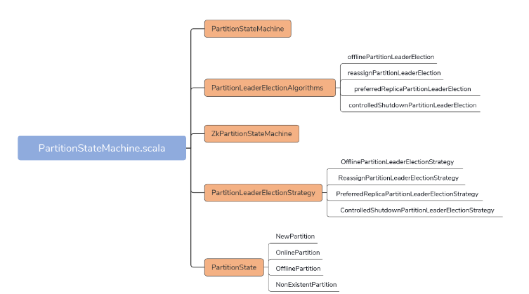

## 1. 开头

很多核心功能都用到了状态机，如：

* 主题删除状态管理
* 副本状态管理
* 分区状态管理

​	kafka 源码中有很多状态机和管理器，比如之前我们学过的 Controller 通道管理器 ControllerChannelManager、处理 Controller 事件的 ControllerEventManager，等等。这些管理器和状态机，大多与各自的“宿主”组件关系密切，可以说是大小不同、功能各异。就比如 Controller 的这两个管理器，必须要与 Controller 组件紧耦合在一起才能实现各自的功能。

不过，Kafka 中还是有一些状态机和管理器具有相对独立的功能框架，不严重依赖使用方，也就是我在这个模块为你精选的 TopicDeletionManager（主题删除管理器）、ReplicaStateMachine（副本状态机）和 PartitionStateMachine（分区状态机）。

TopicDeletionManager：负责对指定 Kafka 主题执行删除操作，清除待删除主题在集群上的各类“痕迹”。

ReplicaStateMachine：负责定义 Kafka 副本状态、合法的状态转换，以及管理状态之间的转换。

PartitionStateMachine：负责定义 Kafka 分区状态、合法的状态转换，以及管理状态之间的转换。

无论是主题、分区，还是副本，它们在 Kafka 中的生命周期通常都有多个状态。而这 3 个状态机，就是来管理这些状态的。而如何实现正确、高效的管理，就是源码要解决的核心问题

## 2. TopicDeletionManager

在主题删除过程中，Kafka 会调整集群中三个地方的数据：ZooKeeper、元数据缓存和磁盘日志文件。

删除主题时，ZooKeeper 上与该主题相关的所有 ZNode 节点必须被清除；

Controller 端元数据缓存中的相关项，也必须要被处理，并且要被同步到集群的其他 Broker 上；

而磁盘日志文件，更是要清理的首要目标。

这三个地方必须要统一处理，就好似我们常说的原子性操作一样。现在回想下开篇提到的那个“秘籍”，你就会发现它缺少了非常重要的一环，那就是：**无法清除 Controller 端的元数据缓存项**。因此，你要尽力避免使用这个“大招”。

DeletionClient 接口的作用，主要是操作 ZooKeeper，实现 ZooKeeper 节点的删除等操作。

TopicDeletionManager，是在 KafkaController 创建过程中被初始化的，主要通过与元数据缓存进行交互的方式，来更新各类数据

```

class TopicDeletionManager(
  // KafkaConfig类，保存Broker端参数
  config: KafkaConfig, 
  // 集群元数据
  controllerContext: ControllerContext,
  // 副本状态机，用于设置副本状态
  replicaStateMachine: ReplicaStateMachine,
  // 分区状态机，用于设置分区状态
  partitionStateMachine: PartitionStateMachine,
  // DeletionClient接口，实现主题删除
  client: DeletionClient) extends Logging {
  this.logIdent = s"[Topic Deletion Manager ${config.brokerId}] "
  // 是否允许删除主题
  val isDeleteTopicEnabled: Boolean = config.deleteTopicEnable
  ......
}
```

### 2.1. resumeDeletions 

## 3. ReplicaStateMachine

 

​	副本状态机：ReplicaStateMachine 是 Kafka Broker 端源码中控制副本状态流转的实现类。每个 Broker 启动时都会创建 ReplicaStateMachine 实例，但只有 Controller 组件所在的 Broker 才会启动它。

​	副本状态：当前，Kafka 定义了 7 类副本状态。同时，它还规定了每类状态合法的前置状态。

​	handleStateChanges：用于执行状态转换的核心方法。底层调用 doHandleStateChanges 方法，以 7 路 case 分支的形式穷举每类状态的转换逻辑。

​	关于doHandleStateChanges 方法中最后一路分支的代码，NonExistentReplica 分支，会更新controllerContext中当前currentAssignedReplicas的副本AR集合，纪录成功状态转换，之后删除这个副本。这里说的状态转换成功只是内存缓存更新成功，zookeeper还未成功的，有延时。NonExistentReplica 分支，会更新controllerContext中当前currentAssignedReplicas的副本AR集合，纪录成功状态转换，之后删除这个副本。这里说的状态转换成功只是内存缓存更新成功，zookeeper还未成功的，有延时

## 4. PartitionStateMachine

 

Kafka 目前提供 4 种 Leader 选举策略，分别是分区下线后的 Leader 选举、分区执行副本重分配时的 Leader 选举、分区执行 Preferred 副本 Leader 选举，以及 Broker 下线时的分区 Leader 选举。

这 4 类选举策略在选择 Leader 这件事情上有着类似的逻辑，那就是，它们几乎都是选择当前副本有序集合中的、首个处于 ISR 集合中的存活副本作为新的 Leader。当然，个别选举策略可能会有细小的差别，你可以结合我们今天学到的源码，课下再深入地研究一下每一类策略的源码。

我们来回顾下这节课的重点。

PartitionStateMachine 是 Kafka Controller 端定义的分区状态机，负责定义、维护和管理合法的分区状态转换。

每个 Broker 启动时都会实例化一个分区状态机对象，但只有 Controller 所在的 Broker 才会启动它。

Kafka 分区有 4 类状态，分别是 NewPartition、OnlinePartition、OfflinePartition 和 NonExistentPartition。其中 OnlinPartition 是分区正常工作时的状态。NewPartition 是未初始化状态，处于该状态下的分区尚不具备选举 Leader 的资格。

Leader 选举有 4 类场景，分别是 Offline、Reassign、Preferrer Leader Election 和 ControlledShutdown。每类场景都对应于一种特定的 Leader 选举策略。

handleStateChanges 方法是主要的入口方法，下面调用 doHandleStateChanges 私有方法实现实际的 Leader 选举功能。