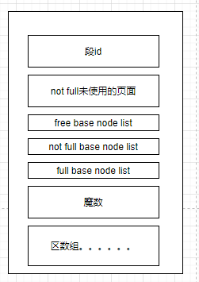
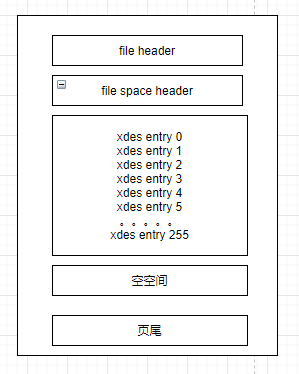
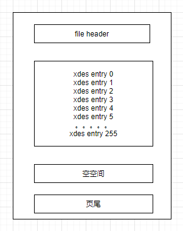
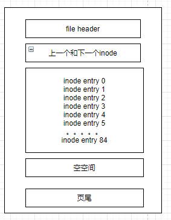

## 1. 概要

&emsp;&emsp;Inodb的表空间是由众多的页组成，而页有很多种类型，它们有不同的用途，后面会陆续介绍它们的用途。如果mysql设置为独立表空间，那么存储数据对应的表空间就是一个表名.ibd文件，当我们查询和插入数据的时候都是对这个文件进行操作。为了提升查询效率，mysql将数据在这个文件中组成了b+树，数据都会被添加到这颗树上；同时，如何高效的为表空间分配磁盘空间，如果更加的方便管理这些存储空间，设计者们做了很多相关的工作。

## 2. 页的结构

&emsp;&emsp;一个页大小16kb，页有很多类型，比如数据页、表空间信息头部页、段信息节点页等等。它们有通用的结构，比如页头和页尾，校验和主要是为了校验整个页的数据是否有损坏，上一页和下一页主要是为了数据页组成b+树使用的。
## 3. 独立表空间
Mysql5.6.6以前，系统默认会将数据存储到系统表空间，在以后的版本默认存储独立的表空间，即创建一个表名.ibd的文件。  

### 3.1. 区的基本概览  
&emsp;&emsp;Mysql的页太多，我们把64个连续的页归成一个区。独立表空间和系统表空间都是一样的，都是以区为单位进行管理的。  

### 3.2. 组
按照区的数量，每256个区分为一个组，每个组的开头几页的类型有所不同。
第一组（0-255）：

* fsp_hdr，表空间的整体属性，本组的所有区的属性，段的信息，后面会解释这个类型的具体作用。
* ibuf_bitmap，本组的所有页的insert buffer信息

* inode，存储了inode的数据结构，这个后面会解释这个类型的作用，存放段的信息，其中会有三种xdes entry的链表指针  

第二组（256-511，及以后）：

* xdes，本组的256个区的属性
* ibuf_bitmap，本组的所有页的insert buffer信息

### 3.3. 段
&emsp;&emsp;如果以页为单位扩增容量，会导致连接索引页之间的双向链表很疏远，查询的时候随机io过多，性能下降。所以尽可能的将数据页双向链表物理挨在一块，我们知道叶子节点存放数据，非叶子节点存放id，最好的情况就是分开来存，于是就有了存放叶子节点的区，和非叶子节点的区。这两部分的区都称作段。因此可以知道一个索引在mysql中至少包含两个段，那么一个表就至少包含两个段，因为系统会默认给表创建一个聚簇索引。  
&emsp;&emsp;如果一个小表每增加一个索引，就有两个段，而一个区就有1m（16x64kb）多，那会造成很大的空间浪费，所以设计者提出了碎片的概念，一个区中的页可以被多个段来使用，这个区被称为碎片区，最开始段的数据都是从碎片区拿的，当超过了32个页后，才会以完整的区为单位分配空间。  
&emsp;&emsp;因此段的构成有两部分，一些区的集合，再加上最开始的一些碎片页构成。在innodb的存储结构中，除了叶子段、非叶子段，还有一些其它特殊用途的段，比如回滚段等等，这里就不再展开了，如果需要了解请查有关资料。
### 3.4. 区的分类
Mysql的区按照它的使用情况可以进行分类，它也被称为区的状态，一共有四种如下展示  

| 状态      | 描述                             |
| --------- | -------------------------------- |
| Free      | 空闲的区，属于表空间             |
| Free_frag | 有剩余空间的碎片区，属于表空间   |
| Full_frag | 没有剩余空间的碎片区，属于表空间 |
| fseg      | 属于某段的区                     |

如何管理这些不同类型的区呢？

Mysql是通过xdes entry（Extent Descriptor Entry）这个东西来管理区的，一个区就对应一个这样的entry。

 

如图所示一个xdes entry有四个重要属性：

* 段id，区所属的段的id，如果是free状态则没有这个值。
* Node list，将多个entry组成一个链表
* Xdes的类型，见上一个表格，一共四种类型
* Bitmap，一共16字节，128bit，因为一个区有64页，那么就是两个比特来描述每一个页是否使用，这里冗余了一个bit没有用。

这些xdex entry是如何使用的呢？
	上面提到了很多概念，一切的作用就是为了高效的插入记录而且也不造成空间的浪费。我们已经知道叶子段和非叶子段是分开存储的，

那么新增一条数据的时候，这些结构发生了什么呢？
	这里分为两种情况：

* 最开始段的数据量少的时候，先去表空间查找free_frag的区，如果有就使用，没有就申请一个区作为free_frag，其它段的数据都可以使用同一个free_frag的页，当free_frag的页用完了，则就将其修改为full_frag。
  注意：我们如何去查找free_frag呢,就可以使用xdes entry中的node list属性指针遍历下一个就行了。根据三种状态分了三种链表，即free链表、free_frag链表、full_frag链表。按需查找对应的链表即可，这个链表的信息存储在表空间属性那里。
* 当段中的页的数量超过32个来自frag区的页时，就直接申请完整的区来填充数据了。
  注意：这里不能将fseg的区直接组成链表，因为这种类型的区是不能共享给其它的段的，这里xdes entry的段号就起作用了，设计者为每个段建立了三个链表
  * Free链表，所有的页都是空的的区的xdes entry放在这个链表
  * Not_free链表，有部分的页是空的区的xdes entry
  * Full链表，所有的xdes entry的页都满了

​	所以，如果一个表有3个自定义的索引，那么加上聚簇索引（默认的），一共会有8个段，每个段有三个链表，一共就有24个链表。当插入数据的时候，先从not_free链表找页，插入数据，如果都满了，会放到full链表中，为该段新申请的区会放到free链表中。这样就很方便的管理存储空间。

​	段维护着这些链表，需要有个查找的入口，mysql设计了一个 base list node的结构来指向xdes entry链表的头和尾，这个结构放在一个方便存取的位置就可以了，存在哪里可以见下文的Inode Entry之中，即存在inode之中。

 

### 3.5. Inode Entry
​	上面我们知道，区可以用一个xdes entry来表示，然后可以让他们组成链表可以进行方便的维护和查找，而表中有很多段该如何管理呢，mysql定义Inode Entry来描述段的结构，如何所示：  

 

* 段id，段的编号
* Not full未使用的页数，上文说过，一个段维护这个not full 的xdes entry链表，为了快速查找有多少个未使用的页，不需要每次都去遍历整个链表
* 3个base node list，存储了上文中的base链表
* 魔数。固定的，有这个值就代表已经初始化
* Fragment区的数组，段会有一些零散的页，这个数组表示的就是所有的零散页的页号。

### 3.6.页类型重新分析
#### 3.6.1.fsp_hdr
​	上面介绍了xdes entry、inode entry、段、区等概念，它们是存在什么地方呢？
我们知道64个页组成了一个区，我们根据数量将0到255的区划分为第一组，而第一组中第一个页面它的页号为0，类型为fsp_hdr，最开始也说到，它存储了表空间的整体属性和该组的所有的xdes entry结构。  

  

如何所示，为第一组第0页的fsp_hdr结构

* 页头，页通用的头部
* 表空间头部，表空间的整体信息，这个很重要，其中包括
  * 表空间id
  * 表空间一共使用的页数
  * 尚未初始化的最小页号，大于该页号的页表示所在的区没有加入free链表，申请的区可能有部分没有初始化，先不加入到free链表，等需要的时候再加入，这个最小页号就完成这个优化一个标记。
  * Free_frag链表使用的页数量
  * Free、free_frag、full_freg链表的base list基点
  * 下一个未使用的段id，如果需要新段，那么就用这个字段的id作为下一个新段的id
  * 一些全局的布尔属性值，比如是否加密、是否为临时表、是否共享等等
  * Base Seg full list 和 base seg free list，段对应inode entry会放在inode类型的页中，一个页可能放不下，组成一个链表。那么放满inode entry的页放在Base Seg full list，没放满的放在base seg free list中。这个inode类型的页是什么样的呢，后面会再做分析。
* Xdes列，存储了该组所有的区的xdes entry列表
* 页尾，通用的尾部信息

#### 3.6.2. Xdes类型

​	每个区都有一个xdes entry，如果一个页来放xdes entry，如果区太多那么就放不下了，所以将多个区按照数量分组，每组的开头记录了该区的xdes entry记录，因为第一组特殊，需要记录表空间的整体信息，所以有了fsp_hdr类型的页。对于后面组的xdes entry使用该组的xdes类型页来记录记录。如图所示，xdes类型的页：

  

与fsp hdr类型相比，少了file space header

#### 3.6.3.Ibuf bitmap类型

​	主要用于跟踪该组的每个page的change buffer信息，Change buffer的主要目的是将对二级索引的数据操作缓存下来，以此减少二级索引的随机IO，并达到操作合并的效果，这个change buffer比较复杂，后续的文章再做分析。

#### 3.6.4.Inode类型

inode类型的页就是为了存储inode entry结构而存在的 

如何所示：

 

* header、trailer、空空间就不解释了
* Inode部分记录了段inode的列表
* 上一个和下一个node，如果一个页不够用，将多个页组合来表示inode列表，这里和file space header关联起来，形成了SEG_INODES_FULL链表、SEG_INODES_FREE链表

#### 3.6.5. Segment header类型

叶子节点和非叶子节点都有一个根节点，根节点所在页中保存了叶子段和非叶子段的信息，其中包括：

* inode所在表空间id
* Inode entry所在的页
* Inode entry 结构在所在页的偏移量。
  通过根节点就可以方便找到段信息了。

## 4. 总结

* 独立表空间会创建一个表名.ibd文件来存储数据
* Innodb存储是以页为单位的，页有不同的类型，索引页存储数据，fsp_hdr存储表空间全局数据、xdes类型专门存储xdes结构列表、inode存储段信息等
* 64个页构成区，区有不同的类型，fseg类型的区属于某个段
* 一个索引有两个段，叶子节点段和非叶子节点段，一个段填充数据时，先从碎片区获取空间，当达到了32个页后，才以完整的区来获取空间，所以一个inode结构包含：碎片页号和3大xdes链表（free、notfree、full）的基点
* 一个xdes结构包含：段id、指向上一个和下个xdes的指针、区内64个页使用情况数组  

 

