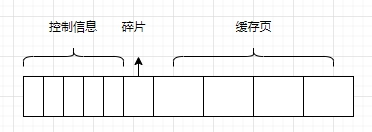

## 1. 概要

​	我们知道mysql基本的存储单位是页，页中有多条行记录，也有不同类型的页，即使我们访问某个页中的一条数据时，也会把所属页的数据都加载到内存之中。这样后续的读取就不用到表空间io读取数据了。Mysql的缓存部分就是bufferpool。

## 2. Buffer Pool

### 2.1. 什么是buffer pool?

​	Mysql启动时会从内存申请一块连续的内存作为缓冲区，默认128m，缓冲区是用来缓存页的，一个缓存页的大小和表空间的页的大小一致16kb

  

如图所示，向操作系统申请的缓存区结构如下，每一个缓存页都会对应一个控制信息单元，相当于缓存页的元信息。碎片是缓存页大小设置不合理导致一部分空间没有被利用到。真实的缓存区大小会比缓存页大5%左右

### 2.2. 缓存页的管理

​	最开始的时候缓存页都是空的，后面会陆续填充磁盘的数据页，于是可以把空的控制块组成一个链表，叫做free链表，来方便进行管理。当然这个链表有个基节点，这个节点不属于缓存区，只占40字节。

  

### 2.3. 缓存页查找

​	通过表空间号+页号确定一个key。放在hash表中，来了一个key，先判断它在不在缓存页中，不在的话从磁盘页读取，在的话从缓存区查找。控制信息就是存的是表空间id，页号，以及缓存页地址。

### 2.4. 缓存页修改

​	当某一个缓存页发生修改，mysql并不会立即同步更新到磁盘页之中，因为会非常损耗性能，会先更新缓存页，后续再更新， 已更新的缓存页叫做脏页，如果区分脏页呢，这里创建了一个flush链表，代表发生修改的缓存页的控制块链表

### 2.5. 缓存的lru

​	缓存页并不是无限的，如何过期没有价值的缓存页呢？这里可以过期最近很少使用的缓存页。创建一个链表，表示最近很少使用的缓存页，叫做lru。

​	只要使用了某一页，就将改页的控制块加入到lru链表的头部。所以尾部的就是很少使用的缓存页，当缓存页不够了，就从尾部区淘汰对应的缓存页空间。

存在的问题：

* 全表扫描会访问所有的页，使用频率不高会将真正的热数据挤下来

* Mysql自己的预读取优化，当顺序访问大于某数后会将改区所有的页都会预加载到缓存中。或者以及缓存了某区的连续13个页，会异步加载该区的所有页

以上都会导致lru链表可能不精准，可以解决：

* 将lru链表分为young和old区，第一次读取放在old，后续访问再移动到young的头部

* 放到old设置一个时间，当第二次访问大于这个时间一定的范围，则判断为不是全表扫描，再移动至young头部。

* 进一步优化，为了减少链表的移动操作，只有young区的4分之一才会被移动到首部，其它的部分不动，影响不大。

总结下来是，由于全表扫描特点是只访问一次，那么只访问一次的可以放到危险区，第二次访问时间间隔稍微长的放到安全区，尽量减少移动的次数，每次移动4分之1

### 2.6. 其它的链表

还有其它的链表，比如压缩链表等等，这里不做介绍

### 2.7. 脏页刷新

有两种方式刷新脏页到磁盘

* 从lru链表的尾部刷新

* 从前面讲到的flush链表刷新

不过有时候，当系统在加载新页到缓存页中时，缓存页不够，看有没有不是脏页的，把它释放掉，没有的话就比较尴尬，需要将脏页处理掉，再放到缓存页中，这个速度就很慢了。

PS：脏页的更新是很慢的

### 2.8. 多buffer pool

​	一个buffer pool内部有很多锁之类的，可能会影响处理效率，这里可以申请多个buffer pool,需要在设置才可以。

### 2.9. Buffer pool的大小变更

chunk_size的值只能在服务器启动时指定，在服务器运行过程中是不可以修改的，一个buffer pool由多个chunk构成；

5.7.5以后可以动态调整buffer pool的大小

### 3. 总结

 
