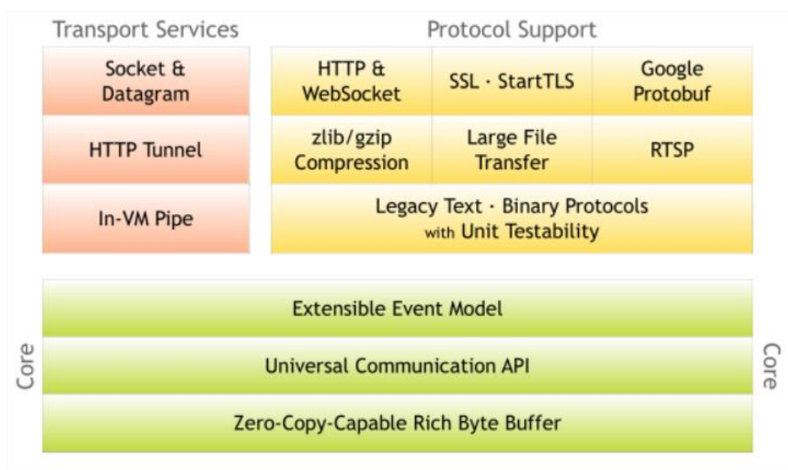
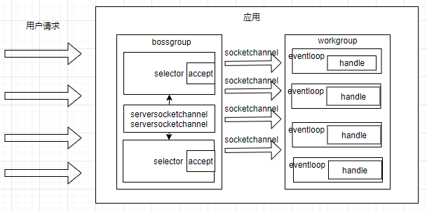
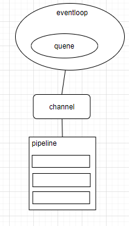

## 1. 开头
众所周知，netty是一款优秀的网络通讯框架，netty是由韩国人开发的。这里从几大方面来概述netty框架： 
* 什么是netty框架
* 为什么要使用netty框架
* netty框架未来的发展。

## 2. netty框架是什么？  
### 2.1. netty整体印象
* 类型  
  网络应用程序的框架
* 异步、事件驱动
* 特性  
  高性能，可维护，快速快速开发
* 用途  
  开发高性能的服务器和客户端。  

  

### 2.2. netty整体印象

## 3. 为什么要使用netty  
netty已经提供了jdk nio了，为什么还要使用netty呢？  
简单来说，是netty做的比nio更多和更好好。更多的功能表现为：  
* 支持常用的应用层协议  
* 解决了传输存在的问题：粘包、半包问题
* 支持流量整形
* 完善的断连、idle等异常问题  

更好的功能表现为：  
* 规避了jdk nio的bug
  * 经典的epoll bug，异常唤醒空转导致cpu 100%
  * ip_tos参数使用时抛出异常  

* 提供了更加好用的api
* 隔离了变化、屏蔽了细节  


## 2. netty的reactor模型
Netty对上面的三种reactor模型都是支持,具体的写法如下：  
```
public static void test1() {
    //reactor单线程模型
    EventLoopGroup eventLoopGroup = new NioEventLoopGroup(1);
    ServerBootstrap serverBootstrap = new ServerBootstrap();
    serverBootstrap.group(eventLoopGroup);
}
public static void test2() {
    //reactor多线程模型
    EventLoopGroup eventLoopGroup = new NioEventLoopGroup();
    ServerBootstrap serverBootstrap = new ServerBootstrap();
    serverBootstrap.group(eventLoopGroup);
}
public static void test3(){
    //reactor主从模型
    EventLoopGroup bossGroup = new NioEventLoopGroup();
    EventLoopGroup workGroup = new NioEventLoopGroup();
    ServerBootstrap serverBootstrap = new ServerBootstrap();
    serverBootstrap.group(bossGroup, workGroup);
}
```

## 3. Netty运行机制
* 创建workgroup线程组（管理socketchannel的）、创建boss线程组（管理serversocketchannel的）
* Serverbootstrap绑定端口
* 用户请求服务端建立连接
* bossgroup使用线程池acceptor连接，并获取socketchannel注册到workgroup
* workgroup使用handler处理socketchannel  

  


## 4. Netty的优化  

* eventloop阻塞
* 系统参数
* 缓冲区
* 直接内存
* 其它  

  


## 5. 粘包的解决
ByteToMessageDecoder提供一些实现类来解决tcp的粘包问题，FixedLengthFrameDecoder（定长），LineBasedFrameDecoder（行分隔符），DelimiterBasedFrameDecoder（自定义分隔符），LengthFieldBasedFrameDecoder（长度编码，在消息头传输长度），JsonObjectDecoder（json分隔符）    


## 6. 总结