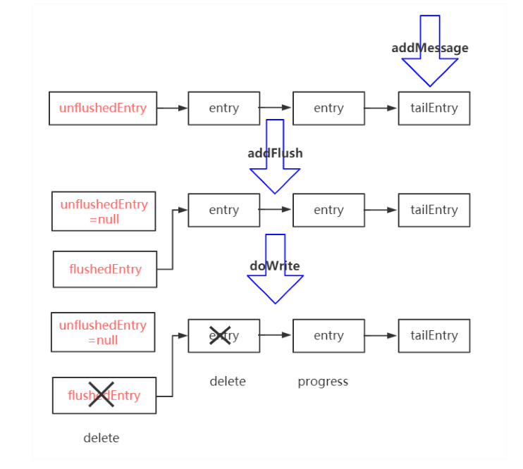
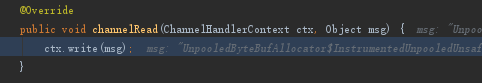
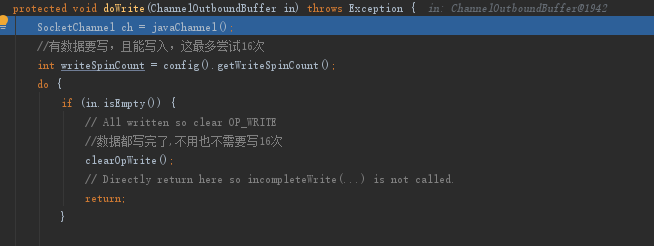

## 2. 写数据
## 2.1. 整体流程  
整体流程  

* io.netty.channel.ChannelPipeline#fireChannelRead
* io.netty.channel.ChannelInboundHandler#channelRead
* io.netty.example.echo.EchoServerHandler，业务handler处理写

* io.netty.example.echo.EchoServerHandler，业务handler处理写
* io.netty.channel.AbstractChannel.AbstractUnsafe#write，抽象的channel写入
* io.netty.channel.ChannelOutboundBuffer#addMessage, 其实是放入到链表尾部
* flush
* DoWrite

