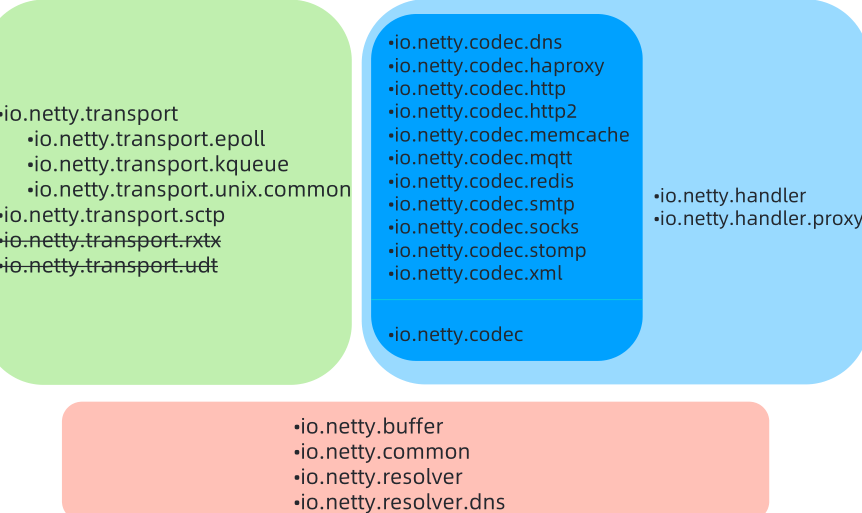
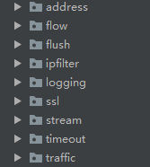

## 1. 代码结构  

* Codec，各种协议
* Netty-common，放了一些常用的工具类
* Handle，放了很多人性化的定制功能，过滤，日志，流控等  
  
* Resolver，地址解析
* Transport,各种channel
* Rxtx,淘汰了，不好加测试
* Transport-udt被废弃了，因为依赖了
* barchart-udt-bundle包，没人维护了  

## 2. 代码编译  