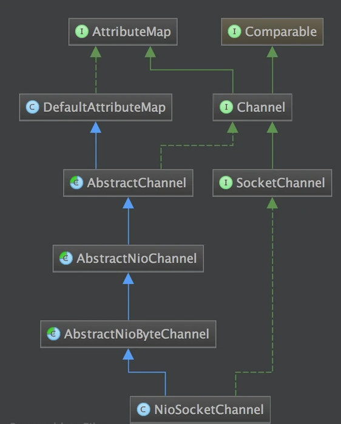
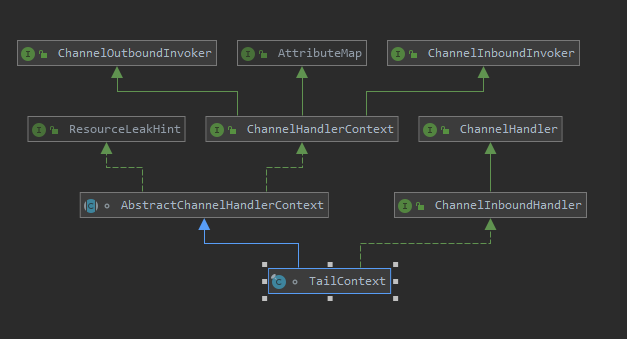
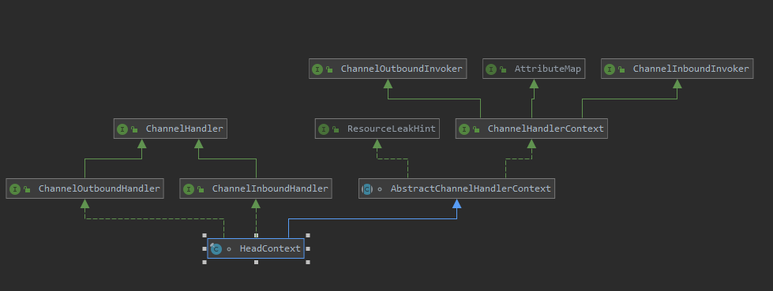
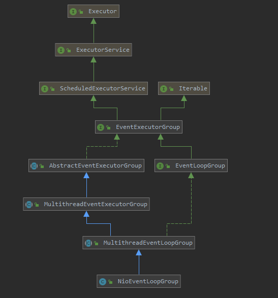
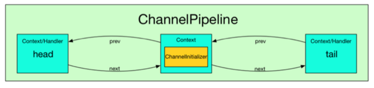
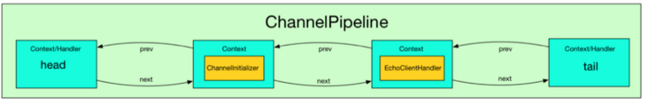
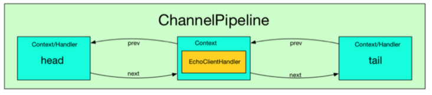
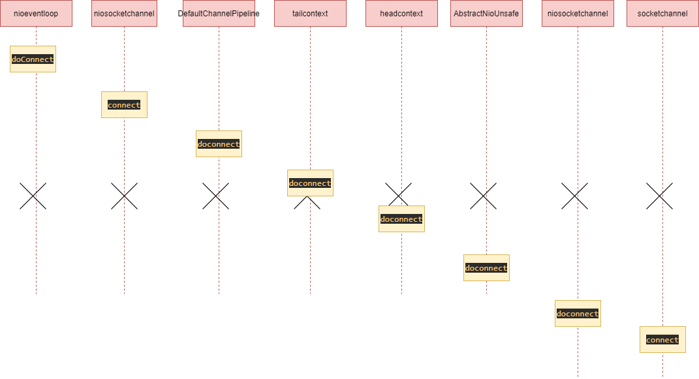

## 1. 客户端启动
&emsp;&emsp;Bootstrap 是 Netty 提供的一个便利的工厂类, 我们可以通过它来完成 Netty 的客户端或服务器端的 Netty 初始化。

### 1.1. 客户端示例
```
    // Configure the client.
    EventLoopGroup group = new NioEventLoopGroup();
    try {
        Bootstrap b = new Bootstrap();
        b.group(group)
          .channel(NioSocketChannel.class)
          .option(ChannelOption.TCP_NODELAY, true)
          .handler(new ChannelInitializer<SocketChannel>() {
              @Override
              public void initChannel(SocketChannel ch) throws Exception {
                  ChannelPipeline p = ch.pipeline();
                  if (sslCtx != null) {
                      p.addLast(sslCtx.newHandler(ch.alloc(), HOST, PORT));
                  }
                  p.addLast(new LoggingHandler(LogLevel.INFO));
                  p.addLast(new EchoClientHandler());
              }
          });

        // Start the client.
        ChannelFuture f = b.connect(HOST, PORT).sync();

        // Wait until the connection is closed.
        f.channel().closeFuture().sync();
    } finally {
        // Shut down the event loop to terminate all threads.
        group.shutdownGracefully();
    }
```
这里有三大大关键点
* 指定了EventLoopGroup（客户端和服务端都必须指定）
* 指定了ChannelType的类型，这里指定了NioSocketChannel.class
* 设置了Handler: 设置数据的处理器  


### 2. NioSocketChannel  
    
如上图所示，NioSocketChannel实现了socketchannel, 而socketchannel是java nio中的管道，它原生有如下这么几种实现。  
* FileChannel, 文件操作
* DatagramChannel, UDP 操作
* SocketChannel, TCP 操作，可以设置阻塞和非阻塞
* ServerSocketChannel, TCP 操作, 使用在服务器端，可以设置阻塞和非阻塞
在netty中，有对他们进行了封装：
* NioSocketChannel, 代表异步的客户端 TCP Socket 连接.
* NioServerSocketChannel, 异步的服务器端 TCP Socket 连接.
* NioDatagramChannel, 异步的 UDP 连接
* NioSctpChannel, 异步的客户端 Sctp 连接.
* NioSctpServerChannel, 异步的 Sctp 服务器端连接.
* OioSocketChannel, 同步的客户端 TCP Socket 连接.
* OioServerSocketChannel, 同步的服务器端 TCP Socket 连接.
* OioDatagramChannel, 同步的 UDP 连接
* OioSctpChannel, 同步的 Sctp 服务器端连接.
* OioSctpServerChannel, 同步的客户端 TCP Socket 连接.
#### 2.1. NioSocketChannel创建
* bootstrap设置配置NioSocketChannel类型
  ```
        Bootstrap b = new Bootstrap();
        b.group(group)
          .channel(NioSocketChannel.class)
  ```
* channel()将传入一个channelFactory的反射工厂，初始化给Bootstrap，channelFactory可以以创建channel
  ```
      public B channel(Class<? extends C> channelClass) {
        return channelFactory(new ReflectiveChannelFactory<C>(
                ObjectUtil.checkNotNull(channelClass, "channelClass")
        ));
      }
  ```
  ReflectiveChannelFactory:
  ```
     public T newChannel() {
        try {
            //反射创建channel
            return constructor.newInstance();
        } catch (Throwable t) {
            throw new ChannelException("Unable to create Channel from class " + constructor.getDeclaringClass(), t);
        }
    }
  ```

* channel实例化 
  channel是在Bootstrap.doConnect调用AbstractBootstrap.initAndRegister的时候创建的。  
  示例代码的b.connect(HOST, PORT).sync()会触发initAndRegister
  initAndRegister
  ```
    Channel channel = null;
      try {
          channel = channelFactory.newChannel();
          init(channel);
      } catch (Throwable t) {
          if (channel != null) {
              channel.unsafe().closeForcibly();
              return new DefaultChannelPromise(channel, GlobalEventExecutor.INSTANCE).setFailure(t);
          }
          return new DefaultChannelPromise(new FailedChannel(), GlobalEventExecutor.INSTANCE).setFailure(t);
      }
      ChannelFuture regFuture = group().register(channel);
  ```
    其中的核心代码：
    * 利用channelFactory创建NioSocketChannel
    * NioSocketChannel的构造器很关键，它将创建java nio的socket channel
      ```
        public NioSocketChannel(SelectorProvider provider) {
          this(newSocket(provider));
        }
        private static SocketChannel newSocket(SelectorProvider provider) {
            try {
                return provider.openSocketChannel();
            } catch (IOException e) {
                throw new ChannelException("Failed to open a socket.", e);
            }
        }
      ```
        * 它会打开一个java nio的socketchannel并返回，socketchannel,provider.openSocketChannel()
        * 调用父类的构造器io.netty.channel.nio.AbstractNioChannel#AbstractNioChannel设置socketchannel为非阻塞
          ```
              protected AbstractNioChannel(Channel parent, SelectableChannel ch, int readInterestOp) {
              super(parent);
              this.ch = ch;
              this.readInterestOp = readInterestOp;
              try {
                  //非阻塞模式
                  ch.configureBlocking(false);
              } catch (IOException e) {
                  //.......
              }
          }
          ```
         * 继续调用父类构造器实例化unsafe和pipeline
      
          ```
          protected AbstractChannel(Channel parent) {
              this.parent = parent;
              unsafe = newUnsafe();
              pipeline = new DefaultChannelPipeline(this);
          }
          ``` 
          * 最终设置niosocketchannel的属性
            ```
              public NioSocketChannel(Channel parent, SocketChannel socket) {
                  super(parent, socket);
                  config = new NioSocketChannelConfig(this, socket.socket());
              }
            ```
#### 2.2. NioSocketChannel小结
* 调用 NioSocketChannel.newSocket(DEFAULT_SELECTOR_PROVIDER) 打开一个新的 Java NIO SocketChannel
* AbstractChannel(Channel parent) 中初始化 AbstractChannel 的属性:
  * parent 属性置为 null
  * unsafe 通过newUnsafe() 实例化一个 unsafe 对象, 它的类型是 AbstractNioByteChannel.NioByteUnsafe 内部类
  * pipeline 是 new DefaultChannelPipeline(this) 新创建的实例.
      Each channel has its own pipeline and it is created automatically when a new channel is created.

 * AbstractNioChannel 中的属性:
   * SelectableChannel ch 被设置为 Java SocketChannel, 即 NioSocketChannel#newSocket 返回的 Java NIO SocketChannel.
   * readInterestOp 被设置为 SelectionKey.OP_READ
   * SelectableChannel ch 被配置为非阻塞的 ch.configureBlocking(false)
 * NioSocketChannel 中的属性
   * SocketChannelConfig config = new NioSocketChannelConfig(this, socket.socket())  


### 3. unsafe  
&emsp;&emsp;在niosocketchannel的实例化的时候，会实例化一个unsafe。unsafe 很重要。
&emsp;&emsp;它封装了对 Java 底层 Socket 的操作, 因此实际上是沟通 Netty 上层和 Java 底层的重要的桥梁.  
#### 3.1. unsafe的核心方法  
这些方法其实都会对应到相关的 Java 底层的 Socket 的操作
```
interface Unsafe {
    SocketAddress localAddress();
    SocketAddress remoteAddress();
    void register(EventLoop eventLoop, ChannelPromise promise);
    void bind(SocketAddress localAddress, ChannelPromise promise);
    void connect(SocketAddress remoteAddress, SocketAddress localAddress, ChannelPromise promise);
    void disconnect(ChannelPromise promise);
    void close(ChannelPromise promise);
    void closeForcibly();
    void deregister(ChannelPromise promise);
    void beginRead();
    void write(Object msg, ChannelPromise promise);
    void flush();
    ChannelPromise voidPromise();
    ChannelOutboundBuffer outboundBuffer();
}
```

#### 3.2. unsafe的实例化  
&emsp;&emsp;在niosocketchannle实例化的时候，会调用创建unsafe对象的方法。  
NioSocketChannel.newUnsafe 方法会返回一个 NioSocketChannelUnsafe 实例. 从这里我们就可以确定了, 在实例化的 NioSocketChannel 中的 unsafe 字段, 其实是一个 NioSocketChannelUnsafe 的实例
```
    protected AbstractNioUnsafe newUnsafe() {
        return new NioSocketChannelUnsafe();
    }
```
### 4. pipeline   
&emsp;&emsp;在niosocketchannle实例化的时候，会调用创建 ChannelPipeline 对象的方法。 它实例化的是默认的channelpipeline对象

#### 4.1. pipeline的实例化   
```
    protected DefaultChannelPipeline(Channel channel) {
        this.channel = ObjectUtil.checkNotNull(channel, "channel");
        succeededFuture = new SucceededChannelFuture(channel, null);
        voidPromise =  new VoidChannelPromise(channel, true);

        tail = new TailContext(this);
        head = new HeadContext(this);

        head.next = tail;
        tail.prev = head;
    }
```
#### 4.2. pipeline关键属性 
DefaultChannelPipeline对象关键点：
* 有两个特殊的字段, 即 head 和 tail, 而这两个字段是一个双向链表的头和尾
* 维护了一个以 AbstractChannelHandlerContext 为节点的双向链表, 这个链表是 Netty 实现 Pipeline 机制的关键  
* head 是一个 ChannelOutboundHandler, 而 tail 则是一个 ChannelInboundHandler
TailContext的结构：
  
HeadContext的结构：
  

#### 4.3. HeadContext、TailContext实例化   

```
HeadContext(DefaultChannelPipeline pipeline) {
    super(pipeline, null, HEAD_NAME, false, true);
    unsafe = pipeline.channel().unsafe();
}
```

* 它调用了父类 AbstractChannelHandlerContext 的构造器, 并传入参数 inbound = false, outbound = true
* TailContext 的构造器与 HeadContext 的相反, 它调用了父类 AbstractChannelHandlerContext 的构造器, 并传入参数 inbound = true, outbound = false
* header 是一个 outboundHandler, 而 tail 是一个inboundHandler


### 5. EventLoop  
在客户端示例最开始就需要创建一个NioEventLoopGroup
### 5.1. NioEventLoopGroup  
    

#### 5.2. NioEventLoopGroup实例化
* 实例化的时候最终调用的是MultithreadEventLoopGroup的构造方法：
```
protected MultithreadEventLoopGroup(int nThreads, ThreadFactory threadFactory, Object... args) {
    super(nThreads == 0? DEFAULT_EVENT_LOOP_THREADS : nThreads, threadFactory, args);
}
```
* 设置线程数,如果没有传入线程数或者为0的话，会设置系统定义的线程数。即：处理器核心数 * 2
  ```
  static {
      DEFAULT_EVENT_LOOP_THREADS = Math.max(1, SystemPropertyUtil.getInt(
              "io.netty.eventLoopThreads", Runtime.getRuntime().availableProcessors() * 2));
  }
  ```
* 继续调用父类构造器MultithreadEventExecutorGroup 初始化
  ```
    // 去掉了参数检查, 异常处理 等代码.
    children = new SingleThreadEventExecutor[nThreads];
    if (isPowerOfTwo(children.length)) {
        chooser = new PowerOfTwoEventExecutorChooser();
    } else {
        chooser = new GenericEventExecutorChooser();
    }
  
    for (int i = 0; i < nThreads; i ++) {
        children[i] = newChild(threadFactory, args);
    }
  ```
    * 创建一个大小为 nThreads 的 SingleThreadEventExecutor 数组
    * 根据 nThreads 的大小, 创建不同的 Chooser.这是netty极致优化的一点。   
         即如果 nThreads 是 2 的幂, 则使用 PowerOfTwoEventExecutorChooser   
        反之使用 GenericEventExecutorChooser.   
        不论使用哪个 Chooser, 它们的功能都是样的, 即从 children 数组中选出一个合适的 EventExecutor 实例.
    * 调用 newChhild 方法初始化 children 数组.   
      这个是一个抽象方法, 它的任务是实例化 EventLoop 对象. 我们跟踪一下它的代码, 可以发现, 这个方法在 NioEventLoopGroup 类中实现了
      ```
        protected EventExecutor newChild(ThreadFactory threadFactory, Object... args) throws Exception {
            return new NioEventLoop(this, threadFactory, (SelectorProvider) args[0]);
        }
      ```
  * 总的概括下就是MultithreadEventExecutorGroup 内部维护了一个 EventExecutor 数组, Netty 的 EventLoopGroup 的实现机制其实就建立在 MultithreadEventExecutorGroup 之上. 每当 Netty 需要一个 EventLoop 时, 会调用 next()       


#### 5.3. NioEventLoopGroup小结 
* EventLoopGroup(其实是MultithreadEventExecutorGroup) 内部维护一个类型为EventExecutor children 数组, 其大小是 nThreads, 这样就构成了一个线程池
* 如果我们在实例化 NioEventLoopGroup 时, 如果指定线程池大小, 则 nThreads 就是指定的值, 反之是处理器核心数乘以2
* MultithreadEventExecutorGroup 中会调用 newChild 抽象方法来初始化 children 数组
* 抽象方法 newChild 是在 NioEventLoopGroup 中实现的, 它返回一个 NioEventLoop 实例.
* NioEventLoop 属性:
  * SelectorProvider provider 属性: NioEventLoopGroup 构造器中通过 SelectorProvider.provider() 获取一个 SelectorProvider
  * Selector selector 属性: NioEventLoop 构造器中通过调用通过 selector = provider.openSelector() 获取一个 selector 对象.


### 6. channel的注册  
之前我们提到Bootstrap在connect的时候会Bootstrap.initAndRegister，这个会注册nisocketchannel  
```
final ChannelFuture initAndRegister() {
    // 去掉非关键代码
    final Channel channel = channelFactory().newChannel();
    init(channel);
    ChannelFuture regFuture = group().register(channel);
}
```
具体会怎么注册这个nisocketchannel呢？ 跟踪源码可以看到，调用链为：
AbstractBootstrap.initAndRegister -> MultithreadEventLoopGroup.register -> SingleThreadEventLoop.register -> AbstractUnsafe.register  
最终会调用到unsafe 的 register 方法, 那么接下来我们就仔细看一下 AbstractUnsafe.register 
#### 6.1. channel的注册流程 
```
  public ChannelFuture register(Channel channel) {
      return next().register(channel);
  }
```
```
  public ChannelFuture register(final ChannelPromise promise) {
      ObjectUtil.checkNotNull(promise, "promise");
      promise.channel().unsafe().register(this, promise);
      return promise;
  }
```
```
public final void register(EventLoop eventLoop, final ChannelPromise promise) {
    // 省略条件判断和错误处理
    AbstractChannel.this.eventLoop = eventLoop;
    register0(promise);
}
```
这里需要注意:
* eventLoop 赋值给 Channel 的 eventLoop 属性
* eventLoop 对象其实是 MultithreadEventLoopGroup.next() 方法获取的
* 我们可以确定 next() 方法返回的 eventLoop 对象是 NioEventLoop 实例

接这个unsafe会调用register0 方法:
```
private void register0(ChannelPromise promise) {
    boolean firstRegistration = neverRegistered;
    doRegister();
    neverRegistered = false;
    registered = true;
    safeSetSuccess(promise);
    pipeline.fireChannelRegistered();
    // Only fire a channelActive if the channel has never been registered. This prevents firing
    // multiple channel actives if the channel is deregistered and re-registered.
    if (firstRegistration && isActive()) {
        pipeline.fireChannelActive();
    }
}
```
register0 又调用了 AbstractNioChannel.doRegister:
```
protected void doRegister() throws Exception {
    // 省略错误处理
    selectionKey = javaChannel().register(eventLoop().selector, 0, this);
}
```
这里就是核心代码了：
* javaChannel() 这个方法在前面我们已经知道了, 它返回的是一个 Java NIO SocketChannel
* SocketChannel 注册到与 eventLoop 关联的 selector 上了
#### 6.2. channel的注册小结  
&emsp;&emsp;Channel 注册过程所做的工作就是将 Channel 与对应的 EventLoop 关联, 因此这也体现了, 在 Netty 中, 每个 Channel 都会关联一个特定的 EventLoop, 并且这个 Channel 中的所有 IO 操作都是在这个 EventLoop 中执行的;   
&emsp;&emsp;当关联好 Channel 和 EventLoop 后, 会继续调用底层的 Java NIO SocketChannel 的 register 方法, 将底层的 Java NIO SocketChannel 注册到指定的 selector 中. 通过这两步, 就完成了 Netty Channel 的注册过程   

&emsp;&emsp;更加详细的注册关键点为：
* 首先在 AbstractBootstrap.initAndRegister中, 通过 group().register(channel), 调用 MultithreadEventLoopGroup.register 方法

* 在MultithreadEventLoopGroup.register 中, 通过 next() 获取一个可用的 SingleThreadEventLoop, 然后调用它的 register

* 在 SingleThreadEventLoop.register 中, 通过 channel.unsafe().register(this, promise) 来获取 channel 的 unsafe() 底层操作对象, 然后调用它的 register.

* 在 AbstractUnsafe.register 方法中, 调用 register0 方法注册 Channel

* 在 AbstractUnsafe.register0 中, 调用 AbstractNioChannel.doRegister 方法

* AbstractNioChannel.doRegister 方法通过 javaChannel().register(eventLoop().selector, 0, this) 将 Channel 对应的 Java NIO SockerChannel 注册到一个 eventLoop 的 Selector 中, 并且将当前 Channel 作为 attachment。    

### 7. handler 
&emsp;&emsp;Netty 的一个强大和灵活之处就是基于 Pipeline 的自定义 handler 机制。 我们可以像添加插件一样自由组合各种各样的 handler 来完成业务逻辑    
#### 7.1. handler使用样例  
```
  handler(new ChannelInitializer<SocketChannel>() {
                @Override
                public void initChannel(SocketChannel ch) throws Exception {
                    ChannelPipeline p = ch.pipeline();
                    if (sslCtx != null) {
                        p.addLast(sslCtx.newHandler(ch.alloc(), HOST, PORT));
                    }
                    p.addLast(new LoggingHandler(LogLevel.INFO));
                    p.addLast(new EchoClientHandler());
                }
            });
```
#### 7.2. handler的机制
* Bootstrap.handler 方法接收一个 ChannelHandler, 而我们传递的是一个 派生于 ChannelInitializer 的匿名类
* 我们需要实现一个抽象的initChannel方法
  ```
      protected abstract void initChannel(C ch) throws Exception;
      @Override
      @SuppressWarnings("unchecked")
      public final void channelRegistered(ChannelHandlerContext ctx) throws Exception {
          // Normally this method will never be called as handlerAdded(...) should call initChannel(...) and remove
          // the handler.
          if (initChannel(ctx)) {
              // we called initChannel(...) so we need to call now pipeline.fireChannelRegistered() to ensure we not
              // miss an event.
              ctx.pipeline().fireChannelRegistered();
  
              // We are done with init the Channel, removing all the state for the Channel now.
              removeState(ctx);
          } else {
              // Called initChannel(...) before which is the expected behavior, so just forward the event.
              ctx.fireChannelRegistered();
          }
      }
  ```
* channelRegistered 方法中, 会调用 initChannel 方法, 将自定义的 handler 添加到 ChannelPipeline
* 然后调用 ctx.pipeline().remove(this) 将自己从 ChannelPipeline 中删除.  
即如下流程：  
调用 initChannel 方法, 将自定义的 handler 添加到 ChannelPipeline  
   
initChannel 方法调用后, 添加了自定义的 handler  
      
最后将 ChannelInitializer 删除   
     


### 8. 客户端连接  
在开始，我们已经知道建立连接时会执行一些初始化的操作。后面就会调用一个核心方法来进行连接，即 event loop 线程中调用 Channel 的 connect 方法
```
  private static void doConnect(
            final SocketAddress remoteAddress, final SocketAddress localAddress, final ChannelPromise connectPromise) {
        final Channel channel = connectPromise.channel();
        channel.eventLoop().execute(new Runnable() {
            @Override
            public void run() {
                if (localAddress == null) {
                    channel.connect(remoteAddress, connectPromise);
                } else {
                    channel.connect(remoteAddress, localAddress, connectPromise);
                }
                connectPromise.addListener(ChannelFutureListener.CLOSE_ON_FAILURE);
            }
        });
    }
```
#### 8.1. 建立连接流程  
* io.netty.bootstrap.Bootstrap#doConnect
* io.netty.channel.AbstractChannel#connect(java.net.SocketAddress, io.netty.channel.ChannelPromise)
* io.netty.channel.DefaultChannelPipeline#connect(java.net.SocketAddress, io.netty.channel.ChannelPromise) 
* AbstractChannelHandlerContext.connect。   
  final AbstractChannelHandlerContext next = findContextOutbound()是个关键代码，从 DefaultChannelPipeline 内的双向链表的 tail 开始, 不断向前寻找第一个 outbound 为 true 的 AbstractChannelHandlerContext, 然后调用它的 invokeConnect 方法
  ```
  public ChannelFuture connect(
            final SocketAddress remoteAddress, final SocketAddress localAddress, final ChannelPromise promise) {
        final AbstractChannelHandlerContext next = findContextOutbound(MASK_CONNECT);
        EventExecutor executor = next.executor();
        if (executor.inEventLoop()) {
            next.invokeConnect(remoteAddress, localAddress, promise);
        } else {
            safeExecute(executor, new Runnable() {
                @Override
                public void run() {
                    next.invokeConnect(remoteAddress, localAddress, promise);
                }
            }, promise, null);
        }
        return promise;
    }
  ```
* AbstractChannelHandlerContext调用invokeConnect  
  ```
  private void invokeConnect(SocketAddress remoteAddress, SocketAddress localAddress, ChannelPromise promise) {
      ((ChannelOutboundHandler) handler()).connect(this, remoteAddress, localAddress, promise);
  }
  ```
  * DefaultChannelPipeline之前讲过， 会实例化两个对象: head 和 tail形成了双向链表的头和尾。 head 是 HeadContext 的实例, 它实现了 ChannelOutboundHandler 接口, 并且它的 outbound 字段为 true. 因此在 findContextOutbound 中, 找到的 AbstractChannelHandlerContext 对象其实就是 head. 进而在 invokeConnect 方法中, 我们向上转换为 ChannelOutboundHandler 就是没问题的了.
  而又因为 HeadContext 重写了 connect 方法, 因此实际上调用的是 HeadContext.connect.

* headcontext的connect方法
  ```
    public void connect(
          ChannelHandlerContext ctx,
          SocketAddress remoteAddress, SocketAddress localAddress,
          ChannelPromise promise) throws Exception {
      unsafe.connect(remoteAddress, localAddress, promise);
  }
  ```
* unsafe是AbstractNioByteChannel.NioByteUnsafe 内部类 ，是实例化时 pipeline.channel().unsafe()赋予的 
* 最终会通过NioByteUnsafe调用AbstractNioUnsafe.connect
  ```
    @Override
  public final void connect(
          final SocketAddress remoteAddress, final SocketAddress localAddress, final ChannelPromise promise) {
      boolean wasActive = isActive();
      if (doConnect(remoteAddress, localAddress)) {
          fulfillConnectPromise(promise, wasActive);
      } else {
          ...
      }
  }
  ```
  connect 方法中, 调用了 doConnect 方法  
  注意, 这个方法并不是 AbstractNioUnsafe 的方法, 而是 AbstractNioChannel 的抽象方法. doConnect 方法是在 NioSocketChannel 中实现的, 因此进入到 NioSocketChannel.doConnect 
* 终于到了最关键的代码，NioSocketChannel.doConnect 
  ```
     protected boolean doConnect(SocketAddress remoteAddress, SocketAddress localAddress) throws Exception {
        if (localAddress != null) {
            doBind0(localAddress);
        }
  
        boolean success = false;
        try {
            boolean connected = SocketUtils.connect(javaChannel(), remoteAddress);
            if (!connected) {
                selectionKey().interestOps(SelectionKey.OP_CONNECT);
            }
            success = true;
            return connected;
        } finally {
            if (!success) {
                doClose();
            }
        }
    }
  ```
  首先是获取 Java NIO SocketChannel, 即我们已经分析过的, 从 NioSocketChannel.newSocket 返回的 SocketChannel 对象; 然后是调用 SocketChannel.connect 方法完成 Java NIO 层面上的 Socket 的连接  


  #### 8.2. 建立连接时序图  
    


  ## 9. 总结