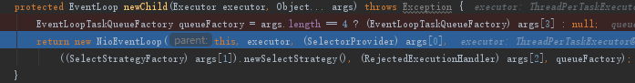

## 1. 开头  

## 2.   
### 2.1. 创建selector  
在new NioEventLoopGroup()（创建一批 NioEventLoop）时创建。
核心为：Selector selector = sun.nio.ch.SelectorProviderImpl.openSelector();
* 创建nioeventloopgroup对象，获取selector创建器（有不同的实现）  
    
* 最终使用MultithreadEventExecutorGroup构造器创建，默认创建一个executor（NioEventLoop对象）放入数组中
* 上一步的创建executor调用NioEventLoopGroup的newChild方法来创建NioEventLoop对象  
       
      
* 选择一个executor，这里有个优化算法，根据是否为2的倍数，放入到EventExecutorChooserFactory.EventExecutorChooser chooser     
    
 由上可知，创建eventloopgroup对象的时候会创建一个eventloop对象数组，每一个eventloop对象持有一个创建的selector对象。  

 ### 2.2. 创建serversocketchannel，并初始化  
 核心为：ServerSocketChannel serverSocketChannel = provider.openServerSocketChannel();  
 * 调用channe方法根据反射获取io.netty.channel.socket.nio.NioServerSocketChanne对象创建工厂  
        
          
          

### 2.3. ServerBootstrap会初始化serversocketchannel,并注册
核心：selectionKey = javaChannel().register(eventLoop().unwrappedSelector(), 0,  this )    
           
    开启evenloop线程  
           
      注册事件  
      
