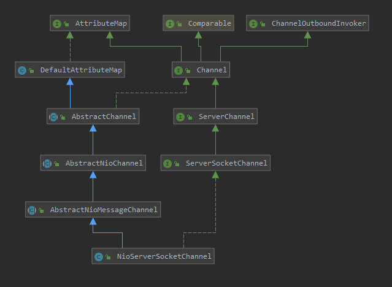
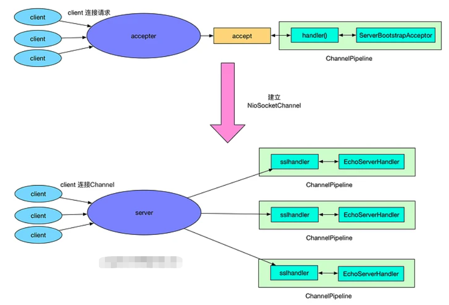

## 1. 介绍
### 1.1. 服务端示例代码   
```
// Configure the server.
EventLoopGroup bossGroup = new NioEventLoopGroup();
EventLoopGroup workerGroup = new NioEventLoopGroup();
final EchoServerHandler serverHandler = new EchoServerHandler();
try {
    ServerBootstrap b = new ServerBootstrap();
    b.group(bossGroup, workerGroup)
        .channel(NioServerSocketChannel.class)
        .option(ChannelOption.SO_BACKLOG, 100)
        .handler(new LoggingHandler(LogLevel.INFO))
        //两种设置keepalive风格
        .childOption(ChannelOption.SO_KEEPALIVE, true)
        .childOption(NioChannelOption.SO_KEEPALIVE, true)
        //切换到unpooled的方式之一
        .childOption(ChannelOption.ALLOCATOR, UnpooledByteBufAllocator.DEFAULT)
            .childHandler(new ChannelInitializer<SocketChannel>() {
            @Override
            public void initChannel(SocketChannel ch) throws Exception {
                ChannelPipeline p = ch.pipeline();
                if (sslCtx != null) {
                    p.addLast(sslCtx.newHandler(ch.alloc()));
                }
                p.addLast(new LoggingHandler(LogLevel.INFO));
                p.addLast(serverHandler);
            }
        });
    // Start the server.
    ChannelFuture f = b.bind(PORT).sync();
    // Wait until the server socket is closed.
    f.channel().closeFuture().sync();
} finally {
    // Shut down all event loops to terminate all threads.
    bossGroup.shutdownGracefully();
    workerGroup.shutdownGracefully();
}
```
和客户端的代码很类似：  
* EventLoopGroup: 不论是服务器端还是客户端, 都必须指定 EventLoopGroup.   
  * 在这个例子中, 指定了 NioEventLoopGroup, 表示一个 NIO 的EventLoopGroup  
  * 服务器端需要指定两个 EventLoopGroup, 一个是 bossGroup, 用于处理客户端的连接请求; 
  * 另一个是 workerGroup, 用于处理与各个客户端连接的 IO 操作.
* ChannelType: 指定 Channel 的类型. 因为是服务器端, 因此使用了 NioServerSocketChannel.
* Handler: 设置数据的处理器  

## 2. Channel的初始化  
&emsp;&emsp;我们在java的nio中已经知道了Channel 是对 Java 底层 Socket 连接的抽象，在netty的客户端中，Channel 的具体类型是 NioSocketChannel， 服务端是NioServerSocketChannel  
### 2.1. Channel类型确定
&emsp;&emsp;和客户端类似也是传入class对象，即，ServerBootstarap.channel(NioServerSocketChannel.class)，最终NioServerSocketChannel 的实例化是通过 BootstrapChannelFactory 工厂类来完成的，BootstrapChannelFactory 中的 clazz 字段被设置为了 NioServerSocketChannel.class, 因此当调用 BootstrapChannelFactory.newChannel()  
```
@Override
public T newChannel() {
    // 删除 try 块
    return clazz.newInstance();
}
```
* ServerBootstrap 中的 ChannelFactory 的实现是 BootstrapChannelFactory
生成的 Channel 的具体类型是 NioServerSocketChannel.
* Channel 的实例化过程, 其实就是调用的 ChannelFactory.newChannel 方法, 生成的的 Channel 实例就是 NioServerSocketChannel.   


### 2.2. 服务端channel  
    

* 创建ServerSocketChannel   
    * 和客户端NioSocketChannel类似, 构造器都是调用了 newSocket 来打开一个 Java 的 NIO Socket。不过需要注意的是, 客户端的 newSocket 调用的是 openSocketChannel, 而服务器端的 newSocket 调用的是openServerSocketChannel
    ```
    private static ServerSocketChannel newSocket(SelectorProvider provider) {
        try {
            return provider.openServerSocketChannel();
        } catch (IOException e) {
            throw new ChannelException("Failed to open a server socket.", e);
        }
    }
    ```
    ```
    public NioServerSocketChannel(ServerSocketChannel channel) {
        super(null, channel, SelectionKey.OP_ACCEPT);
        config = new NioServerSocketChannelConfig(this, javaChannel().socket());
    }
    ```
    * 调用父类构造器时, 传入的参数是 SelectionKey.OP_ACCEPT，而客户端的 Channel 初始化时, 传入的参数是 SelectionKey.OP_READ  
    **注意：Java NIO 是一种 Reactor 模式, 我们通过 selector 来实现 I/O 的多路复用复用. 在一开始时, 服务器端需要监听客户端的连接请求, 因此在这里我们设置了 SelectionKey.OP_ACCEPT**
* 逐级地调用父类的构造器，实例化一个 unsafe 和 pipeline
  ```
    protected AbstractChannel(Channel parent) {
        this.parent = parent;
        unsafe = newUnsafe();
        pipeline = new DefaultChannelPipeline(this);
    }
  ```
  注意，客户端的 unsafe 是一个**AbstractNioByteChannel#NioByteUnsafe 的实例**, 而在服务器端时, 因为 AbstractNioMessageChannel 重写了newUnsafe 方法。
  ```
    @Override
    protected AbstractNioUnsafe newUnsafe() {
        return new NioMessageUnsafe();
    }
  ```


### 2.3. channel小结
nioserversocketchannel的过程为：

* 调用 NioServerSocketChannel.newSocket(DEFAULT_SELECTOR_PROVIDER) 打开一个新的 Java NIO ServerSocketChannel  

* AbstractChannel(Channel parent) 中初始化 AbstractChannel 的属性:
  * parent 属性置为 null
  * unsafe 通过newUnsafe() 实例化一个 unsafe 对象, 它的类型是 AbstractNioMessageChannel#AbstractNioUnsafe 内部类
  * pipeline 是 new DefaultChannelPipeline(this) 新创建的实例.

* AbstractNioChannel 中的属性:
  * SelectableChannel ch 被设置为 Java ServerSocketChannel, 即 NioServerSocketChannel#newSocket 返回的 Java NIO ServerSocketChannel.
  * readInterestOp 被设置为 SelectionKey.OP_ACCEPT
  * SelectableChannel ch 被配置为非阻塞的 ch.configureBlocking(false)
  
* NioServerSocketChannel 中的属性:
  * ServerSocketChannelConfig config = new NioServerSocketChannelConfig(this, javaChannel().socket())  

## 3. ChannelPipeline  
服务器端和客户端的 ChannelPipeline 的初始化一致
## 4. Channel绑定  
服务器端和客户端的 Channel 的注册过程一致  

## 5. bossGroup 和 workerGroup  

### 5.1. reactor模型
为什么会有bossGroup 和 workerGroup。这个就是众所周知的reactor模型  
* bossGroup    
  不断地监听是否有客户端的连接, 当发现有一个新的客户端连接到来时, bossGroup 就会为此连接初始化各项资源。
* workerGroup
  从workerGroup中选出一个EventLoop绑定到此客户端连接中，接下来的服务器与客户端的交互过程就全部在此分配的 EventLoop 中。   

### 5.2. 源码分析  
* ServerBootstrap调用了group，初始化了两个 EventLoopGroup
  ```
    public ServerBootstrap group(EventLoopGroup parentGroup, EventLoopGroup childGroup) {
        super.group(parentGroup);
        ...
        this.childGroup = childGroup;
        return this;
    }
  ```
  * 初始化了两个字段, 一个是 group = parentGroup，在 super.group(parentGroup) 中初始化
  *  childGroup = childGroup

* ServerBootstrap调用bind 方法来监听一个本地端口。并绑定NioServerSocketChannel，调用链为：  
   AbstractBootstrap.bind -> AbstractBootstrap.doBind -> AbstractBootstrap.initAndRegister  
   ```
    final ChannelFuture initAndRegister() {
        final Channel channel = channelFactory().newChannel();
        ... 省略异常判断
        init(channel);
        ChannelFuture regFuture = group().register(channel);
        return regFuture;
    }
   ```
  * 这里 group() 方法返回的是上面我们提到的 bossGroup
  * 这里的 channel 我们也已经分析过了, 它是一个是一个 NioServerSocketChannsl 实例
  * group().register(channel) 将 bossGroup 和 NioServerSocketChannel 关联起来

* workerGroup 与 NioSocketChannel关联  
  * init channel方法。这个方法主要做什么呢？  
    init 方法在 ServerBootstrap 中重写了, 它为 pipeline 中添加了一个 ChannelInitializer, 而这个 ChannelInitializer 中添加了一个关键的 ServerBootstrapAcceptor handler. 
   ```
    @Override
    void init(Channel channel) throws Exception {
        ...
        ChannelPipeline p = channel.pipeline();
  
        final EventLoopGroup currentChildGroup = childGroup;
        final ChannelHandler currentChildHandler = childHandler;
        final Entry<ChannelOption<?>, Object>[] currentChildOptions;
        final Entry<AttributeKey<?>, Object>[] currentChildAttrs;
  
        p.addLast(new ChannelInitializer<Channel>() {
            @Override
            public void initChannel(Channel ch) throws Exception {
                ChannelPipeline pipeline = ch.pipeline();
                ChannelHandler handler = handler();
                if (handler != null) {
                    pipeline.addLast(handler);
                }
                pipeline.addLast(new ServerBootstrapAcceptor(
                        currentChildGroup, currentChildHandler, currentChildOptions, currentChildAttrs));
            }
        });
    }
   ```
   * ServerBootstrapAcceptor重写了 channelRead 方法
     ```
        @Override
        @SuppressWarnings("unchecked")
        public void channelRead(ChannelHandlerContext ctx, Object msg) {
            final Channel child = (Channel) msg;
            child.pipeline().addLast(childHandler);
            ...
            childGroup.register(child).addListener(...);
        }
     ```
    * ServerBootstrapAcceptor 中的 childGroup 是构造此对象是传入的 currentChildGroup即workerGroup
    * Channel 是一个 NioSocketChannel 的实例
    * childGroup.register 就是将 workerGroup 中的某个 EventLoop 和 NioSocketChannel关联
  * ServerBootstrapAcceptor的channelRead的方法的调用   
    一个 client 连接到 server 时, Java 底层的 NIO ServerSocketChannel 会有一个 SelectionKey.OP_ACCEPT，然后就会调用到 NioServerSocketChannel.doReadMessages  
    ```
    @Override
    protected int doReadMessages(List<Object> buf) throws Exception {
        SocketChannel ch = javaChannel().accept();
        ... 省略异常处理
        buf.add(new NioSocketChannel(this, ch));
        return 1;
    }
    ```
    * doReadMessages 中, 通过 javaChannel().accept() 获取到客户端新连接的SocketChannel,
    * 接着就实例化一个 NioSocketChannel, 并且传入 NioServerSocketChannel 对象(即 this)
    * 我们创建的这个NioSocketChannel 的父 Channel 就是 NioServerSocketChannel 实例. 
    * 接下来就经由 Netty 的 ChannelPipeline 机制, 将读取事件逐级发送到各个 handler 中, 于是就会触发前面我们提到的 ServerBootstrapAcceptor.channelRead 方法


## 6. handler  
&emsp;&emsp;服务器端的 handler 的添加过程和客户端的有点区别, 服务器端的 handler 也有两个: 
* 一个是通过 handler() 方法设置 handler 字段，与 accept 过程有关, 即这个 handler 负责处理客户端的连接请求; 
* 另一个是通过 childHandler() 设置 childHandler 字段.childHandler 就是负责和客户端的连接的 IO 交互

### 6.1. handler的添加  
handler是在ServerBootstrap重写的init方法中添加的：  
```
@Override
void init(Channel channel) throws Exception {
    ...
    ChannelPipeline p = channel.pipeline();
    final EventLoopGroup currentChildGroup = childGroup;
    final ChannelHandler currentChildHandler = childHandler;
    final Entry<ChannelOption<?>, Object>[] currentChildOptions;
    final Entry<AttributeKey<?>, Object>[] currentChildAttrs;
    p.addLast(new ChannelInitializer<Channel>() {
        @Override
        public void initChannel(Channel ch) throws Exception {
            ChannelPipeline pipeline = ch.pipeline();
            ChannelHandler handler = handler();
            if (handler != null) {
                pipeline.addLast(handler);
            }
            pipeline.addLast(new ServerBootstrapAcceptor(
                    currentChildGroup, currentChildHandler, currentChildOptions, currentChildAttrs));
        }
    });
}
```
* 在initChannel 方法中, 首先通过 handler() 方法获取一个 handler, 如果获取的 handler 不为空,则添加到 pipeline 中. 然后接着, 添加了一个 ServerBootstrapAcceptor 实例.
* handler()方法返回的是 handler 字段, 而这个字段就是我们在服务器端的启动代码中设置
  handle()的例子
  ```
    b.group(bossGroup, workerGroup)
    ...
    .handler(new LoggingHandler(LogLevel.INFO))
  ```
* 当 channel 绑定到 eventLoop 后(在这里是 NioServerSocketChannel 绑定到 bossGroup)中时, 会在 pipeline 中发出 fireChannelRegistered 事件, 接着就会触发 ChannelInitializer.initChannel 方法的调用.
* ServerBootstrapAcceptor.channelRead 中会为新建的 Channel 设置 handler 并注册到一个 eventLoop 中
  ```
    @Override
    @SuppressWarnings("unchecked")
    public void channelRead(ChannelHandlerContext ctx, Object msg) {
        final Channel child = (Channel) msg;
        child.pipeline().addLast(childHandler);
        ...
        childGroup.register(child).addListener(...);
    }
  ```
* 而这里的 childHandler 就是我们在服务器端启动代码中设置的 handler
  ```
    b.group(bossGroup, workerGroup)
    ...
    .childHandler(new ChannelInitializer<SocketChannel>() {
        @Override
        public void initChannel(SocketChannel ch) throws Exception {
            ChannelPipeline p = ch.pipeline();
            if (sslCtx != null) {
                p.addLast(sslCtx.newHandler(ch.alloc()));
            }
            //p.addLast(new LoggingHandler(LogLevel.INFO));
            p.addLast(new EchoServerHandler());
        }
    });
  ```
 * 后续的步骤就是当这个客户端连接 Channel 注册后, 就会触发 ChannelInitializer.initChannel 方法的调用    


### 6.2. 小结  
* 在服务器 NioServerSocketChannel 的 pipeline 中添加的是 handler 与 ServerBootstrapAcceptor.

* 当有新的客户端连接请求时, ServerBootstrapAcceptor.channelRead 中负责新建此连接的 NioSocketChannel 并添加 childHandler 到 NioSocketChannel 对应的 pipeline 中, 并将此 channel 绑定到 workerGroup 中的某个 eventLoop 中.

* handler 是在 accept 阶段起作用, 它处理客户端的连接请求.

* childHandler 是在客户端连接建立以后起作用, 它负责客户端连接的 IO 交互.  


