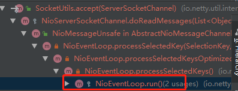
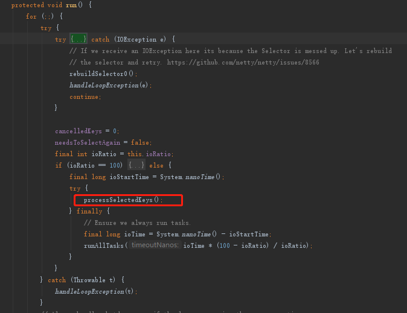
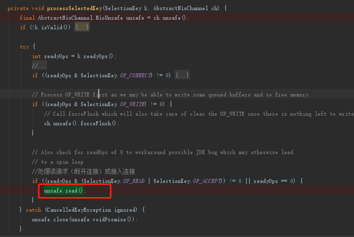
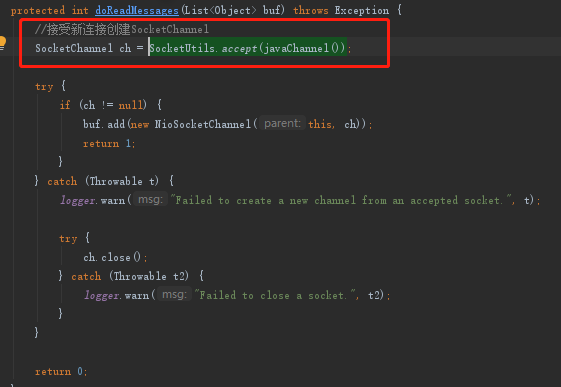
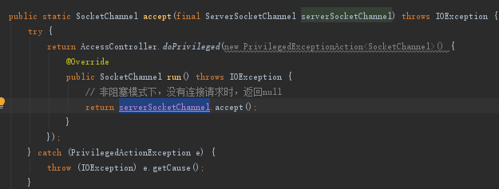
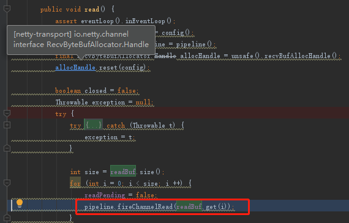
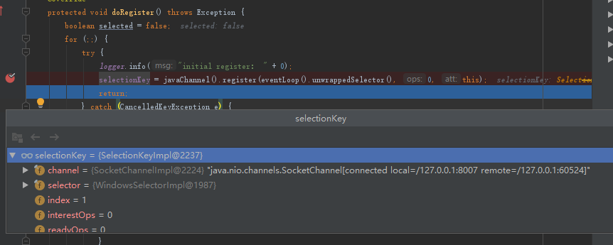
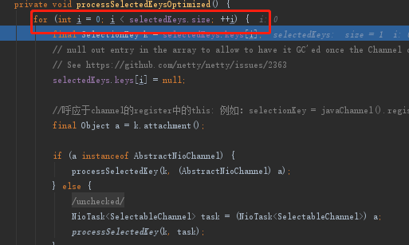

## 1. 开头  

## 2. 创建serversocket
核心为：SocketChannel socketChannel = serverSocketChannel.accept();
### 2.1. NioEventLoop 中的 selector 轮询创建连接事件（OP_ACCEPT）  
  
    

### 2.2. 如果发现有OP_ACCEPT  事件，轮询任务则会调用到创建socketchannel  
     
  
  

### 2.3. 注册socketchannel
将生成的socketchannel注册到selectkey上  
    
     
### 2.4.  Eventloop会轮询selectkeys，检查是否有数据  
    