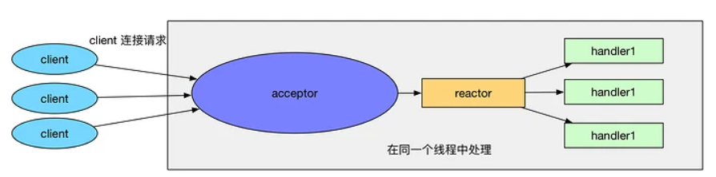
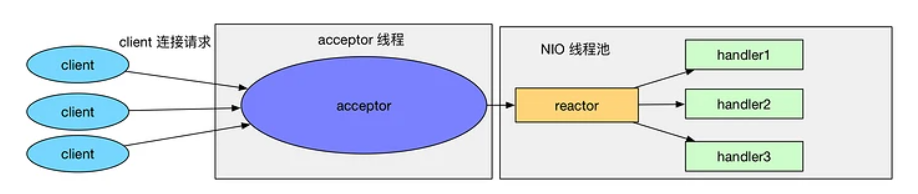
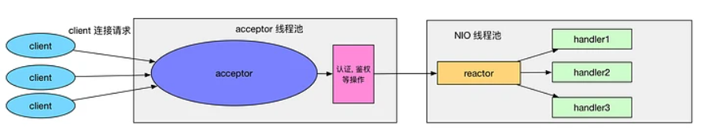
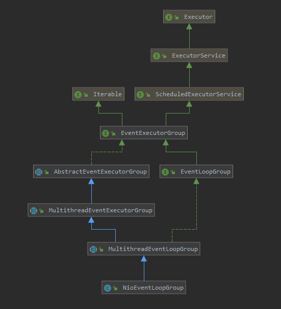
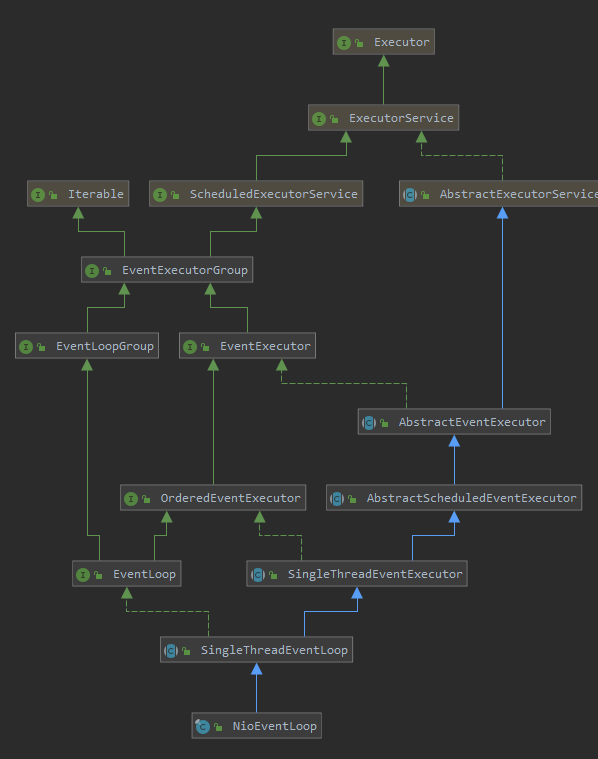
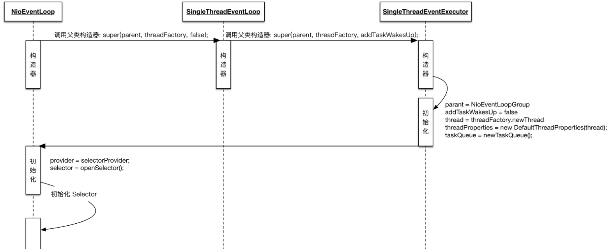
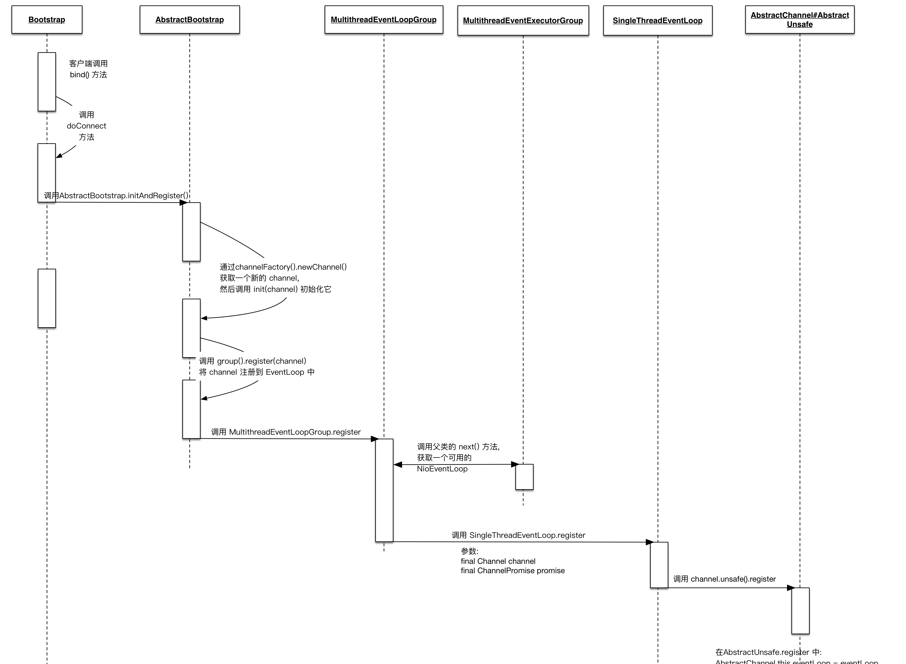
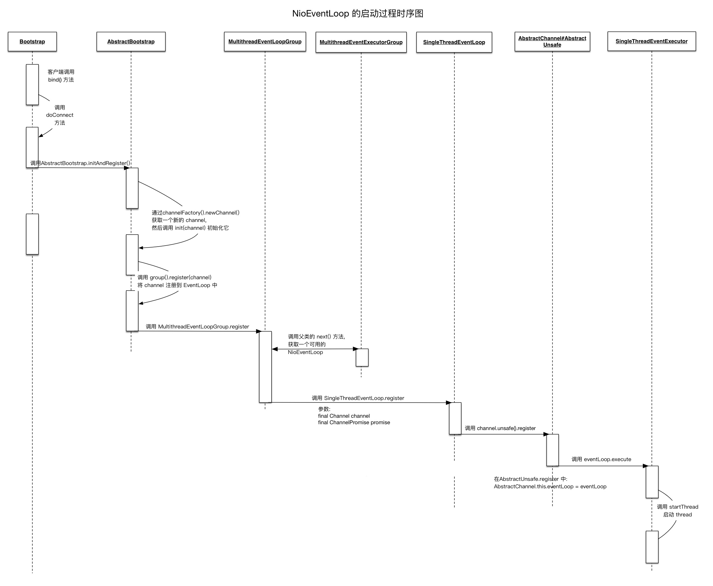

## 1. 开头  
我们由前面的直到当一个netty程序启动后，至少需要一个EventLoopGroup，服务端需要一个bossEventLoopgroup，还需要一个WorkEventLoopGroup，我们知道这是对应于reacotr模型  


## 2. reactor模型回顾
### 2.1. 单线程  
  
 &emsp;&emsp;acceptor 处理和 handler 处理都在一个线程中处理。    
 存在缺陷：
* 当其中某个 handler 阻塞时, 会导致其他所有的 client 的 handler 都得不到执行,
* 并且更严重的是, handler 的阻塞也会导致整个服务不能接收新的 client 请求(因为 acceptor 也被阻塞了). 因为有这么多的缺陷, 因此单线程Reactor 模型用的比较少。
### 2.2. 非主从多线程
  
为了避免单线程的缺陷，如图所示，对单线程进行改进，形成了多线程reactor模型, 其特点如下：  
* 有专门一个线程, 即 Acceptor 线程用于监听客户端的TCP连接请求
* 客户端连接的 IO 操作都是由一个特定的 NIO 线程池负责. 每个客户端连接都与一个特定的 NIO 线程绑定, 因此在这个客户端连接中的所有 IO 操作都是在同一个线程中完成的
* 客户端连接有很多, 但是 NIO 线程数是比较少的, 因此一个 NIO 线程可以同时绑定到多个客户端连接中.  

一般情况下, Reactor 的多线程模式已经可以很好的工作了, 但是依然存在一些缺陷：  
* 如果我们的服务器需要同时处理大量的客户端连接请求， 造成了大量的客户端不能连接到服务器
* 我们需要在客户端连接时, 进行一些权限的检查, 那么单线程的 Acceptor 很有可能就处理不过来, 造成了大量的客户端不能连接到服务器
### 2.3. 主从模型    
  
为了解决上述的缺陷，提出了主从多线程模型，如上图所示  
&emsp;&emsp;其特点为：
* 服务器端接收客户端的连接请求不再是一个线程, 而是由一个独立的线程池组成  


## 3. netty对reactor模型的支持
### 3.1. 单线程
```
EventLoopGroup bossGroup = new NioEventLoopGroup(1);
ServerBootstrap b = new ServerBootstrap();
b.group(bossGroup)
 .channel(NioServerSocketChannel.class)
 ...
```
解释：  
* NioEventLoopGroup 的线程池大小是1
* b.group(bossGroup) 设置了服务器端的 EventLoopGroup
* ServerBootstrap 重写了 group，当传入一个 group 时, 那么 bossGroup 和 workerGroup 就是同一个 NioEventLoopGroup 
* NioEventLoopGroup 只有一个线程, 这样就会导致 Netty 中的 acceptor 和后续的所有客户端连接的 IO 操作都是在一个线程中处理的. 那么对应到 Reactor 的线程模型中, 我们这样设置 NioEventLoopGroup 时, 就相当于 Reactor 单线程模型
### 3.2. 非主从多线程
```
EventLoopGroup bossGroup = new NioEventLoopGroup(1);
EventLoopGroup workerGroup = new NioEventLoopGroup();
ServerBootstrap b = new ServerBootstrap();
b.group(bossGroup, workerGroup)
 .channel(NioServerSocketChannel.class)
 ...
```
解释：  
* bossGroup 中只有一个线程
* 而 workerGroup 中的线程是 CPU 核心数乘以2, 因此对应的到 Reactor 线程模型中, 我们知道, 这样设置的 NioEventLoopGroup 其实就是 Reactor 多线程模型.
### 3.3. 主从多线程模型
主从多线程模型 在 Netty 的服务器端是不存在的。 ServerSocketChannel 只绑定到了 bossGroup 中的一个线程, 因此在调用 Java NIO 的 Selector.select 处理客户端的连接请求时, 实际上是在一个线程中的, 所以对只有一个服务的应用来说, bossGroup 设置多个线程是没有什么作用的, 反而还会造成资源浪费。但是为什么Netty 中的 bossGroup 为什么使用线程池呢？  
作者的回复是：
the creator of Netty says multiple boss threads are useful if we share NioEventLoopGroup between different server bootstraps, but I don't see the reason for it.


&emsp;&emsp;Reactor就是一个执行while (true) { selector.select(); ...}循环的线程，会源源不断的产生新的事件，称作反应堆很贴切。
事件又分为连接事件、IO读和IO写事件，一般把连接事件单独放一线程里处理，即主Reactor（MainReactor），IO读和IO写事件放到另外的一组线程里处理，即从Reactor（SubReactor），从Reactor线程数量一般为2*(CPUs - 1)。   
&emsp;&emsp;所以在运行时，MainReactor只处理Accept事件，连接到来，马上按照策略转发给从Reactor之一，只处理连接，故开销非常小；每个SubReactor管理多个连接，负责这些连接的读和写，属于IO密集型线程，读到完整的消息就丢给业务线程池处理业务，处理完比后，响应消息一般放到队列里，SubReactor会去处理队列，然后将消息写回。  


## 4. NioEventLoopGroup

NioEventLoopGroup可以类比为线程池，其关键点主要有：  
* EventLoopGroup(其实是MultithreadEventExecutorGroup) 内部维护一个类型为 EventExecutor children 数组, 其大小是 nThreads, 这样就构成了一个线程池
* 如果我们在实例化 NioEventLoopGroup 时, 如果指定线程池大小, 则 nThreads 就是指定的值, 反之是处理器核心数 * 2
* MultithreadEventExecutorGroup 中会调用 newChild 抽象方法来初始化 children 数组
* 抽象方法 newChild 是在 NioEventLoopGroup 中实现的, 它返回一个 NioEventLoop 实例.
* NioEventLoop 属性:
   * SelectorProvider provider 属性: NioEventLoopGroup 构造器中通过 SelectorProvider.provider() 获取一个 SelectorProvider
   * Selector selector 属性: NioEventLoop 构造器中通过调用通过 selector = provider.openSelector() 获取一个 selector 对象


## 5. EventLoop

### 5.1. EventLoop总览
通过类图，我们可以知道NioEventLoop继承于SingleThreadEventExecutor，SingleThreadEventExecutor持有java thread, NioEventLoop是Netty 中对本地线程的抽象, 它内部有一个 Thread thread 属性, 存储了一个本地 Java 线程. 因此我们可以认为, 一个 NioEventLoop 其实和一个特定的线程绑定, 并且在其生命周期内, 绑定的线程都不会再改变。它的关键点主要有：
* eventloop的继承链为：NioEventLoop -> SingleThreadEventLoop -> SingleThreadEventExecutor -> AbstractScheduledEventExecutor
* AbstractScheduledEventExecutor实现了schedule 功能，所以eventloop拥有定时任务的功能
* SingleThreadEventLoop实现了队列功能，所以eventloop可以执行execute 方法来向任务队列中添加一个 task, 并由 NioEventLoop 进行调度执行
* 一般eventloop主要执行两中任务：
  * 作为 IO 线程, 执行与 Channel 相关的 IO 操作，包括 调用 select 等待就绪的 IO 事件、读写数据与数据的处理等
  * 作为任务队列, 执行 taskQueue 中的任务, 例如用户调用 eventLoop.schedule 提交的定时任务也是这个线程执行的  


### 5.2. EventLoop实例化
  
我们从时序图中可以看出，SingleThreadEventExecutor会通过ThreadPerTaskExecutor创建thread
```
//一个task一个thread
public final class ThreadPerTaskExecutor implements Executor {
    private final ThreadFactory threadFactory;

    public ThreadPerTaskExecutor(ThreadFactory threadFactory) {
        if (threadFactory == null) {
            throw new NullPointerException("threadFactory");
        }
        this.threadFactory = threadFactory;
    }

    @Override
    public void execute(Runnable command) {
        threadFactory.newThread(command).start();
    }
}

```

```
  protected SingleThreadEventExecutor(EventExecutorGroup parent, Executor executor,
                                        boolean addTaskWakesUp, int maxPendingTasks,
                                        RejectedExecutionHandler rejectedHandler) {
        super(parent);
        this.addTaskWakesUp = addTaskWakesUp;
        this.maxPendingTasks = Math.max(16, maxPendingTasks);
        this.executor = ThreadExecutorMap.apply(executor, this);
        taskQueue = newTaskQueue(this.maxPendingTasks);
        rejectedExecutionHandler = ObjectUtil.checkNotNull(rejectedHandler, "rejectedHandler");
    }
```


### 5.3. EventLoop与 Channel绑定
每个 Channel 都有且仅有一个 EventLoop 与之关联过程如时序图所示
  
AbstractChannel#AbstractUnsafe.register 后, 就完成了 Channel 和 EventLoop 

```

    final ChannelFuture initAndRegister() {
        Channel channel = null;
        try {
            channel = channelFactory.newChannel();
            init(channel);
        } catch (Throwable t) {
            if (channel != null) {
                // channel can be null if newChannel crashed (eg SocketException("too many open files"))
                channel.unsafe().closeForcibly();
                // as the Channel is not registered yet we need to force the usage of the GlobalEventExecutor
                return new DefaultChannelPromise(channel, GlobalEventExecutor.INSTANCE).setFailure(t);
            }
            // as the Channel is not registered yet we need to force the usage of the GlobalEventExecutor
            return new DefaultChannelPromise(new FailedChannel(), GlobalEventExecutor.INSTANCE).setFailure(t);
        }
        //开始register
        ChannelFuture regFuture = config().group().register(channel);
        if (regFuture.cause() != null) {
            if (channel.isRegistered()) {
                channel.close();
            } else {
                channel.unsafe().closeForcibly();
            }
        }
```


```
    public ChannelFuture register(final ChannelPromise promise) {
        ObjectUtil.checkNotNull(promise, "promise");
        promise.channel().unsafe().register(this, promise);
        return promise;
    }
```
发生channel和eventloop绑定

```
    protected abstract class AbstractUnsafe implements Unsafe {

        ......


        public final void register(EventLoop eventLoop, final ChannelPromise promise) {
            if (eventLoop == null) {
                throw new NullPointerException("eventLoop");
            }
            if (isRegistered()) {
                promise.setFailure(new IllegalStateException("registered to an event loop already"));
                return;
            }
            if (!isCompatible(eventLoop)) {
                promise.setFailure(
                        new IllegalStateException("incompatible event loop type: " + eventLoop.getClass().getName()));
                return;
            }

            AbstractChannel.this.eventLoop = eventLoop;

```


### 5.4. EventLoop启动
NioEventLoop 本身就是一个 SingleThreadEventExecutor, 因此 NioEventLoop 的启动, 其实就是 NioEventLoop 所绑定的本地 Java 线程的启动  
所以我们需要找到 SingleThreadEventExecutor 的 thread 字段的 start() 方法。   

* 如下代码为SingleThreadEventExecutor的start方法
```
  private void startThread() {
        if (state == ST_NOT_STARTED) {
            if (STATE_UPDATER.compareAndSet(this, ST_NOT_STARTED, ST_STARTED)) {
                boolean success = false;
                try {
                    doStartThread();
                    success = true;
                } finally {
                    if (!success) {
                        STATE_UPDATER.compareAndSet(this, ST_STARTED, ST_NOT_STARTED);
                    }
                }
            }
        }
    }
```
  * STATE_UPDATER 是 SingleThreadEventExecutor 内部维护的一个属性, 它的作用是标识当前的 thread 的状态. 
  * 在初始的时候, STATE_UPDATER == ST_NOT_STARTED, 因此第一次调用 startThread() 方法时, 就会进入到 if 语句内, 进而调用到 thread.start().  

* 上面的start的方法被execute方法执行，而execute正是在 EventLoop 与 Channel 的关联的时候被AbstractUnsafe.register所执行，如下代码所示
  io.netty.channel.AbstractChannel.AbstractUnsafe#register方法.
  ```
    if (eventLoop.inEventLoop()) {
        register0(promise);
    } else {
        try {
            eventLoop.execute(new Runnable() {
                @Override
                public void run() {
                    register0(promise);
                }
            });
        } catch (Throwable t) {
            logger.warn(
                    "Force-closing a channel whose registration task was not accepted by an event loop: {}",
                    AbstractChannel.this, t);
            closeForcibly();
            closeFuture.setClosed();
            safeSetFailure(promise, t);
        }
  ```
    * Bootstrap.bind -> AbstractChannel#AbstractUnsafe.register 方法, 整个代码都是在主线程中运行的, 因此上面的 eventLoop.inEventLoop() 就为 false
    * 进入到 else 分支, 在这个分支中调用了 eventLoop.execute. eventLoop 是一个 NioEventLoop 的实例, 而 NioEventLoop 没有实现 execute 方法, 因此调用的是 SingleThreadEventExecutor.execute
    * 于是就调用了开始的方法startThread() 方法来启动 SingleThreadEventExecutor 内部关联的 Java 本地线程了，即当 EventLoop.execute 第一次被调用时, 就会触发 startThread() 的调用, 进而导致了 EventLoop 所对应的 Java 线程的启动
