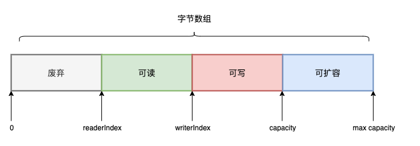

## 1. java NIO Buffer简单回顾
之前已经了解过java NIO Buffer，它的主要关键点：  
* ByteBuffer底层实现包含四个关键字段，并满足大小关系：mark <= position <= limit <= capacity
* ByteBuffer存在写模式和读模式两种状态，内部方法可以触发状态切换，比如flip方法从写状态切换为读状态
* 不同类型的ByteBuffer支持不同的数据类型，包括ByteBuffer、ShortBuffer、CharBuffer、DoubleBuffer、FloatBuffer、IntBuffer等类型


## 2. Netty的扩展
netty的ByteBuf对ByteBuffer实现了非常多扩展功能，并摒弃了一些不足：  
* 不区分读写状态，不需要切换状态；
* 支持池化，避免频繁的GC回收；
* 支持引用计数；
* 类型兼容（同一个ByteBuf可以承载各种数据类型）；
* 支持Unsafe操作的ByteBuf；
* 支持堆外和堆内两种ByteBuf；
* 支持零拷贝的复合类型CompositeByteBuf；  


## 3. ByteBuf的基本特性
### 3.1. 继承关系  
ByteBuf是一个接口，它有众多的实现。子类的命名非常规整，仅从名字上我们就可以将各个子类划分为以下几类：  
* 池化和非池化的ByteBuf，例如：PooledHeapByteBuf 和 UnpooledHeapByteBuf；
* 含Unsafe操作的ByteBuf，例如：PooledUnsafeHeapByteBuf;
* 分片类型的ByteBuf，例如：PooledSliceByteBuf和PooledDuplicatedByteBuf；
* 组合ByteBuf，例如：CompositeBuf;
* 实现了引用计数的ByteBuf。  


### 3.2. 读写指针  
类似NIO ByteBuffer，ByteBuf底层实现也是字节数组，也同样由读写指针来控制读写位置。在ByteBuf的继承类AbstractByteBuf中定义了以下读写指针字段： 
```
    // 当前读指针
    int readerIndex;
    // 当前写指针
    int writerIndex;
    // 暂存的读指针
    private int markedReaderIndex;
    // 暂存的写指针
    private int markedWriterIndex;
    // 最大容量
    private int maxCapacity;
```    
  
* 每读取一个字节，readerIndex递增1；直到readerIndex等于writerIndex，表示ByteBuf已经不可读；
* 每写入一个字节，writerIndex递增1；直到writerIndex等于capacity，表示ByteBuf已经不可写；
* 当writerIndex等于capacity表示底层字节数组需要扩容，且最大扩容不能超过max capacity。
* readableBytes()：可读字节数 –> this.writerIndex - this.readerIndex
* writableBytes()：可写字节数 –> this.capacity - this.writerIndex
* isReadable()：是否可读 –> this.writerIndex - this.readerIndex > 0
* isWritable()：是否可写 –> this.capacity - this.writerIndex > 0  


### 3.3. ByteBuf接口常用方法  
#### 3.3.1. 继承于Comparable和RefrenceCounted的方法  
```
    // 引用数加1
    ReferenceCounted retain();
    // 引用数减1，如果引用数减为0，则释放该对象。
    // 如果该对象被释放则返回true，否则返回false。
    // 注意：子类实现其实是减2，后文会提到。
    boolean release();
```

#### 3.3.2. ByteBuf的核心方法
* 容量有关
  ```
    // 1.返回当前容量
    public abstract int capacity();
    // 2.调整当前容量
    public abstract ByteBuf capacity(int newCapacity);
    // 3.最大容量（capacity的最大上限）
    public abstract int maxCapacity();
  ```

* 读写指针有关方法
都是readerIndex、writerIndex、capital、maxcapital等四个值衍生的方法。
  ```
    // 读写指针相关方法
    // 1.获取当前读指针
    public abstract int readerIndex();
    // 2.设置当前读指针
    public abstract ByteBuf readerIndex(int readerIndex);
    // 3.获取当前写指针
    public abstract int writerIndex();
    // 4.设置当前写指针
    public abstract ByteBuf writerIndex(int writerIndex);
    // 5.同时设置读写指针
    public abstract ByteBuf setIndex(int readerIndex, int writerIndex);
    // 6.获取可读字节数(this.writerIndex - this.readerIndex)
    public abstract int readableBytes();
    // 7.获取可写字节数(this.capacity - this.writerIndex)
    public abstract int writableBytes();
    // 8.获取最大可写字节数 (this.maxCapacity - this.writerIndex)}
    public abstract int maxWritableBytes();
    // 9.是否可读(this.writerIndex - this.readerIndex)
    public abstract boolean isReadable();
    // 10.是否可写(this.capacity - this.writerIndex)
    public abstract boolean isWritable();
    // 11.清空(相当于setIndex(0, 0))
    public abstract ByteBuf clear();
    // 12.记录读指针
    public abstract ByteBuf markReaderIndex();
    // 13.从记录中恢复读指针
    public abstract ByteBuf resetReaderIndex();
    // 14.记录写指针 
    public abstract ByteBuf markWriterIndex();
    // 15.从记录中恢复写指针
    public abstract ByteBuf resetWriterIndex();
    // 16.丢弃已读字节
    public abstract ByteBuf discardReadBytes();
  ```  

  * 随机读写数据有关方法，支持指定位置的读写数据，其中读数据并不会改变指针值
  ```
    // 随机读写数据
    // ... 这部分类似的方法非常多，以下只列举一部分 ...
    // 1.从指定位置读取数据
    public abstract boolean getBoolean(int index);
    public abstract short getUnsignedByte(int index);
    public abstract short getShort(int index);
    public abstract int getUnsignedShort(int index);
    public abstract int   getInt(int index);
    public abstract long  getLong(int index);
    public abstract double getDouble(int index);
    public abstract short getShortLE(int index);（LE：Little Endian byte order，表示小端序，下同）
    public abstract int   getIntLE(int index);
    public abstract long  getLongLE(int index);
    // 略...
    // 2.在指定位置写入数据
    public abstract ByteBuf setBoolean(int index, boolean value);
    public abstract ByteBuf setByte(int index, int value);
    public abstract ByteBuf setShortLE(int index, int value);
    public abstract ByteBuf setInt(int index, int value);
    public abstract ByteBuf setIntLE(int index, int value);
    // 略... 
  ```

  * 顺序读写数据有关方法，上述方法从读(或写)指针位置顺序往后读(或写)数据，并移动读(或写)指针
    ```
    // 1. 在readerIndex位置读取数据并移动指针
    public abstract boolean readBoolean();
    public abstract byte  readByte();
    public abstract short readShort();
    public abstract short readShortLE();
    public abstract int   readInt();
    public abstract int   readIntLE();
    // 略...
    // 2. 在位置写入数据并移动指针
    public abstract ByteBuf writeBoolean(boolean value);
    public abstract ByteBuf writeByte(int value);
    public abstract ByteBuf writeShort(int value);
    public abstract ByteBuf writeShortLE(int value);
    public abstract ByteBuf writeInt(int value);
    public abstract ByteBuf writeIntLE(int value);
    // 略...
    ```

  * 分片相关方法，支持分片获取，实现快速的低成本浅复制
    ```
    public abstract ByteBuf slice();
    public abstract ByteBuf slice(int index, int length);
    public abstract ByteBuf duplicate();
    public abstract ByteBuf retainedSlice(); // 更新引用计数
    public abstract ByteBuf retainedDuplicate(); // 更新引用计数
    ```

  * 其他方法
    ```
    // 判断底层是否为NIO direct buffer
    public abstract boolean isDirect();
    ```


## 4. ByteBuf浅复制实现  
ByteBuf支持浅复制分片，一共有两种浅复制:  
* slice浅复制，slice只是对ByteBuf中的一部分进行浅复制
* duplicate浅复制，duplicate是对整个ByteBuf的浅复制    


### 4.1. slice浅复制  
与原来的ByteBuf共享同一个存储空间，并且也可以被多个分片同时共享   

* slice(int index, int length)的浅复制示例如下：
```
    // io.netty.buffer.AbstractByteBuf.java

    @Override
    public ByteBuf slice(int index, int length) {
        ensureAccessible();
        return new UnpooledSlicedByteBuf(this, index, length);
    }
```
只是新建了一个分片对象UnpooledSlicedByteBuf，构造函数传入了当前ByteBuf（this）、开始索引（index）以及分片长度（length）  

* 父类的构造函数，对该分片对象进行了初始化,slice分片仅仅是对原ByteBuf进行了一层封装，并没有发生任何内存复制行为，所以是非常高效快捷的操作
```
    // 被分片的ByteBuf
    private final ByteBuf buffer;
    // 偏移量
    private final int adjustment;

    AbstractUnpooledSlicedByteBuf(ByteBuf buffer, int index, int length) {
        super(length);
        checkSliceOutOfBounds(index, length, buffer);
        if (buffer instanceof AbstractUnpooledSlicedByteBuf) {
            // 如果传入的是slice分片，则需要叠加其偏移量
            this.buffer = ((AbstractUnpooledSlicedByteBuf) buffer).buffer;
            adjustment = ((AbstractUnpooledSlicedByteBuf) buffer).adjustment + index;
        } else if (buffer instanceof DuplicatedByteBuf) {
            // 如果传入的是dulicated分片，不需要叠加(因为其偏移量为0)
            this.buffer = buffer.unwrap();
            adjustment = index;
        } else {
            this.buffer = buffer;
            adjustment = index;
        }
        // 初始化当前最大容量，对分片来说，最大容量不能超过length
        initLength(length);
        // 初始化写指针
        writerIndex(length);
    }
```
### 4.2. duplicate浅复制    
与slice类似，duplicate也是如此手法。唯一不同是，duplicate是对整个ByteBuf进行浅复制。
```
public DuplicatedByteBuf(ByteBuf buffer) {
    this(buffer, buffer.readerIndex(), buffer.writerIndex());
}

DuplicatedByteBuf(ByteBuf buffer, int readerIndex, int writerIndex) {
    super(buffer.maxCapacity());

    if (buffer instanceof DuplicatedByteBuf) {
        this.buffer = ((DuplicatedByteBuf) buffer).buffer;
    } else if (buffer instanceof AbstractPooledDerivedByteBuf) {
        this.buffer = buffer.unwrap();
    } else {
        this.buffer = buffer;
    }
    // 直接复用原ByteBuf的读写指针
    setIndex(readerIndex, writerIndex);
    markReaderIndex();
    markWriterIndex();
}

```    
注意：
* 无论是slice还是duplicate，都没有调用retain()方法来改变底层ByteBuf的引用计数。
* 如果底层ByteBuf调用release()后被释放，那么所有基于该ByteBuf的浅复制对象都不能进行读写。
* 所以要确保浅复制实例的使用安全，需要通过调用一次retain()方法来递增底层ByteBuf的引用计数；
* 然后在浅复制实例使用结束后，再调用一次release()来递减底层ByteBuf的引用计数  


## 5. CompositeByteBuf  
&emsp;&emsp;CompositeByteBuf也是一个非常典型的ByteBuf，用来将多个ByteBuf组合在一起，形成一个逻辑上的ByteBuf。这点和分片ByteBuf非常类似，都属于在逻辑层面上避免拷贝，实现所谓的“零复制”（Zero Copy)。

具体原理分析：     
* CompositeByteBuf在内部维护一个可扩容的components数组，所有被组合的ByteBuf被封装为Component对象，对象中缓存了该ByteBuf的偏移量adjustment、开始索引offset、结束索引endOffset等  
```
private Component[] components; // resized when needed

private static final class Component {
    final ByteBuf buf;
    int adjustment;
    int offset;
    int endOffset;

    private ByteBuf slice; // cached slice, may be null
}
```  
* CompositeByteBuf的读写，需要先在components数组里二分查找对应索引所在的Component对象，然后对Component对象所包装的ByteBuf进行读写。  
  ```
    @Override
    protected byte _getByte(int index) {
        // 确定索引index所在的Component对象
        Component c = findComponent0(index);
        // 对Component对象所包装的ByteBuf进行读写
        return c.buf.getByte(c.idx(index));
    }

    private Component findComponent0(int offset) {
        // 先检查最近访问的Component是否满足条件
        Component la = lastAccessed;
        if (la != null && offset >= la.offset && offset < la.endOffset) {
           return la;
        }
        // 否则二分查找
        return findIt(offset);
    }

    // 二分查找
    private Component findIt(int offset) {
        for (int low = 0, high = componentCount; low <= high;) {
            int mid = low + high >>> 1;
            Component c = components[mid];
            if (offset >= c.endOffset) {
                low = mid + 1;
            } else if (offset < c.offset) {
                high = mid - 1;
            } else {
                lastAccessed = c;
                return c;
            }
        }

        throw new Error("should not reach here");
    }

  ```  

## 6. 引用计数  
bytebuffer的实现会继承AbstractReferenceCountedByteBuf从而拥有引用计数的功能。核心功能使用CAS原子操作和位运算实现。
```
    private static final AtomicIntegerFieldUpdater<AbstractReferenceCountedByteBuf> refCntUpdater = 
    AtomicIntegerFieldUpdater.newUpdater(AbstractReferenceCountedByteBuf.class, "refCnt");

    // even => "real" refcount is (refCnt >>> 1); odd => "real" refcount is 0
    @SuppressWarnings("unused")
    private volatile int refCnt = 2;
```  
注意：refCntUpdater是修改refCnt字段的原子更新器。而refCnt是存储引用计数的字段。注意，当前ByteBuf的引用数为 refCnt / 2，因此当refCnt等于1时，引用数为0。  

### 6.1. 增加引用计数
retain方法可以增加ByteBuf的引用计数  
```
    @Override
    public ByteBuf retain() {
        return retain0(1);
    }

    private ByteBuf retain0(final int increment) {
        // 将increment扩大两倍为adjustedIncrement
        int adjustedIncrement = increment << 1; // 此处允许溢出，因为后边有判断溢出的逻辑
        // 将adjustedIncrement更新到refCnt，因此refCnt初始值为2，所以恒为偶数
        int oldRef = refCntUpdater.getAndAdd(this, adjustedIncrement);
        // 如果oldRef不是偶数，直接抛异常
        if ((oldRef & 1) != 0) {
            throw new IllegalReferenceCountException(0, increment);
        }
        // 如果oldRef 和 oldRef + adjustedIncrement 正负异号，则意味着已经溢出。
        if ((oldRef <= 0 && oldRef + adjustedIncrement >= 0)
                || (oldRef >= 0 && oldRef + adjustedIncrement < oldRef)) {
            // 发生溢出需要回滚adjustedIncrement
            refCntUpdater.getAndAdd(this, -adjustedIncrement);
            // 然后抛异常
            throw new IllegalReferenceCountException(realRefCnt(oldRef), increment);
        }
        return this;
    }
```    

**注意：每次调用retain()，都会尝试给refCnt加2，所以确保了refCnt恒为偶数，也就是说当前引用数为refCnt / 2。这里为啥设计为递增2而不是递增1，因为这样位运算更加高效吧，而且实际应用中Integer.MAX_VALUE / 2的引用数也是绰绰有余**  


### 6.2. 释放引用release  
release()操作每次减少引用计数2  
```
    @Override
    public boolean release() {
        return release0(1);
    }

    private boolean release0(int decrement) {
        int rawCnt = nonVolatileRawCnt(), realCnt = toLiveRealCnt(rawCnt, decrement);
        if (decrement == realCnt) {
            // 如果decrement == realCnt，意味着需要释放对象
            if (refCntUpdater.compareAndSet(this, rawCnt, 1)) {
                deallocate();
                return true;
            }
            return retryRelease0(decrement);
        }
        return releaseNonFinal0(decrement, rawCnt, realCnt);
    }

    private boolean releaseNonFinal0(int decrement, int rawCnt, int realCnt) {
        if (decrement < realCnt
                // all changes to the raw count are 2x the "real" change
                && refCntUpdater.compareAndSet(this, rawCnt, rawCnt - (decrement << 1))) {
            return false;
        }
        // 上述更新失败则调用重试方法
        return retryRelease0(decrement);
    }

    private boolean retryRelease0(int decrement) {
        // 死循环不断重试释放引用
        for (;;) {
            int rawCnt = refCntUpdater.get(this), realCnt = toLiveRealCnt(rawCnt, decrement);
            if (decrement == realCnt) {
                if (refCntUpdater.compareAndSet(this, rawCnt, 1)) {
                    // 如果refCnt为1，意味着实际的引用数为1/2=0，所以需要释放掉
                    deallocate();
                    return true;
                }
            } else if (decrement < realCnt) {
                // 如果当前引用数realCnt大于decrement，则可以正常更新
                if (refCntUpdater.compareAndSet(this, rawCnt, rawCnt - (decrement << 1))) {
                    return false;
                }
            } else {
                // 如果当前引用数realCnt小于decrement，则抛出引用异常
                throw new IllegalReferenceCountException(realCnt, -decrement);
            }
            Thread.yield(); // this benefits throughput under high contention
        }
    }

    /**
     * Like {@link #realRefCnt(int)} but throws if refCnt == 0
     */
    private static int toLiveRealCnt(int rawCnt, int decrement) {
        if ((rawCnt & 1) == 0) {
            // 如果是偶数，则引用数为rawCnt >>> 1
            return rawCnt >>> 1;
        }
        // 如果是奇数，意味着该对象可能已经被释放掉
        throw new IllegalReferenceCountException(0, -decrement);
    }
```  
分析如下：    
1） release0算法流程：
* 获取当前计数rawCnt，获取实际引用数realCnt；
* 判断decrement是否等于realCnt；
  * 如果相等，意味着本次release之后，对象需要被释放，尝试原子操作修改引用数；
    * 如果修改成功，直接释放对象并返回true；
    * 如果修改失败，调用retryRelease0进行循环重试释放；
  * 如果不相等，意味着本次release之后，对象依然存活，尝试调用releaseNonFinal0；
    * 如果decrement < realCnt，且原子修改引用计数成功，直接返回false；
    * 否则，调用retryRelease0进行循环重试释放。   
  
2） retryRelease0算法流程：
* 死循环开始；
* 获取当前计数rawCnt，获取实际引用数realCnt；
* 判断decrement == realCnt；
  * 如果相等，意味着本次release之后，对象需要被释放，尝试原子操作修改引用数；
    * 如果修改成功，直接释放对象并返回true；
    * 否则跳转；
* 判断decrement < realCnt；
  * 如果成立，意味着本次release之后，对象依然存活，尝试原子更新引用计数；
    * 如果修改成功，直接返回false；
    * 否则跳转；
* 其他情况（decrement > realCnt) 直接抛异常；
* Thread.yield()，尝试让出cpu调度，给其它的紧急任务。
* 跳转到1。  


## 7. 池化技术  
ByteBuf分为两类池化(Pooled)和非池化(Unpooled)。  
* 非池化的ByteBuf每次新建都会申请新的内存空间，并且用完即弃，给JVM的垃圾回收带来负担；
* 而池化的ByteBuf通过内部栈来保存闲置的对象空间，每次新建ByteBuf的时候，优先向内部栈申请闲置的对象空间，并且用完之后重新归还给内部栈，从而减少了JVM的垃圾回收压力   


### 7.1. 非池化实现  
非池化的ByteBuf实现非常简单粗暴    
#### 7.1.1. UnpooledHeapByteBuf    
* 对象分配 UnpooledHeapByteBuf在构造函数里直接新建了一个字节数组来保存数据.   
```
    private final ByteBufAllocator alloc;
    // 使用字节数组保存数据
    byte[] array;

    public UnpooledHeapByteBuf(ByteBufAllocator alloc, int initialCapacity, int maxCapacity) {
        super(maxCapacity);

        checkNotNull(alloc, "alloc");

        if (initialCapacity > maxCapacity) {
            throw new IllegalArgumentException(String.format(
                    "initialCapacity(%d) > maxCapacity(%d)", initialCapacity, maxCapacity));
        }

        this.alloc = alloc;
        setArray(allocateArray(initialCapacity));
        setIndex(0, 0);
    }
    // 分配字节数组
    protected byte [] allocateArray(int initialCapacity) {
        return new byte[initialCapacity];
    }

```
* 对象释放 UnpooledHeapByteBuf的释放全权交给JVM
  ```
    @Override
    protected void deallocate() {
        freeArray(array);
        array = EmptyArrays.EMPTY_BYTES;
    }

    protected void freeArray(byte[] array) {
        // NOOP
    }
  ```
#### 7.1.2. UnpooledDirectByteBuf     
* UnpooledDirectByteBuf则在构造函数中直接新建了一个DirectBuffer   
```
    // 使用DirectBuffer保存数据
    private ByteBuffer buffer;
    public UnpooledDirectByteBuf(ByteBufAllocator alloc, int initialCapacity, int maxCapacity) {
        super(maxCapacity);
        if (alloc == null) {
            throw new NullPointerException("alloc");
        }
        if (initialCapacity < 0) {
            throw new IllegalArgumentException("initialCapacity: " + initialCapacity);
        }
        if (maxCapacity < 0) {
            throw new IllegalArgumentException("maxCapacity: " + maxCapacity);
        }
        if (initialCapacity > maxCapacity) {
            throw new IllegalArgumentException(String.format(
                    "initialCapacity(%d) > maxCapacity(%d)", initialCapacity, maxCapacity));
        }

        this.alloc = alloc;
        setByteBuffer(allocateDirect(initialCapacity));
    }
    // 分配DirectBuffer
    protected ByteBuffer allocateDirect(int initialCapacity) {
        return ByteBuffer.allocateDirect(initialCapacity);
    }
```

* UnpooledDirectByteBuf则尝试主动释放其拥有的DirectBuffer
```
    @Override
    protected void deallocate() {
        ByteBuffer buffer = this.buffer;
        if (buffer == null) {
            return;
        }

        this.buffer = null;

        if (!doNotFree) {
            // 如果DirectBuffer还没被释放，则尝试释放之
            freeDirect(buffer);
        }
    }

    /**
     * Free a direct {@link ByteBuffer}
     */
    protected void freeDirect(ByteBuffer buffer) {
        PlatformDependent.freeDirectBuffer(buffer);
    }
```


### 7.2. 池化技术
池化的ByteBuf都继承自PooledByteBuf类，主要的实现有四种：  
* PooledHeapByteBuf
* PooledDirectByteBuf
* PooledUnsafeDirectByteBuf
* PooledUnsafeHeapByteBuf  

#### 7.2.1. Recycler
如上的都持有一个回收器字段， 例如PooledHeapByteBuf的回收字段为：
```
  private static final Recycler<PooledHeapByteBuf> RECYCLER = new Recycler<PooledHeapByteBuf>() {
        @Override
        protected PooledHeapByteBuf newObject(Handle<PooledHeapByteBuf> handle) {
            return new PooledHeapByteBuf(handle, 0);
        }
    };

```  
* Recycler是一个抽象类，所有的子类都要实现一个newObject方法，用于新建一个子类ByteBuf对象
* Recycler本质上实现的是一个栈的功能，新建ByteBuf的时候，可以向Recycler申请一个闲置对象；当ByteBuf使用完毕后，可以回收并归还给Recycler  
     
* RECYCLER.get()用来获取对象
   
```
 public final T get() {
        if (maxCapacityPerThread == 0) {
            return newObject((Handle<T>) NOOP_HANDLE);
        }
        // 尝试从栈中获取闲置对象
        Stack<T> stack = threadLocal.get();
        DefaultHandle<T> handle = stack.pop();
        if (handle == null) {
            // 如果没有闲置对象，调用newObject新建一个新的对象。
            handle = stack.newHandle();
            handle.value = newObject(handle);
        }
        return (T) handle.value;
    }
```
&emsp;&emsp;分析：
  * 新建池化的ByteBuf都是优先从栈中获取闲置对象；
  * 当栈没有闲置对象再新建。
  * 新建对象还传入了新建的handle，这个handle在对象回收阶段会使用到   
  * 为了抹去历史的使用痕迹，每个新申请的ByteBuf对象，都会调用reuse方法进行初始化（以PooledDirectByteBuf为例） 
    ```
      static PooledDirectByteBuf newInstance(int maxCapacity) {
          PooledDirectByteBuf buf = RECYCLER.get();
          buf.reuse(maxCapacity);
          return buf;
      }
      /**
       * Method must be called before reuse this {@link PooledByteBufAllocator}
       */
      final void reuse(int maxCapacity) {
          maxCapacity(maxCapacity);
          setRefCnt(1);
          setIndex0(0, 0);
          discardMarks();
      }
    ```
**PS：这里有点像对象池**   


* 回收ByteBuf   
前面我们提到：当ByteBuf引用数为0的时候，会调用deallocate()方法进行释放。实现如下:  
```
    @Override
    protected final void deallocate() {
        if (handle >= 0) {
            final long handle = this.handle;
            this.handle = -1;
            memory = null;
            chunk.arena.free(chunk, tmpNioBuf, handle, maxLength, cache);
            tmpNioBuf = null;
            chunk = null;
            recycle();
        }
    }

    private void recycle() {
        recyclerHandle.recycle(this);
    }

```  
最后调用了handler进行回收。所谓的回收动作，其实就是放回栈中:  
```
   static final class DefaultHandle<T> implements Handle<T> {
        private int lastRecycledId;
        private int recycleId;

        boolean hasBeenRecycled;

        private Stack<?> stack;
        private Object value;

        DefaultHandle(Stack<?> stack) {
            this.stack = stack;
        }

        @Override
        public void recycle(Object object) {
            if (object != value) {
                throw new IllegalArgumentException("object does not belong to handle");
            }

            Stack<?> stack = this.stack;
            if (lastRecycledId != recycleId || stack == null) {
                throw new IllegalStateException("recycled already");
            }
            // 将该handler重新放入栈中
            stack.push(this);
        }
    }

```   


## 8. Unsafe  
还有一类使用了Unsafe操作的ByteBuf
* UnpooledUnsafeDirectByteBuf
* UnpooledUnsafeHeapByteBuf
* PooledUnsafeHeapByteBuf
* PooledUnsafeDirectByteBuf    
### 8.1. Unsafe的bytebuf 
unsafe类的bytebuf使用了sun.misc.Unsafe操作数组：  
```
    @Override
    protected byte _getByte(int index) {
        return UnsafeByteBufUtil.getByte(addr(index));
    }
    UnsafeByteBufUtil
    static byte getByte(long address) {
        return UNSAFE.getByte(address);
    }
```
### 8.2. 非Unsafe的bytebuf 
一般使用的是HeapByteBufUtil：
```
    @Override
    protected byte _getByte(int index) {
        return HeapByteBufUtil.getByte(memory, idx(index));
    }
```
```
   static byte getByte(byte[] memory, int index) {
        return memory[index];
    }
```
底层其实是简单的数组寻址  


### 8.3. 为什么要用Unsafe
Unsafe操作可以带来非常可观的性能提升，UnsafeByteBufUtil的性能非常优越.  
Unsafe类使Java拥有了像C语言的指针一样操作内存空间的能力。实质上扩展Java语言表达能力、便于在更高层（Java层）代码里实现原本要在更低层（C层）实现的核心库功能用的。这些功能包括裸内存的申请/释放/访问，低层硬件的atomic/volatile支持，创建未初始化对象等。 Unsafe 类提供了硬件级别的原子操作，Unsafe 里面的方法都是 native 方法，通过使用 JNI 的方式来访问本地 C++ 实现


## 9. 总结  
ByteBuf及其子类的实现原理，包括读写指针、常用方法、浅复制、引用计数、池化、Unsafe对象等实现原理。