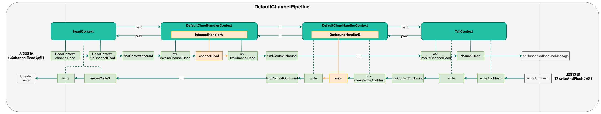

## 1. handler的整体结构  
  
* handler分为实现ChannelInboundHandler接口的入站处理器和实现ChannelOutboundHandler接口的出站处理器；
* handler由DefaultChannelHandlerContext进行包装，并组成一个双向链表；
* 所有的入站操作从HeadContext出发，沿着链表经由每一个入站处理器处理后向TailContext方向传递；
* 所有的出站操作从TailContext出发，沿着链表经由每一个出站处理器处理后向HeadContext方向传递；
* 无论是入站操作抑或是出站操作的传递，都可以在handler中按照业务需求被中断或者改变传递方向。  


## 2. handler的初始化  
先看下handler是如何使用的，这个对于我们已经很熟悉了
```
// Configure the server.
EventLoopGroup bossGroup = new NioEventLoopGroup();
EventLoopGroup workerGroup = new NioEventLoopGroup();
final EchoServerHandler serverHandler = new EchoServerHandler();
try {
    ServerBootstrap b = new ServerBootstrap();
    b.group(bossGroup, workerGroup)
        .channel(NioServerSocketChannel.class)
        .option(ChannelOption.SO_BACKLOG, 100)
        .handler(new LoggingHandler(LogLevel.INFO))
        //两种设置keepalive风格
        .childOption(ChannelOption.SO_KEEPALIVE, true)
        .childOption(NioChannelOption.SO_KEEPALIVE, true)
        //切换到unpooled的方式之一
        .childOption(ChannelOption.ALLOCATOR, UnpooledByteBufAllocator.DEFAULT)
            .childHandler(new ChannelInitializer<SocketChannel>() {
            @Override
            public void initChannel(SocketChannel ch) throws Exception {
                ChannelPipeline p = ch.pipeline();
                if (sslCtx != null) {
                    p.addLast(sslCtx.newHandler(ch.alloc()));
                }
                p.addLast(new LoggingHandler(LogLevel.INFO));
                p.addLast(serverHandler);
            }
        });
    // Start the server.
    ChannelFuture f = b.bind(PORT).sync();
    // Wait until the server socket is closed.
    f.channel().closeFuture().sync();
} finally {
    // Shut down all event loops to terminate all threads.
    bossGroup.shutdownGracefully();
    workerGroup.shutdownGracefully();
}
```
```
    void init(Channel channel) {
        setChannelOptions(channel, options0().entrySet().toArray(newOptionArray(0)), logger);
        setAttributes(channel, attrs0().entrySet().toArray(newAttrArray(0)));

        ChannelPipeline p = channel.pipeline();

        final EventLoopGroup currentChildGroup = childGroup;
        final ChannelHandler currentChildHandler = childHandler;
        final Entry<ChannelOption<?>, Object>[] currentChildOptions =
                childOptions.entrySet().toArray(newOptionArray(0));
        final Entry<AttributeKey<?>, Object>[] currentChildAttrs = childAttrs.entrySet().toArray(newAttrArray(0));
        //ChannelInitializer一次性、初始化handler:
        //负责添加一个ServerBootstrapAcceptor handler，添加完后，自己就移除了:
        //ServerBootstrapAcceptor handler： 负责接收客户端连接创建连接后，对连接的初始化工作。
        p.addLast(new ChannelInitializer<Channel>() {
            @Override
            public void initChannel(final Channel ch) {
                final ChannelPipeline pipeline = ch.pipeline();
                ChannelHandler handler = config.handler();
                if (handler != null) {
                    pipeline.addLast(handler);
                }

                ch.eventLoop().execute(new Runnable() {
                    @Override
                    public void run() {
                        pipeline.addLast(new ServerBootstrapAcceptor(
                                ch, currentChildGroup, currentChildHandler, currentChildOptions, currentChildAttrs));
                    }
                });
            }
        });
    }
```

ChannelInitializer的实现方法中，调用ch.pipeline().addLast方法，不断地将handler追加到双向链表中（TailContext之前），从而形成上图所示的双向链表结构


## 3. handler类型
可以分为两大类，出站和入站handler类型  
### 3.1. 入站
定义了常见的入站操作包括channelActive、channelRead、channelInactive等，还支持用户自定义入站操作userEventTriggered  。 
```
public interface ChannelInboundHandler extends ChannelHandler {

    void channelRegistered(ChannelHandlerContext ctx) throws Exception;

    void channelUnregistered(ChannelHandlerContext ctx) throws Exception;

    void channelActive(ChannelHandlerContext ctx) throws Exception;

    void channelInactive(ChannelHandlerContext ctx) throws Exception;

    void channelRead(ChannelHandlerContext ctx, Object msg) throws Exception;

    void channelReadComplete(ChannelHandlerContext ctx) throws Exception;

    void userEventTriggered(ChannelHandlerContext ctx, Object evt) throws Exception;

    void channelWritabilityChanged(ChannelHandlerContext ctx) throws Exception;

    @Override
    @SuppressWarnings("deprecation")
    void exceptionCaught(ChannelHandlerContext ctx, Throwable cause) throws Exception;
}
```  
用法：   
&emsp;&emsp;常见用法是继承自定义一个hanlder继承ChannelInboundHandlerAdapter  
&emsp;&emsp;ChannelInboundHandlerAdapter是ChannelInboundHandler接口的一个默认实现，内部所有方法都是将入站操作往后传递，不作任何业务处理，如channelRead方法，然后覆盖并实现其中的部分方法：
```
    @Override
    public void channelRead(ChannelHandlerContext ctx, Object msg) throws Exception {
        ctx.fireChannelRead(msg);
    }
```

### 3.2. 出站
出站handler都实现了ChannelOutboundHandler接口，并提供常见的出站操作（bind、connect、close、write、flush等等）   
```
public interface ChannelOutboundHandler extends ChannelHandler {

    void bind(ChannelHandlerContext ctx, SocketAddress localAddress, ChannelPromise promise) throws Exception;

    void connect(ChannelHandlerContext ctx, SocketAddress remoteAddress,
            SocketAddress localAddress, ChannelPromise promise) throws Exception;

    void disconnect(ChannelHandlerContext ctx, ChannelPromise promise) throws Exception;

    void close(ChannelHandlerContext ctx, ChannelPromise promise) throws Exception;

    void deregister(ChannelHandlerContext ctx, ChannelPromise promise) throws Exception;

    void read(ChannelHandlerContext ctx) throws Exception;

    void write(ChannelHandlerContext ctx, Object msg, ChannelPromise promise) throws Exception;

    void flush(ChannelHandlerContext ctx) throws Exception;
}

```  

&emsp;&emsp;常见用法是继承自定义一个hanlder继承ChannelOutboundHandlerAdapter,按照需求可覆盖其中的任何方法
&emsp;&emsp;ChannelOutboundHandlerAdapter是ChannelOutboundHandler的一个默认实现，内部所有方法都是将出站操作往前传递，不作任何业务处理，如write方法
```
    @Override
    public void write(ChannelHandlerContext ctx, Object msg, ChannelPromise promise) throws Exception {
        ctx.write(msg, promise);
    }
```


## 4. 常用handler  

### 4.1.入站handler
#### 4.1.1. ByteToMessageDecoder
ByteToMessageDecoder是一个抽象的解码器，它的具体实现有FixedLengthFrameDecoder（定长），LineBasedFrameDecoder（行分隔符），DelimiterBasedFrameDecoder（自定义分隔符），LengthFieldBasedFrameDecoder（长度编码，在消息头传输长度），JsonObjectDecoder（json分隔符）  
其核心原理为：
  * ByteToMessageDecoder可以从ByteBuf这种字节流中读取数据，然后转换为其他形式的消息对象（也可以是ByteBuf）
  * callDecode内部持续循环消费字节流
  * 然后底层调用了子类实现的抽象方法decode进行解码
  * decode是个抽象方法，需要具体实现，常见的实现有如上罗列的
  ```
   	@Override
    public void channelRead(ChannelHandlerContext ctx, Object msg) throws Exception {
        if (msg instanceof ByteBuf) {
			// 仅处理ByteBuf对象
			// 新建out列表，用于保存解码得到的对象列表
            CodecOutputList out = CodecOutputList.newInstance();
            try {
                ByteBuf data = (ByteBuf) msg;
                first = cumulation == null;
                if (first) {
                    cumulation = data;
                } else {
                    cumulation = cumulator.cumulate(ctx.alloc(), cumulation, data);
                }
				// 调用解码实现方法
                callDecode(ctx, cumulation, out);
            } catch (DecoderException e) {
                throw e;
            } catch (Exception e) {
                throw new DecoderException(e);
            } finally {
                if (cumulation != null && !cumulation.isReadable()) {
                    numReads = 0;
                    cumulation.release();
                    cumulation = null;
                } else if (++ numReads >= discardAfterReads) {
                    // We did enough reads already try to discard some bytes so we not risk to see a OOME.
                    // See https://github.com/netty/netty/issues/4275
                    numReads = 0;
                    discardSomeReadBytes();
                }

                int size = out.size();
                decodeWasNull = !out.insertSinceRecycled();
				// 调用fireChannelRead传递解码得到的对象列表out
                fireChannelRead(ctx, out, size);
				// 回收对象
                out.recycle();
            }
        } else {
            ctx.fireChannelRead(msg);
        }
    }
     protected void callDecode(ChannelHandlerContext ctx, ByteBuf in, List<Object> out) {
        try {
            while (in.isReadable()) {
                // ...省略部分代码...
                decodeRemovalReentryProtection(ctx, in, out);
                // ...省略部分代码...
            }
        } catch (DecoderException e) {
             throw e;
        } catch (Exception cause) {
             throw new DecoderException(cause);
		}
     }

     final void decodeRemovalReentryProtection(ChannelHandlerContext ctx, ByteBuf in, List<Object> out) throws Exception {
        decodeState = STATE_CALLING_CHILD_DECODE;
        try {
            decode(ctx, in, out);
        } finally {
            boolean removePending = decodeState == STATE_HANDLER_REMOVED_PENDING;
            decodeState = STATE_INIT;
            if (removePending) {
                handlerRemoved(ctx);
            }
        }
    }

  ```
LineBasedFrameDecoder实现了根据一个ByteBuf以换行符分割为多个ByteBuf的功能
    ```
    @Override
    protected final void decode(ChannelHandlerContext ctx, ByteBuf in, List<Object> out) throws Exception {
        // 解码得到的对象都放out列表中
        Object decoded = decode(ctx, in);
        if (decoded != null) {
            out.add(decoded);
        }
    }

	protected Object decode(ChannelHandlerContext ctx, ByteBuf buffer) throws Exception {
        final int eol = findEndOfLine(buffer);
        if (!discarding) {
            if (eol >= 0) {
                // 如果找到换行符
                final ByteBuf frame;
                // 计算当前帧的长度以及分隔符长度
                final int length = eol - buffer.readerIndex();
                final int delimLength = buffer.getByte(eol) == '\r'? 2 : 1;
	
                if (length > maxLength) {
                    // 如果该帧长度大于最大长度，则抛异常
                    buffer.readerIndex(eol + delimLength);
                    fail(ctx, length);
                    return null;
                }

                if (stripDelimiter) {
                    // frame去掉分隔符
                    frame = buffer.readRetainedSlice(length);
                    buffer.skipBytes(delimLength);
                } else {
                    // frame包含分隔符
                    frame = buffer.readRetainedSlice(length + delimLength);
                }

                return frame;
            } else {
                final int length = buffer.readableBytes();
                if (length > maxLength) {
                    // 如果没有换行符，而且该帧长度大于最大长度
                    // 则标记discarding为true，且丢弃所有可读数据
                    discardedBytes = length;
                    buffer.readerIndex(buffer.writerIndex());
                    discarding = true;
                    offset = 0;
                    if (failFast) {
                        fail(ctx, "over " + discardedBytes);
                    }
                }
                return null;
            }
        } else {
            if (eol >= 0) {
				// 如果有换行符，丢弃换行符前的所有可读数据
                final int length = discardedBytes + eol - buffer.readerIndex();
                final int delimLength = buffer.getByte(eol) == '\r'? 2 : 1;
                buffer.readerIndex(eol + delimLength);
                discardedBytes = 0;
                discarding = false;
                if (!failFast) {
                    fail(ctx, length);
                }
            } else {
                // 如果没有换行符，丢弃所有可读数据
                discardedBytes += buffer.readableBytes();
                buffer.readerIndex(buffer.writerIndex());
                // We skip everything in the buffer, we need to set the offset to 0 again.
                offset = 0;
            }
            return null;
        }
    }

	 private int findEndOfLine(final ByteBuf buffer) {
        int totalLength = buffer.readableBytes();
        // 找到换行符\n所在的下标
        int i = buffer.forEachByte(buffer.readerIndex() + offset, totalLength - offset, ByteProcessor.FIND_LF);
        if (i >= 0) {
            offset = 0;
            // 某些系统以\r\n作为换行符，这里修改下标为\r的下标
            if (i > 0 && buffer.getByte(i - 1) == '\r') {
                i--;
            }
        } else {
            offset = totalLength;
        }
        return i;
    }
    ```


#### 4.1.2. MessageToMessageDecoder
MessageToMessageDecoder实现了从ByteBuf到消息对象的解码转换，而MessageToMessageDecoder可以实现消息之间的解码转换   
常见的实现有StringDecoder  
MessageToMessageDecoder的源码如：
```
@Override
public void channelRead(ChannelHandlerContext ctx, Object msg) throws Exception {
    CodecOutputList out = CodecOutputList.newInstance();
    try {
        // 检查msg是否满足指定的模板类型I
        if (acceptInboundMessage(msg)) {
            @SuppressWarnings("unchecked")
            I cast = (I) msg;
            try {
                // 调用decode抽象方法
                decode(ctx, cast, out);
            } finally {
                ReferenceCountUtil.release(cast);
            }
        } else {
            out.add(msg);
        }
    } catch (DecoderException e) {
        throw e;
    } catch (Exception e) {
        throw new DecoderException(e);
    } finally {
        int size = out.size();
        for (int i = 0; i < size; i ++) {
            ctx.fireChannelRead(out.getUnsafe(i));
        }
        out.recycle();
    }
}

/**
    * Decode from one message to an other. This method will be called for each written message that can be handled
    * by this decoder.
    *
    * @param ctx           the {@link ChannelHandlerContext} which this {@link MessageToMessageDecoder} belongs to
    * @param msg           the message to decode to an other one
    * @param out           the {@link List} to which decoded messages should be added
    * @throws Exception    is thrown if an error occurs
    */
protected abstract void decode(ChannelHandlerContext ctx, I msg, List<Object> out) throws Exception;
```
StringDecoder  
输入模板类型ByteBuf，然后转换为String
```
@Override
protected void decode(ChannelHandlerContext ctx, ByteBuf msg, List<Object> out) throws Exception {
    out.add(msg.toString(charset));
}
```
### 4.2. 出站handler
#### 4.2.1. 编码器  
也分为MessageToMessageEncoder和MessageToByteEncoder两种，功能和上面的解码是相逆的。StringEncoder也是StringDecoder的逆过程  

#### 4.2.2. SimpleChannelInboundHandler
用户自定义handler的时候最常用到的父类是SimpleChannelInboundHandler。相比ChannelInboundHandlerAdapter，它为用户做了消息对象的数据类型强制转换，方便数据处理。并且确保消息对象被释放掉
```
   @Override
    public void channelRead(ChannelHandlerContext ctx, Object msg) throws Exception {
        boolean release = true;
        try {
            if (acceptInboundMessage(msg)) {
                // 类型强制转换
                @SuppressWarnings("unchecked")
                I imsg = (I) msg;
                channelRead0(ctx, imsg);
            } else {
                release = false;
                ctx.fireChannelRead(msg);
            }
        } finally {
            if (autoRelease && release) {
                ReferenceCountUtil.release(msg);
            }
        }
    }

    protected abstract void channelRead0(ChannelHandlerContext ctx, I msg) throws Exception;
```  


## 5. 总结
