## 1. 概述

### 1.1. 数据类型

Redis 数据结构并不是指 string（字符串）、List（列表）、Hash（哈希）、Set（集合）和 Zset（有序集合），因为这些是 Redis 键值对中值的数据类型，并不是数据结构。这些数据类型的底层实现的方式，才是数据结构.

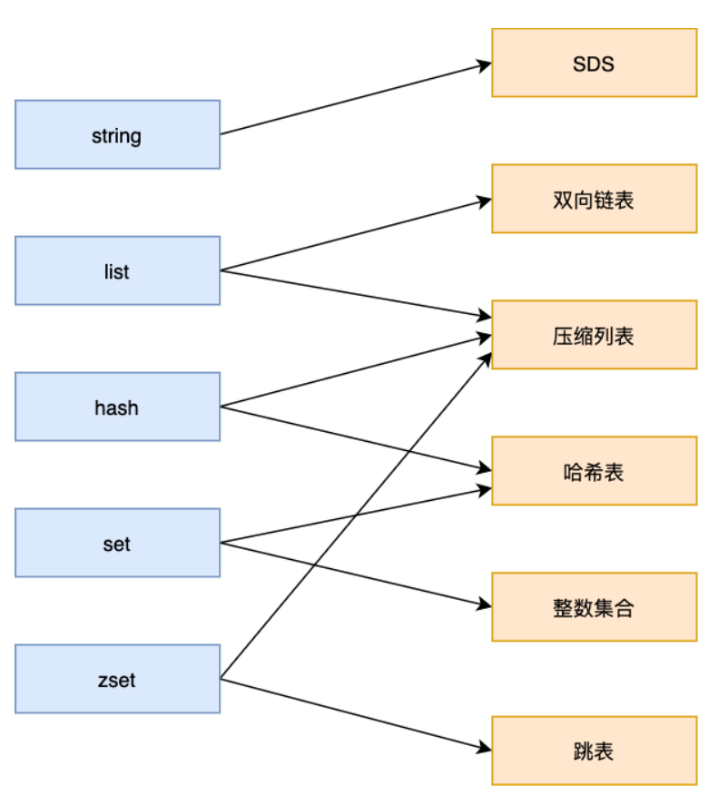 

### 1.2. 数据结构

 

## 2. SDS

​	字符串在 Redis 中是很常用的，键值对中的键是字符串，值有时也是字符串。

​	redis没有直接使用 C 语言的 char* 字符数组来实现字符串，而是自己封装了一个名为简单动态字符串（simple dynamic string，SDS） 的数据结构来表示字符串，也就是 Redis 的 String 数据类型的底层数据结构是 SDS

### 2.1. c语言字符串缺陷

C 语言的字符串其实就是一个字符数组，即数组中每个元素是字符串中的一个字符。

对字符串操作时，char * 指针只是指向字符数组的起始位置，而**字符数组的结尾位置就用“\0”表示，意思是指字符串的结束**

C 语言标准库中字符串的操作函数，就通过判断字符是不是“\0”，如果不是说明字符串还没结束，可以继续操作，如果是则说明字符串结束了，停止操作。

如图所示：

 

这就会导致两个问题：

* **C 语言获取字符串长度操作的时间复杂度是 O（N）**

* 字符串中不能 “\0” 字符外，用 char* 字符串中的字符必须符合某种编码（比如ASCII）。

  限制使得 C 语言的字符串只能保存文本数据，**不能保存像图片、音频、视频文化这样的二进制数据**

* 字符串操作函数不高效且不安全，比如可能会发生缓冲区溢出，从而造成程序运行终止

  比如将 src 字符串拼接到 dest 字符串后面 char *strcat(char *dest, const char* src);

  strcat 函数假定程序员在执行这个函数时，已经为 dest 分配了足够多的内存，可以容纳 src 字符串中的所有内容，而一旦这个假定不成立，就会发生缓冲区溢出将可能会造成程序运行终止

### 2.2. redis字符串实现

 

* **len**

  SDS 所保存的字符串长度。获取字符串的长度的

* **alloc**

  分配给字符数组的空间长度

* **flags**

  SDS 类型，用来表示不同类型的 SDS。一共设计了 5 种类型，分别是 sdshdr5、sdshdr8、sdshdr16、sdshdr32 和 sdshdr64

* **buf[]**

  字节数组，用来保存实际数据

#### 2.2.1. redis字符串改进点

* 可以保存二进制数据

  不需要用 “\0” 字符来标识字符串结尾了，而是直接将其作为二进制数据处理，可以用来保存图片等二进制数据。它即可以保存文本数据，也可以保存二进制数据

* 获取保存字符串长度o(n)

* 无缓冲区溢出风险了

  SDS API 通过 `alloc - len` 计算，可以算出剩余可用的空间大小，这样在对字符串做修改操作的时候，就可以由程序内部判断缓冲区大小是否足够用：

  * 当判断出缓冲区大小不够用时，Redis 会自动将扩大 SDS 的空间大小，以满足修改所需的大小
  * SDS API 会优先检查未使用空间是否足够，如果不够的话，API 不仅会为 SDS 分配修改所必须要的空间，还会给 SDS 分配额外的「未使用空间」
  * 下次在操作 SDS 时，如果 SDS 空间够的话，API 就会直接使用「未使用空间」，而无须执行内存分配，有效的减少内存分配次数

  **相当于之前c语言拼接字符串没去校验溢出风险，redis封装了拼接字符串方法，先校验，不行就扩容。**

#### 2.2.2. 空间优化

**1）数据类型优化：**

SDS 设计不同类型的结构体，是为了能灵活保存不同大小的字符串，从而有效节省内存空间

SDS 结构中有个 flags 成员变量，表示的是 SDS 类型：

* sdshdr5
* sdshdr8
* sdshdr16
* sdshdr32 
* sdshdr64

**区别就在于，它们数据结构中的 len 和 alloc 成员变量的数据类型不同**

如：

```
struct __attribute__ ((__packed__)) sdshdr16 {
    uint16_t len;
    uint16_t alloc; 
    unsigned char flags; 
    char buf[];
};


struct __attribute__ ((__packed__)) sdshdr32 {
    uint32_t len;
    uint32_t alloc; 
    unsigned char flags;
    char buf[];
};
```

- sdshdr16 

  数组长度和分配空间大小不能超过 2 的 16 次方。

- sdshdr32 

  字符数组长度和分配空间大小不能超过 2 的 32 次方

**2）字节对齐优化**

​	Redis 在编程上还**使用了专门的编译优化来节省内存空间**，即在 struct 声明了 `__attribute__ ((packed))` ，它的作用是：**告诉编译器取消结构在编译过程中的优化对齐，按照实际占用字节数进行对齐**

* c语言字节对齐

  默认情况下，sdshdr16 类型的 SDS，编译器会按照 16 字节对其的方式给变量分配内存，这意味着，即使一个变量的大小不到 16 个字节，编译器也会给它分配 16 个字节。

  例如：

  ```
  #include <stdio.h>
  
   struct test1 {
      char a;
      int b;
   } test1;
  
  int main() {
       printf("%lu\n", sizeof(test1));
       return 0;
  }
  ```

  虽然char是1个字节，但是int是4个字节，为了对齐。结构体大小计算出来是 8。其中3 个字节被浪费掉了

  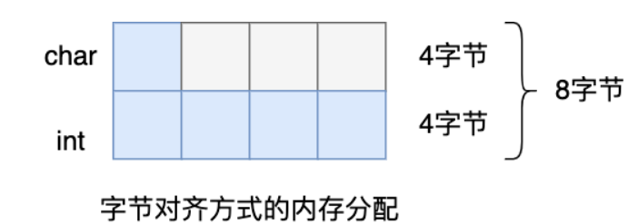

* redis的`__attribute__ ((packed))` 

  采用了 `__attribute__ ((packed))` 属性定义结构体，这样一来，结构体实际占用多少内存空间，编译器就分配多少空间.

  ```
  #include <stdio.h>
  
  struct __attribute__((packed)) test2  {
      char a;
      int b;
   } test2;
  
  int main() {
       printf("%lu\n", sizeof(test2));
       return 0;
  }
  ```

  

  

## 3. 链表

Redis 的 list 数据类型的底层实现之一就是链表。C 语言本身也是没有链表这个数据结构的，所以 Redis 自己设计了一个链表数据结构。

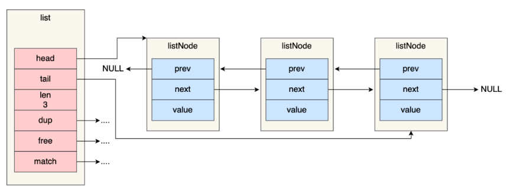 

Redis 在 listNode 结构体基础上又封装了 list 这个数据结构，这样操作起来会更方便，链表结构如下：

```
typedef struct list {
    //链表头节点
    listNode *head;
    //链表尾节点
    listNode *tail;
    //节点值复制函数
    void *(*dup)(void *ptr);
    //节点值释放函数
    void (*free)(void *ptr);
    //节点值比较函数
    int (*match)(void *ptr, void *key);
    //链表节点数量
    unsigned long len;
} list;
```

- listNode 链表节点带有 prev 和 next 指针

  **获取某个节点的前置节点或后置节点的时间复杂度只需O(1)，而且这两个指针都可以指向 NULL，所以链表是无环链表**；

- list 结构因为提供了表头指针 head 和表尾节点 tail

  所以**获取链表的表头节点和表尾节点的时间复杂度只需O(1)**

- list 结构因为提供了链表节点数量 len

  所以**获取链表中的节点数量的时间复杂度只需O(1)**

- listNode 链表节使用 void* 指针保存节点值

  并且可以通过 list 结构的 dup、free、match 函数指针为节点设置该节点类型特定的函数，因此链表节点可以保存各种不同类型的值；

**链表的缺陷：**

​	链表的缺陷也是有的，链表每个节点之间的内存都是不连续的，意味着无法很好利用 CPU 缓存。能很好利用 CPU 缓存的数据结构就是数组，因为数组的内存是连续的，这样就可以充分利用 CPU 缓存来加速访问。

​	因此，Redis 的 list 数据类型在数据量比较少的情况下，会采用「压缩列表」作为底层数据结构的实现，压缩列表就是由数组实现的

## 4. 压缩列表

### 4.1. 使用场景

- 当一个列表键（list）只包含少量的列表项，并且每个列表项都是小整数值，或者长度比较短的字符串，那么 Redis 就会使用压缩列表作为列表键（list）的底层实现。
- 当一个哈希键（hash）只包含少量键值对，并且每个键值对的键和值都是小整数值，或者长度比较短的字符串，那么 Redis 就会使用压缩列表作为哈希键（hash）的底层实现。

### 4.2. 结构设计

#### 4.2.1.  整体结构

**由连续内存块组成的顺序型数据结构**。

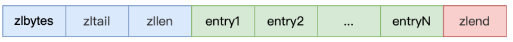 

压缩列表在表头有三个字段：

- **zlbytes**，记录整个压缩列表占用对内存字节数；
- **zltail**，记录压缩列表「尾部」节点距离起始地址由多少字节，也就是列表尾的偏移量；
- **zllen**，记录压缩列表包含的节点数量；
- **zlend**，标记压缩列表的结束点，特殊值 OxFF（十进制255）。

这种设计查找头部和尾部都将是o(1)，但是查找其它元素都将是o(n)

#### 4.2.2.  节点结构

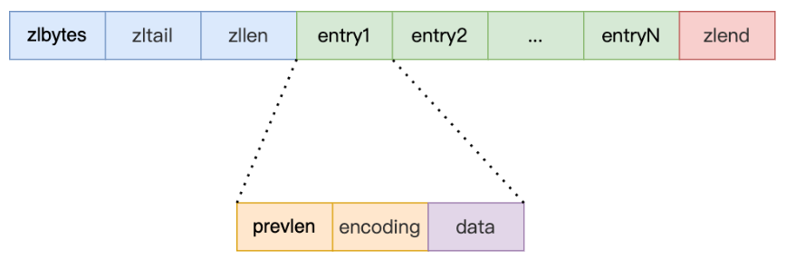 

压缩列表节点包含三部分内容：

* prevlen

  记录了前一个节点的长度；

* encoding

  记录了当前节点实际数据的类型以及长度；

* data

  记录了当前节点的实际数据

当我们往压缩列表中插入数据时，压缩列表 就会根据数据是字符串还是整数，以及它们的大小会在 prevlen 和 encoding 这两个元素里保存不同的信息，这种根据数据大小进行对应信息保存的设计思想，正是 Redis 为了节省内存而采用

#### 4.2.3.  连锁更新

​	压缩列表除了查找复杂度高的问题，压缩列表在插入元素时，如果内存空间不够了，压缩列表还需要重新分配一块连续的内存空间，而这可能会引发**连锁更新**的问题。因此，**压缩列表只会用于保存的节点数量不多的场景**，只要节点数量足够小，即使发生连锁更新，也是能接受的。

连锁更新的过程：

* 如果前一个**节点的长度小于 254 字节**，那么 prevlen 属性需要用 **1 字节的空间**来保存这个长度值
* 如果前一个**节点的长度大于等于 254 字节**，那么 prevlen 属性需要用 **5 字节的空间**来保存这个长度值
* 假设一个压缩列表中有多个连续的、长度在 250～253 之间的节点
* 因为这些节点长度值小于 254 字节，所以 prevlen 属性需要用 1 字节的空间来保存这个长度值
* 如果将一个长度大于等于 254 字节的新节点加入到压缩列表的表头节点，即第一个数据节点
* 因为 e1 节点的 prevlen 属性只有 1 个字节大小，无法保存新节点的长度，此时就需要对压缩列表的空间重分配操作，并将 e1 节点的 prevlen 属性从原来的 1 字节大小扩展为 5 字节大小
* 多米诺牌的效应，需要从前往后全部更新

**这种在特殊情况下产生的连续多次空间扩展操作就叫做「连锁更新」**

**连锁更新一旦发生，就会导致压缩列表 占用的内存空间要多次重新分配，这就会直接影响到压缩列表的访问性能**

## 5. hash表

哈希表是一种保存键值对（key-value）的数据结构

Hash 表优点在于，它**能以 O(1) 的复杂度快速查询数据**。主要是通过 Hash 函数的计算，就能定位数据在表中的位置，紧接着可以对数据进行操作，这就使得数据操作非常快

但是存在的风险也是有，在哈希表大小固定的情况下，随着数据不断增多，那么**哈希冲突**的可能性也会越高

### 5.1. 链式哈希

​	**Redis 采用了链式哈希**，在不扩容哈希表的前提下，将具有相同哈希值的数据链接起来，以便这些数据在表中仍然可以被查询到。

​	实现的方式就是每个哈希表节点都有一个 next 指针，多个哈希表节点可以用 next 指针构成一个单项链表，**被分配到同一个哈希桶上的多个节点可以用这个单项链表连接起来**，这样就解决了哈希冲突。

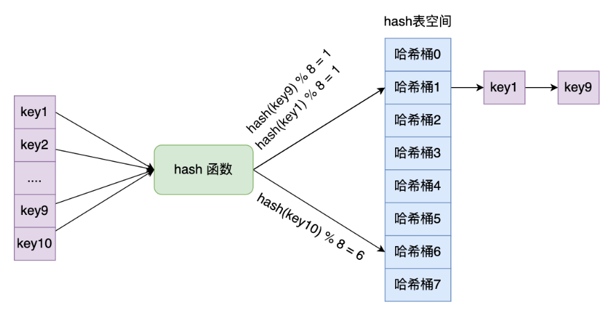 

### 5.2. rehash

​	随着链表长度的增加，在查询这一位置上的数据的耗时就会增加，毕竟链表的查询的时间复杂度是 O（n)。要想解决这一问题，就需要进行 rehash，就是对哈希表的大小进行扩展。

Redis 会使用了两个全局哈希表进行 rehash：

* 在正常服务请求阶段，插入的数据，都会写入到「哈希表 1」，此时的「哈希表 2 」 并没有被分配空间。
* 随着数据逐步增多，触发了 rehash 操作，这个过程分为三步：
  - 给「哈希表 2」 分配空间，一般会比「哈希表 1」 大 2 倍；
  - 将「哈希表 1 」的数据迁移到「哈希表 2」 中；
  - 迁移完成后，「哈希表 1 」的空间会被释放，并把「哈希表 2」 设置为「哈希表 1」，然后在「哈希表 2」 新创建一个空白的哈希表，为下次 rehash 做准备。

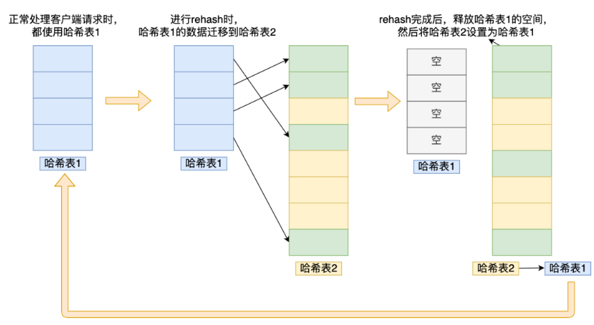 

### 5.3. 渐进式 rehash

​	如果「哈希表 1 」的数据量非常大，那么在迁移至「哈希表 2 」的时候，因为会涉及大量的数据拷贝，此时可能会对 Redis 造成阻塞，无法服务其他请求。

​	为了避免 rehash 在数据迁移过程中，因拷贝数据的耗时，影响 Redis 性能的情况，所以 Redis 采用了**渐进式 rehash**，也就是将数据的迁移的工作不再是一次性迁移完成，而是分多次迁移

渐进式 rehash 步骤如下：

- 给「哈希表 2」 分配空间；
- **在 rehash 进行期间，每次哈希表元素进行新增、删除、查找或者更新操作时，Redis 除了会执行对应的操作之外，还会顺序将「哈希表 1 」中索引位置上的所有 key-value 迁移到「哈希表 2」 上**；
- 随着处理客户端发起的哈希表操作请求数量越多，最终会把「哈希表 1 」的所有 key-value 迁移到「哈希表 2」，从而完成 rehash 操作。

这样就巧妙地把一次性大量数据迁移工作的开销，分摊到了多次处理请求的过程中，避免了一次性 rehash 的耗时操作。

**因此总结下来：**

进行渐进式 rehash 的过程中，会有两个哈希表，所以在渐进式 rehash 进行期间，哈希表元素的删除、查找、更新等操作都会在这两个哈希表进行。

比如，查找一个 key 的值的话，先会在哈希表 1 里面进行查找，如果没找到，就会继续到哈希表 2 里面进行找到。

另外，在渐进式 rehash 进行期间，新增一个 key-value 时，会被保存到「哈希表 2 」里面，而「哈希表 1」 则不再进行任何添加操作，这样保证了「哈希表 1 」的 key-value 数量只会减少，随着 rehash 操作的完成，最终「哈希表 1 」就会变成空表。

### 5.4. rehash阈值

rehash 的触发条件跟**负载因子（load factor）**有关系：

负载因此=保存的节点数量/hash表的大小。

触发 rehash 操作的条件，主要有两个：

- 当负载因子大于等于 1 ，并且 Redis 没有在执行 bgsave 命令或者 bgrewiteaof 命令，也就是没有执行 RDB 快照或没有进行 AOF 重写的时候，就会进行 rehash 操作。
- 当负载因子大于等于 5 时，此时说明哈希冲突非常严重了，不管有没有有在执行 RDB 快照或 AOF 重写，都会强制进行 rehash 操作。

## 6. 跳跃表

​	跳跃表（skiplist）是一种随机化的数据结构，由 **William Pugh** 在论文《Skip lists: a probabilistic alternative to balanced trees》中提出，是一种可以与平衡树媲美的层次化链表结构——查找、删除、添加等操作都可以在对数期望时间下完成。

如下图所示为跳跃表的模型：

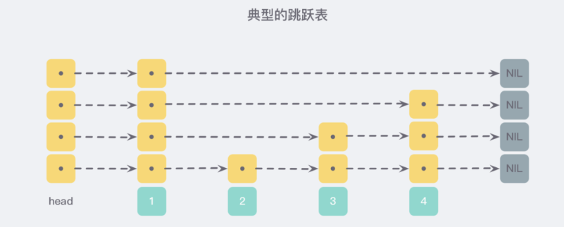 

​	redis的**有序列表 zset** 的数据结构，它类似于 Java 中的 **SortedSet** 和 **HashMap** 的结合体，一方面它是一个 set 保证了内部 value 的唯一性，另一方面又可以给每个 value 赋予一个排序的权重值 score，来达到 **排序** 的目的。它的内部实现就依赖了一种叫做 **「跳跃列表」** 的数据结构。

### 6.1.  为什么要使用跳跃表

zset 要支持随机的插入和删除，使用数组不合适，单纯使用链表查找为o(n)。而对于**红黑树/ 平衡树** 这样的树形结构，也有一定的缺陷不适合zset的场景：

* **性能考虑：** 在高并发的情况下，树形结构需要执行一些类似于 rebalance 这样的可能涉及整棵树的操作，相对来说跳跃表的变化只涉及局部 *(下面详细说)*；

* **实现考虑：** 在复杂度与红黑树相同的情况下，跳跃表实现起来更简单，看起来也更加直观；

### 6.2. 跳跃表查找过程

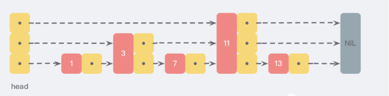 

当链表足够长，这样的多层链表结构可以帮助我们跳过很多下层节点，从而加快查找的效率

### 6.3. 跳跃表改进

​	每一层链表的节点个数，是下面一层的节点个数的一半，这样查找过程就非常类似于一个二分查找，使得查找的时间复杂度可以降低到 *O(logn)*

​	但是，这种方法在插入数据的时候有很大的问题。新插入一个节点之后，就会打乱上下相邻两层链表上节点个数严格的 2:1 的对应关系。如果要维持这种对应关系，就必须把新插入的节点后面的所有节点 *（也包括新插入的节点）* 重新进行调整，这会让时间复杂度重新蜕化成 *O(n)*。删除数据也有同样的问题。

​	**skiplist** 为了避免这一问题，它不要求上下相邻两层链表之间的节点个数有严格的对应关系，而是 **为每个节点随机出一个层数(level)**。比如，一个节点随机出的层数是 3，那么就把它链入到第 1 层到第 3 层这三层链表中。

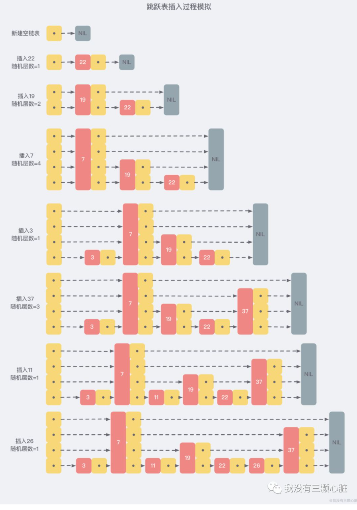 

每一个节点的层数（level）是随机出来的，而且新插入一个节点并不会影响到其他节点的层数，因此，**插入操作只需要修改节点前后的指针，而不需要对多个节点都进行调整**，这就降低了插入操作的复杂度。

假设从我们刚才创建的这个结构中查找 23 这个不存在的数就非常的容易。

### 6.4. 跳跃表实现

Redis 中的跳跃表由 `server.h/zskiplistNode` 和 `server.h/zskiplist` 两个结构定义，前者为跳跃表节点，后者则保存了跳跃节点的相关信息，同之前的 `集合 list` 结构类似，其实只有 `zskiplistNode` 就可以实现了，但是引入后者是为了更加方便的操作：

```
/* ZSETs use a specialized version of Skiplists */
typedefstruct zskiplistNode {
    // value
    sds ele;
    // 分值
    double score;
    // 后退指针
    struct zskiplistNode *backward;
    // 层
    struct zskiplistLevel {
        // 前进指针
        struct zskiplistNode *forward;
        // 跨度
        unsignedlong span;
    } level[];
} zskiplistNode;

typedefstruct zskiplist {
    // 跳跃表头指针
    struct zskiplistNode *header, *tail;
    // 表中节点的数量
    unsignedlong length;
    // 表中层数最大的节点的层数
    int level;
} zskiplist;
```

#### 6.4.1. 随机层数

```
int zslRandomLevel(void) {
    int level = 1;
    while ((random()&0xFFFF) < (ZSKIPLIST_P * 0xFFFF))
        level += 1;
    return (level<ZSKIPLIST_MAXLEVEL) ? level : ZSKIPLIST_MAXLEVEL;
}
```

直观上期望的目标是 50% 的概率被分配到 `Level 1`，25% 的概率被分配到 `Level 2`，12.5% 的概率被分配到 `Level 3`，以此类推...有 2-63 的概率被分配到最顶层，因为这里每一层的晋升率都是 50%。

**Redis 跳跃表默认允许最大的层数是 32**，被源码中 `ZSKIPLIST_MAXLEVEL` 定义，当 `Level[0]` 有 264 个元素时，才能达到 32 层，所以定义 32 完全够用了

#### 6.4.2. 创建跳跃表

在源码中的 `t_zset.c/zslCreate` 中被定义：

```
zskiplist *zslCreate(void) {
    int j;
    zskiplist *zsl;

    // 申请内存空间
    zsl = zmalloc(sizeof(*zsl));
    // 初始化层数为 1
    zsl->level = 1;
    // 初始化长度为 0
    zsl->length = 0;
    // 创建一个层数为 32，分数为 0，没有 value 值的跳跃表头节点
    zsl->header = zslCreateNode(ZSKIPLIST_MAXLEVEL,0,NULL);
    
    // 跳跃表头节点初始化
    for (j = 0; j < ZSKIPLIST_MAXLEVEL; j++) {
        // 将跳跃表头节点的所有前进指针 forward 设置为 NULL
        zsl->header->level[j].forward = NULL;
        // 将跳跃表头节点的所有跨度 span 设置为 0
        zsl->header->level[j].span = 0;
    }
    // 跳跃表头节点的后退指针 backward 置为 NULL
    zsl->header->backward = NULL;
    // 表头指向跳跃表尾节点的指针置为 NULL
    zsl->tail = NULL;
    return zsl;
}
```

即会初始化如下的结构图：

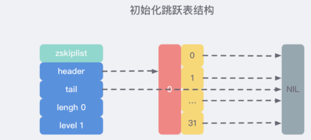 

#### 6.4.3. 插入节点

整体思路：

* 找到当前我需要插入的位置 *（其中包括相同 score 时的处理）*；

* 创建新节点，调整前后的指针指向，完成插入；

##### 6.4.3.1. 声明需要存储的变量

```
// 存储搜索路径
zskiplistNode *update[ZSKIPLIST_MAXLEVEL], *x;
// 存储经过的节点跨度
unsignedint rank[ZSKIPLIST_MAXLEVEL];
int i, level;
```

##### 6.4.3.2. 搜索当前节点插入位置

```
serverAssert(!isnan(score));
x = zsl->header;
// 逐步降级寻找目标节点，得到 "搜索路径"
for (i = zsl->level-1; i >= 0; i--) {
    /* store rank that is crossed to reach the insert position */
    rank[i] = i == (zsl->level-1) ? 0 : rank[i+1];
    // 如果 score 相等，还需要比较 value 值
    while (x->level[i].forward &&
            (x->level[i].forward->score < score ||
                (x->level[i].forward->score == score &&
                sdscmp(x->level[i].forward->ele,ele) < 0)))
    {
        rank[i] += x->level[i].span;
        x = x->level[i].forward;
    }
    // 记录 "搜索路径"
    update[i] = x;
}
```

**讨论：** 有一种极端的情况，就是跳跃表中的所有 score 值都是一样，zset 的查找性能会不会退化为 O(n) 呢？

从上面的源码中我们可以发现 zset 的排序元素不只是看 score 值，也会比较 value 值 *（字符串比较）*

##### 6.4.3.3. 生成插入节点

```
/* we assume the element is not already inside, since we allow duplicated
 * scores, reinserting the same element should never happen since the
 * caller of zslInsert() should test in the hash table if the element is
 * already inside or not. */
level = zslRandomLevel();
// 如果随机生成的 level 超过了当前最大 level 需要更新跳跃表的信息
if (level > zsl->level) {
    for (i = zsl->level; i < level; i++) {
        rank[i] = 0;
        update[i] = zsl->header;
        update[i]->level[i].span = zsl->length;
    }
    zsl->level = level;
}
// 创建新节点
x = zslCreateNode(level,score,ele);
```

##### 6.4.3.4. 重排前向指针

```
for (i = 0; i < level; i++) {
    x->level[i].forward = update[i]->level[i].forward;
    update[i]->level[i].forward = x;

    /* update span covered by update[i] as x is inserted here */
    x->level[i].span = update[i]->level[i].span - (rank[0] - rank[i]);
    update[i]->level[i].span = (rank[0] - rank[i]) + 1;
}

/* increment span for untouched levels */
for (i = level; i < zsl->level; i++) {
    update[i]->level[i].span++;
}
```

##### 6.4.3.5. 重排后向指针并返回

```
x->backward = (update[0] == zsl->header) ? NULL : update[0];
if (x->level[0].forward)
    x->level[0].forward->backward = x;
else
    zsl->tail = x;
zsl->length++;
return x;
```

### 6.4.4. 节点删除实现

删除过程由源码中的 `t_zset.c/zslDeleteNode` 定义，和插入过程类似，都需要先把这个 **"搜索路径"** 找出来，然后对于每个层的相关节点重排一下前向后向指针，同时还要注意更新一下最高层数 `maxLevel`，直接放源码 *(如果理解了插入这里还是很容易理解的)*：

```
/* Internal function used by zslDelete, zslDeleteByScore and zslDeleteByRank */
void zslDeleteNode(zskiplist *zsl, zskiplistNode *x, zskiplistNode **update) {
    int i;
    for (i = 0; i < zsl->level; i++) {
        if (update[i]->level[i].forward == x) {
            update[i]->level[i].span += x->level[i].span - 1;
            update[i]->level[i].forward = x->level[i].forward;
        } else {
            update[i]->level[i].span -= 1;
        }
    }
    if (x->level[0].forward) {
        x->level[0].forward->backward = x->backward;
    } else {
        zsl->tail = x->backward;
    }
    while(zsl->level > 1 && zsl->header->level[zsl->level-1].forward == NULL)
        zsl->level--;
    zsl->length--;
}

/* Delete an element with matching score/element from the skiplist.
 * The function returns 1 if the node was found and deleted, otherwise
 * 0 is returned.
 *
 * If 'node' is NULL the deleted node is freed by zslFreeNode(), otherwise
 * it is not freed (but just unlinked) and *node is set to the node pointer,
 * so that it is possible for the caller to reuse the node (including the
 * referenced SDS string at node->ele). */
int zslDelete(zskiplist *zsl, double score, sds ele, zskiplistNode **node) {
    zskiplistNode *update[ZSKIPLIST_MAXLEVEL], *x;
    int i;

    x = zsl->header;
    for (i = zsl->level-1; i >= 0; i--) {
        while (x->level[i].forward &&
                (x->level[i].forward->score < score ||
                    (x->level[i].forward->score == score &&
                     sdscmp(x->level[i].forward->ele,ele) < 0)))
        {
            x = x->level[i].forward;
        }
        update[i] = x;
    }
    /* We may have multiple elements with the same score, what we need
     * is to find the element with both the right score and object. */
    x = x->level[0].forward;
    if (x && score == x->score && sdscmp(x->ele,ele) == 0) {
        zslDeleteNode(zsl, x, update);
        if (!node)
            zslFreeNode(x);
        else
            *node = x;
        return1;
    }
    return0; /* not found */
}
```

### 6.4.5.节点更新实现

当我们调用 `ZADD` 方法时，如果对应的 value 不存在，那就是插入过程，如果这个 value 已经存在，只是调整一下 score 的值，那就需要走一个更新流程。

假设这个新的 score 值并不会带来排序上的变化，那么就不需要调整位置，直接修改元素的 score 值就可以了，但是如果排序位置改变了，那就需要调整位置，该如何调整呢？

从源码 `t_zset.c/zsetAdd` 函数 `1350` 行左右可以看到，Redis 采用了一个非常简单的策略：

```
/* Remove and re-insert when score changed. */
if (score != curscore) {
    zobj->ptr = zzlDelete(zobj->ptr,eptr);
    zobj->ptr = zzlInsert(zobj->ptr,ele,score);
    *flags |= ZADD_UPDATED;
}
```

**把这个元素删除再插入这个**，需要经过两次路径搜索，从这一点上来看，Redis 的 `ZADD` 代码似乎还有进一步优化的空间。

### 6.4.6.元素排名的实现

跳跃表本身是有序的，Redis 在 skiplist 的 forward 指针上进行了优化，给每一个 forward 指针都增加了 `span` 属性，用来 **表示从前一个节点沿着当前层的 forward 指针跳到当前这个节点中间会跳过多少个节点**。在上面的源码中我们也可以看到 Redis 在插入、删除操作时都会小心翼翼地更新 `span` 值的大小。

所以，沿着 **"搜索路径"**，把所有经过节点的跨度 `span` 值进行累加就可以算出当前元素的最终 rank 值了：

```
/* Find the rank for an element by both score and key.
 * Returns 0 when the element cannot be found, rank otherwise.
 * Note that the rank is 1-based due to the span of zsl->header to the
 * first element. */
unsigned long zslGetRank(zskiplist *zsl, double score, sds ele) {
    zskiplistNode *x;
    unsignedlong rank = 0;
    int i;

    x = zsl->header;
    for (i = zsl->level-1; i >= 0; i--) {
        while (x->level[i].forward &&
            (x->level[i].forward->score < score ||
                (x->level[i].forward->score == score &&
                sdscmp(x->level[i].forward->ele,ele) <= 0))) {
            // span 累加
            rank += x->level[i].span;
            x = x->level[i].forward;
        }

        /* x might be equal to zsl->header, so test if obj is non-NULL */
        if (x->ele && sdscmp(x->ele,ele) == 0) {
            return rank;
        }
    }
    return0;
}
```