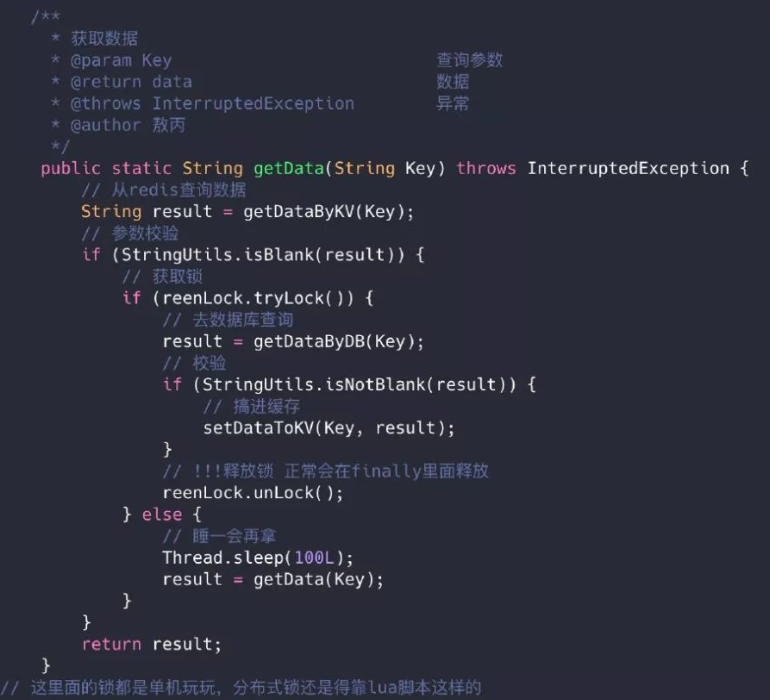

## 数据结构

* Redis有几种基础数据类型及使用场景

  * String

    这是最简单的类型，就是普通的 set 和 get，做简单的 KV 缓存。

    但是真实的开发环境中，很多仔可能会把很多比较复杂的结构也统一转成**String**去存储使用，比如有的仔他就喜欢把对象或者**List**转换为**JSONString**进行存储，拿出来再反序列话啥的。

    **String**的实际应用场景比较广泛的有：

    - **缓存功能：String**字符串是最常用的数据类型，不仅仅是**Redis**，各个语言都是最基本类型，因此，利用**Redis**作为缓存，配合其它数据库作为存储层，利用**Redis**支持高并发的特点，可以大大加快系统的读写速度、以及降低后端数据库的压力。
    - **计数器：**许多系统都会使用**Redis**作为系统的实时计数器，可以快速实现计数和查询的功能。而且最终的数据结果可以按照特定的时间落地到数据库或者其它存储介质当中进行永久保存。
    - **共享用户Session：**用户重新刷新一次界面，可能需要访问一下数据进行重新登录，或者访问页面缓存**Cookie**，但是可以利用**Redis**将用户的**Session**集中管理，在这种模式只需要保证**Redis**的高可用，每次用户**Session**的更新和获取都可以快速完成。大大提高效率。

  * **Hash**

    这个是类似 **Map** 的一种结构，这个一般就是可以将结构化的数据，比如一个对象（前提是**这个对象没嵌套其他的对象**）给缓存在 **Redis** 里，然后每次读写缓存的时候，可以就操作 **Hash** 里的**某个字段**。

    但是这个的场景其实还是多少单一了一些，因为现在很多对象都是比较复杂的，比如你的商品对象可能里面就包含了很多属性，其中也有对象。我自己使用的场景用得不是那么多。

  * List

    **List** 是有序列表，这个还是可以玩儿出很多花样的。

    比如可以通过 **List** 存储一些列表型的数据结构，类似粉丝列表、文章的评论列表之类的东西。

    比如可以通过 **lrange** 命令，读取某个闭区间内的元素，可以基于 **List** 实现分页查询，这个是很棒的一个功能，基于 **Redis** 实现简单的高性能分页，可以做类似微博那种下拉不断分页的东西，性能高，就一页一页走。

    比如可以搞个简单的消息队列，从 **List** 头怼进去，从 **List** 屁股那里弄出来。

    **List**本身就是我们在开发过程中比较常用的数据结构了，热点数据更不用说了。

    - **消息队列：Redis**的链表结构，可以轻松实现阻塞队列，可以使用左进右出的命令组成来完成队列的设计。比如：数据的生产者可以通过**Lpush**命令从左边插入数据，多个数据消费者，可以使用**BRpop**命令阻塞的“抢”列表尾部的数据。

    - 文章列表或者数据分页展示的应用。

      比如，我们常用的博客网站的文章列表，当用户量越来越多时，而且每一个用户都有自己的文章列表，而且当文章多时，都需要分页展示，这时可以考虑使用**Redis**的列表，列表不但有序同时还支持按照范围内获取元素，可以完美解决分页查询功能。大大提高查询效率。

  * **Set**

    **Set** 是无序集合，会自动去重的那种。

    直接基于 **Set** 将系统里需要去重的数据扔进去，自动就给去重了，如果你需要对一些数据进行快速的全局去重，你当然也可以基于 **JVM** 内存里的 **HashSet** 进行去重，但是如果你的某个系统部署在多台机器上呢？得基于**Redis**进行全局的 **Set** 去重。

    可以基于 **Set** 玩儿交集、并集、差集的操作，比如交集吧，我们可以把两个人的好友列表整一个交集，看看俩人的共同好友是谁？对吧。

    反正这些场景比较多，因为对比很快，操作也简单，两个查询一个**Set**搞定

  * **Sorted Set**

    **Sorted set** 是排序的 **Set**，去重但可以排序，写进去的时候给一个分数，自动根据分数排序。

    有序集合的使用场景与集合类似，但是set集合不是自动有序的，而**Sorted set**可以利用分数进行成员间的排序，而且是插入时就排序好。所以当你需要一个有序且不重复的集合列表时，就可以选择**Sorted set**数据结构作为选择方案。

    - 排行榜：有序集合经典使用场景。例如视频网站需要对用户上传的视频做排行榜，榜单维护可能是多方面：按照时间、按照播放量、按照获得的赞数等。

    - 用**Sorted Sets**来做带权重的队列，比如普通消息的score为1，重要消息的score为2，然后工作线程可以选择按score的倒序来获取工作任务。让重要的任务优先执行。

      微博热搜榜，就是有个后面的热度值，前面就是名称

  **Redis**基础类型有五种，这个我在基础里面也有提到了，这个问题其实一般都是对P6以下，也就是1-3年左右的小伙伴可能是会问得比较多的问题。能回答出来五种我想大家都可以，但是不知道大家是否知道，五种类型具体的使用场景，以及什么时候用什么类型最合适呢？要是你回答的不好，没说出几种数据类型，也没说什么场景，你完了，面试官对你印象肯定不好，觉得你平时就是做个简单的 set 和 get

* Redis 和 Memcached 有啥区别，为啥选择用Redis作为你们的缓存中间件？

  **Redis** 支持复杂的数据结构：

  **Redis** 相比 **Memcached** 来说，拥有更多的数据结构，能支持更丰富的数据操作。如果需要缓存能够支持更复杂的结构和操作， **Redis** 会是不错的选择。

  **Redis** 原生支持集群模式：

  在 redis3.x 版本中，便能支持 **Cluster** 模式，而 **Memcached** 没有原生的集群模式，需要依靠客户端来实现往集群中分片写入数据。

  性能对比：

  由于 **Redis** 只使用单核，而 **Memcached** 可以使用多核，所以平均每一个核上 **Redis** 在存储小数据时比 **Memcached** 性能更高。而在 100k 以上的数据中，**Memcached** 性能要高于 **Redis**，虽然 **Redis** 最近也在存储大数据的性能上进行优化，但是比起 **Remcached**，还是稍有逊色。

  Tip：其实面试官这么问，是想看你知道为啥用这个技术栈么？你为啥选这个技术栈，你是否做过技术选型的对比，优缺点你是否了解，你啥都不知道，只是为了用而用，那你可能就**差点意思**了

## 缓存使用

* **什么是redis雪崩？**

  **产生原因：**

  同一时间大面积失效，那一瞬间Redis跟没有一样，那这个数量级别的请求直接打到数据库几乎是灾难性的，你想想如果打挂的是一个用户服务的库，那其他依赖他的库所有的接口几乎都会报错，如果没做熔断等策略基本上就是瞬间挂一片的节奏，你怎么重启用户都会把你打挂，等你能重启的时候，用户早就睡觉去了，并且对你的产品失去了信心，什么垃圾产品。

  **解决方案：**

  处理缓存雪崩简单，在批量往**Redis**存数据的时候，把每个Key的失效时间都加个随机值就好了，这样可以保证数据不会在同一时间大面积失效，我相信，Redis这点流量还是顶得住的。

  如果**Redis**是集群部署，将热点数据均匀分布在不同的**Redis**库中也能避免全部失效的问题，不过本渣我在生产环境中操作集群的时候，单个服务都是对应的单个**Redis**分片，是为了方便数据的管理，但是也同样有了可能会失效这样的弊端，失效时间随机是个好策略。

  或者设置热点数据永远不过期，有更新操作就更新缓存就好了（比如运维更新了首页商品，那你刷下缓存就完事了，不要设置过期时间），电商首页的数据也可以用这个操作，保险。 	

* **那你了解缓存穿透和击穿么，可以说说他们跟雪崩的区别么？**

  * **缓存穿透**

    **原因：**

    缓存穿透是指缓存和数据库中都没有的数据，而用户不断发起请求，我们数据库的 id 都是1开始自增上去的，如发起为id值为 -1 的数据或 id 为特别大不存在的数据。这时的用户很可能是攻击者，攻击会导致数据库压力过大，严重会击垮数据库。

    **解决：**

    从缓存取不到的数据，在数据库中也没有取到，这时也可以将对应Key的Value对写为null、位置错误、稍后重试这样的值具体取啥问产品，或者看具体的场景，缓存有效时间可以设置短点，如30秒（设置太长会导致正常情况也没法使用）

    **Redis**还有一个高级用法**布隆过滤器（Bloom Filter）**也可以使用

  * **缓存击穿**：

    **原因**：

    跟**缓存雪崩**有点像，但是又有一点不一样，缓存雪崩是因为大面积的缓存失效，打崩了DB，而缓存击穿不同的是**缓存击穿**是指一个Key非常热点，在不停的扛着大并发，大并发集中对这一个点进行访问，当这个Key在失效的瞬间，持续的大并发就穿破缓存，直接请求数据库，就像在一个完好无损的桶上凿开了一个洞

    **解决：**

    设置热点数据永远不过期。或者加上互斥锁就能搞定了

   

  

## 数据安全

* 如果你多个系统同时操作（并发）Redis带来的数据问题？

  **问题描述：**

  系统A、B、C三个系统，分别去操作**Redis**的同一个Key，本来顺序是1，2，3是正常的，但是因为系统A网络突然抖动了一下，B，C在他前面操作了**Redis**，这样数据不就错了么。

  就好比下单，支付，退款三个顺序你变了，你先退款，再下单，再支付，那流程就会失败，那数据不就乱了？你订单还没生成你却支付，退款了？明显走不通了，这在线上是很恐怖的事情

  **解决方案：**

  多个系统实例都去更新某个 key。可以基于 **Zookeeper** 实现分布式锁。每个系统通过 **Zookeeper** 获取分布式锁，确保同一时间，只能有一个系统实例在操作某个 Key，别人都不允许读和写

  写入缓存的数据，都是从 **MySQL** 里查出来的，都得写入 **MySQL** 中，写入 **MySQL** 中的时候必须保存一个时间戳，从 **MySQL** 查出来的时候，时间戳也查出来

  **写之前，先判断**一下当前这个 Value 的时间戳是否比缓存里的 Value 的时间戳要新。如果是的话，那么可以写，否则，就不能用旧的数据覆盖新的数据

* 只要用缓存，就可能会涉及到缓存与数据库双存储双写，你只要是双写，就一定会有数据一致性的问题，那么你如何解决一致性问题？

  一般来说，如果允许缓存可以稍微的跟数据库偶尔有不一致的情况，也就是说如果你的系统**不是严格要求** “缓存+数据库” 必须保持一致性的话，最好不要做这个方案，即：**读请求和写请求串行化**，串到一个**内存队列**里去。

  串行化可以保证一定不会出现不一致的情况，但是它也会导致系统的吞吐量大幅度降低，用比正常情况下多几倍的机器去支撑线上的一个请求。

  把一些列的操作都放到队列里面，顺序肯定不会乱，但是并发高了，这队列很容易阻塞，反而会成为整个系统的弱点，瓶颈

* 你了解最经典的KV、DB读写模式么？

  最经典的缓存+数据库读写的模式，就是 **Cache Aside Pattern**

  - 读的时候，先读缓存，缓存没有的话，就读数据库，然后取出数据后放入缓存，同时返回响应。
  - 更新的时候，**先更新数据库，然后再删除缓存**

  

* 为什么是删除缓存，而不是更新缓存？

  * 缓存有时候很复杂

    比如可能更新了某个表的一个字段，然后其对应的缓存，是需要查询另外两个表的数据并进行运算，才能计算出缓存最新的值的

  * 更新缓存的代价有时候是很高的。是不是说，每次修改数据库的时候，都一定要将其对应的缓存更新一份？也许有的场景是这样，但是对于**比较复杂的缓存数据计算的场景**，就不是这样了。如果你频繁修改一个缓存涉及的多个表，缓存也频繁更新。但是问题在于，**这个缓存到底会不会被频繁访问到？**

    如果你只是删除缓存的话，那么在 1 分钟内，这个缓存不过就重新计算一次而已，开销大幅度降低。**用到缓存才去算缓存**

    其实删除缓存，而不是更新缓存，就是一个 Lazy 计算的思想，不要每次都重新做复杂的计算，不管它会不会用到，而是让它到需要被使用的时候再重新计算

    像 **Mybatis**，**Hibernate**，都有懒加载思想。查询一个部门，部门带了一个员工的 **List**，没有必要说每次查询部门，都里面的 1000 个员工的数据也同时查出来啊。80% 的情况，查这个部门，就只是要访问这个部门的信息就可以了。先查部门，同时要访问里面的员工，那么这个时候只有在你要访问里面的员工的时候，才会去数据库里面查询 1000 个员工

## redis网络模型

* Redis 的线程模型了解么？

  **Redis** 内部使用文件事件处理器 `file event handler`，这个文件事件处理器是单线程的，所以 **Redis** 才叫做单线程的模型。它采用 IO 多路复用机制同时监听多个 **Socket**，根据 **Socket** 上的事件来选择对应的事件处理器进行处理。

  文件事件处理器的结构包含 4 个部分：

  - 多个 **Socket**
  - IO 多路复用程序
  - 文件事件分派器
  - 事件处理器（连接应答处理器、命令请求处理器、命令回复处理器）

  多个 **Socket** 可能会并发产生不同的操作，每个操作对应不同的文件事件，但是 IO 多路复用程序会监听多个 **Socket**，会将 **Socket** 产生的事件放入队列中排队，事件分派器每次从队列中取出一个事件，把该事件交给对应的事件处理器进行处理

## 其它问题

- 0、在集群模式下，Redis 的 Key 是如何寻址的？分布式寻址都有哪些算法？了解一致性 Hash 算法吗？
- 1、使用Redis有哪些好处？
- 2、Redis相比Memcached有哪些优势？
- 3、Redis常见性能问题和解决方案
- 4、MySQL里有2000w数据，Redis中只存20w的数据，如何保证Redis中的数据都是热点数据？
- 5、Memcache与Redis的区别都有哪些？
- 6、Redis 常见的性能问题都有哪些？如何解决？
- 7、在什么样的场景下可以充分的利用Redis的特性，大大提高Redis的效率？
- 8、Redis的缓存雪崩、穿透、击穿了解么？有什么异同点？分别怎么解决？
- 9、Redis的基本类型有哪些？他们的使用场景了解么？比较高级的用法你使用过么？
- 10、Redis主从怎么同步数据的？集群的高可用怎么保证？持久化机制了解么？
- 11、为什么 redis 单线程却能支撑高并发？
- 12、如何保证缓存和数据库数据的一致性？
- 13、项目中是怎么用缓存的，用了缓存之后会带来什么问题