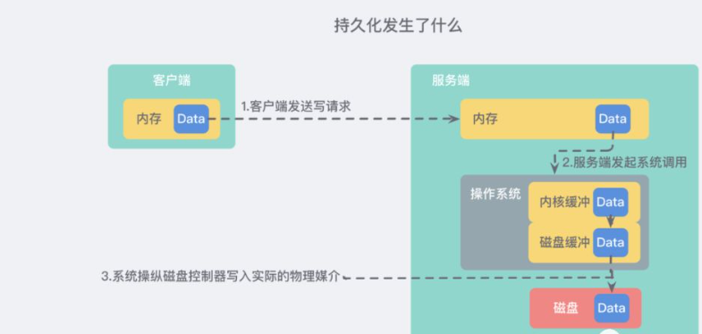
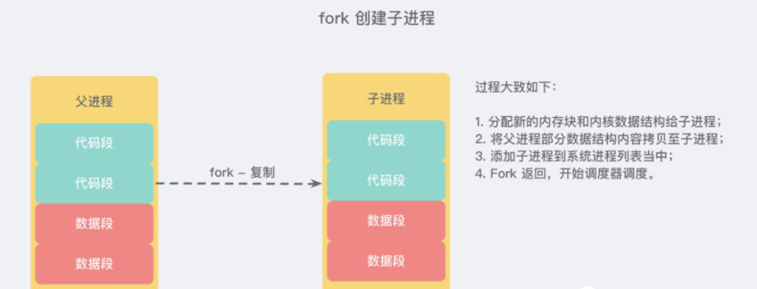
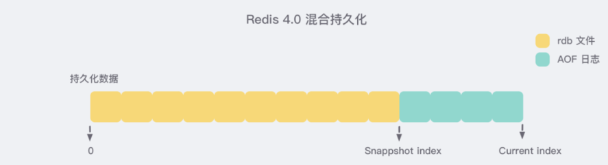

## 1. 开头

​	Redis 的数据全部存储在内存中，如果突然宕机，数据就会全部丢失，因此必须有一套机制来保证 Redis 的数据不会因为故障而丢失，这种机制就是 Redis 的 持久化机制，它会将内存中的数据库状态 保存到磁盘中。

## 2. 整体机制

 

* 客户端向数据库 **发送写命令** *(数据在客户端的内存中)*

* 数据库 **接收** 到客户端的 **写请求** *(数据在服务器的内存中)*

* 数据库 **调用系统 API** 将数据写入磁盘 *(数据在内核缓冲区中)*

  在 *上述步骤 3* 成功返回之后，我们就认为成功了。即使进程崩溃，操作系统仍然会帮助我们把数据正确地写入磁盘

  * 操作系统将 **写缓冲区** 传输到 **磁盘控控制器** *(数据在磁盘缓存中)*
  * 如果此时停电了，那么就将丢失数据。
  * **写缓冲区**，并不是所有的写操作都会被立即写入磁盘，而是要先经过一个缓冲区，默认情况下，Linux 将在 **30 秒** 后实际提交写入，但是**30 秒** 并不是 Redis 能够承受的，这意味着，如果发生故障，那么最近 30 秒内写入的所有数据都可能会丢失。幸好 `PROSIX API` 提供了另一个解决方案：`fsync`，该命令会 **强制** 内核将 **缓冲区** 写入 **磁盘**，但这是一个非常消耗性能的操作，每次调用都会 **阻塞等待** 直到设备报告 IO 完成，所以一般在生产环境的服务器中，**Redis** 通常是每隔 1s 左右执行一次 `fsync` 操作

* 操作系统的磁盘控制器将数据 **写入实际的物理媒介** 中 *(数据在磁盘中)*

  这才是真正的持久化

## 3. Redis 持久化方式

### 3.1. 快照

​	**Redis 快照** 是最简单的 Redis 持久性模式。当满足特定条件时，它将生成数据集的时间点快照，例如，如果先前的快照是在2分钟前创建的，并且现在已经至少有 *100* 次新写入，则将创建一个新的快照。快照作为包含整个数据集的单个 `.rdb` 文件生成。

#### 3.1.1. 性能问题

​	Redis 是一个 **单线程** 的程序，这意味着，我们不仅仅要响应用户的请求，还需要进行内存快照。而后者要求 Redis 必须进行 IO 操作，这会严重拖累服务器的性能

#### 3.1.2. fork

​	**持久化的同时**，**内存数据结构** 还可能在 **变化**，这怎么办呢？操作系统多进程 **COW(Copy On Write) 机制** 拯救了我们。**Redis** 在持久化时会调用 `glibc` 的函数 `fork` 产生一个子进程

简单理解也就是基于当前进程 **复制** 了一个进程，主进程和子进程会共享内存里面的代码块和数据段

 

示例代码如下：

```
pid = os.fork()
if pid > 0:
  handle_client_request()  # 父进程继续处理客户端请求
if pid == 0:
  handle_snapshot_write()  # 子进程处理快照写磁盘
if pid < 0:
  # fork error
```

* **快照持久化** 可以完全交给 **子进程** 来处理，**父进程** 则继续 **处理客户端请求**。**子进程** 做数据持久化，它 **不会修改现有的内存数据结构**，它只是对数据结构进行遍历读取，然后序列化写到磁盘中。但是 **父进程** 不一样，它必须持续服务客户端请求，然后对 **内存数据结构进行不间断的修改**。

* 这个时候就会使用操作系统的 COW 机制来进行 **数据段页面** 的分离。数据段是由很多操作系统的页面组合而成，当父进程对其中一个页面的数据进行修改时，会将被共享的页面复 制一份分离出来，然后 **对这个复制的页面进行修改**。这时 **子进程** 相应的页面是 **没有变化的**，还是进程产生时那一瞬间的数据
* 子进程因为数据没有变化，它能看到的内存里的数据在进程产生的一瞬间就凝固了，再也不会改变，这也是为什么 **Redis** 的持久化 **叫「快照」的原因**。接下来子进程就可以非常安心的遍历数据了进行序列化写磁盘了

### 3.2. AOF

如果运行 Redis 的计算机停止运行，电源线出现故障或者您 `kill -9` 的实例意外发生，则写入 Redis 的最新数据将丢失。

**AOF(Append Only File - 仅追加文件)** 它的工作方式非常简单：每次执行 **修改内存** 中数据集的写操作时，都会 **记录** 该操作。假设 AOF 日志记录了自 Redis 实例创建以来 **所有的修改性指令序列**，那么就可以通过对一个空的 Redis 实例 **顺序执行所有的指令**，也就是 **「重放」**，来恢复 Redis 当前实例的内存数据结构的状态

#### 3.2.1. 执行过程

* 当 Redis 收到客户端修改指令后，会先进行参数校验、逻辑处理

* 如果没问题，就 **立即** 将该指令文本

* 然后**存储** 到 AOF 日志中

  **先执行指令再将日志存盘**

这一点不同于 `MySQL`、`LevelDB`、`HBase` 等存储引擎，如果我们先存储日志再做逻辑处理，这样就可以保证即使宕机了，我们仍然可以通过之前保存的日志恢复到之前的数据状态。

**解释原因：**

仅仅是因为，由于AOF文件会比较大，为了避免写入无效指令（错误指令），必须先做指令检查？如何检查，只能先执行了。因为语法级别检查并不能保证指令的有效性，比如删除一个不存在的key。而MySQL这种是因为它本身就维护了所有的表的信息，所以可以语法检查后过滤掉大部分无效指令直接记录日志，然后再执行。

#### 3.2.2. 重写

**Redis** 在长期运行的过程中，AOF 的日志会越变越长。如果实例宕机重启，重放整个 AOF 日志会非常耗时，导致长时间 Redis 无法对外提供服务。所以需要对 **AOF 日志 "瘦身"**

**Redis** 提供了 `bgrewriteaof` 指令用于对 AOF 日志进行瘦身。其 **原理** 就是 **开辟一个子进程** 对内存进行 **遍历** 转换成一系列 Redis 的操作指令，**序列化到一个新的 AOF 日志文件** 中。序列化完毕后再将操作期间发生的 **增量 AOF 日志** 追加到这个新的 AOF 日志文件中，追加完毕后就立即替代旧的 AOF 日志文件了，瘦身工作就完成了。

#### 3.2.3. fsync

AOF 日志是以文件的形式存在的，当程序对 AOF 日志文件进行写操作时，实际上是将内容写到了内核为文件描述符分配的一个内存缓存中，然后内核会异步将脏数据刷回到磁盘的。

就像我们 *上方第四步* 描述的那样，我们需要借助 `glibc` 提供的 `fsync(int fd)` 函数来讲指定的文件内容 **强制从内核缓存刷到磁盘**。但 **"强制开车"** 仍然是一个很消耗资源的一个过程，需要 **"节制"**！通常来说，生产环境的服务器，Redis 每隔 1s 左右执行一次 `fsync` 操作就可以了。

Redis 同样也提供了另外两种策略，一个是 **永不 `fsync`**，来让操作系统来决定合适同步磁盘，很不安全，另一个是 **来一个指令就 `fsync` 一次**，非常慢。但是在生产环境基本不会使用。

### 3.3. 混合持久化

重启 Redis 时，我们很少使用 `rdb` 来恢复内存状态，因为会丢失大量数据。我们通常使用 AOF 日志重放，但是重放 AOF 日志性能相对 `rdb` 来说要慢很多，这样在 Redis 实例很大的情况下，启动需要花费很长的时间。

**Redis 4.0** 为了解决这个问题，带来了一个新的持久化选项——**混合持久化**：

将 `rdb` 文件的内容和增量的 AOF 日志文件存在一起。这里的 AOF 日志不再是全量的日志，而是 **自持久化开始到持久化结束** 的这段时间发生的增量 AOF 日志，通常这部分 AOF 日志很小。

 

于是在 Redis 重启的时候，可以先加载 `rdb` 的内容，然后再重放增量 AOF 日志就可以完全替代之前的 AOF 全量文件重放，重启效率因此大幅得到提升