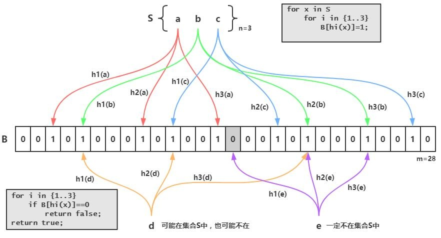
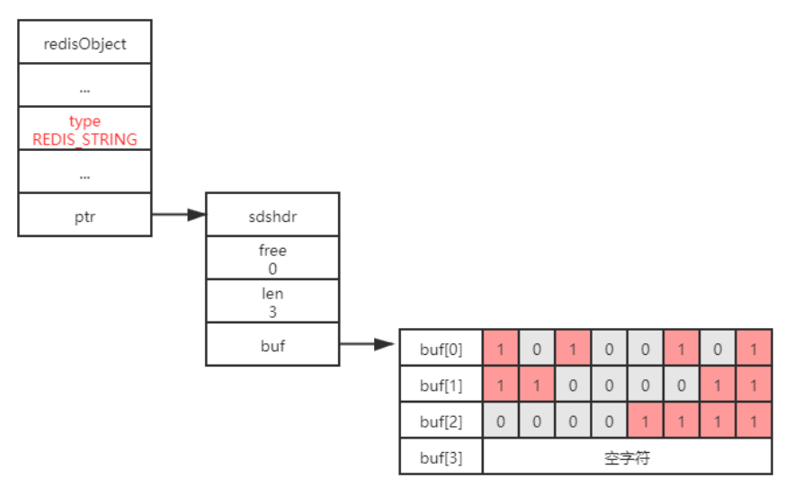
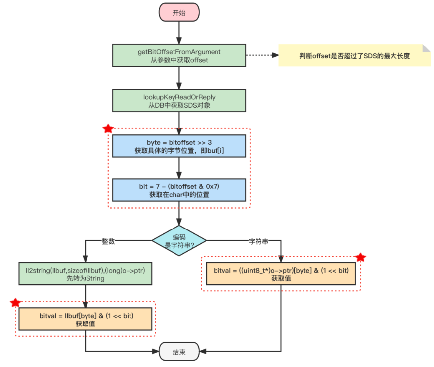
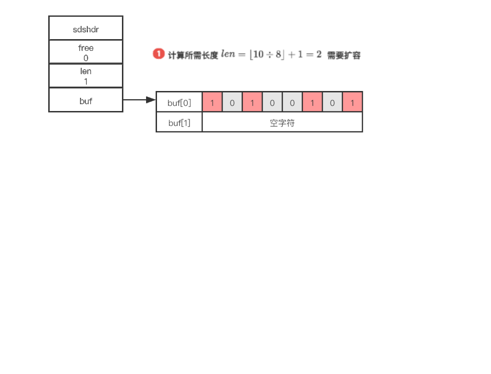
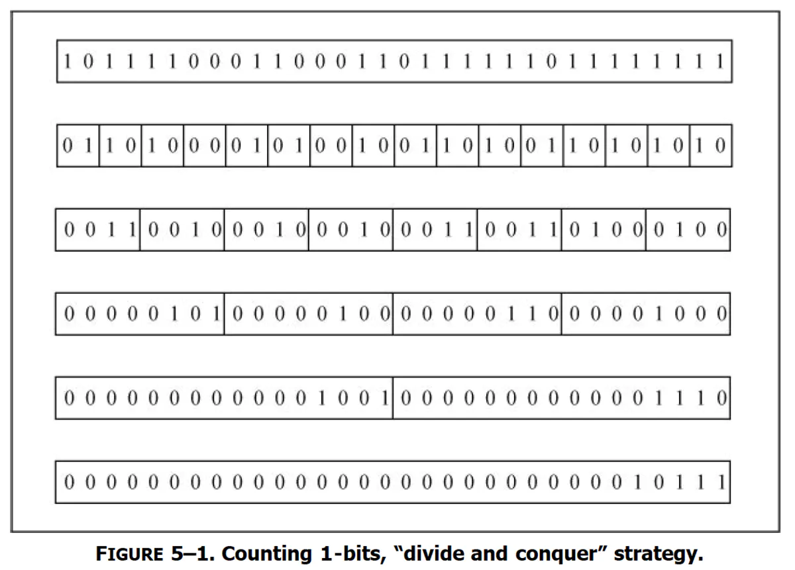
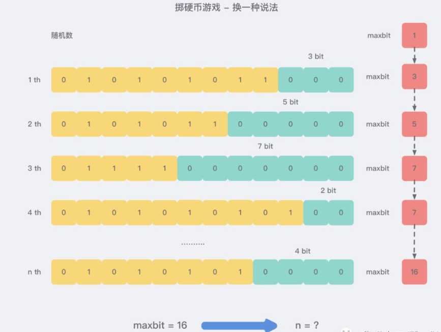
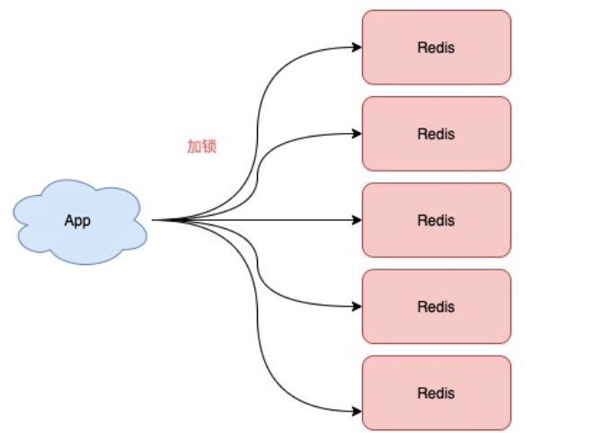
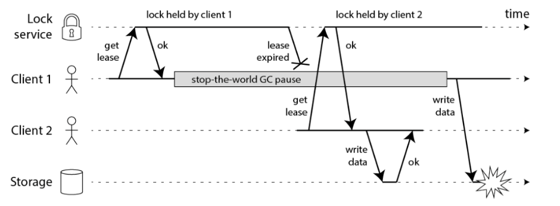
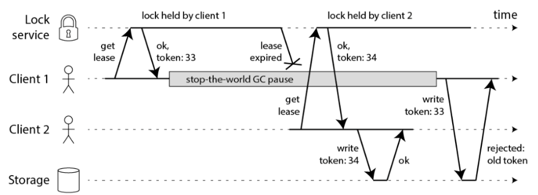
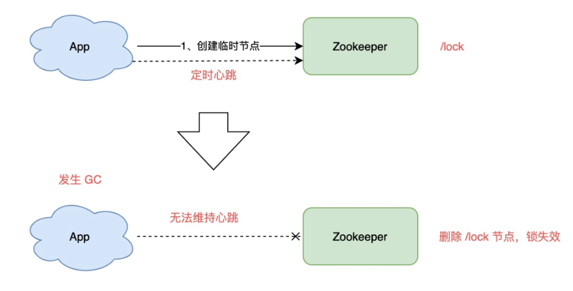

## 1. 开头

redis是缓存利器，也有着很多的使用场景。本篇文章，将一一探讨redis的常见用法。

## 2. 布隆过滤器

布隆过滤器是1970年由一个叫布隆的小伙子提出的。它实际上是一个很长的二进制向量和一系列随机映射函数

### 2.1. 应用场景

布隆过滤器可以用于检索一个元素是否在一个集合中。它的优点是空间效率和查询时间都远远超过一般的算法，缺点是有一定的误识别率和删除困难。一般用于**缓存穿透和海量数据去重**。

### 2.2. 原理

当一个元素被加入集合时，通过K个散列函数将这个元素映射成一个位数组中的K个点，把它们置为1。检索时，我们只要看看这些点是不是都是1就（大约）知道集合中有没有它了，即：

* 如果这些点有任何一个0，则被检元素一定不在；
* 如果都是1，则被检元素很可能在。这就是布隆过滤器的基本思想

Bloom Filter跟单哈希函数Bit-Map不同之处在于：Bloom Filter使用了k个哈希函数，每个字符串跟k个bit对应。从而降低了冲突的概率

 

* 我们先把我们数据库的数据都加载到我们的过滤器中，比如数据库的id现在有：1、2、3
* 1 为例子他在上图中经过三次hash之后，把三次原本值0的地方改为1
* 我进来查询如果id也是1 那我就把1拿去三次hash 发现跟上面的三个位置完全一样，那就能证明过滤器中有1的
* 反之如果不一样就说明不存在了

我们都会用来防止缓存击穿

### 2.3. 缺点

bloom filter之所以能做到在时间和空间上的效率比较高，是因为牺牲了判断的准确率、删除的便利性

- 存在误判，可能要查到的元素并没有在容器中，但是hash之后得到的k个位置上值都是1。如果bloom filter中存储的是黑名单，那么可以通过建立一个白名单来存储可能会误判的元素。
- 删除困难。一个放入容器的元素映射到bit数组的k个位置上是1，删除的时候不能简单的直接置为0，可能会影响其他元素的判断。可能需要Counting Bloom Filter

### 2.3. 实现

​	布隆过滤器有许多实现与优化，Guava中就提供了一种Bloom Filter的实现。在使用bloom filter时，绕不过的两点是预估**数据量n**以及期望的**误判率fpp**，在实现bloom filter时，绕不过的两点就是hash函数的选取以及bit数组的大小。对于一个确定的场景，我们预估要存的数据量为n，期望的误判率为fpp，然后需要计算我们需要的Bit数组的大小m，以及hash函数的个数k，并选择hash函数

#### 2.3.1. Bit数组大小选择

根据预估数据量n以及误判率fpp，bit数组大小的m的计算方式： 


#### 2.3.2. hash函数

由预估数据量n以及bit数组长度m，可以得到一个hash函数的个数k： 

哈希函数的选择对性能的影响应该是很大的，一个好的哈希函数要能近似等概率的将字符串映射到各个Bit。选择k个不同的哈希函数比较麻烦，一种简单的方法是选择一个哈希函数，然后送入k个不同的参数。

哈希函数个数k、位数组大小m、加入的字符串数量n的关系

#### 2.3.3. 例子

引入jar包：

```
<dependency>
            <groupId>com.google.guava</groupId>
            <artifactId>guava</artifactId>
            <version>23.0</version>
 </dependency>  
```

写入数据：

```
private static BloomFilter<Integer> bf = BloomFilter.create(Funnels.integerFunnel(), 1000000);
 // 初始化1000000条数据到过滤器中
 for (int i = 0; i < total; i++) {
	 bf.put(i);
 }
```

验证数据：

```
 // 匹配已在过滤器中的值，是否有匹配不上的
 for (int i = 0; i < total; i++) {
     if (!bf.mightContain(i)) {
        System.out.println("有坏人逃脱了~~~");
     }
 }
// 匹配不在过滤器中的10000个值，有多少匹配出来
int count = 0;
for (int i = total; i < total + 10000; i++) {
    if (bf.mightContain(i)) {
		count++;
	}
}
System.out.println("误伤的数量：" + count);
```

结果：

运行结果表示，遍历这一百万个在过滤器中的数时，都被识别出来了。一万个不在过滤器中的数，误伤了320个，错误率是0.03左右。

#### 2.3.4. guava的小结

```
public static <T> BloomFilter<T> create(Funnel<? super T> funnel, int expectedInsertions) {
        return create(funnel, (long) expectedInsertions);
    }  

    public static <T> BloomFilter<T> create(Funnel<? super T> funnel, long expectedInsertions) {
        return create(funnel, expectedInsertions, 0.03); // FYI, for 3%, we always get 5 hash functions
    }

    public static <T> BloomFilter<T> create(
          Funnel<? super T> funnel, long expectedInsertions, double fpp) {
        return create(funnel, expectedInsertions, fpp, BloomFilterStrategies.MURMUR128_MITZ_64);
    }

    static <T> BloomFilter<T> create(
      Funnel<? super T> funnel, long expectedInsertions, double fpp, Strategy strategy) {
     ......
    }
```

BloomFilter一共四个create方法，不过最终都是走向第四个。看一下每个参数的含义：

* funnel：数据类型(一般是调用Funnels工具类中的)

* expectedInsertions：期望插入的值的个数

* fpp 错误率(默认值为0.03)

一百万个int类型数字，需要的位数为7298440，700多万位。理论上存一百万个数，一个int是4字节32位，需要4*8*1000000=3200万位。如果使用HashMap去存，按HashMap50%的存储效率，需要6400万位。可以看出BloomFilter的存储空间很小，只有HashMap的1/10左右

当错误率设为0.0003时，所需要的位数为16883499，1600万位，需要12个函数

错误率越大，所需空间和时间越小，错误率越小，所需空间和时间约越大大

### 2.4. 小结

布隆过滤器的应用场景：

- cerberus在收集监控数据的时候, 有的系统的监控项量会很大, 需要检查一个监控项的名字是否已经被记录到db过了, 如果没有的话就需要写入db.
- 爬虫过滤已抓到的url就不再抓，可用bloom filter过滤
- 垃圾邮件过滤。如果用哈希表，每存储一亿个 email地址，就需要 1.6GB的内存（用哈希表实现的具体办法是将每一个 email地址对应成一个八字节的信息指纹，然后将这些信息指纹存入哈希表，由于哈希表的存储效率一般只有 50%，因此一个 email地址需要占用十六个字节。一亿个地址大约要 1.6GB，即十六亿字节的内存）。因此存贮几十亿个邮件地址可能需要上百 GB的内存。而Bloom Filter只需要哈希表 1/8到 1/4 的大小就能解决同样的问题

## 3. bitMap

如果我们需要记录某一用户在一年中每天是否有登录我们的系统这一需求该如何完成呢？如果使用KV存储，每个用户需要记录365个，当用户量上亿时，这所需要的存储空间是惊人的

### 3.1. 数据结构

**位图数据结构其实并不是一个全新的玩意，我们可以简单的认为就是个数组，只是里面的内容只能为0或1而已(二进制位数组)**

  

### 3.2. 命令

- `SETBIT`：为位数组指定偏移量上的二进制位设置值，偏移量从0开始计数，二进制位的值只能为0或1。返回原位置值。
- `GETBIT`：获取指定偏移量上二进制位的值。
- `BITCOUNT`：统计位数组中值为1的二进制位数量。
- `BITOP`：对多个位数组进行按位与、或、异或运算。

### 3.3. 源码分析

#### 3.3.1. 对象结构

就是sds的结构

```
typedef struct redisObject {
 // 类型
 unsigned type:4;
 // 编码
 unsigned encoding:4;
 unsigned lru:REDIS_LRU_BITS; /* lru time (relative to server.lruclock) */
 // 引用计数
 int refcount;
 // 执行底层实现的数据结构的指针
 void *ptr;
} robj;
```

- `type` 的值为 `REDIS_STRING`表示这是一个字符串对象
- `sdshdr.len` 的值为1表示这个SDS保存了一个1字节大小的位数组
- buf数组中的`buf[0]`实际保存了位数组
- buf数组中的`buf[1]`为自动追加的`\0`字符

#### 3.3.2. GETBIT

`GETBIT`用于返回位数组在偏移量上的二进制位的值

以`GETBIT array 3`为例，`array`表示上图中三个字节的位数组。

 

 

#### 3.3.3. SETBIT

`SETBIT`用于将位数组在偏移量的二进制位的值设为value，并向客户端返回旧值。

**SETBIT array 10 1**

 


**SETBIT array 12 1**

  

#### 3.3.4. BITCOUNT

​	`BITCOUNT`命令用于统计给定位数组中值为1的二进制位的数量。功能似乎不复杂，但实际上要高效地实现这个命令并不容易，需要用到一些精巧的算法.

* 暴力遍历

  现`BITCOUNT`命令最简单直接的方法，就是遍历位数组中的每个二进制位，并在遇到值为1的二进制位时将计数器加1

* 查表法

  对于一个有限集合来说，集合元素的排列方式是有限的，并且对于一个有限长度的位数组来说，它能表示的二进制位排列也是有限的。根据这个原理，我们可以创建一个表，表的键为某种排列的位数组，而表的值则是相应位数组中值为1的二进制位的数量

  对于8位长的位数组来说，我们可以创建下表，通过这个表格我们可以一次从位数组中读入8位，然后根据这8位的值进行查表，直接知道这个值包含了多少个1

  **查表法耗内存**

* 二进制位统计算法:variable-precision SWAR

  已知效率最好的通用算法为`variable-precision SWAR`算法，该算法通过一系列位移和位运算操作，可以**在常数时间**，**内计算多个字节的汉明重量，并且不需要使用任何额外的内存**

  * 计算出的值i的二进制表示可以按**每两个二进制位为一组进行分组**，各组的十进制表示就是该组的1的数量；

    如，对于调用`swar(0xFBB4080B)`，将计算出值`0xA6640406`，这个值表的每两个二进制位的十进制表示记录了`0xFBB4080B`每两个二进制位的汉明重量

    

  * 计算出的值i的二进制表示可以按**每四个二进制位为一组进行分组**，各组的十进制表示就是该组的1的数量；

    将计算出值`0x43310103`,这个值表的每四个二进制位的十进制表示记录了`0xFBB4080B`每四个二进制位的汉明重量

  * 计算出的值i的二进制表示可以按**每八个二进制位为一组进行分组**，各组的十进制表示就是该组的1的数量；

    将计算出值`0x7040103`，这个值表的每八个二进制位的十进制表示记录了`0xFBB4080B`每八个二进制位的汉明重量

     

  * `i*0x01010101`语句计算出bitarray中1的数量并记录在二进制位的最高八位，而`>>24`语句则通过右移运算，将bitarray的汉明重量移动到最低八位，得出的结果就是bitarray的汉明重量。

    计算`0x7040103 * 0x01010101 = 0xF080403`，将汉明重量聚集到二进制位的最高八位

     

  之后计算`0xF080403 >> 24`，将汉明重量移动到低八位，得到最终值`0x1111`，即十进制15

  **Redis 中通过调用`redisPopcount`方法统计汉明重量**

  Redis 中同时运用了**查表法**和**SWAR算法**完成`BITCOUNT`功能

  **其总结的流程如下：**

   

  

   PS. 这个做法的最大作用，不是处理 int，而是处理更大位数的情况，在长度只有 3232 位的 int 的情况下，该做法不一定就比循环要快（该做法会产生多个的中间结果，导致赋值发生多次，而且由于指令之间存在对 nn 数值依赖，可能不会被优化为并行指令），这个道理和对于排序元素少的情况下，我们会选择「选择排序」而不是「归并排序」是一样的

### 3.4. 实战

#### 3.4.1. 去重

40亿的运单号去重。如果没有1GB的内存限制，我们可以使用排序和Set完成这个算法。

- 排序：

  - 首先将40亿个单号进行排序；
  - 从小到大遍历，跳过重复元素只取第一个元素。

- Set

  将40亿个运单号统统放进Set集合中，自动完成去重

一个字节可以记录8个数是否存在(类似于基数排序)，将QQ号对应的offset的值设置为1表示此数存在，遍历完40亿个QQ号后直接统计`BITMAP`上值为1的offset即可完成QQ号的去重。

#### 3.4.2. 登陆状态

我们可以使用`BITMAP`实现GITHUB中统计每天提交次数的这个小功能。**我们可以使用一个字节来记录提交次数，只是在业务上需要处理好十进制和二进制直接的转换而已**

**生成状态：**

```
public void genTestData() {
    if(redisUtils.isExist(CommonConstant.KEY)){
        return;
    }
    // 获取当前年的总天数
    int days = getDays();
    for (int i = 0; i < days; i++) {
        int random = ThreadLocalRandom.current().nextInt(64);
        // 生成随机数表示每天的PR次数
        String binaryString = Integer.toBinaryString(random);
        if (binaryString.length() < 8) {
            // 填充0
            if(binaryString.length() == 0){binaryString = "00000000";}
            else if(binaryString.length() == 1){binaryString = "0000000"+binaryString;}
            else if(binaryString.length() == 2){binaryString = "000000"+binaryString;}
            else if(binaryString.length() == 3){binaryString = "00000"+binaryString;}
            else if(binaryString.length() == 4){binaryString = "0000"+binaryString;}
            else if(binaryString.length() == 5){binaryString = "000"+binaryString;}
            else if(binaryString.length() == 6){binaryString = "00"+binaryString;}
            else if(binaryString.length() == 7){binaryString = "0"+binaryString;}
        }
        char[] chars = binaryString.toCharArray();
        for (int j = 0; j < chars.length; j++) {
            // 设置BitMap
            redisUtils.setBit(CommonConstant.KEY,i*8+j,chars[j]);
        }
    }
}

/**
 * 获取当前年的总天数
 * @return days 总天数
 */
private int getDays(){
    Calendar calOne = Calendar.getInstance();
    int year = calOne.get(Calendar.YEAR);
    System.out.println(year);
    Calendar calTwo = new GregorianCalendar(year, 11, 31);
    return calTwo.get(Calendar.DAY_OF_YEAR);
}
```

**获取状态：**

```
public List<String> getPushData() {
    List<String> res = new ArrayList<>(366);
    // 没有数据就先造数据
    genTestData();
    int days = getDays();
    for(long i=0;i<days;i++){
        StringBuilder sb = new StringBuilder();
        for (int j = 0; j < 8; j++) {
            String bit = redisUtils.getBit(CommonConstant.KEY, i * 8 + j);
            sb.append(bit);
        }
        // 直接返回二进制串，前端转换为十进制
        res.add(sb.toString());
    }
    return res;
}
```

### 3.5. 注意事项

* sds会根据数据量的大小选择存储的数据结构

  ```
  static inline char sdsReqType(size_t string_size) {
      if (string_size < 1<<5)
         // #define SDS_TYPE_5  0
          return SDS_TYPE_5;
      if (string_size < 1<<8)
          // #define SDS_TYPE_8  1
          return SDS_TYPE_8;
      if (string_size < 1<<16)
          // #define SDS_TYPE_16 2
          return SDS_TYPE_16;
  #if (LONG_MAX == LLONG_MAX)
      if (string_size < 1ll<<32)
          // #define SDS_TYPE_32 3
          return SDS_TYPE_32;
      // #define SDS_TYPE_64 4
      return SDS_TYPE_64;
  #else
      return SDS_TYPE_32;
  #endif
  }
  ```

  ```
  static inline int sdsHdrSize(char type) {
      // #define SDS_TYPE_MASK 7，二进制为0000 0111
      switch(type&SDS_TYPE_MASK) {
          // #define SDS_TYPE_5  0
          case SDS_TYPE_5:
              return sizeof(struct sdshdr5);
          // #define SDS_TYPE_8  1
          case SDS_TYPE_8:
              return sizeof(struct sdshdr8);
          // #define SDS_TYPE_16 2
          case SDS_TYPE_16:
              return sizeof(struct sdshdr16);
          // #define SDS_TYPE_32 3
          case SDS_TYPE_32:
              return sizeof(struct sdshdr32);
          // #define SDS_TYPE_64 4
          case SDS_TYPE_64:
              return sizeof(struct sdshdr64);
      }
      return 0;
  }
  ```

  通过位运算`type&SDS_TYPE_MASK`选择对应的数据结构

* SDS 最长就是512MB

  **官网我们可以确定的是SDS最大容量就是512MB**。但是2的32次方表示的是4GB这是为什么呢？

  因为`t_string.c`中有`checkStringLength`这个方法会校验是否超过512M

* 二进制安全

  如果目标中含有\0，那么就会被当作终止字符

## 4. HyperLogLog

**HyperLogLog** 是最早由 Flajolet 及其同事在 2007 年提出的一种 **估算基数的近似最优算法**。但跟原版论文不同的是，好像很多书包括 Redis 作者都把它称为一种 **新的数据结构(new datastruct)** *(算法实现确实需要一种特定的数据结构来实现)*。

### 4.1. 基数统计

**基数统计(Cardinality Counting)** 通常是用来统计一个集合中不重复的元素个数。

例如案例：**同一个用户一天之内的多次访问请求只能计数一次**，统计网站上每个网页的 **UV(独立访客，每个用户每天只记录一次)**。这就是基数统计的常见场景。

* **B 树**

  **B 树最大的优势就是插入和查找效率很高**，如果用 B 树存储要统计的数据，可以快速判断新来的数据是否存在，并快速将元素插入 B 树。要计算基础值，只需要计算 B 树的节点个数就行了。不过将 B 树结构维护到内存中，能够解决统计和计算的问题，但是 **并没有节省内存**

* **bitmap**

  **bitmap** 可以理解为通过一个 bit 数组来存储特定数据的一种数据结构，**每一个 bit 位都能独立包含信息**，bit 是数据的最小存储单位，因此能大量节省空间，也可以将整个 bit 数据一次性 load 到内存计算。如果定义一个很大的 bit 数组，基础统计中 **每一个元素对应到 bit 数组中的一位**

* **概率算法**

  目前还没有发现更好的在 **大数据场景** 中 **准确计算** 基数的高效算法，因此在不追求绝对精确的情况下，使用概率算法算是一个不错的解决方案

  概率算法 **不直接存储** 数据集合本身，通过一定的 **概率统计方法预估基数值**，这种方法可以大大节省内存，同时保证误差控制在一定范围内。目前用于基数计数的概率算法包括:

  - **Linear Counting(LC)**：早期的基数估计算法，LC 在空间复杂度方面并不算优秀，实际上 LC 的空间复杂度与上文中简单 bitmap 方法是一样的（但是有个常数项级别的降低），都是 O(Nmax)
  - **LogLog Counting(LLC)**：LogLog Counting 相比于 LC 更加节省内存，空间复杂度只有 O(log2(log2(Nmax)))
  - **HyperLogLog Counting(HLL)**：HyperLogLog Counting 是基于 LLC 的优化和改进，在同样空间复杂度情况下，能够比 LLC 的基数估计误差更小

  其中，**HyperLogLog** 的表现是惊人的，上面我们简单计算过用 **bitmap** 存储 **1 个亿** 统计数据大概需要 `12 M` 内存，而在 **HyperLoglog** 中，只需要不到 **1 K** 内存就能够做到！在 Redis 中实现的 **HyperLoglog** 也只需要 **12 K** 内存，在 **标准误差 0.81%** 的前提下，**能够统计 264 个数据**！

### 4.2. HyperLogLog原理

​	举例如下：我们给定一系列的随机整数，**记录下低位连续零位的最大长度 K**，即为图中的 `maxbit`，**通过这个 K 值我们就可以估算出随机数的数量 N**：

 

http://content.research.neustar.biz/blog/hll.html

 

- **m 表示分桶个数：** 从图中可以看到，这里分成了 64 个桶；
- **蓝色的 bit 表示在桶中的位置：** 例如图中的 `101110` 实则表示二进制的 `46`，所以该元素被统计在中间大表格 `Register Values` 中标红的第 46 个桶之中；
- **绿色的 bit 表示第一个 1 出现的位置**：从图中可以看到标绿的 bit 中，从右往左数，第一位就是 1，所以在 `Register Values` 第 46 个桶中写入 1；
- **红色 bit 表示绿色 bit 的值的累加：** 下一个出现在第 46 个桶的元素值会被累加；

**PF 的内存占用为什么是 12 KB？**

我们上面的算法中使用了 **1024** 个桶，网站演示也只有 **64** 个桶，不过在 Redis 的 HyperLogLog 实现中，用的是 **16384** 个桶，即：214，也就是说，就像上面网站中间那个 `Register Values` 大表格有 **16384** 格。

**而Redis 最大能够统计的数据量是 264**，即每个桶的 `maxbit` 需要 **6** 个 bit 来存储，最大可以表示 `maxbit = 63`，于是总共占用内存就是：**(214) x 6 / 8** *(每个桶 6 bit，而这么多桶本身要占用 16384 bit，再除以 8 转换成 KB)*,算出来的结果就是 `12 KB`。

### 4.3. Redis 实现

从上面我们算是对 **HyperLogLog** 的算法和思想有了一定的了解，并且知道了一个 **HyperLogLog** 实际占用的空间大约是 `12 KB`，但 Redis 对于内存的优化非常变态，当 **计数比较小** 的时候，大多数桶的计数值都是 **零**，这个时候 Redis 就会适当节约空间，转换成另外一种 **稀疏存储方式**，与之相对的，正常的存储模式叫做 **密集存储**，这种方式会恒定地占用 `12 KB`。

### 4.4. Redis使用

**HyperLogLog** 提供了两个指令 `PFADD` 和 `PFCOUNT`，字面意思就是一个是增加，另一个是获取计数。`PFADD` 和 `set` 集合的 `SADD` 的用法是一样的，来一个用户 ID，就将用户 ID 塞进去就是，`PFCOUNT` 和 `SCARD` 的用法是一致的，直接获取计数值

```
> PFADD codehole user1
(interger) 1
> PFCOUNT codehole
(integer) 1
> PFADD codehole user2
(integer) 1
> PFCOUNT codehole
(integer) 2
> PFADD codehole user3
(integer) 1
> PFCOUNT codehole
(integer) 3
> PFADD codehole user4 user 5
(integer) 1
> PFCOUNT codehole
(integer) 5
```

我们可以用 Java 编写一个脚本来试试 HyperLogLog 的准确性到底有多少：

```
publicclass JedisTest {
  public static void main(String[] args) {
    for (int i = 0; i < 100000; i++) {
      jedis.pfadd("codehole", "user" + i);
    }
    long total = jedis.pfcount("codehole");
    System.out.printf("%d %d\n", 100000, total);
    jedis.close();
  }
}
```

结果输出如下：

```
10000099723
```

发现 `10` 万条数据只差了 `277`，按照百分比误差率是 `0.277%`，对于巨量的 UV 需求来说，这个误差率真的不算高。

当然，除了上面的 `PFADD` 和 `PFCOUNT` 之外，还提供了第三个 `PFMEGER` 指令，用于将多个计数值累加在一起形成一个新的 `pf` 值：

```
> PFADD  nosql  "Redis"  "MongoDB"  "Memcached"
(integer) 1

> PFADD  RDBMS  "MySQL" "MSSQL" "PostgreSQL"
(integer) 1

> PFMERGE  databases  nosql  RDBMS
OK

> PFCOUNT  databases
(integer) 6
```

## 5. 分布式锁

### 5.1. 分布式锁介绍

分布式锁主要有两个场景：

* **避免不同节点重复相同的工作**：比如用户执行了某个操作有可能不同节点会发送多封邮件；

* **避免破坏数据的正确性**：如果两个节点在同一条数据上同时进行操作，可能会造成数据错误或不一致的情况出现

### 5.2. 常见实现方式

锁的本质：**同一时间只允许一个用户操作**。所以理论上，能够满足这个需求的工具我们都能够使用 *(就是其他应用能帮我们加锁的)*：

* **基于 MySQL 中的锁**

  MySQL 本身有自带的悲观锁 `for update` 关键字，也可以自己实现悲观/乐观锁来达到目的；

* **基于 Zookeeper 有序节点**

  Zookeeper 允许临时创建有序的子节点，这样客户端获取节点列表时，就能够当前子节点列表中的序号判断是否能够获得锁；

* **基于 Redis 的单线程**

  由于 Redis 是单线程，所以命令会以串行的方式执行，并且本身提供了像 `SETNX(set if not exists)` 这样的指令，本身具有互斥性；

### 5.3. redis锁存在问题

#### 5.3.1. 锁超时

​	假设现在我们有两台平行的服务 A B，其中 A 服务在 **获取锁之后** 由于未知神秘力量突然 **挂了**，那么 B 服务就永远无法获取到锁了。所以我们需要额外设置一个超时时间，来保证服务的可用性。

​	但是另一个问题随即而来：**如果在加锁和释放锁之间的逻辑执行得太长，以至于超出了锁的超时限制**，也会出现问题。因为这时候第一个线程持有锁过期了，而临界区的逻辑还没有执行完，与此同时第二个线程就提前拥有了这把锁，导致临界区的代码不能得到严格的串行执行

​	为了避免这个问题，**Redis 分布式锁不要用于较长时间的任务**。如果真的偶尔出现了问题，造成的数据小错乱可能就需要人工的干预

**锁超时的通用思路：**

​	**加锁时，先设置一个过期时间，然后我们开启一个「守护线程」，定时去检测这个锁的失效时间，如果锁快要过期了，操作共享资源还未完成，那么就自动对锁进行「续期」，重新设置过期时间**

​	Redisson 是一个 Java 语言实现的 Redis SDK 客户端，在使用分布式锁时，它就采用了「自动续期」的方案来避免锁过期，这个守护线程我们一般也把它叫做「看门狗」线程

**PS: java的gc对redis锁超时的影响**

服务 A 获取了锁并设置了超时时间，但是服务 A 出现了 STW 且时间较长，导致了分布式锁进行了超时释放，在这个期间服务 B 获取到了锁，待服务 A STW 结束之后又恢复了锁，这就导致了 **服务 A 和服务 B 同时获取到了锁**，这个时候分布式锁就不安全了。

不仅仅局限于 Redis，Zookeeper 和 MySQL 有同样的问题

#### 5.3.2. 锁被别人释放

​	有一个稍微安全一点的方案是 **将锁的 `value` 值设置为一个随机数**，释放锁时先匹配随机数是否一致，然后再删除 key，这是为了 **确保当前线程占有的锁不会被其他线程释放**，除非这个锁是因为过期了而被服务器自动释放的。

​	但是匹配 `value` 和删除 `key` 在 Redis 中并不是一个原子性的操作，也没有类似保证原子性的指令，所以可能需要使用像 Lua 这样的脚本来处理了，因为 Lua 脚本可以 **保证多个指令的原子性执行**。

lua脚本示例如下：

```
// 判断锁是自己的，才释放
if redis.call("GET",KEYS[1]) == ARGV[1]
then
    return redis.call("DEL",KEYS[1])
else
    return 0
end
```

#### 5.3.3. 单点问题

​	如果 Redis 采用单机部署模式，那就意味着当 Redis 故障了，就会导致整个服务不可用。而如果采用主从模式部署，我们想象一个这样的场景：*服务 A* 申请到一把锁之后，如果作为主机的 Redis 宕机了，那么 *服务 B* 在申请锁的时候就会从从机那里获取到这把锁。

​	为了解决这个问题，Redis 作者提出了一种 **RedLock 红锁** 的算法

```
// 三个 Redis 集群
RLock lock1 = redissionInstance1.getLock("lock1");
RLock lock2 = redissionInstance2.getLock("lock2");
RLock lock3 = redissionInstance3.getLock("lock3");

RedissionRedLock lock = new RedissionLock(lock1, lock2, lock2);
lock.lock();
// do something....
lock.unlock();
```

Redlock 的方案基于 2 个前提：

* 不再需要部署**从库**和**哨兵**实例，只部署**主库**

* 但主库要部署多个，官方推荐至少 5 个实例，它们之间没有任何关系，都是一个个孤立的实例

 

整体的流程是这样的，一共分为 5 步：

* 客户端先获取「当前时间戳T1」

* 客户端依次向这 5 个 Redis 实例发起加锁请求（用前面讲到的 SET 命令），且每个请求会设置超时时间（毫秒级，要远小于锁的有效时间），如果某一个实例加锁失败（包括网络超时、锁被其它人持有等各种异常情况），就立即向下一个 Redis 实例申请加锁

* 如果客户端从 >=3 个（大多数）以上 Redis 实例加锁成功，则再次获取「当前时间戳T2」，如果 T2 - T1 < 锁的过期时间，此时，认为客户端加锁成功，否则认为加锁失败

  因为操作的是多个节点，所以耗时肯定会比操作单个实例耗时更久，而且，因为是网络请求，网络情况是复杂的，有可能存在**延迟、丢包、超时**等情况发生，网络请求越多，异常发生的概率就越大。

  所以，即使大多数节点加锁成功，但如果加锁的累计耗时已经「超过」了锁的过期时间，那此时有些实例上的锁可能已经失效了，这个锁就没有意义了

* 加锁成功，去操作共享资源（例如修改 MySQL 某一行，或发起一个 API 请求）

* 加锁失败，向「全部节点」发起释放锁请求（前面讲到的 Lua 脚本释放锁）

  在某一个 Redis 节点加锁时，可能因为「网络原因」导致加锁失败。例如，客户端在一个 Redis 实例上加锁成功，但在读取响应结果时，网络问题导致**读取失败**，那这把锁其实已经在 Redis 上加锁成功了。所以，释放锁时，不管之前有没有加锁成功，需要释放「所有节点」的锁，以保证清理节点上「残留」的锁。

​	**在多个实例上加锁**本质上是为了「容错」，部分实例异常宕机，剩余的实例加锁成功，整个锁服务依旧可用。该方案的正确性在于**如果只存在「故障」节点，只要大多数节点正常，那么整个系统依旧是可以提供正确服务的**，参考拜占庭将军问题。

后面一小节会进行进一步分析redlock的问题。

#### 5.3.4. 原子命令问题

redis加锁、设置过期是 2 条命令，有没有可能只执行了第一条，第二条却「来不及」执行的情况发生呢？例如：

* SETNX 执行成功，执行 EXPIRE 时由于网络问题，执行失败

* SETNX 执行成功，Redis 异常宕机，EXPIRE 没有机会执行

* SETNX 执行成功，客户端异常崩溃，EXPIRE 也没有机会执行

总之，这两条命令不能保证是原子操作（一起成功），就有潜在的风险导致过期时间设置失败，依旧发生「死锁」问题

Redis 2.6.12 之后，Redis 扩展了 SET 命令的参数，用这一条命令就可以了：

```
ET lock 1 EX 10 NX
```

### 5.4. redlock

#### 5.4.1. **分布式锁的目的**

* **效率**

  使用分布式锁的互斥能力，是避免不必要地做同样的两次工作（例如一些昂贵的计算任务）。如果锁失效，并不会带来「恶性」的后果，例如发了 2 次邮件等，无伤大雅。

* **正确性**

  避免产生不一致的数据

#### 5.4.2. **分布式系统困境**

分布式系统会遇到的三座大山：**NPC**。

- N：Network Delay，网络延迟
- P：Process Pause，进程暂停（GC）
- C：Clock Drift，时钟漂移

#### 5.4.3. **redlock超时问题**

 

* 客户端 1 请求锁定节点 A、B、C、D、E

* 客户端 1 的拿到锁后，进入 GC（时间比较久）

* 所有 Redis 节点上的锁都过期了

* 客户端 2 获取到了 A、B、C、D、E 上的锁

* 客户端 1 GC 结束，认为成功获取锁

* 客户端 2 也认为获取到了锁，发生「冲突」

#### 5.4.4. **redlock时钟问题**

* 客户端 1 获取节点 A、B、C 上的锁，但由于网络问题，无法访问 D 和 E

* 节点 C 上的时钟「向前跳跃」，导致锁到期
  - 系统管理员「手动修改」了机器时钟
  - 机器时钟在同步 NTP 时间时，发生了大的「跳跃」

* 客户端 2 获取节点 C、D、E 上的锁，由于网络问题，无法访问 A 和 B

* 客户端 1 和 2 现在都相信它们持有了锁（冲突）

#### 5.4.5. **redlock理想方案**

提出 fecing token 的方案，保证正确性。相对应的，Martin 提出一种被叫作 fecing token 的方案，保证分布式锁的正确性。这个模型流程如下：

* 客户端在获取锁时，锁服务可以提供一个「递增」的 token

* 客户端拿着这个 token 去操作共享资源

* 共享资源可以根据 token 拒绝「后来者」的请求

 

**一个好的分布式锁，无论 NPC 怎么发生，可以不在规定时间内给出结果，但并不会给出一个错误的结果。也就是只会影响到锁的「性能」（或称之为活性），而不会影响它的「正确性」**

#### 5.4.6. 分布式专家Martin评价

* **Redlock不伦不类**

  它对于效率来讲，Redlock 比较重，没必要这么做，而对于正确性来说，Redlock 是不够安全的。

* **时钟假设不合理**

  该算法对系统时钟做出了危险的假设（假设多个节点机器时钟都是一致的），如果不满足这些假设，锁就会失效。

* **无法保证正确性**

  Redlock 不能提供类似 fencing token 的方案，所以解决不了正确性的问题。为了正确性，请使用有「共识系统」的软件，例如 Zookeeper。

#### 5.4.7. redlock作者思路

**以上是分布式专家提出的问题和思路，而redlock作者提出反驳意见如下：**

* **时钟误差问题**

  Redlock 并不需要完全一致的时钟，只需要大体一致就可以了，允许有「误差」。例如要计时 5s，但实际可能记了 4.5s，之后又记了 5.5s，有一定误差，但只要不超过「误差范围」锁失效时间即可，这种对于时钟的精度要求并不是很高，而且这也符合现实环境。一般时钟变化的场景为：

  * **手动修改时钟**：不要这么做就好了，否则你直接修改 Raft 日志，那 Raft 也会无法工作...

  * **时钟跳跃**：通过「恰当的运维」，保证机器时钟不会大幅度跳跃（每次通过微小的调整来完成），实际上这是可以做到的

* **网络延迟、GC 问题**

  **redlock加锁前获取T1，最后一次加锁成功后「当前时间戳T2」？用 T2 - T1 的时间，与锁的过期时间做比较？**如果在期间发生了网络延迟、进程 GC 等耗时长的异常情况，那在 T2 - T1，是可以检测出来的，如果超出了锁设置的过期时间，那这时就认为加锁会失败，之后释放所有节点的锁就好了！

  发生网络延迟、进程 GC 是在获取T2 之后，也就是客户端确认拿到了锁，去操作共享资源的途中发生了问题，导致锁失效，那这**不止是 Redlock 的问题，任何其它锁服务例如 Zookeeper，都有类似的问题，这不在讨论范畴内**

  即结论就是：

  - 客户端在拿到锁之前，无论经历什么耗时长问题，Redlock 都能够在第 3 步检测出来
  - 客户端在拿到锁之后，发生 NPC，那 Redlock、Zookeeper 都无能为力

  Redis 作者认为 Redlock 在保证时钟正确的基础上，是可以保证正确性的

* **fencing token 机制**

  * 方案必须要求要操作的「共享资源服务器」有拒绝「旧 token」的能力。

    要操作 MySQL，从锁服务拿到一个递增数字的 token，然后客户端要带着这个 token 去改 MySQL 的某一行，这就需要利用 MySQL 的「事物隔离性」来做。

    如果操作的不是 MySQL 呢？例如向磁盘上写一个文件，或发起一个 HTTP 请求，那这个方案就无能为力了，这对要操作的资源服务器，提出了更高的要求

  * 即使 Redlock 没有提供 fecing token 的能力，但 Redlock 已经提供了随机值（就是前面讲的 UUID），利用这个随机值，也可以达到与 fecing token 同样的效果.例子如下：

    * 客户端使用 Redlock 拿到锁

    * 客户端要修改 MySQL 表中的某一行数据之前，先把锁的 VALUE 更新到这一行的某个字段中（这里假设为 current_token 字段)

    * 客户端处理业务逻辑

    * 客户端修改 MySQL 的这一行数据，把 VALUE 当做 WHERE 条件，再修改

      ```
      UPDATE table T SET val = $new_val WHERE id = $id AND current_token = $redlock_value
      ```

      这种方案依赖 MySQL 的事物机制，也达到对方提到的 fecing token 一样的效果

      **不过，两个客户端通过这种方案，先「标记」再「检查+修改」共享资源，那这两个客户端的操作顺序无法保证，而fecing token因为这个 token 是单调递增的数字，资源服务器可以拒绝小的 token 请求，保证了操作的「顺序性」**。

      **Redis 作者对这问题做了不同的解释，分布式锁的本质，是为了「互斥」，只要能保证两个客户端在并发时，一个成功，一个失败就好了，不需要关心「顺序性」**

redlock对分布式专家的反驳结论如下：

* **同意对方关于「时钟跳跃」对 Redlock 的影响，但认为时钟跳跃是可以避免的，取决于基础设施和运维。**
* **Redlock 在设计时，充分考虑了 NPC 问题，在 Redlock 步骤 3 之前出现 NPC，可以保证锁的正确性，但在步骤 3 之后发生 NPC，不止是 Redlock 有问题，其它分布式锁服务同样也有问题，所以不在讨论范畴内。**

#### 5.4.8. zk锁

**zk锁基本流程：**

Zookeeper，基于它实现的分布式锁是这样的：

* 客户端 1 和 2 都尝试创建「临时节点」，例如 /lock

* 假设客户端 1 先到达，则加锁成功，客户端 2 加锁失败

* 客户端 1 操作共享资源

* 客户端 1 删除 /lock 节点，释放锁

zk锁是采用了「临时节点」，保证客户端 1 拿到锁后，只要连接不断，就可以一直持有锁。而且，如果客户端 1 异常崩溃了，那么这个临时节点会自动删除，保证了锁一定会被释。

**依然存在问题：**

 

* 客户端 1 创建临时节点 /lock 成功，拿到了锁

* 客户端 1 发生长时间 GC

* 客户端 1 无法给 Zookeeper 发送心跳，Zookeeper 把临时节点「删除」

* 客户端 2 创建临时节点 /lock 成功，拿到了锁

* 客户端 1 GC 结束，它仍然认为自己持有锁（冲突）

可见，即使是使用 Zookeeper，也无法保证进程 GC、网络延迟异常场景下的安全性

**Zookeeper 的优点：**

* 不需要考虑锁的过期时间

* watch 机制，加锁失败，可以 watch 等待锁释放，实现乐观锁

**它的劣势是：**

* 性能不如 Redis

* 部署和运维成本高

* 客户端与 Zookeeper 的长时间失联，锁被释放问题

### 5.5. redis内部实现

分布式锁类似于 "占坑"，而 `SETNX(SET if Not eXists)` 指令就是这样的一个操作

该命令在redis之中的源码为：

```
// SET/ SETEX/ SETTEX/ SETNX 最底层实现
void setGenericCommand(client *c, int flags, robj *key, robj *val, robj *expire, int unit, robj *ok_reply, robj *abort_reply) {
    longlong milliseconds = 0; /* initialized to avoid any harmness warning */
    // 如果定义了 key 的过期时间则保存到上面定义的变量中
    // 如果过期时间设置错误则返回错误信息
    if (expire) {
        if (getLongLongFromObjectOrReply(c, expire, &milliseconds, NULL) != C_OK)
            return;
        if (milliseconds <= 0) {
            addReplyErrorFormat(c,"invalid expire time in %s",c->cmd->name);
            return;
        }
        if (unit == UNIT_SECONDS) milliseconds *= 1000;
    }
    // lookupKeyWrite 函数是为执行写操作而取出 key 的值对象
    // 这里的判断条件是：
    // 1.如果设置了 NX(不存在)，并且在数据库中找到了 key 值
    // 2.或者设置了 XX(存在)，并且在数据库中没有找到该 key
    // => 那么回复 abort_reply 给客户端
    if ((flags & OBJ_SET_NX && lookupKeyWrite(c->db,key) != NULL) ||
        (flags & OBJ_SET_XX && lookupKeyWrite(c->db,key) == NULL))
    {
        addReply(c, abort_reply ? abort_reply : shared.null[c->resp]);
        return;
    }
    
    // 在当前的数据库中设置键为 key 值为 value 的数据
    genericSetKey(c->db,key,val,flags & OBJ_SET_KEEPTTL);
    // 服务器每修改一个 key 后都会修改 dirty 值
    server.dirty++;
    if (expire) setExpire(c,c->db,key,mstime()+milliseconds);
    notifyKeyspaceEvent(NOTIFY_STRING,"set",key,c->db->id);
    if (expire) notifyKeyspaceEvent(NOTIFY_GENERIC,
        "expire",key,c->db->id);
    addReply(c, ok_reply ? ok_reply : shared.ok);
}
```

* 在之前版本的 Redis 中，由于 `SETNX` 和 `EXPIRE` 并不是 **原子指令**

* Redis 2.8 的版本中，加入了 `SET` 指令的扩展参数，使得 `SETNX` 可以和 `EXPIRE` 指令一起执行

  ```
  > SET lock:test true ex 5 nx
  OK
  ... do something critical ...
  > del lock:test
  ```

* 官方文档也在 `SETNX` 文档中提到了这样一种思路：**把 SETNX 对应 key 的 value 设置为 <current Unix time + lock timeout + 1>**，这样在其他客户端访问时就能够自己判断是否能够获取下一个 value 为上述格式的锁了

官方文档思路：https://redis.io/commands/set

### 5.6. 使用案例

用 Jedis 来模拟实现，关键代码如下：

```
privatestaticfinal String LOCK_SUCCESS = "OK";
privatestaticfinal Long RELEASE_SUCCESS = 1L;
privatestaticfinal String SET_IF_NOT_EXIST = "NX";
privatestaticfinal String SET_WITH_EXPIRE_TIME = "PX";

@Override
public String acquire() {
    try {
        // 获取锁的超时时间，超过这个时间则放弃获取锁
        long end = System.currentTimeMillis() + acquireTimeout;
        // 随机生成一个 value
        String requireToken = UUID.randomUUID().toString();
        while (System.currentTimeMillis() < end) {
            String result = jedis
                .set(lockKey, requireToken, SET_IF_NOT_EXIST, SET_WITH_EXPIRE_TIME, expireTime);
            if (LOCK_SUCCESS.equals(result)) {
                return requireToken;
            }
            try {
                Thread.sleep(100);
            } catch (InterruptedException e) {
                Thread.currentThread().interrupt();
            }
        }
    } catch (Exception e) {
        log.error("acquire lock due to error", e);
    }

    return null;
}

@Override
public boolean release(String identify) {
    if (identify == null) {
        returnfalse;
    }

    String script = "if redis.call('get', KEYS[1]) == ARGV[1] then return redis.call('del', KEYS[1]) else return 0 end";
    Object result = new Object();
    try {
        result = jedis.eval(script, Collections.singletonList(lockKey),
            Collections.singletonList(identify));
        if (RELEASE_SUCCESS.equals(result)) {
            log.info("release lock success, requestToken:{}", identify);
            return true;
        }
    } catch (Exception e) {
        log.error("release lock due to error", e);
    } finally {
        if (jedis != null) {
            jedis.close();
        }
    }

    log.info("release lock failed, requestToken:{}, result:{}", identify, result);
    returnfalse;
}
```

### 5.7. 小结

**一个分布式锁，在极端情况下，不一定是安全的**

* Redlock 只有建立在「时钟正确」的前提下，才能正常工作，如果你可以保证这个前提，那么可以拿来使用。但保证时钟正确，我认为并不是你想的那么简单就能做到的

  * **从硬件角度来说**

    时钟发生偏移是时有发生，无法避免。

    例如，CPU 温度、机器负载、芯片材料都是有可能导致时钟发生偏移的。

  * **运维暴力修改时钟的情况时常发生**

    影响了系统的正确性，所以，人为错误也是很难完全避免的。

  尽量不用它redlock，而且它的性能不如单机版 Redis，部署成本也高，我还是会优先考虑使用主从+ 哨兵的模式 实现分布式锁

* **使用分布式锁，在上层完成「互斥」目的，虽然极端情况下锁会失效，但它可以最大程度把并发请求阻挡在最上层，减轻操作资源层的压力。**
* **对于要求数据绝对正确的业务，在资源层一定要做好「兜底」，设计思路可以借鉴 fecing token 的方案来做**
* 两种思路结合，我认为对于大多数业务场景，已经可以满足要求了。