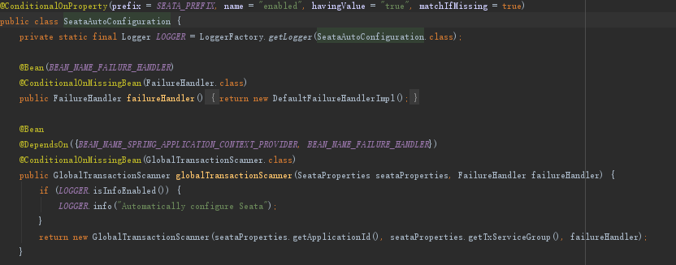
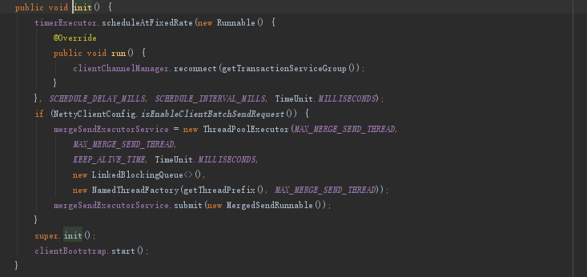
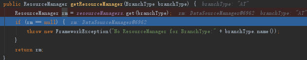

## 1. 概要
&emsp;Seata是一款优秀的开源分布式事务框架，提供了4种事务模式：at、tcc、xa、saga。  
&emsp;其中at模式是seata主打的代码无侵入事务模式，默认隔离性为读未提交；Tcc性能较好，但是需要修改业务，比如拆分出一个中间状态，seata需要业务系统配合编写侵入型代码。Xa是严格按照两阶段提交实现，性能较差。Saga适合链路较长的事务场景，配合状态机配置一起使用，可能需要解决隔离性产生的问题，比如第一个参与者事务提交，接着这个事务的数据发生了变更，后面的事务回滚，那么第一个事务回滚不回来。  
&emsp;下面我们主要介绍下at、tcc模式的使用，并分析下它们的实现机制。xa和saga因为不常用，我们再稍微了解下它们的原理。

## 2. seata的at模式
### 2.1. 使用介绍
如下图所示的业务逻辑:  
  
只需要在事务入口方法上添加@GlobalTransactional，即可开启全局事务:  
  

at模式的整体请求流程为：  
  

1. TM 向 TC 申请开启一个全局事务，全局事务创建成功并生成一个全局唯一的 XID。
2. XID 在微服务调用链路的上下文中传播。
3. RM提交的时候，RM 向 TC 注册分支事务，获取branchId，最终新增undo记录快照和变更业务记录，最后将执行结果汇报给TC。
4. TM 根据 TC 中所有的分支事务的执行情况，发起全局提交或回滚决议。
5. TC调度 XID 下管辖的全部分支事务完成提交或回滚请求

## 3. 客户端启动
### 3.1. seata-spring-boot-starter 
&emsp;&emsp;应用可以依赖官方提供的seata-spring-boot-starter包来初始化seata客户端，如果不依赖该包，则需要自行加载配置进行初始化。下面介绍seata-spring-boot-starter是如何初始化seata的。
### 3.2. GloableTransationalScanner初始化  
&emsp;&emsp;starter利用了springaop自动代理机制对一些bean进行代理，GloableTransationalScanner针对标有GloableTransaction注解的方法进行代码增强（注册全局事务、回滚全局事务等），同时利用afterPropertiesSet进行处理客户端的初始化。  
seataAutoConfiguration-》GlobalTransactionScanner-》initClients  
  
### 3.3. 初始化TM、RM  
客户端的初始化：  
  
Seata的客户端有两种:  
* Tm代表一个全局事务管理器，负责管理全局事务，可以进行全局事务的注册和提交。  
* RM代码分支事务管理器，管理分支事务。  
### 3.4. 初始化TM  
调用init方法  
  

  
1. 注册消息处理器，消息处理器可以处理来自TC的消息
2. 建立tc的服务端连接
3. 启动netty  
   
**注意：**  
**&emsp;&emsp;Tm实例创建（new channelmanager，ClientHandler）TmClient init-> 注册处理器->接着int会reconnectChannel(让channelmanager持有连接tc的channel)->netty启动绑定ClientHandler(消息会获取具体的processor进行处理).**

### 3.5. 初始化RM  
 
  
其流程为：
1. 初始化一些manager
2. 注册消息处理器
3. 建立tc的服务端连接
4. 启动netty  
  

其中：  
 * ResourceManager负责资源的注册和注销
 * 消息回调监听器负责rmHandler用于接收seata-server在二阶段发出的提交或者回滚请求。  
  
**注意：**  
  **&emsp;&emsp;获取RMclient实例（new对象DefaultResourceManager、channelmanager、DefaultRMHandler）-》int，注册processor->reconnetc tc 填充channel-》netty启动绑定ClientHandler(消息会获取具体的processor进行处理).**  
### 3.6. GlobalTransactionScanner的aop注解拦截器  
&emsp;&emsp;代码增强部分会最终使用GlobalTransactionalInterceptor进行处理，如下下图所示，GlobalTransactionalInterceptor中的invoke方法如：  
  
如果方法上有全局事务注解，调用handleGlobalTransaction开启全局事务，如果没有，按普通方法执行，避免性能下降  
  
最终调用的是TransactionalTemplate的execute方法，execute就是开启事务，提交或回滚的核心代码了。  
  
以上是一个完整的分布式事务入口和出口，开启全局事务会通知TC并获取一个xid，异常回滚，会通知TC让TC通知各个RM回滚，无异常则会通知TC，让各个RM提交
下面我们看看开启全局事务通知TC如何实现的。  
  
如上的代码显示，begin会调用transactionManager的begin，最终同步调用tc并获取XID  
  

将XID绑定到上下文中  
    

下面我们看看全局回滚是怎么实现的：
它也是调用TC通知的，和开启事务一样，全局提交也是如此。  
   
远程调用TC是由在TM初始化的时候初始的RmNettyRemotingClient的sendSyncRequest方法执行的。  
   
全局提交的和回滚一样，都是发送消息至TC。  
### 3.7. 数据库代理  
Starter中的SeataDataSourceAutoConfiguration会初始化代理数据源  
  
并初始化onnectionProxy，StatementProxy的代理类。
DataSourceProxyHolder会根据模式来创建对应的代理对象  
  
创建数据源代理对象的时候会向TC注册当前的数据源（rm）  
  
获取当前模式（at）对应的ResourceManager对象（spi机制会注册多个manager，报告at、saga等）,因为不同的模式逻辑可能不一样。  

  
### 3.8. 执行业务sql  
当一个sql在执行的时候，会判断是不是处于一个全局事务之中，如果不是则走普通sql
PreparedStatementProxy执行sql  

  
我们再来ConnectionProxy，看ConnectionProxy最后commit，会将undo日志插入sql和业务sql一并执行  

  
最后会上报它们的执行状态  
如何进行上报的，和TM开启全局事务获取XID一样，调用RmNettyRemotingClient发送消息至TC  
### 3.9. RM最终提交和回滚  
在上面已经介绍了，RM初始化后，会定义很多处理器，其中就有处理tc发过来提交或回滚指令。
  
### 3.10. RM最终提交   
RmBranchCommitProcessor  
  
BranchCommitRequest  
  
会根据类型从map中取出对应的handler（spi机制放入的，不同的seata类型不一样），进行处理  
  
处理会调用抽象类doBranchCommit  
  
DataSourceManager(spi机制)会最终调用worker处理  
  
commit请求放到队列中，有定时任务处理  
  
  
按照数据库类型批量删除undo日志  
  
### 3.11. RM回滚  
DataSourceManager的branchRollback
UndoLogManager.undo(dataSourceProxy, xid, branchId)，大体是根据Undolog进行反解析并执行回滚操作。
然后进行回滚日志的清理和提交。
  
## 4. seata的TCC模式  
  
流程为：  
1. 全局事务拦截器拦截到@GlobalTransational注解，调用TM开启全局事务
2. 执行TCC参与者的prepare方法时，被TCC拦截器拦截，在prepare方法执
3. 行前注册分支事务到TC，在prepare方法执行后向TC报告分支事务的状态
4. 如果执行发生异常则TM通知TC回滚事务，否则TM通知TC执行提交事务
5. TC收到TM的提交或回滚通知，遍历各TCC分支事务，逐个进行提交或回滚  

  
### 4.1. 使用示例  
接口发布：  

  
### 4.2. 全局事务的开启、提交、回滚分析  

#### 4.2.1. TCC的初始化  
&emsp;&emsp;Seata 的 spring 模块会对涉及到分布式业务的 bean 进行处理。项目启动时，当 GlobalTransactionalScanner 扫描到 TCC 服务的 reference 时（即tcc事务参与方），会对其进行动态代理，即给 bean 织入 TCC 模式下的 MethodInterceptor 的实现类。tcc 事务发起方依然使用 @GlobalTransactional 注解开启，织入的是通用的 MethodInterceptor 的实现类  
&emsp;&emsp;globalTransationscanner判断是否为TCC代理  
  
判断是否TCC代理的过程中，会进行TCC资源的初始化  
  
如上代码所示：  
通过反射拿到了TwoPhaseBusinessAction注解中声明的Commit方法和Rollback方法并封装成TCCResource对象，最终调用ResourceManager的registerResource方法。TCC模式下ResourceManger的实现为TCCResourceManager，AbstractRMHandler的实现为RMHandlerTCC。  
最终会将资源注册至tc上去  
  
#### 4.2.2. 开启tcc事务  
同AT模式一样，通过GlobalTransactionalInterceptor实现
拦截器添加开启事务  
执行业务方法：  
* 如果有异常向TC发送回滚指令
* 如果无异常向TC提交提交指令  
  

  
#### 4.2.3. 分支事务的注册  
&emsp;&emsp;Tcc的拦截器使用一个ActionInterceptorHandler来帮助进行分支事务的注册，这个TCC的拦截器主要是拦截定义的tcc方法接口，只要执行了这个方法就会被分支事务功能增强。
并获取branchId  

  
### 4.3. 全局提交  
和at模式一样，最终调用的DefaultGlobalTransaction的commit方法，最终会rpc调用tc  
  
总结一下全局事务提交的大致流程：
1. 业务方调用微服务无异常，通过TM发起事务提交请求
2. TC接收到事务提交请求后，通过Xid找到全局事务，再取出所有分支事务
3. 遍历分支事务，发出分支事务提交请求
4. TCC资源管理器RM接收到提交请求后，从本地TCCResource缓存中根据resourceId取出对应方法bean，反射调用commit方法。  

下面为rm接收到tc的commit请求的代码  
  
Tc如何接受消息并处理，在本文暂不梳理。  
### 4.4. 全局回滚
和at模式一样，最终调用的DefaultGlobalTransaction的rollback方法，最终会rpc调用tc  

## 5. seata的其它模式简要介绍
### 5.1. XA模式
  
Branchid 在xa的start之前  
### 5.2. SAGA模式  
参考http://seata.io/zh-cn/blog/design-more-flexable-application-by-saga.html  
  
## 6. 总结
* AT、TCC、SAGAX属于补偿性事务，XA属于强事务，因此性能比较差
* Seata使用了大量的spi机制，比如不同类型的资源管理器、消息事务管理器来方便根据不同模式使用不同的代码逻辑，在以后的编程中可以借鉴
* 使用时需要注意，AT模式为读未提交
* Seata本身会增加系统性能损耗，如全局事务xid获取（与TC通讯）、before image解析SQL、after image解析SQL、insert undo log（新增的sql记录），branch注册（tc通讯）、undo记录数据量较大（包含执行前和执行后的记录），第二阶段会占用系统资源、网络开销、数据库资源等，所以在使用的时候一定要考虑为了这个一致性有较大性能损耗是否值得。
* TC目前是支持节点的集群部署，但是水平扩展较弱，比如TC依赖数据库，瓶颈将会在数据库上。

   
   
   
  

   
   
   
   

# 草稿
=seata-spring-boot-starter 负责加载相关的配置

Client 有bootstrap，manager, client初始化一些processd到map，并连接server到manager，再bootstrap启动netty，进行handler，hander持有各种处理器的processord的map。

ClientMessageListener 是 RM 消息处理监听器，用于负责处理从 TC 发送过来的指令，并对分支进行分支提交、分支回滚，以及 undo log 删除操作；最后 init 方法跟 TM 逻辑也大体一致；DefaultRMHandler 封装了 RM 分支事务的一些具体操作逻辑。

初始化initClients

初始化TM
1、注册事件处理器
2、开启定时任务连接server
初始化RM
1、注册事件处理器
2、连接server，放在netty管理器clientChannelManager
3、启动nettybootstrap

########事务如何进行拦截和开启的：
GlobalTransactionScanner中的wrapIfNecessary，会根据是否包含gloabletransation注解来生产代理类拦截器GlobalTransactionalInterceptor，其中会调用transationtemplate中会开启事务,其中代码：

#######undo日志是如何生成的
SeataDataSourceAutoConfiguration会代理数据库

最终会交给io.seata.rm.datasource.DataSourceProxy这个类来代理，他初始化一些配置ConnectionProxy，PreparedStatementProxy代理类。

先判断是否开启了全局事务，如果没有，不走代理，不解析sql，避免性能下降
调用SQLVisitorFactory对目标sql进行解析
针对特定类型sql操作(INSERT,UPDATE,DELETE,SELECT_FOR_UPDATE)等进行特殊解析
执行sql并返回结果

AbstractDMLBaseExecutor方法会解析XID入undo库
获取sql执行前镜像beforeImage
执行sql
获取sql执行后afterimage
根据beforeImage，afterImage生成undolog记录并添加到connectionProxy的上下文中
Sql

将tc的commit请求放到队列中
启动定时任务

同理tc的回滚也是一样的流程

2、Tcc的机制
6.Tcc的面临的问题
a)业务拆分
业务逻辑的拆分、本来转账的操作只需要扣，但是就可能被拆分成冻结、扣除。
用户接入 TCC 模式，最重要的事情就是考虑如何将业务模型拆成 2 阶段，实现成 TCC 的 3 个方法，并且保证 Try 成功 Confirm 一定能成功。相对于 AT 模式，TCC 模式对业务代码有一定的侵入性，但是 TCC 模式无 AT 模式的全局行锁，TCC 性能会比 AT 模式高很多。
b)空回滚
c)防悬挂
d)幂等控制

大致流程如下：

1.全局事务拦截器拦截到@GlobalTransational注解，调用TM开启全局事务

2.执行TCC参与者的prepare方法时，被TCC拦截器拦截，在prepare方法执

行前注册分支事务到TC，在prepare方法执行后向TC报告分支事务的状态

3.如果执行发生异常则TM通知TC回滚事务，否则TM通知TC执行提交事务

4.TC收到TM的提交或回滚通知，遍历各TCC分支事务，逐个进行提交或回滚

