## 1. 概要
&emsp;tc负责seata事务的协调，被称为协调器（tc），几乎每个阶段都要与tc进行交互，比如全局事务的开启，需要tc来生成xid给客户端，branch注册分支事务需要申请branch。全局事务回滚和全局提交都需要tc来向每一个参与的客户端发起相应的通知。  
&emsp;这些客户端发过来的数据不能放置在内存中，因为避免宕机导致数据丢失，seata提供了db、reids、file等持久化的方式。  
&emsp;还需要定时将未完成的事务、或者提交失败的事务进行重试处理，来保证事务的最终一  
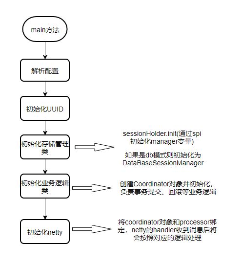  
## 2. 原理分析
### 2.1. 启动入口
main函数io.seata.server.Server  
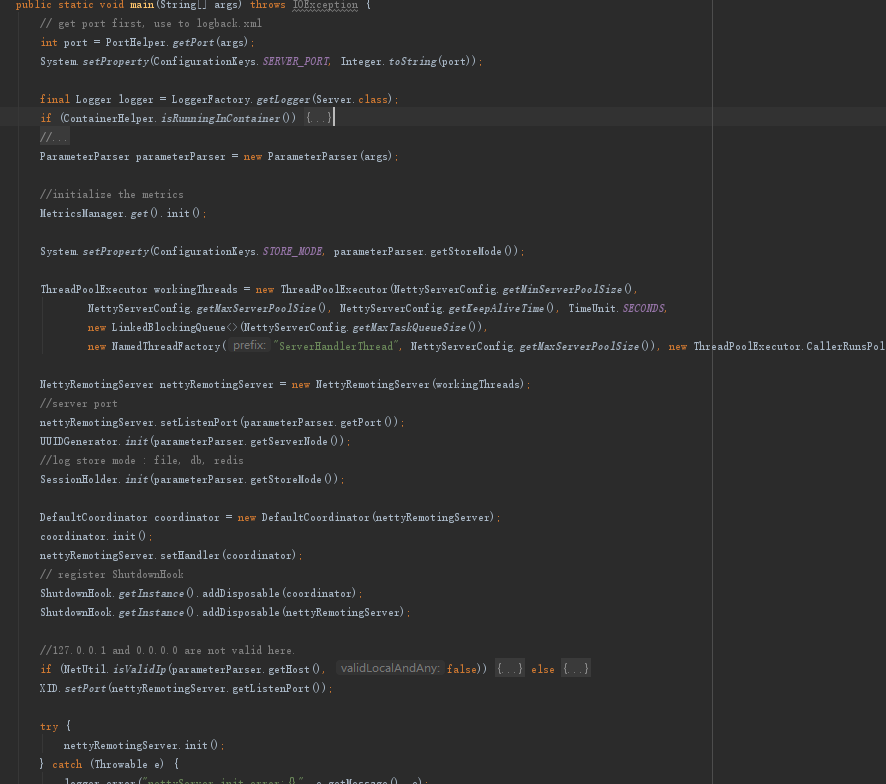  
1. 解析启动配置参数
2. 初始化UUID，用于XID等一些id的生成
3. 根据配置来初始化存储类，比如有的是redis有的是file或db
4. 初始化事务注册等业务逻辑类，如全局事务开启、分支事务注册、回滚等处理类
5. 初始化netty网路通讯，最后启动netty
### 2.2. sessionHolder初始化  
EnhancedServiceLoader.load(SessionManager.class, StoreMode.DB.getName());  
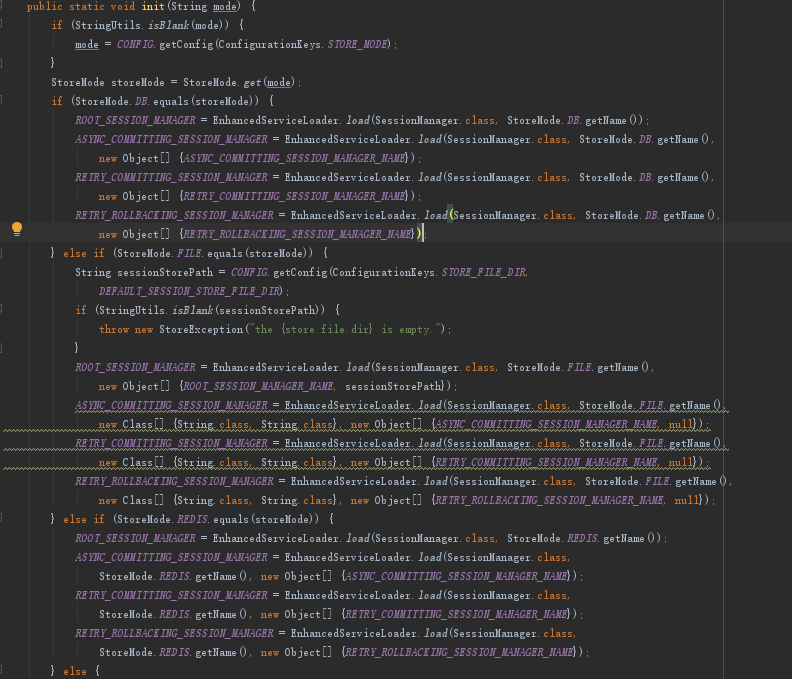  
1. 通过spi机制获取所有的sessionmanager实例
2. 通过spi机制获取异步提交SessionManager
3. 通过spi机制获取]提交重试SessionManager
4. 通过spi机制获取回滚SessionManager
5. 四个SessionManager本质都是类DataBaseSessionManager的实例  
   
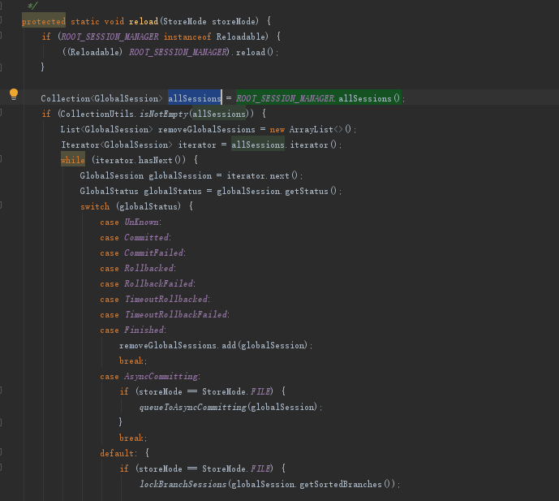  
通过spi机制获取所有的sessionmanager实例  

## 2.3. 初始化DefaultCoordinator
&emsp;&emsp;init方法初始化了5个定时器，主要用于分布式事务的重试机制，所以要通过不断的重试机制来实现事务的最终一致性。下面的定时器除了undoLogDelete之外，其他的定时任务默认都是1秒执行一次。  

  
举个例子，异步提交定时任务  
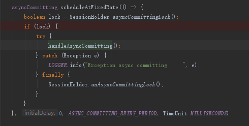
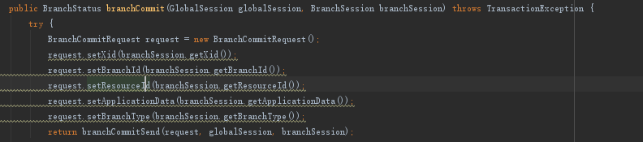  
根据事务类型，获取相应的session列表。然后doCommit发送到客户端  
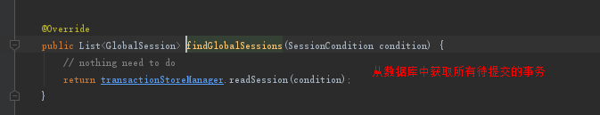
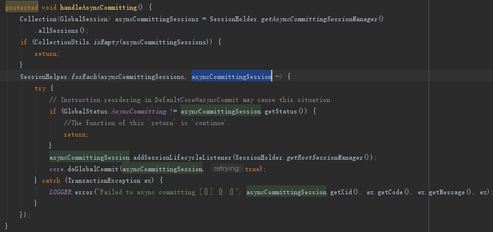
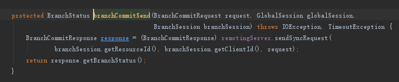  
客户端收到这个提交消息后，会将undo日志删除，具体的逻辑请参照客户端原理分析。  
## 2.4. Netty的初始化  
这个步骤主要有两步：
1. registerProcessor：注册与Client通信的Processor。
2. super.init()：super.init()方法中负责初始化Netty，并把当前实例的IP端口注册到注册中心中。  
  
  

注册多个处理客户端发送的消息的processor: 
1. 注册事务处理相关的Processor，比如事务提交，回滚，第一阶段获取branchId
2. 注册ResponseProcessor，ResponseProcessor用于处理当Server端主动发起请求时s收到的回复信息
3. Client端发起RM注册请求时对应的Processor
4. Client端发起TM注册请求时对应的Processor
5. Client端发送心跳请求时对应的Processor

Netty启动成功之后把当前实例注册到registry.conf配置文件配置的注册中心上  
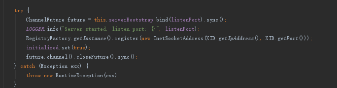  
注册了多个处理器，绑定了DefaultCoordinator作为handler，当消息被netty接受后，message处理时获取对应的processor，然后processor会使用DefaultCoordinator进行业务处理  
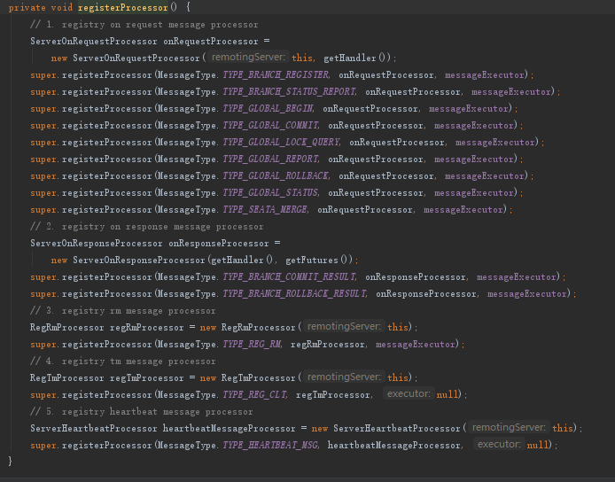  
## 2.5. 接收收消息示例
### 2.5.1. 注册全局事务提交的processor

### 2.5.2. DefaultCoordinator处理消息，GlobalBeginRequest处理消息
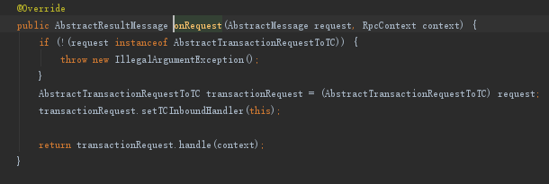
### 2.5.3. 生成xid，并将相应的数据存储至数据库
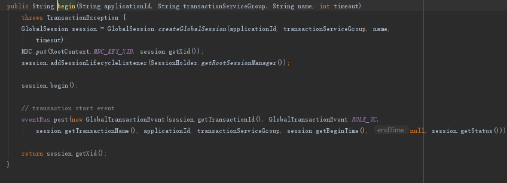
### 2.5.4. 将xid封装成response，发送回客户端

## 3. 总结
* Seata 的server通过spi机制初始化不同的持久化方式，本文配置的是db
* Seata 的配置可以从nacos读取，服务节点实现了基于nacos的服务发现机制
* Coordinator是server的核心，负责了和RM、TM交互的核心业务逻辑。
* 使用netty与客户端交互来提高通讯性能