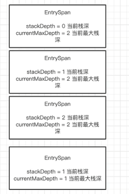
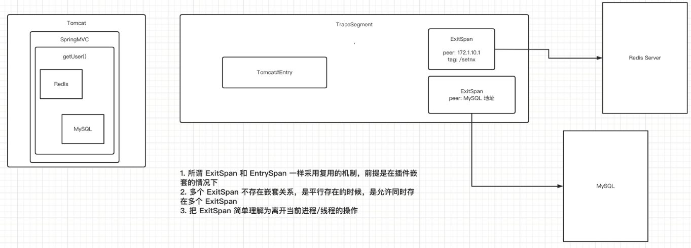
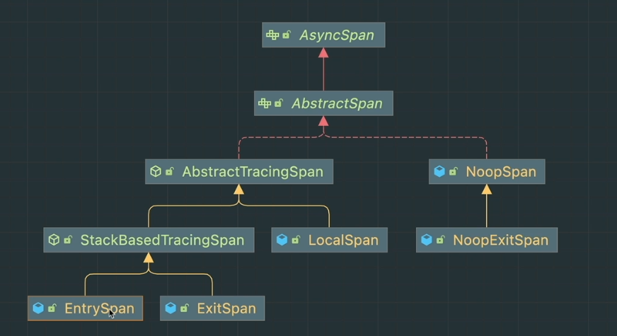
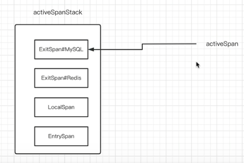

## 1. 前置知识

### 1.1. 通用规范

* 链路追踪  

  opentracing链路追踪协议https://github.com/opentracing-contrib/opentracing-specification-zh.git

  [opentracing-specification-zh/specification.md at master · opentracing-contrib/opentracing-specification-zh (github.com)](https://github.com/opentracing-contrib/opentracing-specification-zh/blob/master/specification.md)

  这个介绍了链路追踪的通用数据模型和通用的api，遵循这些语义规范。

* dapper

### 1.2. 基础概念

这里有一个请求从gateway触发，经历了多个服务，形成了一个链路 

* segement

  一个jvm进程的所有操作叫做segment

  如果所示有6个segment,后一个服务的segment会指向前一个segment

  我们通过parent将多个segement连接起来

* span

  一个segment内部的具体的操作操作叫做span

  比如，访问redis、访问mysql

  span之间也是会有parent的关系的

  但是这些span都是属于一个segement的，即segment是一个容器，装了很多span的

* trace

  trace就是一次请求，将这么多的span、segement串联起来，

  trace有一个id，是全局唯一的。

 

 

如图所示

* 1代表的是链路
* 2代表的是segement
* 3代表的是span

## 2. traceId

org.apache.skywalking.apm.agent.core.context.ids.DistributedTraceId

上面将的链路的id主要是这个类生成的

```
/**
 * The <code>DistributedTraceId</code> presents a distributed call chain.
 * <p>
 * This call chain has a unique (service) entrance,
 * <p>
 * such as: Service : http://www.skywalking.com/cust/query, all the remote, called behind this service, rest remote, db
 * executions, are using the same <code>DistributedTraceId</code> even in different JVM.
 * <p>
 * The <code>DistributedTraceId</code> contains only one string, and can NOT be reset, creating a new instance is the
 * only option.
 */
@RequiredArgsConstructor
@ToString
@EqualsAndHashCode
public abstract class DistributedTraceId {
    @Getter
    private final String id;
}
```

根据注释，表示一个分布式调用链，即使跨了不同的jvm进程，链路id都一样

一旦这个traceid生成了，就不能重置，不能修改，只能重新生成

 它有两个实现：

* NewDistributedTraceId

  ```
  public class NewDistributedTraceId extends DistributedTraceId {
      public NewDistributedTraceId() {
          super(GlobalIdGenerator.generate());
      }
  }
  ```

  GlobalIdGenerator是生成traceid的工具类

  ```
  public static String generate() {
      return StringUtil.join(
          '.',
          PROCESS_ID,
          String.valueOf(Thread.currentThread().getId()),
          String.valueOf(THREAD_ID_SEQUENCE.get().nextSeq())
      );
  }
  ```

  THREAD_ID_SEQUENCE是一个threadlocal工具

  ```
  private static final ThreadLocal<IDContext> THREAD_ID_SEQUENCE = ThreadLocal.withInitial(
      () -> new IDContext(System.currentTimeMillis(), (short) 0));
  ```

  通过threadlocal获取到idcontext

  其中IDContext

  ```
  private static class IDContext {
      private long lastTimestamp;
      private short threadSeq;
  
      // Just for considering time-shift-back only.
      private long lastShiftTimestamp;
      private int lastShiftValue;
  
      private IDContext(long lastTimestamp, short threadSeq{
          this.lastTimestamp = lastTimestamp;
          this.threadSeq = threadSeq;
      }
             private long nextSeq() {
              return timestamp() * 10000 + nextThreadSeq();
          }
  
          private long timestamp() {
              long currentTimeMillis = System.currentTimeMillis();
  
              if (currentTimeMillis < lastTimestamp) {
                  // Just for considering time-shift-back by Ops or OS. @hanahmily 's suggestion.
                  if (lastShiftTimestamp != currentTimeMillis) {
                      lastShiftValue++;
                      lastShiftTimestamp = currentTimeMillis;
                  }
                  return lastShiftValue;
              } else {
                  lastTimestamp = currentTimeMillis;
                  return lastTimestamp;
              }
          }
  
          private short nextThreadSeq() {
              if (threadSeq == 10000) {
                  threadSeq = 0;
              }
              return threadSeq++;
          }
      }
  ```

  * lastTimestamp

    上一次生成seqenece的时间戳

  * threadSeq线程的序列号

  * lastShiftTimestamp、lastShiftValue

    处理时钟回拨的，因为操作系统可能会引起时间设置倒退

  * nextSeq

    这个就是generate其中调用的方法,其中会结合timestamp() * 10000 + nextThreadSeq()生成序列号

  * timestamp

    获取当前的时间戳，如果发生了时间回拨处理一下,返回应该的当前的时间戳

  * nextThreadSeq

    会在0-10000之间循环遍历

  所以总的来说

  GlobalIdGenerator.generate()会根据当前线程生成的序列号，加上线程id，进程id生成的，然后就可以生成全局id了

  这个GlobalIdGenerator既可以生成traceid又可以生成segementid

* PropagatedTraceId

  ```
  public class PropagatedTraceId extends DistributedTraceId {
      public PropagatedTraceId(String id) {
          super(id);
      }
  }
  ```

## 3. segement

一次请求打到一个jvm进程里后，通常是由一个线程来完成，但是也有可能在里面开了一个线程池。所以准确来讲，一个segment表示一个jvm的一个segment的所有操作。

```
public class TraceSegment {

     private String traceSegmentId;
     private TraceSegmentRef ref;
     private List<AbstractTracingSpan> spans；
     private DistributedTraceId relatedGlobalTraceId;
     private boolean ignore = false;
     private boolean isSizeLimited = false;
     private final long createTime;

}
```

* spans

  表示当前当前这个segment的所有的操作

* relatedGlobalTraceId

  当前所在的globaltraceid

* traceSegmentId

  tracesegmentid的唯一id

* TraceSegmentRef

  这个是当前segment的上一个segment的指针，这个字段不会被序列化，只是为了快速访问

  ```
  public class TraceSegmentRef {
      private SegmentRefType type;
      private String traceId;
      private String traceSegmentId;
      private int spanId;
      private String parentService;
      private String parentServiceInstance;
      private String parentEndpoint;
      private String addressUsedAtClient;
  }
  public enum SegmentRefType {
  	CROSS_PROCESS, CROSS_THREAD
  }
  ```

  * SegmentRefType

    * CROSS_PROCESS

      代表跨进程

    * CROSS_THREAD

      代表跨线程

  * traceSegmentId

    代表的是就是parent的segmentid

  * spanId

    代表的是spanid，后面会进行分析

  * parentService

    调用者的服务

  * parentServiceInstance

    调用者的服务实例

  * parentEndpoint

    调用父类的一个请求

  * transform

    将TraceSegmentRef对象转化为Probuffer

    

### 3.1. relatedGlobalTrace

当前的segment关联一个全局traceid

```
public void relatedGlobalTrace(DistributedTraceId distributedTraceId) {
    if (relatedGlobalTraceId instanceof NewDistributedTraceId) {
        this.relatedGlobalTraceId = distributedTraceId;
    }
}
```

### 3.2. ref

引用某一条segment

```
public void ref(TraceSegmentRef refSegment) {
    if (null == ref) {
        this.ref = refSegment;
    }
}
```

### 3.3. archive

将一个span加进来

```
public void archive(AbstractTracingSpan finishedSpan) {
    spans.add(finishedSpan);
}
```

### 3.4. finish

这里传入一个布尔值，表示操作做完了

```
public TraceSegment finish(boolean isSizeLimited) {
    this.isSizeLimited = isSizeLimited;
    return this;
}
```

其中isSizeLimited和一个配置文件相关，SPAN_LIMIT_PER_SEGMENT默认300

这个标识一个segment默认可以存储的span数，举例如：

```
private boolean isLimitMechanismWorking() {
    if (spanIdGenerator >= spanLimitWatcher.getSpanLimit()) {
        long currentTimeMillis = System.currentTimeMillis();
        if (currentTimeMillis - lastWarningTimestamp > 30 * 1000) {
            LOGGER.warn(
                new RuntimeException("Shadow tracing context. Thread dump"),
                "More than {} spans required to create", spanLimitWatcher.getSpanLimit()
            );
            lastWarningTimestamp = currentTimeMillis;
        }
        return true;
    } else {
        return false;
    }
}
```

就是表示当我们要关闭segment的时候，表示我当前的segment是否已经收集满了segement了，true表示已经满了，会丢弃一部分span操作

## 4. span

### 4.1. componentsDefine

```
public class ComponentsDefine {

    public static final OfficialComponent TOMCAT = new OfficialComponent(1, "Tomcat");

    public static final OfficialComponent HTTPCLIENT = new OfficialComponent(2, "HttpClient");

    public static final OfficialComponent DUBBO = new OfficialComponent(3, "Dubbo");

    public static final OfficialComponent MOTAN = new OfficialComponent(8, "Motan");

    public static final OfficialComponent RESIN = new OfficialComponent(10, "Resin");
    .................
    
```

这个就是定义的plugin的名称。这个组件全部用Component的实现类来表示，即OfficialComponent，代表的是官方的插件，但是如果想自己写的话，需要新实现一个

### 4.2. spanlayer

```
public enum SpanLayer {
    DB(1),//比如访问mysql、还是oracle等等数据库的操作 
    RPC_FRAMEWORK(2),//远程调用 
    HTTP(3),
    MQ(4),
    CACHE(5);
```

在skywalking中，将所有的插件分成了5类

### 4.3. tags

这个类定义了一些官方的tags对象

```
public static final StringTag URL = new StringTag(1, "url");

/**
 * STATUS_CODE records the http status code of the response.
 */
public static final StringTag STATUS_CODE = new StringTag(2, "status_code", true);

/**
 * DB_TYPE records database type, such as sql, redis, cassandra and so on.
 */
public static final StringTag DB_TYPE = new StringTag(3, "db.type");
```

### 4.4.  AsyncSpan

用于异步的插件，特别是rpc插件。

#### 4.4.1. AbstractSpan 

* AbstractSpan setComponent(Component component);

  表示当前的这个操作发生在哪个一个插件身上。

* AbstractSpan setLayer(SpanLayer layer);

  设置当前的这个操作的分类（5大类）

* AbstractSpan tag(AbstractTag<?> tag, String value)

  在这儿span上面打标签，有String和AbstractTag的类型，AbstractTag有覆盖的功能

* AbstractSpan log(Throwable t)

  记录一个异常为本地时间，见注释

  ```
  Record an exception event of the current walltime timestamp.
  ```

* AbstractSpan errorOccurred()

  标记一下这个span为异常的

* isEntry

  进入span

* isExit

  退出span

* AbstractSpan log(long timestamp, Map<String, ?> event)

  记录一个事件

* AbstractSpan setOperationName(String operationName)

  记录当前操作的名称，如果当前组件是http是http则是url，如果是db则是sql语句,如果是redis，则就是redis命令

* AbstractSpan start()

  表示span这个操作动作开始

* void ref(TraceSegmentRef ref)

  这个span的父segment操作，segment和segment之间是靠这个TraceSegmentRef 进行连接的

* AbstractSpan setPeer(String remotePeer)

  设置对端地址

  一个请求可能跨多个进程，操作多个中间件，每次进行rpc对面的地址就是remotepeer

* boolean isProfiling();

  这个后面在进行分析

* void skipAnalysis();

  发送给后端是否要进行分析

#### 4.4.2. AbstractTracingSpan

这个类继承了abstractspan抽象类，实现了部分方法

##### 4.4.2.1. **核心属性：**

* spanId

  一个segmemetn有很多span，这些span都会给他们分配一个spanid

* parentspan

  一个span是上一个还没有结束的span触发的，这个就是他的父类的id

* isInAsyncMode

  当前的异步操作是否已经开启了

* isAsyncStopped

  当前的异步操作是否已经结束了

* TracingContext

  这个很重要，用来管理一条链路的segment

* protected List<TraceSegmentRef> refs;

  用于当前span指定自己所在的segment的前一个segment，除非这个是所有的链路的第一个segment。

  通常情况下是一个segments，但是如果是批处理就有可能有多个parent了。

  例如一次rpc去请求配拆分成多给子任务，这些线程是并行的，最终会进行join方法，最终又汇集成一个线程处理，那么这个线程的parentsegemtn就可能有多个，ref多个了

  常见于 MQ / Batch 调用。例如，MQ 批量消费消息时，消息来自【多个服务】。每次批量消费时，【消费者】新建一个 TraceSegment 对象：

  将自己的 `refs` 指向【多个服务】的多个 TraceSegment 。

  将自己的 `relatedGlobalTraces` 设置为【多个服务】的多个 DistributedTraceId

* 其它的的字段和abstactspan类似

  skipAnalysis为true，当前这个segment的所有的span都不会分析

* tags

  在Tags类中会官方定义一些tag,可以通过一些方法传入

  Tags里面定义了很多tags

##### 4.4.2.2. **核心方法：**

* finish方法

  ```
  public boolean finish(TraceSegment owner) {
      this.endTime = System.currentTimeMillis();
      owner.archive(this);
      return true;
  }
  ```

  就是把当前的span添加到当前的segment之中

* log

  ```
  public AbstractTracingSpan log(Throwable t) {
      if (logs == null) {
          logs = new LinkedList<>();
      }
      if (!errorOccurred && ServiceManager.INSTANCE.findService(StatusCheckService.class).isError(t)) {
          errorOccurred();
      }
      logs.add(new LogDataEntity.Builder().add(new KeyValuePair("event", "error"))
                                          .add(new KeyValuePair("error.kind", t.getClass().getName()))
                                          .add(new KeyValuePair("message", t.getMessage()))
                                          .add(new KeyValuePair(
                                              "stack",
                                              ThrowableTransformer.INSTANCE.convert2String(t, 4000)
                                          ))
                                          .build(System.currentTimeMillis()));
      return this;
  }
  ```

  * 判断当前还没有发生发生了异常，并且判断哪些异常不断异常

    ServiceManager.INSTANCE.findService(StatusCheckService.class).isError(t)，就记录异常栈

  * 然后从异常中提炼出相关信息

* public void ref(TraceSegmentRef ref)

  将ref放到列表中

* prepareForAsync

  ```
  public AbstractSpan prepareForAsync() {
      if (isInAsyncMode) {
          throw new RuntimeException("Prepare for async repeatedly. Span is already in async mode.");
      }
      ContextManager.awaitFinishAsync(this);
      isInAsyncMode = true;
      return this;
  }
  ```

  表示我们要做异步了

  ```
  ContextManager.awaitFinishAsync(this);
  ```

  表示等待异步来完成 

* asyncFinish

  异步任务结束

  ```
  public AbstractSpan asyncFinish() {
      if (!isInAsyncMode) {
          throw new RuntimeException("Span is not in async mode, please use '#prepareForAsync' to active.");
      }
      if (isAsyncStopped) {
          throw new RuntimeException("Can not do async finish for the span repeatedly.");
      }
      this.endTime = System.currentTimeMillis();
      owner.asyncStop(this);
      isAsyncStopped = true;
      return this;
  }
  ```

  asyncStop提交这个span

#### 4.4.3. StackBasedTracingSpan

这个span继承于AbstractTracingSpan。从这个类的注释我们可以看出

```
This kind of span can start and finish multi times in a stack-like invoke line.
```

这个栈可以在一个栈的调用中被启动和finish多次。

##### 4.4.3.1. 示例

到底该怎么理解呢？举例如下：

* 一个tomcat部署了一个sprinmvc的应用

* 一个请求进来，先进入到tomcat的plugin，会创建一个EntrySpan

  一个segment只能有一个entryspan。

  ```
  AbstractSpan span = ContextManager.createEntrySpan(request.getRequestURI(), contextCarrier);
  Tags.URL.set(span, request.getRequestURL().toString());
  Tags.HTTP.METHOD.set(span, request.getMethod());
  span.setComponent(ComponentsDefine.TOMCAT);
  SpanLayer.asHttp(span);
  ```

* tomcat的请求到达springmvc插件，也会执行这个创建方法

  ```
  AbstractSpan span = ContextManager.createEntrySpan(operationName, contextCarrier);
  Tags.URL.set(span, httpServletRequest.getRequestURL().toString());
  Tags.HTTP.METHOD.set(span, httpServletRequest.getMethod());
  span.setComponent(ComponentsDefine.SPRING_MVC_ANNOTATION);
  SpanLayer.asHttp(span);
  ```

  * 一个segment只能有一个entryspan。因此会复用tomcat层的entryspan。
  * 因此后面的插件会覆盖前面创建的entryspan的span信息，不如componet等等之类的。这种覆盖关系的实现就需要使用stackbasedtracingspan技术了

* 调用getUser方法，这个创建的是一个localspan了。

##### 4.4.3.2. 栈结构

entryspan时使用当前栈深度和当前最大栈深来保存

 

**注意在这个栈中是一个span，从下到上是从tomcat请求到结束的变化图**。从这个请求过程和参数我们可以得出结论：

* 当最大值和当前值相等时，为正向请求
* 当当前值小于最大值时，说明请求返回
* entryspan记录的信息永远是最靠近服务的提供侧的信息。即getUser

##### 4.4.3.4. 核心属性

```
public abstract class StackBasedTracingSpan extends AbstractTracingSpan {
    protected int stackDepth;
    protected String peer;
```

* stackdepth

  表示栈的深度

* peer

  调用目标地址

```
@Override
public boolean finish(TraceSegment owner) {
    if (--stackDepth == 0) {
        return super.finish(owner);
    } else {
        return false;
    }
}
```

当栈的深度为0的时候，说明栈空了，需要结束了，结束TraceSegment

#### 4.4.4. EntrySpan

* public EntrySpan start()

  这个entryspan继承于stackbasedTracingspan.根据注释我们可以知道，这个entryspan只能由一定进入的插件创建。而entryspan的信息永远是最靠近服务测的信息。

  ```
  @Override
  public EntrySpan start() {
      if ((currentMaxDepth = ++stackDepth) == 1) {
          super.start();
      }
      clearWhenRestart();
      return this;
  }
  ```

  这里如果stackdeth为1，说明时请求进入方向。

  * 后面的插件会复用entryspan时，都会调用下这个方法。

  * 因为每一个插件认为自己时第一个entryspan。

  * 如果不等于1则会clearwhenrestart()，即清空一些基础信息。

* 其它方法

  * public EntrySpan tag(String key, String value)

  * public AbstractTracingSpan setLayer(SpanLayer layer)

  * public AbstractTracingSpan setComponent(Component component) 

  这些方法为设置调用信息，但是都会都会判断stackDepth == currentMaxDepth，因为这个是请求进入的方向，否则被反向覆盖

#### 4.4.5. ExitSpan

这个和entryspan类似，exitspan记录的时更靠近服务测的信息，比如dubbo调用，再调用httpclient调用，那么最终记录的是更靠近消费侧的信息，即dubbo的信息

* 启动方法

  ```
  public ExitSpan start() {
      if (++stackDepth == 1) {
          super.start();
      }
      return this;
  }
  ```

  只有栈的深度等于1时，才会启动，即刚刚创建。

* 我们一般在进行跨进程调用的时候会创建exitspan，并进行设置peer地址。比如访问redis或者访问mysql。都是一个exitspan。

* eixtspan和entryspan都是采用复用的机制，但前提时在嵌套调用之中。
* 多个exitspan不存在嵌套关系，是平行存在的，是兄弟关系
* tracesement里面不一定要有exitspan

因此exitspan可以简单理解为离开当前线程。

 


#### 4.4.6. LocalSpan

根据注释我们也可以知道

```
represents a normal tracing point, such as a local method
```

就是一个普通的点，通常记录一个本地方法的调用。

比如我们使用skywaking的工具包上面有注解，可以标注某些方法为localspan.它记录一些简单的信息

```
public LocalSpan(int spanId, int parentSpanId, String operationName, TracingContext owner) {
    super(spanId, parentSpanId, operationName, owner);
}
```

例如pinpoint的链路追踪可以精确到调用链中的每一个方法。它就是使用了多个localspan,它的追踪粒度非常大。而skaywalking采用了新的思路，性能剖析工具，填写的性能剖析的追踪请求后，就可以达到pinpoint的同样的思路了。

#### 4.4.7. 小结

 

注意，这里的noopexitspan，noopspan代表一个不会被记录的操作。为了确保span的整个工作流程的统一。

### 4.5. span引用关系

 

## 5. TracerContext

### 5.1. AbstractTracerContext

这个整个链路追踪的上下文管理器

* inject

  将跨进程的ContextCarrier注入进来，这个ContextCarrier就是一个segment中的所有信息。

  根据注释我们也可以知道它是跨进程调用会进行inject，需要传递一个ContextCarrier作为载具	

* extract

  与上面相反，它是提取信息，即跨进程的segment信息中提取

* capture

  用于跨线程传播数据调用使用，上面的是跨进程传输数据。不需要载具，直接生成快照即可。

* continue

  与capture相反，用于跨线程提取数据

* getReadablePrimaryTraceId

  获取只读的traceid

* getSegmentId

  获取当前segment的id

* int getSpanId();

  获取当前活跃的spanid

* createEntrySpan

  创建entryspan

* createLocalSpan

  创建localspan

* createExitSpan

  创建localspan

* activeSpan

  拿到当前活跃的span对象

* stopSpan

  Finish the given span

* CorrelationContext getCorrelationContext()

  获取用户自定义的一些数据

### 5.2. IgnoredTracerContext

这个是AbstractTracerContext的其中一个实现，这个就是不需要追踪的trace或span被这个上下文进行管理。这个是为了确保流程的一致性

```
/**
 * The <code>IgnoredTracerContext</code> represent a context should be ignored. So it just maintains the stack with an
 * integer depth field.
 * <p>
 * All operations through this will be ignored, and keep the memory and gc cost as low as possible.
 */
public class IgnoredTracerContext implements AbstractTracerContext {
    private static final NoopSpan NOOP_SPAN = new NoopSpan();
    private static final String IGNORE_TRACE = "Ignored_Trace";

    private final CorrelationContext correlationContext;
    private final ExtensionContext extensionContext;

    private int stackDepth;
```

### 5.3. TracingContext

这个是AbstractTracerContext的核心实现，是核心的追踪逻辑控制器。它基于栈工作机制构建tracingcontext。在跨线程或进程之间，我们使用TraceSegmentRef表示这种关系。而这种联系是通过ContextCarrier或者ContextSnapshot载具进行实现的。可以参考AbstractTracerContext的前几个核心的方法。所以总结下来这个类的核心功能就是：

* 当前的segment和自己前后的segment的引用TraceSegmentRef
* 当前的segment内的所有的span

#### 5.3.1.  核心属性

* 一个tracecontext持有一个Segment对象

* 活跃的span都存在一个栈里面 

  ```
  private LinkedList<AbstractSpan> activeSpanStack = new LinkedList<>();
  ```

  这些方法提供一些栈的操作

* AbstractSpan firstSpan

  从7.0.0开始支持延迟注入数据，比如inject跨进程时，支持空的注入

* spanIdGenerator

  生成下一个spanid

* span个数更新器，采用原子方法更新

  ```
  private volatile int asyncSpanCounter;
  private static final AtomicIntegerFieldUpdater<TracingContext> ASYNC_SPAN_COUNTER_UPDATER =
      AtomicIntegerFieldUpdater.newUpdater(TracingContext.class, "asyncSpanCounter");
  ```

* private volatile boolean running;

  当前tractcontext是否在运行

* SpanLimitWatcher

  配置更新监听器

*  TracingContext(String firstOPName, SpanLimitWatcher spanLimitWatcher) {

  构造器传入名字和监听器

#### 5.3.2.  活跃span

我们在一次请求的segment按顺序创建的segment都会一些span，这些span都放入到上面说的栈之中，而位于栈顶的span就是活跃的span

 

#### 5.3.3.  核心方法

* 获取当前spanid

  ```
  public int getSpanId() {
      return activeSpan().getSpanId();
  }
  ```

  获取当前活跃span的id

* createEntrySpan

  ```
  public AbstractSpan createEntrySpan(final String operationName) {
      if (isLimitMechanismWorking()) {
          NoopSpan span = new NoopSpan();
          return push(span);
      }
      AbstractSpan entrySpan;
      TracingContext owner = this;
      final AbstractSpan parentSpan = peek();
      final int parentSpanId = parentSpan == null ? -1 : parentSpan.getSpanId();
      if (parentSpan != null && parentSpan.isEntry()) {
          /*
           * Only add the profiling recheck on creating entry span,
           * as the operation name could be overrided.
           */
          profilingRecheck(parentSpan, operationName);
          parentSpan.setOperationName(operationName);
          entrySpan = parentSpan;
          return entrySpan.start();
      } else {
          entrySpan = new EntrySpan(
              spanIdGenerator++, parentSpanId,
              operationName, owner
          );
          entrySpan.start();
          return push(entrySpan);
      }
  }
  ```

  * isLimitMechanismWorking

    判断span的个数是否太多，如果为true，则不允许创建更多的span，则创建一个loopspan,入栈后直接返回

  * 先从栈中弹出一个parentspan，如果为空则是第一个栈，设置spanid为-1，否则将弹出的parentspan的id作为一个parentid

  * parentspandd的operationname被当前操作覆盖。赋值给entryspan，调用entryspan.start()的方法

    注意这里从栈中拿出元素没有删除，所以不用重新放回去

* createLocalSpan

  ```
  public AbstractSpan createLocalSpan(final String operationName) {
      if (isLimitMechanismWorking()) {
          NoopSpan span = new NoopSpan();
          return push(span);
      }
      AbstractSpan parentSpan = peek();
      final int parentSpanId = parentSpan == null ? -1 : parentSpan.getSpanId();
      AbstractTracingSpan span = new LocalSpan(spanIdGenerator++, parentSpanId, operationName, this);
      span.start();
      return push(span);
  }
  ```

  因为localspan没有复用逻辑，所以直接创建一个新的对象绑定一下父子关系就可以start然后放入到栈之中

* createExitSpan

  ```
  public AbstractSpan createExitSpan(final String operationName, final String remotePeer) {
      if (isLimitMechanismWorking()) {
          NoopExitSpan span = new NoopExitSpan(remotePeer);
          return push(span);
      }
  
      AbstractSpan exitSpan;
      AbstractSpan parentSpan = peek();
      TracingContext owner = this;
      if (parentSpan != null && parentSpan.isExit()) {
          exitSpan = parentSpan;
      } else {
          final int parentSpanId = parentSpan == null ? -1 : parentSpan.getSpanId();
          exitSpan = new ExitSpan(spanIdGenerator++, parentSpanId, operationName, remotePeer, owner);
          push(exitSpan);
      }
      exitSpan.start();
      return exitSpan;
  }
  ```

  和entryspan类似

* stopSpan

  ```
  /**
   * Stop the given span, if and only if this one is the top element of {@link #activeSpanStack}. Because the tracing
   * core must make sure the span must match in a stack module, like any program did.
   *
   * @param span to finish
   */
  @Override
  public boolean stopSpan(AbstractSpan span) {
      AbstractSpan lastSpan = peek();
      if (lastSpan == span) {
          if (lastSpan instanceof AbstractTracingSpan) {
              AbstractTracingSpan toFinishSpan = (AbstractTracingSpan) lastSpan;
              if (toFinishSpan.finish(segment)) {
                  pop();
              }
          } else {
              pop();
          }
      } else {
          throw new IllegalStateException("Stopping the unexpected span = " + span);
      }
  
      finish();
  
      return activeSpanStack.isEmpty();
  }
  ```

  根据注释我们可以知道关闭span，必须要符合栈的逻辑，必须先关闭栈顶的元素。

  * toFinishSpan.finish(segment)会将span中的计数发生变更
  * 调用finish的方法，逻辑如下

* finish();

  这个是用来结束context的，这个方法需要判断栈是否空了，才会真正的结束，才会清理一些参数，并且做一些监听器的通知。所以栈没空调用没有关系。

  ```
  private void finish() {
      if (isRunningInAsyncMode) {
          asyncFinishLock.lock();
      }
      try {
          boolean isFinishedInMainThread = activeSpanStack.isEmpty() && running;
          if (isFinishedInMainThread) {
              /*
               * Notify after tracing finished in the main thread.
               */
              TracingThreadListenerManager.notifyFinish(this);
          }
  
          if (isFinishedInMainThread && (!isRunningInAsyncMode || asyncSpanCounter == 0)) {
              TraceSegment finishedSegment = segment.finish(isLimitMechanismWorking());
              TracingContext.ListenerManager.notifyFinish(finishedSegment);
              running = false;
          }
      } finally {
          if (isRunningInAsyncMode) {
              asyncFinishLock.unlock();
          }
      }
  }
  ```

   segment.finish(isLimitMechanismWorking())。这个当满足所有的span都结束了，那么就可以通知结束segment了。

  总结下来就做了两件事：

  * 通知下性能监控
  * 通知下segemtn结束

* inject方法

  ```
  public void inject(AbstractSpan exitSpan, ContextCarrier carrier) {
      if (!exitSpan.isExit()) {
          throw new IllegalStateException("Inject can be done only in Exit Span");
      }
  
      ExitTypeSpan spanWithPeer = (ExitTypeSpan) exitSpan;
      String peer = spanWithPeer.getPeer();
      if (StringUtil.isEmpty(peer)) {
          throw new IllegalStateException("Exit span doesn't include meaningful peer information.");
      }
  
      carrier.setTraceId(getReadablePrimaryTraceId());
      carrier.setTraceSegmentId(this.segment.getTraceSegmentId());
      carrier.setSpanId(exitSpan.getSpanId());
      carrier.setParentService(Config.Agent.SERVICE_NAME);
      carrier.setParentServiceInstance(Config.Agent.INSTANCE_NAME);
      carrier.setParentEndpoint(first().getOperationName());
      carrier.setAddressUsedAtClient(peer);
  
      this.correlationContext.inject(carrier);
      this.extensionContext.inject(carrier);
  }
  ```

  * 当前传入的span是exietspan，然后把当前上下文传到ContextCarrier之中，并传输给其它进程

  * 这个方法只会在exitspan之中调用

  * entryspan不可能做跨线程跨进程的访问，这里一定是exietspan

  * 这个inject方法会封装carrier这个对象，设置一些基础信息

    比如，parentspanid，parentservicename,ip等等

  * firstspan永远指向栈底的span

    carier对象的parentEndPoint字段会封装firstspan的操作名称

* extract

  用于提取跨进程调用的上下文信息

  ```
  public void extract(ContextCarrier carrier) {
      TraceSegmentRef ref = new TraceSegmentRef(carrier);
      this.segment.ref(ref);
      this.segment.relatedGlobalTrace(new PropagatedTraceId(carrier.getTraceId()));
      AbstractSpan span = this.activeSpan();
      if (span instanceof EntrySpan) {
          span.ref(ref);
      }
  
      carrier.extractExtensionTo(this);
      carrier.extractCorrelationTo(this);
  }
  ```

  * 该方法时下一个segment调用的
  * TraceSegmentRef ref = new TraceSegmentRef(carrier)封装当前segmett的traceSegment。
  * 获取当前栈顶的entryspan设置ref的segment。

  即绑定当前segment和上一个segment之间的关系。

* capture

  ```
  public ContextSnapshot capture() {
      ContextSnapshot snapshot = new ContextSnapshot(
          segment.getTraceSegmentId(),
          activeSpan().getSpanId(),
          getPrimaryTraceId(),
          first().getOperationName(),
          this.correlationContext,
          this.extensionContext
      );
  
      return snapshot;
  }
  ```

  跨线程调用，直接new 一个快照对象即可。

* continued

  也是从对象直接提取即可，不过也需要设置下引用关系

  ```
  public void continued(ContextSnapshot snapshot) {
      if (snapshot.isValid()) {
          TraceSegmentRef segmentRef = new TraceSegmentRef(snapshot);
          this.segment.ref(segmentRef);
          this.activeSpan().ref(segmentRef);
          this.segment.relatedGlobalTrace(snapshot.getTraceId());
          this.correlationContext.continued(snapshot);
          this.extensionContext.continued(snapshot);
          this.extensionContext.handle(this.activeSpan());
      }
  }
  ```

### 5.4. ContextCarrier

这个时跨进程传输的时候封装的对象，主要维护了一些CarrierItem列表，这个是一个单项链表

主要有：

* CarrierItemHead

  链表头

* SW8CarrierItem

  skywaking版本的item

* SW8CorrelationCarrierItem

* SW8ExtensionCarrierItem

这些主要就是header不一样
