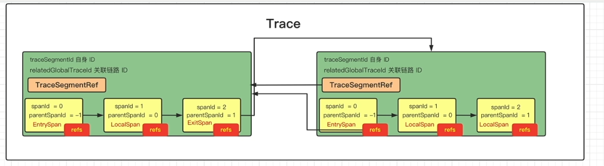

## 1. 前置知识

### 1.1. 通用规范

* 链路追踪  

  opentracing链路追踪协议https://github.com/opentracing-contrib/opentracing-specification-zh.git

  [opentracing-specification-zh/specification.md at master · opentracing-contrib/opentracing-specification-zh (github.com)](https://github.com/opentracing-contrib/opentracing-specification-zh/blob/master/specification.md)

  这个介绍了链路追踪的通用数据模型和通用的api，遵循这些语义规范。

* dapper

### 1.2. 基础概念

这里有一个请求从gateway触发，经历了多个服务，形成了一个链路 

* segement

  一个jvm进程的所有操作叫做segment

  如果所示有6个segment,后一个服务的segment会指向前一个segment

  我们通过parent将多个segement连接起来

* span

  一个segment内部的具体的操作操作叫做span

  比如，访问redis、访问mysql

  span之间也是会有parent的关系的

  但是这些span都是属于一个segement的，即segment是一个容器，装了很多span的

* trace

  trace就是一次请求，将这么多的span、segement串联起来，

  trace有一个id，是全局唯一的。

 

 

如图所示

* 1代表的是链路
* 2代表的是segement
* 3代表的是span

## 2. traceId

org.apache.skywalking.apm.agent.core.context.ids.DistributedTraceId

上面将的链路的id主要是这个类生成的

```
/**
 * The <code>DistributedTraceId</code> presents a distributed call chain.
 * <p>
 * This call chain has a unique (service) entrance,
 * <p>
 * such as: Service : http://www.skywalking.com/cust/query, all the remote, called behind this service, rest remote, db
 * executions, are using the same <code>DistributedTraceId</code> even in different JVM.
 * <p>
 * The <code>DistributedTraceId</code> contains only one string, and can NOT be reset, creating a new instance is the
 * only option.
 */
@RequiredArgsConstructor
@ToString
@EqualsAndHashCode
public abstract class DistributedTraceId {
    @Getter
    private final String id;
}
```

根据注释，表示一个分布式调用链，即使跨了不同的jvm进程，链路id都一样

一旦这个traceid生成了，就不能重置，不能修改，只能重新生成

 它有两个实现：

* NewDistributedTraceId

  ```
  public class NewDistributedTraceId extends DistributedTraceId {
      public NewDistributedTraceId() {
          super(GlobalIdGenerator.generate());
      }
  }
  ```

  GlobalIdGenerator是生成traceid的工具类

  ```
  public static String generate() {
      return StringUtil.join(
          '.',
          PROCESS_ID,
          String.valueOf(Thread.currentThread().getId()),
          String.valueOf(THREAD_ID_SEQUENCE.get().nextSeq())
      );
  }
  ```

  THREAD_ID_SEQUENCE是一个threadlocal工具

  ```
  private static final ThreadLocal<IDContext> THREAD_ID_SEQUENCE = ThreadLocal.withInitial(
      () -> new IDContext(System.currentTimeMillis(), (short) 0));
  ```

  通过threadlocal获取到idcontext

  其中IDContext

  ```
  private static class IDContext {
      private long lastTimestamp;
      private short threadSeq;
  
      // Just for considering time-shift-back only.
      private long lastShiftTimestamp;
      private int lastShiftValue;
  
      private IDContext(long lastTimestamp, short threadSeq{
          this.lastTimestamp = lastTimestamp;
          this.threadSeq = threadSeq;
      }
             private long nextSeq() {
              return timestamp() * 10000 + nextThreadSeq();
          }
  
          private long timestamp() {
              long currentTimeMillis = System.currentTimeMillis();
  
              if (currentTimeMillis < lastTimestamp) {
                  // Just for considering time-shift-back by Ops or OS. @hanahmily 's suggestion.
                  if (lastShiftTimestamp != currentTimeMillis) {
                      lastShiftValue++;
                      lastShiftTimestamp = currentTimeMillis;
                  }
                  return lastShiftValue;
              } else {
                  lastTimestamp = currentTimeMillis;
                  return lastTimestamp;
              }
          }
  
          private short nextThreadSeq() {
              if (threadSeq == 10000) {
                  threadSeq = 0;
              }
              return threadSeq++;
          }
      }
  ```

  * lastTimestamp

    上一次生成seqenece的时间戳

  * threadSeq线程的序列号

  * lastShiftTimestamp、lastShiftValue

    处理时钟回拨的，因为操作系统可能会引起时间设置倒退

  * nextSeq

    这个就是generate其中调用的方法,其中会结合timestamp() * 10000 + nextThreadSeq()生成序列号

  * timestamp

    获取当前的时间戳，如果发生了时间回拨处理一下,返回应该的当前的时间戳

  * nextThreadSeq

    会在0-10000之间循环遍历

  所以总的来说

  GlobalIdGenerator.generate()会根据当前线程生成的序列号，加上线程id，进程id生成的，然后就可以生成全局id了

  这个GlobalIdGenerator既可以生成traceid又可以生成segementid

* PropagatedTraceId

  ```
  public class PropagatedTraceId extends DistributedTraceId {
      public PropagatedTraceId(String id) {
          super(id);
      }
  }
  ```

## 3. segement

一次请求打到一个jvm进程里后，通常是由一个线程来完成，但是也有可能在里面开了一个线程池。所以准确来讲，一个segment表示一个jvm的一个segment的所有操作。

```
public class TraceSegment {

     private String traceSegmentId;
     private TraceSegmentRef ref;
     private List<AbstractTracingSpan> spans；
     private DistributedTraceId relatedGlobalTraceId;
     private boolean ignore = false;
     private boolean isSizeLimited = false;
     private final long createTime;

}
```

* spans

  表示当前当前这个segment的所有的操作

* relatedGlobalTraceId

  当前所在的globaltraceid

* traceSegmentId

  tracesegmentid的唯一id

* TraceSegmentRef

  这个是当前segment的上一个segment的指针，这个字段不会被序列化，只是为了快速访问

  ```
  public class TraceSegmentRef {
      private SegmentRefType type;
      private String traceId;
      private String traceSegmentId;
      private int spanId;
      private String parentService;
      private String parentServiceInstance;
      private String parentEndpoint;
      private String addressUsedAtClient;
  }
  public enum SegmentRefType {
  	CROSS_PROCESS, CROSS_THREAD
  }
  ```

  * SegmentRefType

    * CROSS_PROCESS

      代表跨进程

    * CROSS_THREAD

      代表跨线程

  * traceSegmentId

    代表的是就是parent的segmentid

  * spanId

    代表的是spanid，后面会进行分析

  * parentService

    调用者的服务

  * parentServiceInstance

    调用者的服务实例

  * parentEndpoint

    调用父类的一个请求

  * transform

    将TraceSegmentRef对象转化为Probuffer

    

### 3.1. relatedGlobalTrace

当前的segment关联一个全局traceid

```
public void relatedGlobalTrace(DistributedTraceId distributedTraceId) {
    if (relatedGlobalTraceId instanceof NewDistributedTraceId) {
        this.relatedGlobalTraceId = distributedTraceId;
    }
}
```

### 3.2. ref

引用某一条segment

```
public void ref(TraceSegmentRef refSegment) {
    if (null == ref) {
        this.ref = refSegment;
    }
}
```

### 3.3. archive

将一个span加进来

```
public void archive(AbstractTracingSpan finishedSpan) {
    spans.add(finishedSpan);
}
```

### 3.4. finish

这里传入一个布尔值，表示操作做完了

```
public TraceSegment finish(boolean isSizeLimited) {
    this.isSizeLimited = isSizeLimited;
    return this;
}
```

其中isSizeLimited和一个配置文件相关，SPAN_LIMIT_PER_SEGMENT默认300

这个标识一个segment默认可以存储的span数，举例如：

```
private boolean isLimitMechanismWorking() {
    if (spanIdGenerator >= spanLimitWatcher.getSpanLimit()) {
        long currentTimeMillis = System.currentTimeMillis();
        if (currentTimeMillis - lastWarningTimestamp > 30 * 1000) {
            LOGGER.warn(
                new RuntimeException("Shadow tracing context. Thread dump"),
                "More than {} spans required to create", spanLimitWatcher.getSpanLimit()
            );
            lastWarningTimestamp = currentTimeMillis;
        }
        return true;
    } else {
        return false;
    }
}
```

就是表示当我们要关闭segment的时候，表示我当前的segment是否已经收集满了segement了，true表示已经满了，会丢弃一部分span操作

## 4. span

### 4.1. componentsDefine

```
public class ComponentsDefine {

    public static final OfficialComponent TOMCAT = new OfficialComponent(1, "Tomcat");

    public static final OfficialComponent HTTPCLIENT = new OfficialComponent(2, "HttpClient");

    public static final OfficialComponent DUBBO = new OfficialComponent(3, "Dubbo");

    public static final OfficialComponent MOTAN = new OfficialComponent(8, "Motan");

    public static final OfficialComponent RESIN = new OfficialComponent(10, "Resin");
    .................
    
```

这个就是定义的plugin的名称。这个组件全部用Component的实现类来表示，即OfficialComponent，代表的是官方的插件，但是如果想自己写的话，需要新实现一个

### 4.2. spanlayer

```
public enum SpanLayer {
    DB(1),//比如访问mysql、还是oracle等等数据库的操作 
    RPC_FRAMEWORK(2),//远程调用 
    HTTP(3),
    MQ(4),
    CACHE(5);
```

在skywalking中，将所有的插件分成了5类

### 4.3. tags

这个类定义了一些官方的tags对象

```
public static final StringTag URL = new StringTag(1, "url");

/**
 * STATUS_CODE records the http status code of the response.
 */
public static final StringTag STATUS_CODE = new StringTag(2, "status_code", true);

/**
 * DB_TYPE records database type, such as sql, redis, cassandra and so on.
 */
public static final StringTag DB_TYPE = new StringTag(3, "db.type");
```

### 4.4.  AsyncSpan

用于异步的插件，特别是rpc插件。

#### 4.4.1. AbstractSpan 

* AbstractSpan setComponent(Component component);

  表示当前的这个操作发生在哪个一个插件身上。

* AbstractSpan setLayer(SpanLayer layer);

  设置当前的这个操作的分类（5大类）

* AbstractSpan tag(AbstractTag<?> tag, String value)

  在这儿span上面打标签，有String和AbstractTag的类型，AbstractTag有覆盖的功能

* AbstractSpan log(Throwable t)

  记录一个异常为本地时间，见注释

  ```
  Record an exception event of the current walltime timestamp.
  ```

* AbstractSpan errorOccurred()

  标记一下这个span为异常的

* isEntry

  进入span

* isExit

  退出span

* AbstractSpan log(long timestamp, Map<String, ?> event)

  记录一个事件

* AbstractSpan setOperationName(String operationName)

  记录当前操作的名称，如果当前组件是http是http则是url，如果是db则是sql语句,如果是redis，则就是redis命令

* AbstractSpan start()

  表示span这个操作动作开始

* void ref(TraceSegmentRef ref)

  这个span的父segment操作，segment和segment之间是靠这个TraceSegmentRef 进行连接的

* AbstractSpan setPeer(String remotePeer)

  设置对端地址

  一个请求可能跨多个进程，操作多个中间件，每次进行rpc对面的地址就是remotepeer

* boolean isProfiling();

  这个后面在进行分析

* void skipAnalysis();

  发送给后端是否要进行分析

#### 4.4.2. AbstractTracingSpan

这个类继承了abstractspan抽象类，实现了部分方法

##### 4.4.2.1. **核心属性：**

* spanId

  一个segmemetn有很多span，这些span都会给他们分配一个spanid

* parentspan

  一个span是上一个还没有结束的span触发的，这个就是他的父类的id

* isInAsyncMode

  当前的异步操作是否已经开启了

* isAsyncStopped

  当前的异步操作是否已经结束了

* TracingContext

  这个很重要，用来管理一条链路的segment

* protected List<TraceSegmentRef> refs;

  用于当前span指定自己所在的segment的前一个segment，除非这个是所有的链路的第一个segment。

  通常情况下是一个segments，但是如果是批处理就有可能有多个parent了。

  例如一次rpc去请求配拆分成多给子任务，这些线程是并行的，最终会进行join方法，最终又汇集成一个线程处理，那么这个线程的parentsegemtn就可能有多个，ref多个了

  常见于 MQ / Batch 调用。例如，MQ 批量消费消息时，消息来自【多个服务】。每次批量消费时，【消费者】新建一个 TraceSegment 对象：

  将自己的 `refs` 指向【多个服务】的多个 TraceSegment 。

  将自己的 `relatedGlobalTraces` 设置为【多个服务】的多个 DistributedTraceId

* 其它的的字段和abstactspan类似

  skipAnalysis为true，当前这个segment的所有的span都不会分析

* tags

  在Tags类中会官方定义一些tag,可以通过一些方法传入

  Tags里面定义了很多tags

##### 4.4.2.2. **核心方法：**

* finish方法

  ```
  public boolean finish(TraceSegment owner) {
      this.endTime = System.currentTimeMillis();
      owner.archive(this);
      return true;
  }
  ```

  就是把当前的span添加到当前的segment之中

* log

  ```
  public AbstractTracingSpan log(Throwable t) {
      if (logs == null) {
          logs = new LinkedList<>();
      }
      if (!errorOccurred && ServiceManager.INSTANCE.findService(StatusCheckService.class).isError(t)) {
          errorOccurred();
      }
      logs.add(new LogDataEntity.Builder().add(new KeyValuePair("event", "error"))
                                          .add(new KeyValuePair("error.kind", t.getClass().getName()))
                                          .add(new KeyValuePair("message", t.getMessage()))
                                          .add(new KeyValuePair(
                                              "stack",
                                              ThrowableTransformer.INSTANCE.convert2String(t, 4000)
                                          ))
                                          .build(System.currentTimeMillis()));
      return this;
  }
  ```

  * 判断当前还没有发生发生了异常，并且判断哪些异常不断异常

    ServiceManager.INSTANCE.findService(StatusCheckService.class).isError(t)，就记录异常栈

  * 然后从异常中提炼出相关信息

* public void ref(TraceSegmentRef ref)

  将ref放到列表中

* prepareForAsync

  ```
  public AbstractSpan prepareForAsync() {
      if (isInAsyncMode) {
          throw new RuntimeException("Prepare for async repeatedly. Span is already in async mode.");
      }
      ContextManager.awaitFinishAsync(this);
      isInAsyncMode = true;
      return this;
  }
  ```

  表示我们要做异步了

  ```
  ContextManager.awaitFinishAsync(this);
  ```

  表示等待异步来完成 

* asyncFinish

  异步任务结束

  ```
  public AbstractSpan asyncFinish() {
      if (!isInAsyncMode) {
          throw new RuntimeException("Span is not in async mode, please use '#prepareForAsync' to active.");
      }
      if (isAsyncStopped) {
          throw new RuntimeException("Can not do async finish for the span repeatedly.");
      }
      this.endTime = System.currentTimeMillis();
      owner.asyncStop(this);
      isAsyncStopped = true;
      return this;
  }
  ```

  asyncStop提交这个span

### 4.5. span引用关系

 

