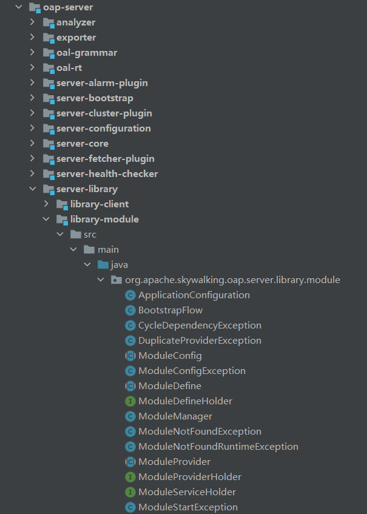
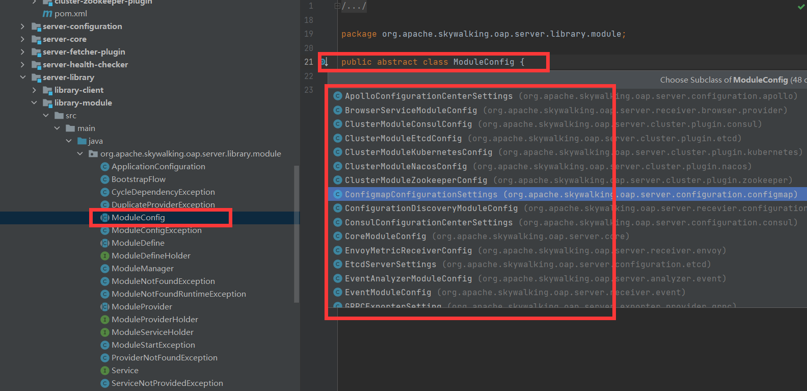
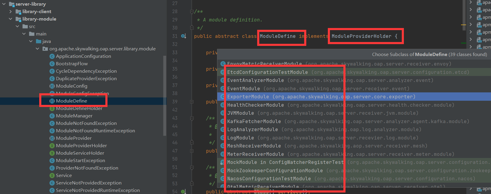
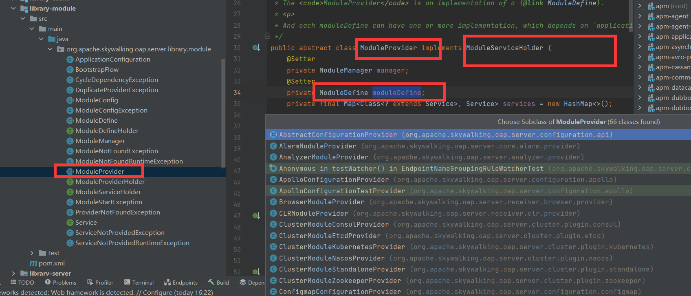
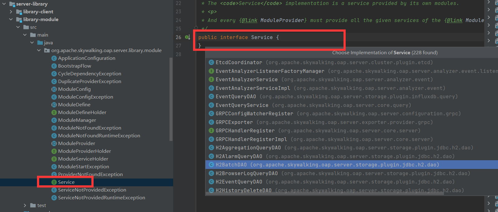
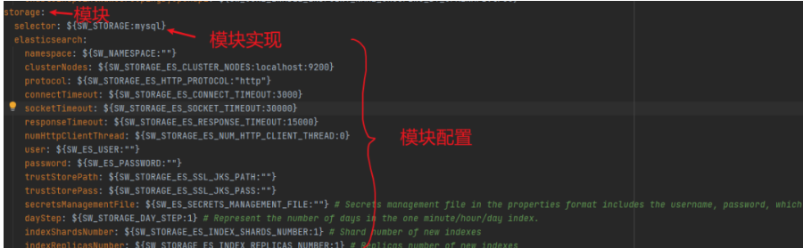
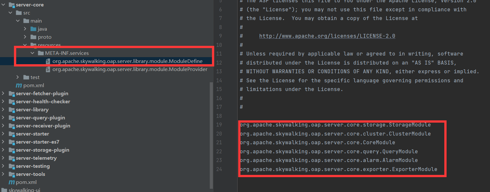

## 1. 开头

Skywalking的整体的架构就是由一个一个的module组成的，Skywalking运用模块加载的思想

 

## 2. 模块概念

### 2.1. 模块配置

不同的模块有不同的模块配置实现，如下



### 2.2. 模块定义

不同的模块有不同的模块定义

 

### 2.3. 模块实现

模块时如何实现的呢，由实现类来实现，**依赖于模块定义**

 

### 2.4. 服务

模块可能需要一种服务，它由service接口定义

正如注释所说：implementation is a service provided by its own modules

每个模块的定义里会加入很多这样的service的class

 

### 2.5. 配置文件

配置文件中的Module关系（ApplicationConfiguration --> application.yml）

 

```
public class ApplicationConfiguration {
    private HashMap<String, ModuleConfiguration> modules = new HashMap<>();

    public String[] moduleList() {
        return modules.keySet().toArray(new String[0]);
    }

    public ModuleConfiguration addModule(String moduleName) {
        ModuleConfiguration newModule = new ModuleConfiguration();
        modules.put(moduleName, newModule);
        return newModule;
    }

    public boolean has(String moduleName) {
        return modules.containsKey(moduleName);
    }

    public ModuleConfiguration getModuleConfiguration(String name) {
        return modules.get(name);
    }

    // 模块实现
    public static class ModuleConfiguration {
        ......
    }

    // 模块实现配置
    public static class ProviderConfiguration {
        ......
    }
}
```

## 3. 模块机制

这里以以数据库模块为例.模块我的理解就是一个功能块。它的实现有很多种，比如存储功能块，它可以存ES，也可以存mysql，那么就有相应的配置，模块的具体实现就是es实现，配置就是es的配置类了。

存储模块的模块定义在OAP的核心包下：org/apache/skywalking/oap/server/core/storage

### 3.1. 模块定义配置

位于oap-server/server-core/src/main/resources/META-INF/services目录下的配置文件：

 

虽然模块定义是在核心包下，但是模块的实现是在另一个地方，这里先看模块定义代码：

### 3.2.  模块定义

```
// 对应模块结构中的：模块定义
public class StorageModule extends ModuleDefine {

    public static final String NAME = "storage";

    public StorageModule() {
        super(NAME);
    }

    @Override
    public Class[] services() {
        // 对应模块结构中的Service
        return new Class[] {
            StorageBuilderFactory.class,
            IBatchDAO.class,
            StorageDAO.class,
            IHistoryDeleteDAO.class,
            INetworkAddressAliasDAO.class,
            ITopologyQueryDAO.class,
            IMetricsQueryDAO.class,
            ITraceQueryDAO.class,
            IMetadataQueryDAO.class,
            IAggregationQueryDAO.class,
            IAlarmQueryDAO.class,
            ITopNRecordsQueryDAO.class,
            ILogQueryDAO.class,
            IProfileTaskQueryDAO.class,
            IProfileTaskLogQueryDAO.class,
            IProfileThreadSnapshotQueryDAO.class,
            UITemplateManagementDAO.class,
            IBrowserLogQueryDAO.class,
            IEventQueryDAO.class,
            IEBPFProfilingTaskDAO.class,
            IEBPFProfilingScheduleDAO.class,
            IEBPFProfilingDataDAO.class
        };
    }
}
```

### 3.3.  模块实现

存储模块的实现就在包：oap-server/server-storage-plugin包下

我们以h2内存数据库为例

oap-server/server-storage-plugin/storage-jdbc-hikaricp-plugin/src/main/java/org/apache/skywalking/oap/server/storage/plugin/jdbc/h2/dao

#### 3.3.1.  模块实现配置

H2StorageConfig

```
public class H2StorageConfig extends ModuleConfig {
    private String driver = "org.h2.jdbcx.JdbcDataSource";
    private String url = "jdbc:h2:mem:skywalking-oap-db;DB_CLOSE_DELAY=-1";
    private String user = "";
    private String password = "";
    private int metadataQueryMaxSize = 5000;
    }
```

#### 3.3.2.  模块实现类

代码位于Provider(oap-server/server-storage-plugin/storage-jdbc-hikaricp-plugin/src/main/java/org/apache/skywalking/oap/server/storage/plugin/jdbc/h2/H2StorageProvider.java)

```
public class H2StorageProvider extends ModuleProvider {
    ...
}
```

### 3.4.  模块管理

通过管理模块可以对所有的模块进行一些必要的相关操作（初始化，判空等，该类是OAP的核心，重中之重），该类为ModuleManager

```
public class ModuleManager implements ModuleDefineHolder {
    private boolean isInPrepareStage = true;
    private final Map<String, ModuleDefine> loadedModules = new HashMap<>();

    /**
     * Init the given modules
     */
    public void init(
        ApplicationConfiguration applicationConfiguration) throws ModuleNotFoundException, ProviderNotFoundException, ServiceNotProvidedException, CycleDependencyException, ModuleConfigException, ModuleStartException {
        String[] moduleNames = applicationConfiguration.moduleList();
        // SPI加载所有模块定义
        ServiceLoader<ModuleDefine> moduleServiceLoader = ServiceLoader.load(ModuleDefine.class);
        // 加载所有模块提供者
        ServiceLoader<ModuleProvider> moduleProviderLoader = ServiceLoader.load(ModuleProvider.class);

        HashSet<String> moduleSet = new HashSet<>(Arrays.asList(moduleNames));
        for (ModuleDefine module : moduleServiceLoader) {
            if (moduleSet.contains(module.name())) {
              //一个模块定义对应多个实现
                module.prepare(this, applicationConfiguration.getModuleConfiguration(module.name()), moduleProviderLoader);
                loadedModules.put(module.name(), module);
                moduleSet.remove(module.name());
            }
        }
        // Finish prepare stage
        isInPrepareStage = false;

        if (moduleSet.size() > 0) {
            throw new ModuleNotFoundException(moduleSet.toString() + " missing.");
        }

        BootstrapFlow bootstrapFlow = new BootstrapFlow(loadedModules);

        bootstrapFlow.start(this);
        bootstrapFlow.notifyAfterCompleted();
    }

    @Override
    public boolean has(String moduleName) {
        return loadedModules.get(moduleName) != null;
    }

    @Override
    public ModuleProviderHolder find(String moduleName) throws ModuleNotFoundRuntimeException {
        assertPreparedStage();
        ModuleDefine module = loadedModules.get(moduleName);
        if (module != null)
            return module;
        throw new ModuleNotFoundRuntimeException(moduleName + " missing.");
    }

    private void assertPreparedStage() {
        if (isInPrepareStage) {
            throw new AssertionError("Still in preparing stage.");
        }
    }
}

```

