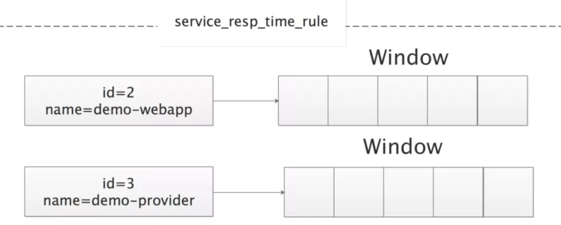
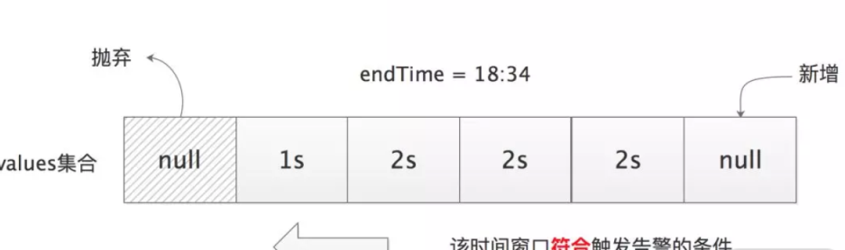

## 1. 整体设计

要想实现一个简单的告警系统，我们需要完成如下四个部分：

* 指定告警的规则（Rule）。

* 接收监控数据。

* 告警检查，将预先定义好的告警规则阈值与接收到的监控数据进行比较。

* 如果监控数据符合告警规则，就会触发告警，那么将会通过指定途径将告警信息发送用户。


在收到告警消息之后，运维人员或是开发人员就会开始关注并处理相应的问题。

SkyWalking OAP 的告警功能是在 server-alarm-plugin 插件中实现的


## 2. 实现机制

* 告警规则配置


### 2.2. 数据处理

 MetricsStreamProcessor 处理监控指标的核心逻辑，它会根据配置创建 Minute、Hour、Day、Month 四种不同 DownSampling 粒度的 MetricsPersistentWorker，分别对应 minutePersistentWorker、hourPersistentWorker、dayPersistentWorker、monthPersistentWorker，其中 minutePersistentWorker 与其他逻辑三个 MetricsPersistentWorker 对象相比，除了 DownSampling 粒度不同之外，还多封装了两个 Worker —— AlarmNotifyWorker 和 ExportWorker。
从名字就能看出 AlarmNotifyWorker 与告警相关，OAP 收到的监控点就是通过该 Worker 进入上述告警流程的。当收到一个监控点（即 Metrics 对象）时，会经过AlarmNotifyWorker、AlarmEnhance 组件，只是简单地转发了 Metrics 对象，并没有做什么特殊处理， NotifyHandler.notfiy() 方法是根据 Metrics 分类创建相应 MetaInAlarm 对象的地方
AnnotationScan 是 OAP 中的注解扫描器，它上面可以注册多个 AnnotationListener 监听器。AnnotationScan 扫描 classpath 时候，会根据类上的注解，从注册的 AnnotationListener 集合中找到匹配的 AnnotationListener 进行处理。其中就包括前面介绍的 StreamAnnotationListener，它就是用来处理 @Stream 注解的，StreamAnnotationListener 会按照 @Stream 注解中 processor 属性指定的对应 StreamProcessor 实现为该 @Stream 注解修饰的类创建相应的 Worker 链。

另一个 AnnotationListener 实现—— DefaultScopeDefine.Listener，它处理的是 @ScopeDeclaration 注解，它会根据 @ScopeDeclaration 注解的 catalog 属性将 Metrics 实现分为 Service、ServiceInstance、Endpoint 三类，对应 MetaInAlarm 的三个具体实现

```
if (DefaultScopeDefine.inServiceCatalog(scope)) {
```

#### 2.2.1. AlarmNotifyWorker

在处理指标数据时，多个woker，其中会注入这个AlarmNotifyWorker，执行的时候会经过这个worker

```
public class AlarmNotifyWorker extends AbstractWorker<Metrics> {
    private AlarmEntrance entrance;

    public AlarmNotifyWorker(ModuleDefineHolder moduleDefineHolder) {
        super(moduleDefineHolder);
        this.entrance = new AlarmEntrance(moduleDefineHolder);
    }

    @Override
    public void in(Metrics metrics) {
        if (metrics instanceof WithMetadata) {
            entrance.forward(metrics);
        }
    }
```

然后执行

```
  metricsNotify.notify(metrics);
```

#### 2.2.2. MetricsNotify

解析数据，然后遍历规则列表

```
 public void notify(Metrics metrics) {
			.........
            ServiceMetaInAlarm serviceMetaInAlarm = new ServiceMetaInAlarm();
            serviceMetaInAlarm.setMetricsName(meta.getMetricsName());
            serviceMetaInAlarm.setId(serviceId);
            serviceMetaInAlarm.setName(serviceIDDefinition.getName());
            metaInAlarm = serviceMetaInAlarm;
 }
 runningRules.forEach(rule -> rule.in(metaInAlarm, metrics));
```

#### 2.2.3. Window

```
 rule.in(metaInAlarm, metrics));
```

放入到时间窗口

```
if (valueType != null) {
	Window window = windows.computeIfAbsent(meta, ignored -> new Window(period));
	window.add(metrics);
}
```

如果meta有窗口，就不用创建

即每一类的指标会创建一个这样的窗口,注意这个窗口大小和配置的规则有关

 

Window 的核心字段如下：

```
private int period;  // 告警检查的时间窗口
// 长度固定为period的List，其中每个元素对应一分钟的监控值
private LinkedList<Metrics> values; 
private LocalDateTime endTime; // 最后一次进行告警检查的时间
private int counter; // 当前达到告警阈值的次数
private int silenceCountdown; // 当前剩余的沉默周期数
```

Window 中有三个核心方法：

* moveTo(LocalDateTime) 方法

  由定时任务触发，根据传入时间与 endTime 的差值更新 values 集合。

* add(Metrics) 方法

  将指定监控数据更新到 values 集合中相应的位置，刚刚添加数据数据到窗口的示例。

* checkAlarm() 方法

  由定时任务触发，根据 values 集合中记录的监控数据进行告警检查，并返回相应的告警消息。

### 2.3. 告警检查

* alarmProvider会初始化组件notifyHandler

  ```
  notifyHandler.init(new AlarmStandardPersistence(getManager()));
  ```

* 然后启动定时任务

  ```
  public void start(List<AlarmCallback> allCallbacks) {
  ```

* 滑动窗口更新

  这个会遍历规则列表

  ```
   alarmRulesWatcher.getRunningContext().values().forEach(ruleList -> ruleList.forEach(runningRule -> {
                      if (minutes > 0) {
                          runningRule.moveTo(checkTime);
                          /*
                           * Don't run in the first quarter per min, avoid to trigger false alarm.
                           */
                          if (checkTime.getSecondOfMinute() > 15) {
                              hasExecute[0] = true;
                              alarmMessageList.addAll(runningRule.check());
                          }
                      }
                  }));
  ```

  会调用 moveTo() 方法将 values 集合中的全部元素填充为 null，更新 endTime 为 18:30。同样是在 18:30 这一分钟内，该 RunningRule 收到了 18:30 对应的 service_resp_time 监控点，如图【2】所示，会通过 Window.add() 方法将其记录到 values 集合中。

  总而言之就是保证时间窗口表示的时最近的那个窗口的数据，时间流逝了，这个窗口就需要更新了。

* 检查告警

  后台 check 线程完成 values 集合更新后会立即调用该 Window.checkAlarm() 方法进行告警检查，此时只有一个监控点且未达到阈值，不会触发告警。之后（还是在 18:31 这一分钟内）会收到新的监控点，如下图所示，同样会通过 Window.add() 记录到 values 集合中

  ```
   public List<AlarmMessage> check() {
          List<AlarmMessage> alarmMessageList = new ArrayList<>(30);
  
          windows.forEach((meta, window) -> {
              Optional<AlarmMessage> alarmMessageOptional = window.checkAlarm();
              if (alarmMessageOptional.isPresent()) {
                  AlarmMessage alarmMessage = alarmMessageOptional.get();
                  alarmMessage.setScopeId(meta.getScopeId());
                  alarmMessage.setScope(meta.getScope());
                  alarmMessage.setName(meta.getName());
                  alarmMessage.setId0(meta.getId0());
                  alarmMessage.setId1(meta.getId1());
                  alarmMessage.setRuleName(this.ruleName);
                  alarmMessage.setAlarmMessage(formatter.format(meta));
                  alarmMessage.setOnlyAsCondition(this.onlyAsCondition);
                  alarmMessage.setStartTime(System.currentTimeMillis());
                  alarmMessage.setPeriod(this.period);
                  alarmMessage.setTags(this.tags);
                  alarmMessageList.add(alarmMessage);
              }
          });
  
          return alarmMessageList;
      }
  ```

   

  在 18：34 分的检查中首次满足告警条件，即当前时间窗口内有 3 个点超过 2s。

  服务在接下来两分钟的耗时分别为 1s 和 2s

  在 18:34~18:36 连续 3 次检查都符合了告警条件，此时才会真正发送告警信息。之后会进入 2 分钟的沉默期。

  虽然 18:37 和 18:38 两次检查都符合告警条件，但因为此时在沉默期内，都不会告警消息

此时已经连续累积了 4 个时间窗口符合告警条件，接下来的 18:39 分检查结果无论是否符合告警条件，都会发送告警消息出去，并再次进入 2 分钟的沉默期

### 2.4. 告警通知

```
if (alarmMessageList.size() > 0) {
    if (alarmRulesWatcher.getCompositeRules().size() > 0) {
        List<AlarmMessage> messages = alarmRulesWatcher.getCompositeRuleEvaluator().evaluate(alarmRulesWatcher.getCompositeRules(), alarmMessageList);
        alarmMessageList.addAll(messages);
    }
    List<AlarmMessage> filteredMessages = alarmMessageList.stream().filter(msg -> !msg.isOnlyAsCondition()).collect(Collectors.toList());
    if (filteredMessages.size() > 0) {
        allCallbacks.forEach(callback -> callback.doAlarm(filteredMessages));
    }
}
```

#### 2.4.1. 发送通知

WebhookCallback 是通过 Webhook 的方式将告警消息发送到 SkyWalking Rocketbot。AlarmStandardPersistence 则会将告警消息持久化到 ElasticSearch 中，后续可以通过 query-graphql-plugin 插件提供的接口查询

Webhook 是常见的事件监听方式之一，它允许第三方应用监听系统的某些特定事件。例如这里的发送告警消息，当告警被触发之后，WebhookCallback 会通过 HTTP POST 方式将告警消息发送到第三方应用指定的 URL 地址，第三方应用通过监听该地址获取告警消息并展示给用户。再例如，在 Gitlab 中也提供了 Webhook 的功能，用户可以使用 Webhook 监听项目代码的 Push 事件，触发 Jenkins 的自动打包和部署。
在 alarm-settings.yml 文件中除了可以配置告警规则，还可以配置 WebhookCallback 请求的 URL 地址，如下所示：

```
rules:
  # 前文介绍的告警配置(略)
webhooks: # 可以配置多个 URL
  - http://127.0.0.1/notify/
  - http://127.0.0.1/go-wechat/
```

在 NotifyHandler 初始化过程中会创建 WebhookCallback 对象。WebhookCallback 底层是通过 HttpClient 发送 Post 请求的，核心实现在 doAlarm() 方法，如下所示（省略的 try/catch 等异常处理的相关代码）：

```

// 创建 HttpClient
CloseableHttpClient httpClient = HttpClients.custom().build();
// remoteEndpoints集合就是 alarm-settings.yml 文件中配置的 URL
remoteEndpoints.forEach(url -> {
    HttpPost post = new HttpPost(url); // 创建 HttpPost请求
     // 配置请求的超时信息，ConnectionTimeOut、RequestTimeOut以及SocketTimeOut都是1s
    post.setConfig(requestConfig);
    post.setHeader("Accept", "application/json");
    post.setHeader("Content-type", "application/json");
    // 生成JSON格式的告警信息
    StringEntity entity = new StringEntity(gson.toJson(alarmMessage));
    post.setEntity(entity);
    // 发送请求
    CloseableHttpResponse httpResponse = httpClient.execute(post);
    // 检查 Http 响应码
    StatusLine statusLine = httpResponse.getStatusLine();
    if (statusLine != null && statusLine.getStatusCode() != 200) {
        logger.error("send alarm to " + url + " failure. Response code: " + statusLine.getStatusCode());
    }
});
```

#### 2.4.2. AlarmStandardPersistence

告警消息除了会通过 WebhookCallback 发送出去之外，还会通过 AlarmStandardPersistence 进行持久化。在收到 AlarmMessage 之后，AlarmStandardPersistence 会将其转换成 AlarmRecord，并交给 RecordStreamProcessor 进行持久化。AlarmRecord 的核心字段与 AlarmMessage 的字段基本一致


