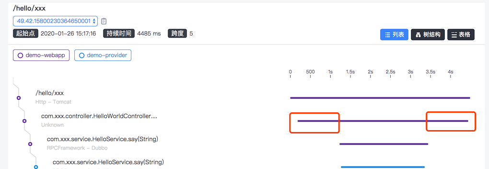

## 1. 问题背景

SkyWalking 提供的 Agent 可以收集服务的 Metrics、Trace、Log 等维度的数据，然后发送到后端的 OAP 进行分析并进行持久化存储，我们可以使用 SkyWalking Rocketbot UI（或是直接使用 GraphQL） 从不同的维度查询上述数据，评估系统的各项性能和某些具体行为。
例如，我们可以通过 ServiceRespTimeMetrics、ServiceP99Metrics、ServiceCpmMetrics 等 Metrics 了解一个服务的整体吞吐量；可以通过 Trace 信息了解某个具体请求经过的核心组件和服务，以及在这些组件和服务上的耗时情况；可以通过 Trace 上携带的 Log 信息了解相应的异常信息；还可以根据 Trace 信息分析得到 Relation 信息，画出整个服务架构的拓扑图，了解各个服务之间的调用关系以及拓扑图每条调用边上的响应时间、SLA 等信息。这就可以帮助开发和运维人员更好地管理整个服务集群，更快地定位系统的热点和瓶颈，降低运维和问题定位的成本。
SkyWalking 已经满足了我们日常监控和运维的绝大多数需求，但是并没有覆盖到所有运维场景。假设我们发现请求在某个服务中的耗时特别长，远远超过了预期，例如开篇示例中的 demo-webapp ，如下图所示，在 HelloWorldController 在开始调用 Dubbo 服务的前后，会有耗时超过 1s 以上情况：

 

即组件之间的耗时我们查不出来。其可能的原因为：

* 多个线程并发竞争同一把锁
* 读写文件，线程等待 I/O 操作；
* 代码逻辑本身的性能有问题，时间复杂度太高。

如果通过 Trace 以及 Metrics 不能明确定位高耗时的问题，我们使用 jstack 工具将线程的栈信息 dump 下来，然后分析线程在哪一个调用中耗时较长。在现实场景中，往往一次 dump 的信息是不足以确认问题的，为了反映线程状态的动态变化，需要连续多次做 Thread Dump，每次间隔根据具体的场景决定，建议至少产生三次以上的 Thread Dump 信息，如果每次 Thread Dump 都指向同一个问题，一般就能够确定具体的问题。
在实际的微服务场景中进行 Thread Dump 时，你可能会遇到几个问题：

* 如果多个服务都有耗时高的情况，就需要我们去多个服务的机器上进行 Thread Dump，比较麻烦，而且也很难确定不同服务的 Thread Dump 信息是否存在关联。
* 请求一般会经过多个服务端处理，每个服务又是单独的一个集群。如果是某些特殊参数的请求触发了高耗时，我们很难手动捕捉到该请求走到了服务的那个实例上，这台机器上去进行 Thread Dump 就比较困难。
* 如果要求某些服务的响应时延非常低的情况下，虽然服务的延迟高了，但是相对人来说的时间是非常短的，而我们手动 Thread Dump 的速度和次数都是有限的，可能错过问题所在的逻辑，导致问题定位错误